# Hono Enterprise — Architecture Guide

> **This document is the definitive technical architecture guide for framework contributors.** It
> explains how the framework works internally and why it was designed this way.
>
> **Audience:** Framework contributors and maintainers, not application developers.
>
> **Companion documents:**
>
> - [`PUBLIC_API.md`](PUBLIC_API.md) — How developers use the framework
> - [`ROADMAP.md`](ROADMAP.md) — Implementation phases
> - [`AI_GUIDELINES.md`](AI_GUIDELINES.md) — Engineering rules

---

## Table of Contents

1. [Vision](#1-vision)
2. [Design Principles](#2-design-principles)
3. [High-Level Architecture](#3-high-level-architecture)
4. [Request Lifecycle](#4-request-lifecycle)
5. [Plugin Architecture](#5-plugin-architecture)
6. [Service Registry](#6-service-registry)
7. [Runtime Layer](#7-runtime-layer)
8. [Package Architecture](#8-package-architecture)
9. [Dependency Rules](#9-dependency-rules)
10. [Middleware Pipeline](#10-middleware-pipeline)
11. [Dependency Injection](#11-dependency-injection)
12. [Decorator System](#12-decorator-system)
13. [Error Handling](#13-error-handling)
14. [Security Model](#14-security-model)
15. [Performance Philosophy](#15-performance-philosophy)
16. [Testing Strategy](#16-testing-strategy)
17. [Extending the Framework](#17-extending-the-framework)
18. [Future Evolution](#18-future-evolution)

---

## 1. Vision

### Why This Framework Exists

Enterprise backend development faces a recurring tension: **frameworks that are powerful tend to be
heavy and opinionated, while frameworks that are lightweight tend to lack enterprise features.**

NestJS provides excellent developer experience with decorators, DI, and modules, but it is tightly
coupled to Node.js, requires reflection, and has a steep learning curve. Fastify is fast and
plugin-oriented but lacks the enterprise abstractions (repository pattern, CQRS, multi-tenancy,
audit logging) that large organizations need. Hono delivers exceptional performance and runtime
portability but is intentionally minimal — it provides routing, not architecture.

**Hono Enterprise exists to bridge this gap.** It combines:

| Source       | What We Take                                                         |
| ------------ | -------------------------------------------------------------------- |
| Hono         | Performance, runtime portability, routing engine                     |
| Spring Boot  | Plugin auto-configuration, conditional registration, starter bundles |
| ASP.NET Core | Middleware pipeline, request/response abstractions                   |
| Fastify      | Plugin encapsulation, decoration pattern, lifecycle hooks            |

### Problems It Solves

1. **Runtime lock-in** — NestJS, Express, and Fastify are Node.js-first. Hono Enterprise runs on
   Node.js, Deno, and Bun with zero code changes, and is designed for Cloudflare Workers
   extensibility.

2. **Opinionated heaviness** — NestJS requires DI, decorators, and reflection. Hono Enterprise makes
   all of these optional. Start with just a router and add capabilities as needed.

3. **Monolithic frameworks** — Most frameworks bundle all features. Hono Enterprise is plugin-first:
   every capability (logging, database, auth, validation) is a plugin that can be added, removed, or
   replaced.

4. **Poor replaceability** — In most frameworks, swapping the database layer or logger requires
   touching application code. Hono Enterprise uses capability tokens, so any plugin can be replaced
   without modifying business logic.

5. **Enterprise feature gaps** — Lightweight frameworks lack secrets management, audit logging,
   circuit breakers, feature flags, and multi-tenancy. Hono Enterprise provides these as plugins.

### Why It Is Not a NestJS Clone

NestJS is built around three mandatory pillars: **modules, dependency injection, and decorators**.
Every NestJS application must use all three. This creates a steep learning curve and tight coupling
to the framework's opinions.

Hono Enterprise inverts this:

| Aspect           | NestJS       | Hono Enterprise             |
| ---------------- | ------------ | --------------------------- |
| DI               | Required     | Optional plugin             |
| Decorators       | Required     | Optional plugin             |
| Reflection       | Required     | Optional                    |
| Modules          | Required     | Plugins (more granular)     |
| Programmatic API | Limited      | Full API for everything     |
| Replaceability   | Difficult    | Any plugin swappable        |
| Runtime          | Node.js only | Node, Deno, Bun, CF Workers |
| Bundle size      | Large        | Pay only for what you use   |

A Hono Enterprise application can be as minimal as:

```typescript
const app = createApplication({ plugins: [RuntimePlugin()] });
app.router.get('/', (ctx) => ctx.response.json({ hello: 'world' }));
await app.start();
```

No decorators, no DI, no modules — just a router and a runtime. Capabilities are added incrementally
via plugins.

### Why It Uses Hono

Hono is used as the **routing engine** for several reasons:

1. **Performance** — Hono is one of the fastest TypeScript routers, competitive with Fastify.
2. **Runtime portability** — Hono already runs on Node.js, Deno, Bun, and Cloudflare Workers.
3. **Minimal** — Hono does not impose an architecture; it provides routing and lets the framework
   build on top.
4. **Standards-based** — Hono uses the standard `Request`/`Response` Web APIs.

Hono Enterprise does not expose Hono directly to application developers. Instead, it wraps Hono in a
runtime adapter that abstracts the HTTP server, request, and response objects. This allows the
framework to swap Hono for another router in the future without breaking applications.

### Why It Is Plugin-First

A plugin-first architecture provides three critical benefits:

1. **Pay only for what you use** — If you do not need a database, the database plugin is never
   loaded. No dead code, no unused dependencies, no startup overhead.

2. **Replace anything** — Every capability is identified by a capability token (a string). If you do
   not like the default logger, you register a different plugin that provides the same `logger`
   token. Application code does not change.

3. **Extensible without forking** — Need a feature the framework does not provide? Write a plugin.
   No need to fork the framework or monkey-patch internals.

### Why Runtime Independence Matters

The JavaScript ecosystem is fragmenting across runtimes:

- **Node.js** — The incumbent, with the largest ecosystem.
- **Deno** — Secure by default, native TypeScript, web-standard APIs.
- **Bun** — Extremely fast, Node-compatible, native TypeScript.
- **Cloudflare Workers** — Edge computing, V8 isolates, no Node.js APIs.

Applications written today on Node.js may need to run on Bun tomorrow for performance, or on
Cloudflare Workers for edge deployment. Hono Enterprise ensures that **business logic never depends
on runtime-specific APIs**. All runtime-specific operations (UUID generation, timers, crypto, file
system, environment variables) are abstracted behind `IRuntimeServices` and provided by the
`RuntimePlugin`.

---

## 2. Design Principles

### Plugin-First Architecture

Every capability is a plugin. The kernel ships with zero features beyond plugin orchestration. This
means:

- The kernel is small and stable.
- Features are independently versioned.
- Applications include only what they need.
- Any feature can be replaced or removed.

### Composition Over Inheritance

The framework avoids deep inheritance hierarchies. Instead:

- Exceptions are created via factory functions, not class inheritance.
- Plugins compose via capability tokens, not abstract base classes.
- Middleware composes via pipeline execution, not middleware classes inheriting from a base.
- Services are composed via the service registry, not via class hierarchies.

### Dependency Inversion

All dependencies point toward abstractions:

- Plugins depend on interfaces from `@hono-enterprise/common`.
- Services are resolved by capability token, not by class reference.
- Adapters implement interfaces defined in `common`.
- No package depends on a concrete implementation from another package.

### Runtime Abstraction

No package except `@hono-enterprise/runtime` may use runtime-specific APIs. This rule is enforced
by:

- Lint rules (custom `deno lint` plugin rule / CI gate) that forbid `node:` and `bun:` imports and
  `Deno.*` globals outside the runtime package.
- Code review.
- CI tests that run on all three runtimes.

### Capability Tokens

Plugins communicate via **capability tokens** — strings that identify a capability, not a concrete
type:

```typescript
// Plugin A provides the 'database' capability
ctx.services.register('database', new PrismaDatabaseService());

// Plugin B consumes the 'database' capability
const db = ctx.services.get<IDatabaseService>('database');
```

This decouples plugins from each other. Plugin B does not know that Plugin A provides the database
service — it only knows that _something_ provides the `database` capability. This enables:

- **Replaceability** — Swap Prisma for Drizzle by registering a different plugin.
- **Testing** — Register a mock service with the same token.
- **Decoupling** — Plugins never import from each other.

### Programmatic APIs

Every feature has a complete programmatic API. No feature requires decorators, DI, or reflection.
This ensures:

- The framework works in environments that do not support decorators (e.g., some bundlers strip
  them).
- Developers who prefer functional style are not forced into OOP.
- Testing is easier — no need to bootstrap a decorator system.

### Optional Decorators

Decorators are provided by the `DecoratorPlugin`. When registered, it reads metadata stored by
decorators and registers routes, services, and middleware with the kernel. When not registered,
decorators are inert — they store metadata that is never read.

### Optional Dependency Injection

DI is provided by the `DiPlugin`. When registered, it provides a container for resolving services by
token. When not registered, services are resolved directly from the `ServiceRegistry`. The
`ServiceRegistry` is the primary service resolution mechanism; the DI container is a convenience
layer on top.

### Tree Shaking

Every package uses:

- ES module exports only.
- `sideEffects: false` in `package.json`.
- Subpath exports for granular imports.
- No top-level side effects.

This ensures bundlers can eliminate unused code.

### SOLID

- **S** — Each plugin has one responsibility.
- **O** — Plugins extend behavior via registration, not modification.
- **L** — Any adapter implementing an interface is substitutable.
- **I** — Interfaces are segregated (e.g., `IReadRepository` vs `IWriteRepository`).
- **D** — All dependencies point to interfaces in `common`.

### Clean Architecture

Dependency direction always points inward:

```
Plugins (Infrastructure) → Application Code → Domain Code
                                ↑
                    depends on interfaces only
```

### Hexagonal Architecture

- **Ports** — Interfaces in `@hono-enterprise/common` (e.g., `IDatabaseService`, `ICacheStore`,
  `IMessageBroker`).
- **Adapters** — Implementations in plugins (e.g., `PrismaAdapter`, `RedisStore`, `RabbitMqBroker`).
- **Application Core** — Business logic depends only on ports.

---

## 3. High-Level Architecture

```mermaid
graph TB
    subgraph Application Layer
        App[Application Instance]
    end

    subgraph Kernel
        Kernel[Plugin Kernel]
        Registry[Plugin Registry]
        Services[Service Registry]
        Pipeline[Middleware Pipeline]
        Router[Router]
    end

    subgraph Plugins
        Runtime[RuntimePlugin]
        Logger[LoggerPlugin]
        Config[ConfigPlugin]
        Validation[ValidationPlugin]
        Database[DatabasePlugin]
        Auth[AuthPlugin]
        Other[...Other Plugins]
    end

    subgraph Runtime Adapters
        Node[Node Adapter]
        Deno[Deno Adapter]
        Bun[Bun Adapter]
    end

    App --> Kernel
    Kernel --> Registry
    Kernel --> Services
    Kernel --> Pipeline
    Kernel --> Router

    Registry --> Runtime
    Registry --> Logger
    Registry --> Config
    Registry --> Validation
    Registry --> Database
    Registry --> Auth
    Registry --> Other

    Runtime --> Node
    Runtime --> Deno
    Runtime --> Bun

    Pipeline -.-> Router
    Router -.-> Pipeline
```

### Component Responsibilities

| Component               | Responsibility                                                                                               |
| ----------------------- | ------------------------------------------------------------------------------------------------------------ |
| **Application**         | Entry point for developers. Holds plugin list, starts/stops server, provides `inject()` for testing.         |
| **Plugin Kernel**       | Orchestrates plugin registration, lifecycle, and shutdown. The only component that knows about all plugins.  |
| **Plugin Registry**     | Stores registered plugins, resolves dependencies, detects cycles, orders by priority.                        |
| **Service Registry**    | Maps capability tokens to service instances. The primary service resolution mechanism.                       |
| **Middleware Pipeline** | Executes middleware in order. Created by the kernel, populated by plugins.                                   |
| **Router**              | Registers and matches routes. Populated by plugins and application code.                                     |
| **Plugins**             | Provide capabilities (logging, database, auth, etc.) by registering services, middleware, routes, and hooks. |
| **Runtime Adapters**    | Abstract runtime-specific APIs (HTTP server, UUID, timers, crypto, fs).                                      |

### Key Insight

The kernel knows **nothing** about what the application does. It only knows how to:

1. Register plugins.
2. Resolve plugin dependencies.
3. Build the middleware pipeline.
4. Build the router.
5. Start and stop the HTTP server (delegated to the runtime adapter).

All domain knowledge lives in plugins. This is what makes the framework replaceable and extensible.

---

## 4. Request Lifecycle

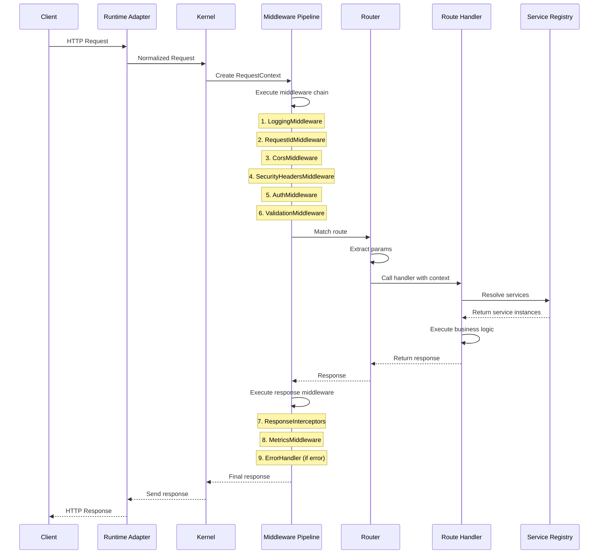

### Detailed Flow

1. **Incoming Request** — A client sends an HTTP request to the server.

2. **Runtime Adapter** — The runtime adapter (Node, Deno, or Bun) receives the raw HTTP request and
   converts it to the framework's `IRequest` abstraction. This normalizes the request across
   runtimes.

3. **Kernel** — The kernel receives the normalized request and creates a `RequestContext`. The
   context provides access to:
   - The request and response objects.
   - The service registry (for resolving services).
   - A state map (for passing data between middleware).
   - The request ID and correlation ID.

4. **Middleware Pipeline** — The kernel passes the context through the middleware pipeline.
   Middleware executes in priority order:
   - **Logging** — Logs the incoming request.
   - **Request ID** — Generates or propagates a unique request ID.
   - **CORS** — Handles preflight requests.
   - **Security Headers** — Adds security headers to the response.
   - **Authentication** — Extracts and validates credentials, populates `ctx.request.user`.
   - **Authorization** — Checks roles and permissions.
   - **Validation** — Validates the request body, query, params, headers against Zod schemas.

5. **Router** — After middleware, the pipeline calls the router to match the request path and method
   to a registered route. The router extracts path parameters.

6. **Route Handler** — The matched route's handler is called with the context. The handler:
   - Resolves services from the service registry via `ctx.services.get<T>(token)`.
   - Executes business logic (calling services, repositories, etc.).
   - Returns a response via `ctx.response.json()`, `ctx.response.send()`, etc.

7. **Response Middleware** — After the handler returns, the pipeline executes response-phase
   middleware:
   - **Response Interceptors** — Transform the response (e.g., wrap in a standard envelope).
   - **Metrics** — Record request duration and status code.
   - **Error Handler** — If any middleware or handler threw an error, the error handler catches it
     and formats a standardized error response.

8. **Response** — The kernel sends the final response back through the runtime adapter to the
   client.

### Short-Circuiting

Any middleware can short-circuit the pipeline by sending a response without calling `next()`. For
example, the auth middleware can return a 401 response if authentication fails, and the pipeline
stops — the router and handler are never called.

### Error Propagation

If any middleware or handler throws an error, the pipeline catches it and passes it to the error
handler middleware. The error handler:

1. Logs the error (if a logger is available).
2. Formats the error as a standardized response (RFC 7807 by default).
3. Sends the error response to the client.

---

## 5. Plugin Architecture

### Plugin Lifecycle

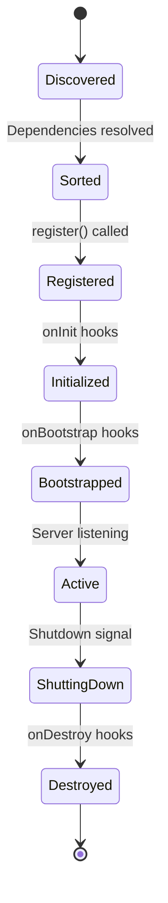

### Plugin Registration Flow

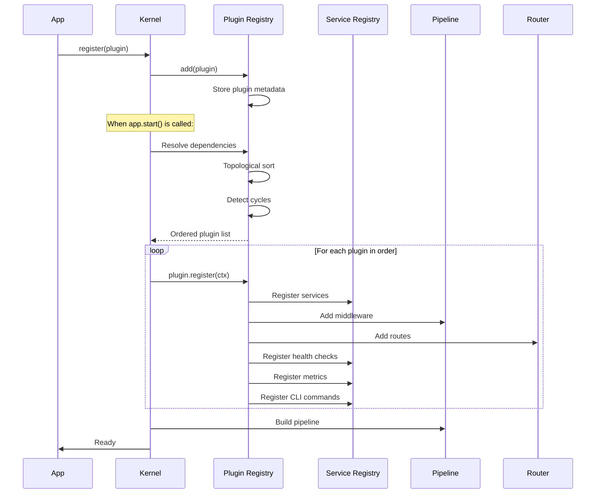

### Dependency Resolution

Plugins declare dependencies:

```typescript
{
  name: 'database-plugin',
  dependencies: ['logger', 'config'],
  optionalDependencies: ['metrics'],
  provides: ['database'],
  consumes: ['logger', 'config'],
}
```

The plugin registry:

1. Builds a dependency graph from all registered plugins.
2. Performs topological sort to determine registration order.
3. Detects circular dependencies and throws an error.
4. Validates that all required dependencies are present.
5. Optional dependencies that are absent do not cause an error.

### Capability Tokens

Capability tokens are strings that identify a capability, not a concrete type:

```typescript
// Standard tokens defined in @hono-enterprise/common
const CAPABILITIES = {
  LOGGER: 'logger',
  DATABASE: 'database',
  CACHE: 'cache',
  AUTH: 'authentication',
  // ...
};

// Plugin A provides a capability
ctx.services.register(CAPABILITIES.DATABASE, new DatabaseService());

// Plugin B consumes the capability
const db = ctx.services.get<IDatabaseService>(CAPABILITIES.DATABASE);
```

**Why tokens instead of class references?**

1. **Decoupling** — Plugin B does not import Plugin A's code.
2. **Replaceability** — Any plugin can provide the same token.
3. **Testing** — Tests register a mock with the same token.
4. **Tree-shaking** — No import dependencies between plugins.
5. **Multi-provider** — Multiple plugins can provide the same token (e.g., multiple database
   connections).

### Plugin Ordering

Plugins are ordered by:

1. **Dependency order** — A plugin's dependencies must be registered first.
2. **Priority** — Within the same dependency level, lower priority numbers register first.
3. **Registration order** — Within the same priority, registration order is preserved.

### Plugin Replacement

Any plugin can be replaced by registering a new plugin with the same `name` and `provides` tokens:

```typescript
// Replace the default database plugin
app.register({
  name: 'database', // Same name
  version: '1.0.0',
  provides: ['database'],
  register(ctx) {
    ctx.services.register('database', new MyCustomDatabase(), { override: true });
  },
});
```

### Optional Plugins

Plugins can declare optional dependencies:

```typescript
{
  name: 'audit-plugin',
  dependencies: ['logger'],
  optionalDependencies: ['database', 'messaging'],
  register(ctx) {
    const logger = ctx.services.get('logger');

    // Check if optional dependencies are available
    if (ctx.services.has('database')) {
      const db = ctx.services.get('database');
      // Use database for audit storage
    }

    if (ctx.services.has('messaging')) {
      const broker = ctx.services.get('messaging');
      // Publish audit events to message broker
    }
  },
}
```

### Plugin Communication

Plugins never communicate directly. They communicate through:

| Mechanism        | Use Case                                        |
| ---------------- | ----------------------------------------------- |
| Service Registry | Resolve a capability provided by another plugin |
| Middleware       | Observe or modify requests/responses            |
| Event Bus        | Publish/subscribe to domain events              |
| Message Broker   | Publish/subscribe to integration events         |
| Lifecycle Hooks  | React to application lifecycle events           |

### Lifecycle Hooks

Plugins register lifecycle hooks via `ctx.lifecycle`:

| Hook          | When                      | Use Case                         |
| ------------- | ------------------------- | -------------------------------- |
| `onRegister`  | Plugin registration       | Initialize plugin state          |
| `onInit`      | All plugins registered    | Validate cross-plugin state      |
| `onBootstrap` | Server about to start     | Final preparation                |
| `onRequest`   | Every request             | Per-request setup                |
| `onResponse`  | Every response            | Per-response cleanup             |
| `onError`     | Unhandled error           | Error logging, alerting          |
| `onShutdown`  | Application shutting down | Close connections, flush buffers |
| `onClose`     | Application closed        | Final cleanup                    |

### Extension Points

Every plugin must expose extension points so other plugins and application code can extend its
behavior:

| Extension Point       | API                                                         | Example                          |
| --------------------- | ----------------------------------------------------------- | -------------------------------- |
| Custom service        | `ctx.services.register(token, service, { override: true })` | Replace the default logger       |
| Custom middleware     | `ctx.middleware.add(fn, { priority })`                      | Add a request timing middleware  |
| Custom route          | `ctx.router.get(path, handler)`                             | Add a health check route         |
| Custom health check   | `ctx.health.register(name, indicator)`                      | Add a custom health indicator    |
| Custom metric         | `ctx.metrics.register(name, config)`                        | Add a custom Prometheus metric   |
| Custom CLI command    | `ctx.cli.register(name, handler)`                           | Add a custom CLI command         |
| Custom OpenAPI        | `ctx.openapi.addSchema(name, schema)`                       | Add a schema to the OpenAPI spec |
| Custom decorator      | `ctx.decorators.register(name, handler)`                    | Add a custom decorator           |
| Custom lifecycle      | `ctx.lifecycle.onX(fn)`                                     | React to lifecycle events        |
| Custom env validation | `ctx.environment.validate(spec)`                            | Validate environment variables   |

---

## 6. Service Registry

The Service Registry is the **primary service resolution mechanism** in the framework. It maps
capability tokens to service instances.

### Registration

```typescript
// Register a service
ctx.services.register('database', new DatabaseService());

// Register with options
ctx.services.register('database', new DatabaseService(), {
  override: false, // Throw if already registered (default)
  multi: false, // Single provider (default)
  lazy: false, // Eager instantiation (default)
});

// Register a factory (lazy)
ctx.services.registerFactory('database', () => new DatabaseService());
```

### Capability Lookup

```typescript
// Get a service (throws if not found)
const db = ctx.services.get<IDatabaseService>('database');

// Check if a capability is available
if (ctx.services.has('cache')) {
  const cache = ctx.services.get<ICacheStore>('cache');
}

// Get all services for a multi-provider token
const allNotifiers = ctx.services.getAll<INotifier>('notifier');
```

### Multi-Provider Support

Some capabilities can have multiple providers:

```typescript
// Plugin A
ctx.services.register(CAPABILITIES.NOTIFICATION, new EmailNotifier(), { multi: true });

// Plugin B
ctx.services.register(CAPABILITIES.NOTIFICATION, new SmsNotifier(), { multi: true });

// Consumer
const notifiers = ctx.services.getAll<INotifier>(CAPABILITIES.NOTIFICATION);
// Returns [EmailNotifier, SmsNotifier]
```

### Override Rules

```typescript
// First registration
ctx.services.register('logger', new PinoLogger());

// Override (explicit)
ctx.services.register('logger', new ConsoleLogger(), { override: true });

// Without override flag, throws an error
ctx.services.register('logger', new ConsoleLogger());
// Error: Capability 'logger' is already registered. Use { override: true } to replace.
```

### Lazy Services

```typescript
// Factory is called only on first get()
ctx.services.registerFactory('database', () => {
  const config = ctx.services.get('config');
  return new DatabaseService({ url: config.get('DATABASE_URL') });
});

// Factory is not called yet
// ...

// First get() triggers factory
const db = ctx.services.get('database'); // Factory called here

// Subsequent get() returns cached instance
const db2 = ctx.services.get('database'); // Same instance
```

### Service Scopes

The Service Registry supports two scopes:

| Scope           | Behavior                                                                            |
| --------------- | ----------------------------------------------------------------------------------- |
| **Application** | Service is created once and shared across all requests. Default.                    |
| **Request**     | Service is created per request via `ctx.services.register()` in request middleware. |

Request-scoped services are registered on the request context, not the global registry:

```typescript
app.middleware.add(async (ctx, next) => {
  // Register a request-scoped service
  ctx.services.register('request-logger', logger.child({ requestId: ctx.request.id }));
  await next();
});
```

### Thread Safety Considerations

The Service Registry is **not thread-safe** by design. JavaScript is single-threaded (event loop),
so concurrent access is not an issue. However:

- **Registration** must happen during the bootstrap phase, not during request processing.
- **Request-scoped registration** is safe because each request has its own context.
- **Lazy factories** are safe because JavaScript is single-threaded — the factory is called at most
  once.

---

## 7. Runtime Layer

### Why Runtime Abstraction Exists

Different JavaScript runtimes have different APIs for the same operations:

| Operation     | Node.js                | Deno                       | Bun                    |
| ------------- | ---------------------- | -------------------------- | ---------------------- |
| UUID          | `crypto.randomUUID()`  | `crypto.randomUUID()`      | `crypto.randomUUID()`  |
| Random bytes  | `crypto.randomBytes()` | `crypto.getRandomValues()` | `crypto.randomBytes()` |
| High-res time | `process.hrtime()`     | `performance.now()`        | `performance.now()`    |
| Environment   | `process.env`          | `Deno.env`                 | `Bun.env`              |
| File system   | `fs` module            | `Deno.readFile()`          | `Bun.file()`           |
| HTTP server   | `http.createServer()`  | `Deno.serve()`             | `Bun.serve()`          |

Without abstraction, every plugin would need runtime-specific code paths. The Runtime Layer
eliminates this by providing a single interface.

### IRuntimeServices

All runtime-specific operations are abstracted behind `IRuntimeServices`:

```typescript
interface IRuntimeServices {
  platform(): RuntimePlatform;
  version(): string;
  hostname(): string;

  uuid(): string;
  randomBytes(length: number): Uint8Array;
  subtle: SubtleCrypto;

  now(): number;
  hrtime(): number;
  setTimeout(fn: () => void, ms: number): TimerHandle;
  clearTimeout(handle: TimerHandle): void;
  setInterval(fn: () => void, ms: number): TimerHandle;
  clearInterval(handle: TimerHandle): void;

  env: Record<string, string | undefined>;
  exit(code?: number): never;

  fs?: IFileSystem;
}
```

### Runtime Adapters

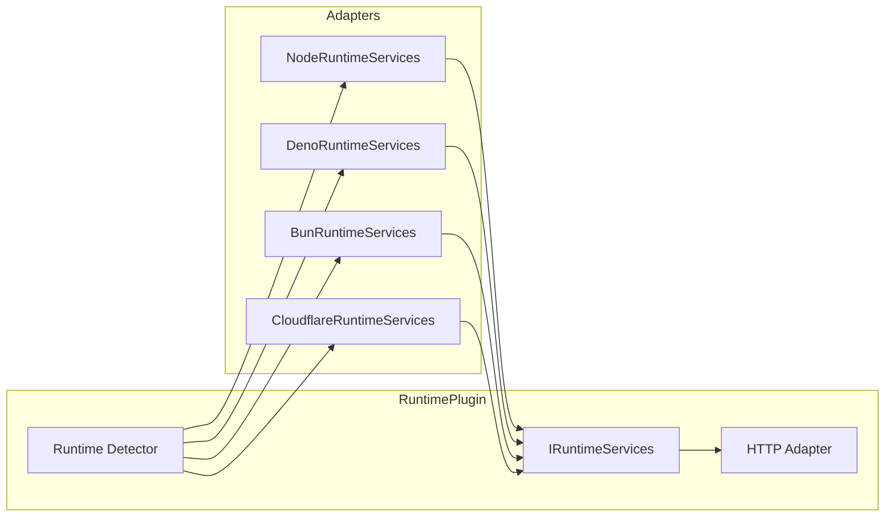

### Runtime Is Mandatory

A runtime provider is the one plugin every application must register. `createApplication()` **fails
fast at startup** if no registered plugin provides the `runtime` capability, and the kernel always
registers the runtime-providing plugin first, regardless of declared priority. This is why
`ctx.runtime` on `IPluginContext` is non-optional — every other plugin can rely on it being present
during its own `register()` call.

### Auto-Detection

The `RuntimePlugin` auto-detects the runtime at startup:

```typescript
function detectRuntime(): RuntimePlatform {
  if (typeof Deno !== 'undefined') return 'deno';
  if (typeof Bun !== 'undefined') return 'bun';
  if (typeof caches !== 'undefined' && navigator.userAgent?.includes('cloudflare')) {
    return 'cloudflare-workers';
  }
  return 'node';
}
```

### HTTP Server Abstraction

The Runtime Plugin also provides HTTP server adapters:

```typescript
interface IHttpAdapter {
  createServer(handler: (req: IRequest) => Promise<IResponse>): ServerHandle;
  listen(handle: ServerHandle, port: number, hostname?: string): Promise<void>;
  close(handle: ServerHandle): Promise<void>;
}
```

Each runtime has its own implementation:

- **NodeHttpAdapter** — Uses Node's `http.createServer()`.
- **DenoHttpAdapter** — Uses Deno's `Deno.serve()`.
- **BunHttpAdapter** — Uses Bun's `Bun.serve()`.

### Why Only Runtime May Use Runtime-Specific APIs

This rule is enforced because:

1. **Portability** — If a plugin uses `process.env` directly, it breaks on Deno and Bun.
2. **Testability** — Runtime services can be mocked in tests.
3. **Consistency** — All plugins use the same API, regardless of runtime.
4. **Future-proofing** — New runtimes only need a new adapter, not changes to every plugin.

### Future Runtimes

Adding a new runtime requires:

1. Implement `IRuntimeServices` for the new runtime.
2. Implement `IHttpAdapter` for the new runtime.
3. Add the runtime to the detector.
4. No changes to any other package.

This is the power of the adapter pattern — the framework is open for extension but closed for
modification.

---

## 8. Package Architecture

### Toolchain and Distribution

The monorepo is developed with the **Deno toolchain** (Deno 2 workspaces;
`deno check`/`test`/`lint`/`fmt`). Packages are published to **JSR** under the `@hono-enterprise`
scope with no build step — TypeScript sources are published directly. Node and Bun consumers install
through JSR's npm compatibility layer, which transforms packages to standard ESM npm artifacts.
Cross-runtime support is therefore a _distribution_ property (JSR) plus a _code_ property (runtime
abstraction, §7) — CI verifies both by running the test suite under Deno and a compat suite under
Node and Bun.

### Package Overview

```mermaid
graph TB
    subgraph Foundation
        common[common]
        kernel[kernel]
        runtime[runtime]
    end

    subgraph Optional Core
        di[di-plugin]
        decorator[decorator-plugin]
    end

    subgraph Infrastructure Plugins
        database[database-plugin]
        cache[cache-plugin]
        messaging[messaging-plugin]
        queue[queue-plugin]
        storage[storage-plugin]
    end

    subgraph Security Plugins
        auth[auth-plugin]
        http-sec[http-security-plugin]
        secrets[secrets-plugin]
    end

    subgraph Application Plugins
        events[events-plugin]
        cqrs[cqrs-plugin]
        scheduler[scheduler-plugin]
    end

    subgraph Observability Plugins
        logger[logger-plugin]
        metrics[metrics-plugin]
        health[health-plugin]
        telemetry[telemetry-plugin]
        audit[audit-plugin]
    end

    subgraph Communication Plugins
        mail[mail-plugin]
        notification[notification-plugin]
    end

    subgraph Feature Plugins
        feature-flags[feature-flags-plugin]
        multi-tenancy[multi-tenancy-plugin]
        resilience[resilience-plugin]
    end

    subgraph Developer Tools
        validation[validation-plugin]
        config[config-plugin]
        openapi[openapi-plugin]
        cli[cli]
        testing[testing]
        sdk[sdk]
    end

    common --> kernel
    common --> runtime
    kernel --> runtime
    common --> di
    kernel --> di
    common --> decorator
    kernel --> decorator

    common --> logger
    kernel --> logger
    common --> config
    kernel --> config
    common --> validation
    kernel --> validation
    common --> database
    kernel --> database
    common --> cache
    kernel --> cache
    common --> events
    kernel --> events
    common --> cqrs
    kernel --> cqrs
    common --> messaging
    kernel --> messaging
    common --> queue
    kernel --> queue
    common --> auth
    kernel --> auth
    common --> http-sec
    kernel --> http-sec
    common --> scheduler
    kernel --> scheduler
    common --> metrics
    kernel --> metrics
    common --> health
    kernel --> health
    common --> openapi
    kernel --> openapi
    common --> telemetry
    kernel --> telemetry
    common --> secrets
    kernel --> secrets
    common --> audit
    kernel --> audit
    common --> resilience
    kernel --> resilience
    common --> storage
    kernel --> storage
    common --> mail
    kernel --> mail
    common --> notification
    kernel --> notification
    common --> feature-flags
    kernel --> feature-flags
    common --> multi-tenancy
    kernel --> multi-tenancy
```

### Package Details

#### @hono-enterprise/common

| Aspect               | Detail                                                                                                                               |
| -------------------- | ------------------------------------------------------------------------------------------------------------------------------------ |
| **Purpose**          | Shared types, interfaces, and capability tokens                                                                                      |
| **Responsibilities** | Define all public interfaces; define capability token constants; provide shared utility types                                        |
| **Dependencies**     | None                                                                                                                                 |
| **Public API**       | All interfaces (`IPlugin`, `IPluginContext`, `ILogger`, `IConfig`, `IDatabaseService`, etc.); `CAPABILITIES` constant; utility types |
| **Extension Points** | N/A (types only)                                                                                                                     |
| **Rules**            | Zero dependencies; no runtime behavior beyond constants and pure type utilities                                                      |

#### @hono-enterprise/kernel

| Aspect               | Detail                                                                                                                                    |
| -------------------- | ----------------------------------------------------------------------------------------------------------------------------------------- |
| **Purpose**          | Plugin orchestration and request processing                                                                                               |
| **Responsibilities** | Plugin registry; service registry; middleware pipeline; router; application lifecycle; request context                                    |
| **Dependencies**     | `common` only                                                                                                                             |
| **Public API**       | `createApplication()`; `Application`; `ServiceRegistry`; `RouterApi`; `MiddlewareApi` (consumes `IPlugin`/`IPluginContext` from `common`) |
| **Extension Points** | Custom plugins; custom middleware; custom routes; service override                                                                        |
| **Rules**            | No runtime-specific APIs; no decorator support; no DI; zero features beyond orchestration                                                 |

#### @hono-enterprise/runtime

| Aspect               | Detail                                                                                               |
| -------------------- | ---------------------------------------------------------------------------------------------------- |
| **Purpose**          | Runtime abstraction layer                                                                            |
| **Responsibilities** | Provide `IRuntimeServices` for Node, Deno, Bun; provide HTTP server adapters; runtime auto-detection |
| **Dependencies**     | `common`, `kernel`                                                                                   |
| **Public API**       | `RuntimePlugin()`; `IRuntimeServices`; `IHttpAdapter`; `detectRuntime()`                             |
| **Extension Points** | Custom runtime adapter (for new runtimes); custom HTTP adapter                                       |
| **Rules**            | The only package allowed to use runtime-specific APIs                                                |

#### @hono-enterprise/di-plugin

| Aspect               | Detail                                                                                                      |
| -------------------- | ----------------------------------------------------------------------------------------------------------- |
| **Purpose**          | Optional dependency injection container                                                                     |
| **Responsibilities** | Provide DI container with singleton, scoped, transient lifecycles; constructor injection; factory providers |
| **Dependencies**     | `common`, `kernel`                                                                                          |
| **Public API**       | `DiPlugin()`; `IContainer`; `ContainerBuilder`                                                              |
| **Extension Points** | Custom provider types; custom scopes                                                                        |
| **Rules**            | Optional; no other plugin depends on it; services resolve from ServiceRegistry, not container               |

#### @hono-enterprise/decorator-plugin

| Aspect               | Detail                                                                                                                                |
| -------------------- | ------------------------------------------------------------------------------------------------------------------------------------- |
| **Purpose**          | Optional decorator and metadata system                                                                                                |
| **Responsibilities** | Store decorator metadata in plain objects; read metadata and register routes/services/middleware with kernel                          |
| **Dependencies**     | `common`, `kernel`                                                                                                                    |
| **Public API**       | `DecoratorPlugin()`; `@Controller`, `@Get`, `@Post`, etc.; `@Injectable`, `@Inject`; `@Body`, `@Query`, `@Param`; `createDecorator()` |
| **Extension Points** | Custom decorators via `createDecorator()`; custom parameter decorators                                                                |
| **Rules**            | Optional; no reflection required; metadata stored in plain objects; decorators are syntactic sugar over programmatic API              |

#### @hono-enterprise/logger-plugin

| Aspect               | Detail                                                                                                      |
| -------------------- | ----------------------------------------------------------------------------------------------------------- |
| **Purpose**          | Structured logging                                                                                          |
| **Responsibilities** | Provide `ILogger` implementations (Pino, Console, Noop); request logging middleware; slow request detection |
| **Dependencies**     | `common`, `kernel`, `runtime`                                                                               |
| **Public API**       | `LoggerPlugin()`; `ILogger`                                                                                 |
| **Extension Points** | Custom logger implementation (override `logger` token); custom log formatters                               |
| **Rules**            | Pino is optional (injected or lazy-loaded via `npm:` specifier); ConsoleLogger works on all runtimes        |

#### @hono-enterprise/config-plugin

| Aspect               | Detail                                                                                             |
| -------------------- | -------------------------------------------------------------------------------------------------- |
| **Purpose**          | Configuration management                                                                           |
| **Responsibilities** | Load environment variables; parse `.env` files; validate config with Zod; provide type-safe access |
| **Dependencies**     | `common`, `kernel`, `runtime`                                                                      |
| **Public API**       | `ConfigPlugin()`; `IConfig`                                                                        |
| **Extension Points** | Custom config sources (override `config` token); custom env file parsers                           |
| **Rules**            | Environment access via `runtime.env`, not `process.env`                                            |

#### @hono-enterprise/validation-plugin

| Aspect               | Detail                                                                                                               |
| -------------------- | -------------------------------------------------------------------------------------------------------------------- |
| **Purpose**          | Request validation with Zod                                                                                          |
| **Responsibilities** | Validate body, query, params, headers, cookies; sanitize input; format validation errors (RFC 7807, default, custom) |
| **Dependencies**     | `common`, `kernel`                                                                                                   |
| **Public API**       | `ValidationPlugin()`; `IValidationService`; `validateBody()`, `validateQuery()`, `validateParams()`                  |
| **Extension Points** | Custom error formatters; custom sanitization rules                                                                   |
| **Rules**            | Zod is the source of truth for validation; schemas are shared with OpenAPI plugin                                    |

#### @hono-enterprise/exceptions

| Aspect               | Detail                                                                                                                  |
| -------------------- | ----------------------------------------------------------------------------------------------------------------------- |
| **Purpose**          | Exception types and global error handling                                                                               |
| **Responsibilities** | `HttpError` type; factory functions (`badRequest()`, `notFound()`, etc.); error handler middleware; RFC 7807 formatting |
| **Dependencies**     | `common` only                                                                                                           |
| **Public API**       | `HttpError`; exception factory functions; `errorHandler()`                                                              |
| **Extension Points** | Custom error formatters                                                                                                 |
| **Rules**            | Plain package, not a plugin; composition (factories) over inheritance; registered by the application, not the kernel    |

#### @hono-enterprise/database-plugin

| Aspect               | Detail                                                                                                                                |
| -------------------- | ------------------------------------------------------------------------------------------------------------------------------------- |
| **Purpose**          | Database access with repository pattern                                                                                               |
| **Responsibilities** | Provide `IDatabaseService`; repository pattern; unit of work (transactions); ORM adapters (Prisma, Drizzle, Memory)                   |
| **Dependencies**     | `common`, `kernel`, `runtime`                                                                                                         |
| **Public API**       | `DatabasePlugin()`; `IDatabaseService`; `IRepository`; `IUnitOfWork`                                                                  |
| **Extension Points** | Custom ORM adapter; custom repository; custom transaction strategy                                                                    |
| **Rules**            | Prisma and Drizzle are optional (injected or lazy-loaded via `npm:` specifiers); Memory adapter for testing; no raw SQL in public API |

#### @hono-enterprise/cache-plugin

| Aspect               | Detail                                                                                                                        |
| -------------------- | ----------------------------------------------------------------------------------------------------------------------------- |
| **Purpose**          | Caching abstraction with transparent response-caching middleware                                                              |
| **Responsibilities** | Provide `ICacheStore`; Memory, Redis, Noop stores; `CacheService`; `cacheMiddleware`; TTL management                          |
| **Dependencies**     | `common`, `kernel`                                                                                                            |
| **Public API**       | `CachePlugin()`, `CacheService`, `MemoryStore`, `RedisStore`, `NoopStore`, `cacheMiddleware`, types in `src/interfaces/index` |
| **Extension Points** | Custom cache store (override `cache` token); custom key generators; named multi-cache instances                               |
| **Rules**            | Redis client is optional (injected or lazy-loaded via `npm:` specifier); Memory store default; `ICacheStore` has 5 methods    |

#### @hono-enterprise/events-plugin

| Aspect               | Detail                                                                                                                     |
| -------------------- | -------------------------------------------------------------------------------------------------------------------------- |
| **Purpose**          | In-memory event bus for domain events                                                                                      |
| **Responsibilities** | Publish/subscribe domain events; event handler registration; error handling                                                |
| **Dependencies**     | `common`, `kernel`                                                                                                         |
| **Public API**       | `EventsPlugin()`; `IEventBus`; `DomainEvent`; `IntegrationEvent`; `defineDomainEvent`; `IEventHandler`; `subscribeHandler` |
| **Extension Points** | Custom event bus (override `events` token); custom event handlers                                                          |
| **Rules**            | In-memory only; for distributed events, use messaging plugin                                                               |

#### @hono-enterprise/cqrs-plugin

| Aspect               | Detail                                                                                                                                                                                                                                                                   |
| -------------------- | ------------------------------------------------------------------------------------------------------------------------------------------------------------------------------------------------------------------------------------------------------------------------ |
| **Purpose**          | Command Query Responsibility Segregation                                                                                                                                                                                                                                 |
| **Responsibilities** | Command bus; query bus; pipeline behaviors; handler registration                                                                                                                                                                                                         |
| **Dependencies**     | `common`, `kernel`                                                                                                                                                                                                                                                       |
| **Public API**       | `CqrsPlugin()`; `ICommandBus`; `IQueryBus`; `ICqrsFacade`; `ICommandHandler`; `IQueryHandler`; `IPipelineBehavior`; `CqrsRequest`; `CqrsCommand`; `CqrsQuery`; `CommandBus`; `QueryBus`; `HandlerNotFoundError` (contracts owned by `common`, re-exported by the plugin) |
| **Extension Points** | Custom pipeline behaviors; custom bus implementations                                                                                                                                                                                                                    |
| **Rules**            | Optional; consumes the `events` capability via token for event sourcing (optional)                                                                                                                                                                                       |

#### @hono-enterprise/messaging-plugin

| Aspect               | Detail                                                                                                                                                                    |
| -------------------- | ------------------------------------------------------------------------------------------------------------------------------------------------------------------------- |
| **Purpose**          | Message broker abstraction for cross-service integration events                                                                                                           |
| **Responsibilities** | Provide `IMessageBroker`; in-memory and Redis Streams adapters; serializer interface (`ISerializer`); `EventsMessagingBridge` for events-to-messaging bridge              |
| **Dependencies**     | `common`, `kernel`, `runtime`                                                                                                                                             |
| **Public API**       | `MessagingPlugin()`; `EventsMessagingBridge()`; `InMemoryBroker`; `RedisStreamsBroker`; `JsonSerializer`; `IMessageBroker` (re-exported from `common`)                    |
| **Extension Points** | Custom broker adapter; custom serializers; custom Redis client injection                                                                                                  |
| **Rules**            | ioredis is optional (injected or lazy-loaded via `npm:` specifier); in-memory broker default for testing; decoupled from events plugin; named instances via `name` option |

#### @hono-enterprise/queue-plugin

| Aspect               | Detail                                                                                                            |
| -------------------- | ----------------------------------------------------------------------------------------------------------------- |
| **Purpose**          | Background job queue                                                                                              |
| **Responsibilities** | Add/process jobs; retry strategies; recurring jobs; concurrency control                                           |
| **Dependencies**     | `common`, `kernel`, `runtime`                                                                                     |
| **Public API**       | `QueuePlugin()`; `IQueue`                                                                                         |
| **Extension Points** | Custom queue adapter; custom retry strategies                                                                     |
| **Rules**            | Redis and RabbitMQ clients are optional (injected or lazy-loaded via `npm:` specifiers); Memory queue for testing |

#### @hono-enterprise/auth-plugin

| Aspect               | Detail                                                                                                           |
| -------------------- | ---------------------------------------------------------------------------------------------------------------- |
| **Purpose**          | Authentication and authorization                                                                                 |
| **Responsibilities** | JWT service; API key auth; RBAC with role hierarchy; permission checks; guards; rate limiting                    |
| **Dependencies**     | `common`, `kernel`                                                                                               |
| **Public API**       | `AuthenticationPlugin()`; `IAuthService`; `IJwtService`; `requireAuth()`, `requireRole()`, `requirePermission()` |
| **Extension Points** | Custom auth strategies; custom guards; custom RBAC models                                                        |
| **Rules**            | JWT library is optional (injected or lazy-loaded via `npm:` specifier); password hashing via runtime crypto      |

#### @hono-enterprise/http-security-plugin

| Aspect               | Detail                                                                  |
| -------------------- | ----------------------------------------------------------------------- |
| **Purpose**          | HTTP transport security                                                 |
| **Responsibilities** | CORS; security headers; CSRF; request size limiting; IP security        |
| **Dependencies**     | `common`, `kernel`                                                      |
| **Public API**       | `HttpSecurityPlugin()`                                                  |
| **Extension Points** | Custom security headers; custom CORS policies                           |
| **Rules**            | Secure defaults; all security features are opt-out (enabled by default) |

#### @hono-enterprise/scheduler-plugin

| Aspect               | Detail                                                                                                         |
| -------------------- | -------------------------------------------------------------------------------------------------------------- |
| **Purpose**          | Job scheduling                                                                                                 |
| **Responsibilities** | Cron jobs; delayed jobs; recurring jobs; retry with backoff; distributed locking                               |
| **Dependencies**     | `common`, `kernel`, `runtime`                                                                                  |
| **Public API**       | `SchedulerPlugin()`; `IScheduler`                                                                              |
| **Extension Points** | Custom distributed lock implementation; custom cron parser                                                     |
| **Rules**            | Distributed locking for multi-instance deployments; Redis for lock storage (optional, injected or lazy-loaded) |

#### @hono-enterprise/metrics-plugin

| Aspect               | Detail                                                                                          |
| -------------------- | ----------------------------------------------------------------------------------------------- |
| **Purpose**          | Prometheus metrics                                                                              |
| **Responsibilities** | Counter, gauge, histogram, summary; metrics registry; Prometheus rendering; built-in collectors |
| **Dependencies**     | `common`, `kernel`, `runtime`                                                                   |
| **Public API**       | `MetricsPlugin()`; `IMetricsService`                                                            |
| **Extension Points** | Custom metric collectors; custom renderers                                                      |
| **Rules**            | Prometheus format only; OpenMetrics support in future                                           |

#### @hono-enterprise/health-plugin

| Aspect               | Detail                                                                                     |
| -------------------- | ------------------------------------------------------------------------------------------ |
| **Purpose**          | Health check endpoints                                                                     |
| **Responsibilities** | `/health`, `/live`, `/ready` endpoints; health indicator registration; built-in indicators |
| **Dependencies**     | `common`, `kernel`                                                                         |
| **Public API**       | `HealthPlugin()`; `IHealthService`; `IHealthIndicator`                                     |
| **Extension Points** | Custom health indicators                                                                   |
| **Rules**            | Health indicators depend on capability tokens, not concrete packages                       |

#### @hono-enterprise/openapi-plugin

| Aspect               | Detail                                                                          |
| -------------------- | ------------------------------------------------------------------------------- |
| **Purpose**          | OpenAPI documentation generation                                                |
| **Responsibilities** | Generate OpenAPI spec from route schemas; Zod to OpenAPI conversion; Swagger UI |
| **Dependencies**     | `common`, `kernel`                                                              |
| **Public API**       | `OpenApiPlugin()`; `IOpenApiService`                                            |
| **Extension Points** | Custom schema transformers; custom UI                                           |
| **Rules**            | Zod is the source of truth; no duplicated schemas; spec deduplication           |

#### @hono-enterprise/telemetry-plugin

| Aspect               | Detail                                                                       |
| -------------------- | ---------------------------------------------------------------------------- |
| **Purpose**          | OpenTelemetry distributed tracing                                            |
| **Responsibilities** | Tracer provider; span management; context propagation; instrumentation       |
| **Dependencies**     | `common`, `kernel`, `runtime`                                                |
| **Public API**       | `TelemetryPlugin()`; `ITelemetryService`                                     |
| **Extension Points** | Custom exporters; custom instrumentations                                    |
| **Rules**            | OpenTelemetry SDK is optional (injected or lazy-loaded via `npm:` specifier) |

#### @hono-enterprise/secrets-plugin

| Aspect               | Detail                                                                                                |
| -------------------- | ----------------------------------------------------------------------------------------------------- |
| **Purpose**          | Secret management                                                                                     |
| **Responsibilities** | Retrieve secrets from KMS, Vault, env; secret rotation; caching                                       |
| **Dependencies**     | `common`, `kernel`, `runtime`                                                                         |
| **Public API**       | `SecretsPlugin()`; `ISecretManager`                                                                   |
| **Extension Points** | Custom secret provider                                                                                |
| **Rules**            | Cloud SDKs are optional (injected or lazy-loaded via `npm:` specifiers); env provider for development |

#### @hono-enterprise/audit-plugin

| Aspect               | Detail                                                                   |
| -------------------- | ------------------------------------------------------------------------ |
| **Purpose**          | Audit trail logging                                                      |
| **Responsibilities** | Log audit events; store in database, file, or log; audit trail retrieval |
| **Dependencies**     | `common`, `kernel` (consumes `logger` capability via token)              |
| **Public API**       | `AuditPlugin()`; `IAuditLogger`                                          |
| **Extension Points** | Custom audit storage                                                     |
| **Rules**            | Audit logs are immutable; storage is pluggable                           |

#### @hono-enterprise/resilience-plugin

| Aspect               | Detail                                                        |
| -------------------- | ------------------------------------------------------------- |
| **Purpose**          | Resilience patterns                                           |
| **Responsibilities** | Circuit breaker; retry with backoff; timeout; bulkhead        |
| **Dependencies**     | `common`, `kernel`                                            |
| **Public API**       | `ResiliencePlugin()`; `IResilienceService`                    |
| **Extension Points** | Custom resilience patterns; custom circuit breaker strategies |
| **Rules**            | Patterns are composable; no external dependencies             |

#### @hono-enterprise/storage-plugin

| Aspect               | Detail                                                                                                          |
| -------------------- | --------------------------------------------------------------------------------------------------------------- |
| **Purpose**          | File storage abstraction                                                                                        |
| **Responsibilities** | S3, GCS, local, memory providers; upload middleware; signed URLs                                                |
| **Dependencies**     | `common`, `kernel`, `runtime`                                                                                   |
| **Public API**       | `StoragePlugin()`; `IStorage`                                                                                   |
| **Extension Points** | Custom storage provider                                                                                         |
| **Rules**            | Cloud SDKs are optional (injected or lazy-loaded via `npm:` specifiers); local and memory providers for testing |

#### @hono-enterprise/mail-plugin

| Aspect               | Detail                                                                                            |
| -------------------- | ------------------------------------------------------------------------------------------------- |
| **Purpose**          | Email sending                                                                                     |
| **Responsibilities** | SMTP, SES, SendGrid providers; template engine                                                    |
| **Dependencies**     | `common`, `kernel`                                                                                |
| **Public API**       | `MailPlugin()`; `IMailer`                                                                         |
| **Extension Points** | Custom mail provider; custom template engine                                                      |
| **Rules**            | Email SDKs are optional (injected or lazy-loaded via `npm:` specifiers); log provider for testing |

#### @hono-enterprise/notification-plugin

| Aspect               | Detail                                                                         |
| -------------------- | ------------------------------------------------------------------------------ |
| **Purpose**          | Multi-channel notifications                                                    |
| **Responsibilities** | Email, SMS, push, Slack channels; multi-channel dispatch                       |
| **Dependencies**     | `common`, `kernel`                                                             |
| **Public API**       | `NotificationPlugin()`; `INotifier`                                            |
| **Extension Points** | Custom notification channels                                                   |
| **Rules**            | Channel providers are optional (injected or lazy-loaded via `npm:` specifiers) |

#### @hono-enterprise/feature-flags-plugin

| Aspect               | Detail                                                                  |
| -------------------- | ----------------------------------------------------------------------- |
| **Purpose**          | Feature flag management                                                 |
| **Responsibilities** | Flag evaluation; percentage rollout; user targeting; multiple providers |
| **Dependencies**     | `common`, `kernel`                                                      |
| **Public API**       | `FeatureFlagsPlugin()`; `IFeatureFlags`                                 |
| **Extension Points** | Custom flag provider                                                    |
| **Rules**            | Config provider for simple cases; LaunchDarkly for enterprise           |

#### @hono-enterprise/multi-tenancy-plugin

| Aspect               | Detail                                                                            |
| -------------------- | --------------------------------------------------------------------------------- |
| **Purpose**          | Multi-tenancy support                                                             |
| **Responsibilities** | Tenant resolution; tenant context; database isolation strategies; cache isolation |
| **Dependencies**     | `common`, `kernel`                                                                |
| **Public API**       | `MultiTenancyPlugin()`; `IMultiTenancyService`                                    |
| **Extension Points** | Custom tenant resolver; custom database strategy                                  |
| **Rules**            | Tenant resolution via middleware; tenant context via request context              |

#### @hono-enterprise/testing

| Aspect               | Detail                                                         |
| -------------------- | -------------------------------------------------------------- |
| **Purpose**          | Testing utilities                                              |
| **Responsibilities** | Test app factory; mock plugin; request injection; mock context |
| **Dependencies**     | `common`, `kernel`                                             |
| **Public API**       | `createTestApp()`; `createMockPlugin()`; `inject()`            |
| **Extension Points** | N/A (testing utility)                                          |
| **Rules**            | No real external dependencies; in-memory adapters only         |

#### @hono-enterprise/cli

| Aspect               | Detail                                                                 |
| -------------------- | ---------------------------------------------------------------------- |
| **Purpose**          | CLI tool with generators                                               |
| **Responsibilities** | Project scaffolding; code generation; plugin-aware generators          |
| **Dependencies**     | `common`, `kernel`                                                     |
| **Public API**       | `hono-enterprise` CLI command                                          |
| **Extension Points** | Custom schematics                                                      |
| **Rules**            | Plugin-aware: detects installed plugins and offers relevant generators |

#### @hono-enterprise/sdk

| Aspect               | Detail                                                                  |
| -------------------- | ----------------------------------------------------------------------- |
| **Purpose**          | Client SDK for external consumers                                       |
| **Responsibilities** | HTTP client; auth interceptors; retry; circuit breaker; OpenAPI codegen |
| **Dependencies**     | `common`, `kernel`                                                      |
| **Public API**       | `HttpClient`; `createClient()`                                          |
| **Extension Points** | Custom interceptors                                                     |
| **Rules**            | Runtime-independent; works in browsers and servers                      |

---

## 9. Dependency Rules

### Allowed Dependency Direction

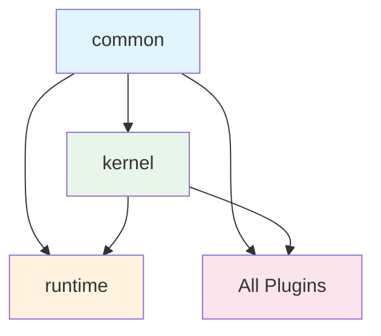

**Rules:**

1. `common` depends on **nothing**.
2. `kernel` depends on `common` only.
3. `runtime` depends on `common` and `kernel`.
4. All plugins depend on `common` and optionally `kernel`.
5. **No plugin depends on another plugin** at the package level.
6. Plugins communicate via capability tokens at runtime.

### Why Circular Dependencies Are Forbidden

Circular dependencies cause:

1. **Unpredictable initialization** — If A depends on B and B depends on A, which initializes first?
2. **Bundle size** — Bundlers cannot tree-shake circular dependencies.
3. **Testing difficulty** — Cannot test one package without loading the other.
4. **Maintenance** — Changes to one package force changes to the other.

### How Capability Tokens Prevent Circular Dependencies

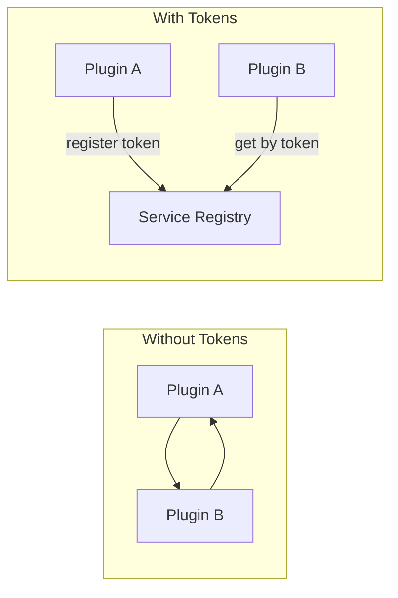

With capability tokens:

- Plugin A registers a service with token `'database'`.
- Plugin B resolves the service by token `'database'`.
- Plugin B never imports Plugin A's code.
- No circular dependency.

### Build-Time vs Runtime Dependencies

| Type           | Direction                                  | Example                                                           |
| -------------- | ------------------------------------------ | ----------------------------------------------------------------- |
| **Build-time** | Package imports types from another package | `import type { IDatabaseService } from '@hono-enterprise/common'` |
| **Runtime**    | Plugin resolves service by token           | `ctx.services.get('database')`                                    |

Build-time dependencies are for type definitions only. Runtime dependencies are resolved through the
service registry. This separation ensures packages can be type-checked independently and bundled
without pulling in unnecessary code.

---

## 10. Middleware Pipeline

### Pipeline Architecture

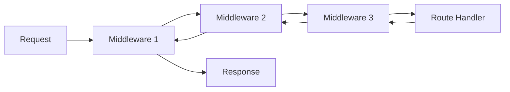

The middleware pipeline is a chain of functions that execute in order. Each middleware receives the
request context and a `next()` function. Calling `next()` passes control to the next middleware. Not
calling `next()` short-circuits the pipeline.

### Ordering

Middleware is ordered by priority (lower numbers execute first):

| Priority | Middleware                | Purpose                  |
| -------- | ------------------------- | ------------------------ |
| 50       | LoggingMiddleware         | Log incoming request     |
| 100      | RequestIdMiddleware       | Generate request ID      |
| 150      | CorrelationIdMiddleware   | Propagate correlation ID |
| 200      | CorsMiddleware            | Handle CORS              |
| 250      | SecurityHeadersMiddleware | Add security headers     |
| 300      | AuthMiddleware            | Authenticate request     |
| 350      | AuthorizationMiddleware   | Check permissions        |
| 400      | ValidationMiddleware      | Validate request         |
| 500      | RouteHandler              | Execute route handler    |
| 600      | ResponseInterceptors      | Transform response       |
| 700      | MetricsMiddleware         | Record metrics           |
| 800      | ErrorHandler              | Handle errors            |

### Registration

```typescript
// Global middleware
app.middleware.add(loggingMiddleware(), { priority: 50 });

// Route-level middleware
app.router.get('/users', {
  middleware: [authMiddleware(), validationMiddleware()],
  handler: async (ctx) => {/* ... */},
});
```

### Execution

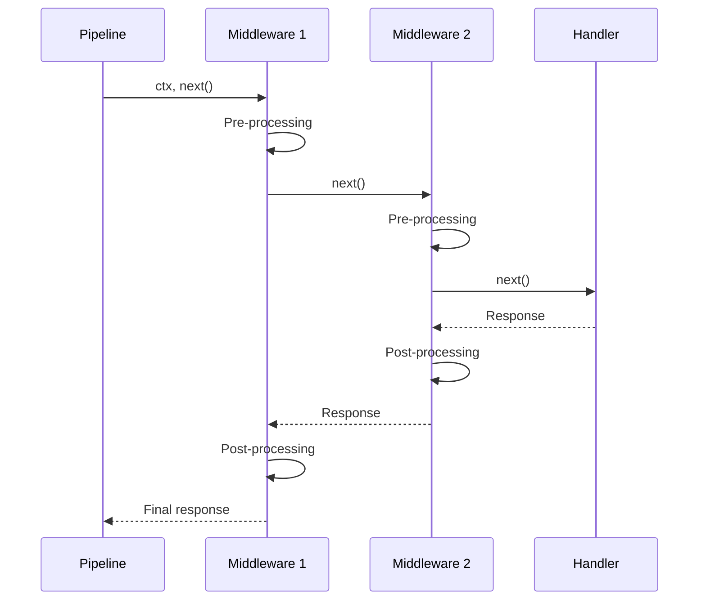

### Short-Circuiting

A middleware can short-circuit by sending a response without calling `next()`:

```typescript
const authMiddleware = () => async (ctx, next) => {
  const token = ctx.request.headers.get('authorization');
  if (!token) {
    return ctx.response.status(401).json({ error: 'Unauthorized' });
    // next() is not called — pipeline stops
  }
  await next();
};
```

### Error Propagation

If a middleware or handler throws an error:

1. The error propagates up the middleware chain.
2. Each middleware's post-processing is skipped.
3. The error reaches the error handler middleware.
4. The error handler formats the response and sends it.


### Context Creation

Each request gets a fresh `RequestContext`:

```typescript
interface RequestContext {
  request: IRequest;
  response: IResponse;
  services: ServiceRegistry;
  state: Map<string, unknown>;
  params: Record<string, string>;
  query: Record<string, string>;
  id: string;
  startTime: number;
}
```

The `state` map allows middleware to pass data to downstream middleware and handlers:

```typescript
// Validation middleware
ctx.state.set('validatedBody', result.data);

// Handler
const body = ctx.state.get('validatedBody');
```

### Request-Scoped Data

Request-scoped data is stored on the context, not on global state. This ensures:

- No data leaks between requests.
- No race conditions.
- Easy testing (each test gets a fresh context).

---

## 11. Dependency Injection

### Why DI Is Optional

DI is a pattern for managing service dependencies. In Hono Enterprise, the **Service Registry** is
the primary service resolution mechanism. DI is an optional layer that provides:

- Constructor injection.
- Lifecycle management (singleton, scoped, transient).
- Circular dependency detection at the DI level.

Applications that prefer manual wiring or factory functions can skip the DI plugin entirely.

### Three Approaches to Service Management

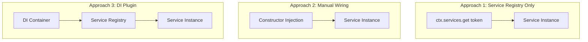

| Approach                  | When to Use                                                                 |
| ------------------------- | --------------------------------------------------------------------------- |
| **Service Registry only** | Simple applications; functional style; no DI needed                         |
| **Manual wiring**         | When you want explicit control; pass dependencies via constructors          |
| **DI Plugin**             | When you want automatic resolution; when you have complex dependency graphs |

### Service Registry (Default)

```typescript
// Register
ctx.services.register('userService', new UserService(db, logger));

// Resolve
const userService = ctx.services.get<UserService>('userService');
```

### Manual Wiring

```typescript
class UserService {
  constructor(
    private db: IDatabaseService,
    private logger: ILogger,
  ) {}
}

// In a plugin
register(ctx) {
  const db = ctx.services.get('database');
  const logger = ctx.services.get('logger');
  ctx.services.register('userService', new UserService(db, logger));
}
```

### DI Plugin

```typescript
// Register DI plugin
app.register(DiPlugin({ defaultScope: 'singleton' }));

// In a plugin
register(ctx) {
  const container = ctx.services.get<IContainer>('di-container');

  container.register('UserService', {
    useClass: UserService,
    inject: ['database', 'logger'],
  });

  // Resolve with constructor injection
  const userService = container.resolve<UserService>('UserService');
}
```

### When to Use Each

| Scenario                       | Recommended Approach                        |
| ------------------------------ | ------------------------------------------- |
| Simple app with few services   | Service Registry                            |
| Functional programming style   | Service Registry                            |
| OOP with explicit dependencies | Manual Wiring                               |
| Complex dependency graphs      | DI Plugin                                   |
| NestJS migration               | DI Plugin + Decorator Plugin                |
| Testing                        | Service Registry (mock by overriding token) |

---

## 12. Decorator System

### Why Decorators Are Optional

Decorators are a TypeScript feature that requires compiler support (`experimentalDecorators` or the
new TC39 decorators proposal). Some environments and bundlers do not support decorators.
Additionally, some developers prefer functional style over OOP decorators.

Hono Enterprise makes decorators optional by:

1. Providing a complete programmatic API for every feature.
2. Implementing decorators as a thin layer over the programmatic API.
3. Storing decorator metadata in plain objects, not via reflection.

### How Decorators Work

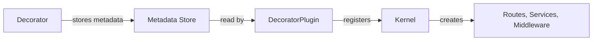

1. **Decorator execution** — When a class is decorated, the decorator function stores metadata in a
   plain object (`MetadataStore`).

2. **Metadata storage** — Metadata is stored in a `Map` keyed by class reference. No reflection is
   used.

3. **DecoratorPlugin registration** — When the `DecoratorPlugin` is registered, it scans the
   `MetadataStore` for decorated classes.

4. **Kernel registration** — The `DecoratorPlugin` calls the kernel's programmatic API to register
   routes, services, and middleware from the metadata.

### Metadata Storage

```typescript
// MetadataStore is a plain object, not a WeakMap
interface MetadataStore {
  controllers: Map<Function, ControllerMetadata>;
  services: Map<Function, ServiceMetadata>;
  routes: Map<Function, RouteMetadata[]>;
}
```

**Why not WeakMap?** WeakMaps require the key to be an object reference. In some bundlers and
runtimes, class references can be lost during tree-shaking. A plain `Map` with explicit registration
is more predictable.

### Programmatic API Equivalents

Every decorator has a programmatic equivalent:

| Decorator                   | Programmatic Equivalent                       |
| --------------------------- | --------------------------------------------- |
| `@Controller('/users')`     | `app.router.group('/users', ...)`             |
| `@Get('/')`                 | `app.router.get('/', handler)`                |
| `@Body()`                   | `ctx.request.body`                            |
| `@Query('name')`            | `ctx.query.name`                              |
| `@Param('id')`              | `ctx.params.id`                               |
| `@UseGuards(requireAuth())` | `middleware: [requireAuth()]`                 |
| `@Injectable()`             | `ctx.services.register(token, new Service())` |

### Reflection

Reflection is **not required**. The `DecoratorPlugin` reads metadata from the `MetadataStore`, not
via `Reflect.getMetadata()`. This ensures:

- No dependency on `reflect-metadata` polyfill.
- Works in environments that do not support reflection.
- Metadata is explicit and inspectable.

### Discovery

The `DecoratorPlugin` can auto-discover decorated classes:

```typescript
app.register(DecoratorPlugin({
  autoDiscover: true,
  controllersPath: './src/controllers',
}));
```

Or classes can be registered explicitly:

```typescript
app.register(DecoratorPlugin({
  controllers: [UserController, OrderController],
}));
```

---

## 13. Error Handling

### Exception Flow

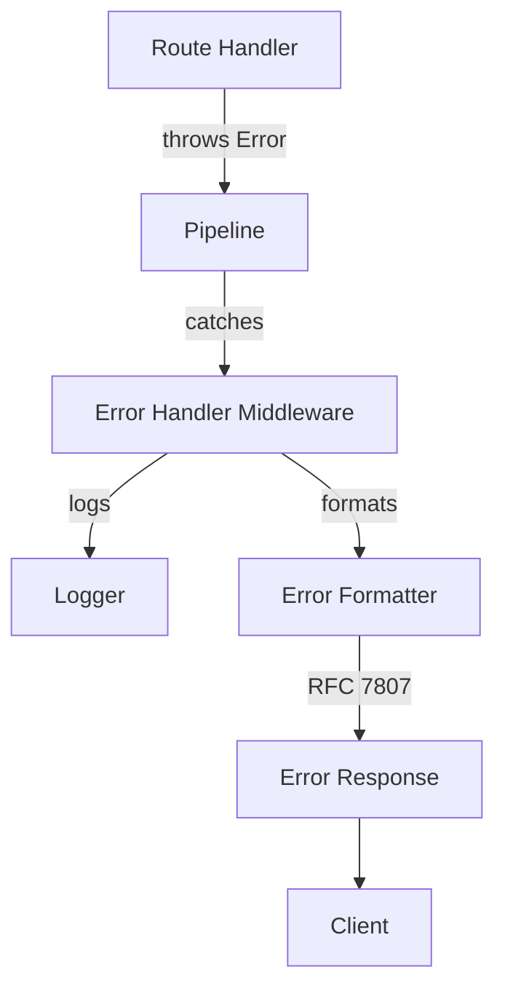

### Exception Types

The framework uses **factory functions** instead of class inheritance for exceptions:

```typescript
// Factory function (composition)
function badRequest(message: string, details?: unknown): HttpError;
function unauthorized(message: string): HttpError;
function notFound(message: string): HttpError;
```

**Why factory functions?**

1. No rigid inheritance hierarchy to maintain.
2. Custom error types without modifying the base class.
3. Easier serialization/deserialization.
4. Runtime composition of error properties.

### Problem Details (RFC 7807)

The default error format follows [RFC 7807](https://datatracker.ietf.org/doc/html/rfc7807):

```json
{
  "type": "https://hono-enterprise.dev/errors/not-found",
  "title": "Not Found",
  "status": 404,
  "detail": "User with id 123 not found",
  "instance": "/users/123"
}
```

### Global Error Handler

The error handler middleware comes from the `@hono-enterprise/exceptions` package and is registered
by the application (or by a starter bundle) — the kernel ships zero features, including error
formatting:

```typescript
import { errorHandler } from '@hono-enterprise/exceptions';

app.middleware.add(errorHandler({
  format: 'rfc7807',
  includeStackTrace: config.get('NODE_ENV') === 'development', // via ConfigPlugin, never process.env
  logErrors: true,
}));
```

### Plugin Error Handling

Plugins can register custom error handlers:

```typescript
ctx.lifecycle.onError((error, ctx) => {
  const logger = ctx.services.get('logger');
  logger.error('Unhandled error', { error: error.message, stack: error.stack });
});
```

### Logging and Observability

Errors are:

1. **Logged** — Via the logger plugin (if registered).
2. **Traced** — Via the telemetry plugin (if registered), as span exceptions.
3. **Metriced** — Via the metrics plugin (if registered), as error counters.
4. **Audited** — Via the audit plugin (if registered), for security-related errors.

---

## 14. Security Model

### Security Layers

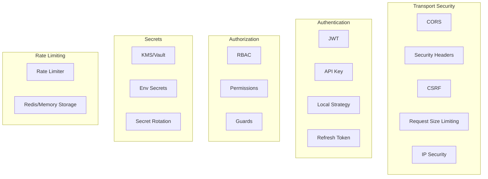

### Authentication

Authentication is handled by the `AuthPlugin`, which provides:

- **JWT** — Sign and verify tokens.
- **API Key** — Validate API keys via custom function.
- **Local** — Username/password authentication.
- **Refresh Token** — Issue new access tokens.

Authentication middleware extracts credentials and populates `ctx.request.user`.

### Authorization

Authorization is handled via guards (middleware factories):

- `requireAuth()` — Require any authenticated user.
- `requireRole(role)` — Require a specific role.
- `requirePermission(permission)` — Require a specific permission.
- `requireAnyRole(roles)` — Require any of the specified roles.
- `requireAllPermissions(permissions)` — Require all specified permissions.

### RBAC

The RBAC system supports role hierarchy:

```typescript
rbac: {
  roles: {
    admin: { permissions: ['*'], inherits: ['manager'] },
    manager: { permissions: ['users:read', 'users:write'], inherits: ['user'] },
    user: { permissions: ['profile:read', 'profile:write'] },
  },
}
```

### Secrets

The `SecretsPlugin` provides secret management:

- **AWS KMS** — Retrieve secrets from AWS KMS.
- **GCP Secret Manager** — Retrieve secrets from GCP.
- **Azure Key Vault** — Retrieve secrets from Azure.
- **HashiCorp Vault** — Retrieve secrets from Vault.
- **Environment** — Retrieve secrets from environment variables (development).

### Plugin Responsibilities

| Plugin                 | Security Responsibility                                 |
| ---------------------- | ------------------------------------------------------- |
| `http-security-plugin` | CORS, security headers, CSRF, request size, IP security |
| `auth-plugin`          | Authentication, authorization, RBAC, rate limiting      |
| `secrets-plugin`       | Secret management and rotation                          |
| `audit-plugin`         | Audit trail for security events                         |
| `validation-plugin`    | Input validation and sanitization                       |
| `logger-plugin`        | Redaction of sensitive fields in logs                   |

### Secure Defaults

All security plugins default to the most secure configuration:

- CORS: no origins allowed by default.
- JWT: strong algorithm (HS256 or RS256).
- Rate limiting: enabled by default.
- Security headers: enabled by default.
- Input validation: enabled by default.
- Secret redaction in logs: enabled by default.

---

## 15. Performance Philosophy

### Minimal Allocations

The framework minimizes object allocations:

- Request context is reused where possible (pooled in high-throughput scenarios).
- Middleware chain is pre-compiled, not rebuilt per request.
- Route matching uses a radix tree for O(log n) matching.
- Service instances are cached (singleton scope by default).

### Lazy Loading

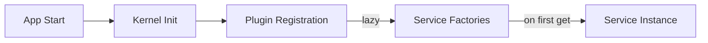

- Plugins register factories, not instances.
- Service instances are created on first `get()`.
- Heavy services (database, message broker) are only initialized when first used.

### Plugin Loading

Plugin loading is optimized:

1. **Topological sort** — O(V + E) where V is plugins and E is dependencies.
2. **Parallel registration** — Plugins with no dependencies between them can register in parallel
   (future optimization).
3. **No reflection** — Metadata is stored in plain objects, no runtime reflection overhead.

### Caching

- Route matching results are cached per request.
- Service instances are cached (singleton scope).
- Config values are cached after first read.
- OpenAPI spec is generated once and cached.

### Tree Shaking

Every package is tree-shakeable:

- ES module exports only.
- `sideEffects: false` in `package.json`.
- Subpath exports for granular imports.
- No top-level side effects.
- Peer dependencies for heavy libraries.

### Startup Optimization

- Plugins register factories, not instances.
- The middleware pipeline is compiled once at startup.
- The route table is built once at startup.
- Config validation happens once at startup.

### Runtime Performance

- Hono router for fast route matching.
- Minimal middleware overhead (each middleware is a function call).
- No reflection in the hot path.
- Async/await throughout (no callback overhead).

### Memory Efficiency

- No global state.
- Request context is garbage-collected after response.
- Service singletons are the only long-lived objects.
- Event listeners are cleaned up on shutdown.

---

## 16. Testing Strategy

### Test Pyramid

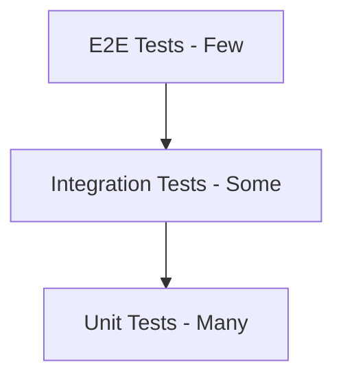

### Unit Tests

- Test individual functions and classes in isolation.
- Mock all dependencies.
- Fast execution (< 100ms per test).
- 90%+ coverage required.

### Integration Tests

- Test plugin registration and service resolution.
- Test middleware pipeline execution.
- Test route matching and handler execution.
- Use in-memory adapters (no real databases, Redis, etc.).

### Plugin Tests

Each plugin must test:

1. **Registration** — Plugin registers correctly with the kernel.
2. **Service resolution** — Services are resolvable by capability token.
3. **Middleware** — Plugin middleware executes correctly.
4. **Routes** — Plugin routes are registered and matchable.
5. **Lifecycle** — Lifecycle hooks are called correctly.
6. **Error handling** — Plugin handles errors gracefully.
7. **Optional dependencies** — Plugin works when optional dependencies are absent.

### Runtime Compatibility Tests

- All tests must pass on Node.js, Deno, and Bun.
- CI runs the full test suite on all three runtimes.
- Runtime-specific tests are guarded with `runtime.platform()` checks.

### Contract Tests

- OpenAPI spec is validated against the actual API.
- Route schemas match the actual request/response shapes.
- Plugin interfaces are validated against their implementations.

### End-to-End Tests

- Test full application scenarios.
- Use `app.inject()` for HTTP testing without a server.
- Test the complete request lifecycle.
- Test graceful shutdown.

### Test Utilities

The `@hono-enterprise/testing` package provides:

- `createTestApp()` — Create a test application with specified plugins.
- `createMockPlugin()` — Mock a plugin's service.
- `inject()` — Send HTTP requests without a server.
- `createTestContext()` — Create a mock request context.

---

## 17. Extending the Framework

### Creating a Plugin

```typescript
import type { IPlugin, IPluginContext } from '@hono-enterprise/common';

export function MyPlugin(options: MyPluginOptions): IPlugin {
  return {
    name: 'my-plugin',
    version: '1.0.0',
    dependencies: ['logger'],
    provides: ['my-capability'],
    register(ctx: IPluginContext) {
      const logger = ctx.services.get('logger');

      // 1. Register a service
      ctx.services.register('my-capability', new MyService(options));

      // 2. Add middleware
      ctx.middleware.add(myMiddleware(), { priority: 300 });

      // 3. Register routes
      ctx.router.get('/my-route', (ctx) => {
        const service = ctx.services.get<MyService>('my-capability');
        return ctx.response.json(service.getData());
      });

      // 4. Register health check
      ctx.health.register('my-service', async () => ({
        status: 'up',
        data: { version: options.version },
      }));

      // 5. Register metric
      ctx.metrics.register('my_operations_total', {
        type: 'counter',
        help: 'Total my operations',
      });

      // 6. Register CLI command
      ctx.cli.register('my:command', () => {
        console.log('Running my command');
      });

      // 7. Register lifecycle hook
      ctx.lifecycle.onShutdown(() => {
        logger.info('My plugin shutting down');
      });
    },
  };
}
```

### Creating a Runtime Adapter

```typescript
import { IRuntimeServices, RuntimePlatform } from '@hono-enterprise/common';

export class MyRuntimeServices implements IRuntimeServices {
  platform(): RuntimePlatform {
    return 'my-runtime';
  }

  version(): string {
    return '1.0.0';
  }

  uuid(): string {
    // Implement UUID generation for your runtime
  }

  // ... implement all IRuntimeServices methods
}
```

### Creating Custom Middleware

```typescript
function myMiddleware(options?: MyOptions): MiddlewareFunction {
  return async (ctx, next) => {
    // Pre-processing
    const start = ctx.services.get<IRuntimeServices>('runtime').now();

    await next();

    // Post-processing
    const duration = ctx.services.get<IRuntimeServices>('runtime').now() - start;
    ctx.response.header('X-Duration', duration.toString());
  };
}
```

### Creating a Custom Decorator

```typescript
import { createDecorator } from '@hono-enterprise/decorator-plugin';

export const Cacheable = (ttl: number) => createDecorator('cacheable', { ttl });

// Usage
@Controller('/api')
class ApiController {
  @Get('/data')
  @Cacheable(3600)
  async getData() {
    return this.service.getData();
  }
}
```

### Creating a Database Adapter

```typescript
import { IOrmAdapter, ITransaction } from '@hono-enterprise/common';

export class MyOrmAdapter implements IOrmAdapter {
  async connect(): Promise<void> {/* ... */}
  async disconnect(): Promise<void> {/* ... */}
  isReady(): boolean {/* ... */}
  createTransaction(): ITransaction {/* ... */}
  async migrate(): Promise<void> {/* ... */}
}
```

### Creating a Cache Adapter

```typescript
import { ICacheStore } from '@hono-enterprise/common';

export class MyCacheStore implements ICacheStore {
  async get<T>(key: string): Promise<T | null> {/* ... */}
  async set<T>(key: string, value: T, ttl?: number): Promise<void> {/* ... */}
  async delete(key: string): Promise<boolean> {/* ... */}
  // ... implement all ICacheStore methods
}
```

### Creating a Transport Adapter

Transport adapters (message brokers, queue systems) follow the same pattern:

```typescript
import { IMessageBroker } from '@hono-enterprise/common';

export class MyMessageBroker implements IMessageBroker {
  async connect(): Promise<void> {/* ... */}
  async disconnect(): Promise<void> {/* ... */}
  async publish<T>(topic: string, message: T): Promise<void> {/* ... */}
  async subscribe<T>(topic: string, handler: MessageHandler<T>): Promise<Subscription> {/* ... */}
}
```

---

## 18. Future Evolution

### How the Architecture Supports Evolution

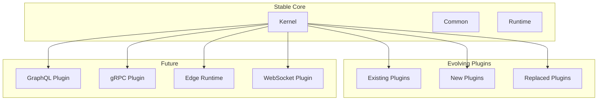

### Versioning

- **Kernel** — Extremely stable. Breaking changes only in major versions.
- **Common** — Extremely stable. Interface additions are minor versions; removals are major.
- **Plugins** — Independently versioned. Each plugin follows semver.
- **Starters** — Versioned as bundles. A starter version pins compatible plugin versions.

### Backward Compatibility

The architecture ensures backward compatibility through:

1. **Capability tokens** — Tokens are strings. New tokens can be added without breaking existing
   ones.
2. **Optional plugins** — New plugins do not affect applications that do not use them.
3. **Interface additions** — New interface methods can be added with default implementations.
4. **Plugin replacement** — A new plugin can replace an old one by registering the same token.

### Plugin Evolution

Plugins can evolve independently:

- A plugin can add new features in minor versions.
- A plugin can deprecate old APIs with `@deprecated` JSDoc.
- A plugin can remove deprecated APIs in major versions.
- A plugin can be replaced by a new plugin with the same capability token.

### Capability Evolution

New capabilities can be added without affecting existing ones:

```typescript
// v1.0: Existing capability
ctx.services.register('database', new DatabaseService());

// v2.0: New capability added
ctx.services.register('vector-database', new VectorDatabaseService());

// Existing applications are unaffected
```

### Public API Stability

The public API (defined in `PUBLIC_API.md`) is stable:

- No breaking changes in minor or patch versions.
- Deprecation period for removed APIs.
- Major version bumps for breaking changes.
- `PUBLIC_API.md` is the source of truth and is updated with every API change.

### Future Additions

The architecture supports future additions without breaking existing applications:

| Future Addition          | How It Fits                                                      |
| ------------------------ | ---------------------------------------------------------------- |
| **GraphQL Plugin**       | New plugin that registers GraphQL routes and schema              |
| **gRPC Plugin**          | New plugin that provides gRPC server and client                  |
| **Edge Runtime**         | New runtime adapter for Cloudflare Workers                       |
| **WebSocket Plugin**     | New plugin that provides WebSocket support                       |
| **SSE Plugin**           | New plugin that provides Server-Sent Events                      |
| **New Database Adapter** | New plugin that provides the `database` token with a new ORM     |
| **New Message Broker**   | New plugin that provides the `messaging` token with a new broker |
| **New Auth Strategy**    | New plugin that extends the `auth-plugin` with a new strategy    |
| **New Health Indicator** | New plugin that registers a health check                         |
| **New Metric Collector** | New plugin that registers a metric collector                     |

### Migration Paths

When breaking changes are necessary:

1. **Announce** — Document the breaking change in a release notes and `PUBLIC_API.md`.
2. **Deprecate** — Mark the old API as `@deprecated` with a migration path.
3. **Provide replacement** — Offer a new API that replaces the old one.
4. **Wait** — Allow at least one minor version for migration.
5. **Remove** — Remove the deprecated API in the next major version.

---

## Conclusion

The Hono Enterprise architecture is designed for **longevity, replaceability, and runtime
portability**. By making everything a plugin, using capability tokens for communication, and
abstracting runtime-specific APIs, the framework can evolve without breaking existing applications.

Contributors should internalize these principles:

1. **Everything is a plugin** — If you are adding a feature, it should be a plugin.
2. **Communicate via tokens** — Never import from another plugin; use the service registry.
3. **Abstract the runtime** — Never use runtime-specific APIs outside the runtime package.
4. **Prefer composition** — Use factory functions, not inheritance hierarchies.
5. **Document everything** — JSDoc on every public API; update `PUBLIC_API.md` for API changes.
6. **Test everything** — 90%+ coverage; tests on all runtimes.
7. **Never break backward compatibility** — Deprecate, do not remove.

For implementation phases, refer to [`ROADMAP.md`](ROADMAP.md). For developer-facing API, refer to
[`PUBLIC_API.md`](PUBLIC_API.md). For engineering rules, refer to
[`AI_GUIDELINES.md`](AI_GUIDELINES.md).
