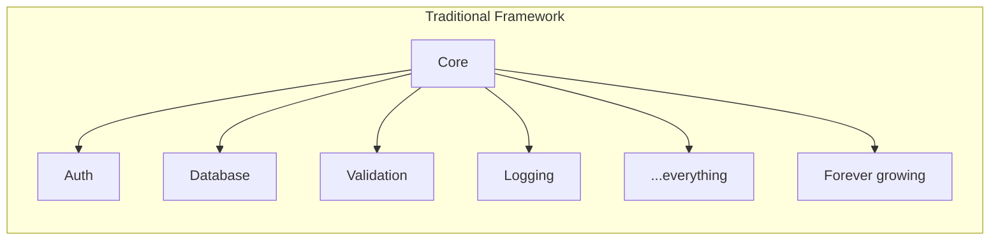
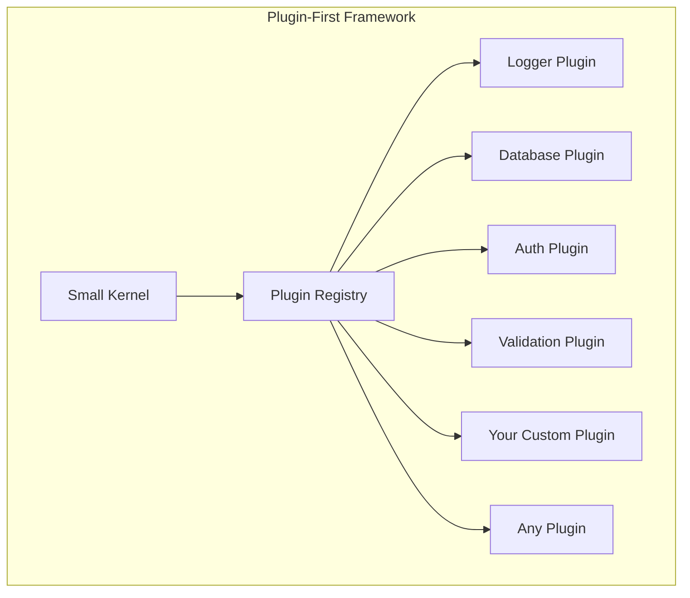

# Hono Enterprise

<div align="center">

**Plugin-first enterprise backend framework built on Hono.**

Enterprise architecture without the weight. Runtime freedom without the chaos.

[](LICENSE)
[](https://www.typescriptlang.org/)
[](https://nodejs.org/)
[](https://deno.land/)
[](https://bun.sh/)
[](CONTRIBUTING.md)

</div>

---

## Why This Exists

Building enterprise backends today forces a difficult choice:

| Option | Problem |
|--------|---------|
| **Hono** | Extremely fast and runtime-portable, but intentionally minimal — no DI, no modules, no enterprise patterns. |
| **NestJS** | Rich enterprise features, but tightly coupled to Node.js, requires decorators and DI, and carries a steep learning curve. |
| **Fastify** | Fast and plugin-oriented, but lacks enterprise abstractions like repository patterns, CQRS, and multi-tenancy. |
| **Express** | Ubiquitous but aging, callback-based, and Node.js-only. |

Every existing solution forces a compromise: **power vs. portability, features vs. simplicity, opinion vs. flexibility.**

**Hono Enterprise resolves this compromise.** It combines:

- ⚡ **Hono's performance** — One of the fastest TypeScript routers available.
- 🌍 **Runtime independence** — Write once, run on Node.js, Deno, and Bun. Cloudflare Workers support is planned.
- 🧩 **Plugin-first architecture** — Every capability is a plugin. Start minimal, add what you need, replace what you do not like.
- 🏢 **Enterprise capabilities** — Authentication, RBAC, CQRS, event sourcing, multi-tenancy, audit logging, secrets management, and more.

Without becoming heavyweight. Without forcing opinions. Without locking you in.

---

## Core Principles

| Principle | What It Means |
|-----------|---------------|
| **Plugin-first** | Every capability — logging, database, auth, validation — is a plugin. The kernel ships with zero features. |
| **Runtime independent** | No package except the runtime plugin uses runtime-specific APIs. Business logic never touches `process.env` or `fs`. |
| **Optional DI** | Dependency injection is a plugin, not a requirement. Use it if you want it; skip it if you do not. |
| **Optional decorators** | Decorators are a plugin, not a requirement. Every feature has a complete programmatic API. |
| **Explicit APIs** | No magic. No hidden globals. No reflection required. Everything is explicit and inspectable. |
| **Type safety** | Strict TypeScript throughout. No `any` in public APIs. Full type inference for services, config, and routes. |
| **Tree-shakeable** | Every package uses ES modules, `sideEffects: false`, and subpath exports. You ship only what you use. |
| **Production ready** | Built for scale: graceful shutdown, distributed locking, circuit breakers, audit trails, and observability. |
| **Enterprise focused** | Patterns that large organizations need: multi-tenancy, feature flags, secrets management, CQRS, event sourcing. |

---

## Features

> **Status legend:** 📋 Designed — specified in the roadmap, not yet implemented · 🚧 Planned — future design work. The framework is in the design phase; no feature is implemented yet (see [Roadmap](#roadmap)).

| Feature | Status | Description |
|---------|--------|-------------|
| Runtime abstraction | 📋 Designed | Node.js, Deno, Bun support with auto-detection |
| Plugin system | 📋 Designed | Capability-token-based plugin architecture |
| Middleware pipeline | 📋 Designed | ASP.NET Core-style ordered middleware |
| Validation | 📋 Designed | Zod-based validation with RFC 7807 error format |
| Authentication | 📋 Designed | JWT, API keys, local strategy, refresh tokens |
| Authorization | 📋 Designed | RBAC with role hierarchy and permission guards |
| OpenAPI | 📋 Designed | Auto-generation from route schemas with Swagger UI |
| Database adapters | 📋 Designed | Prisma and Drizzle with repository pattern and Unit of Work |
| Caching | 📋 Designed | Memory and Redis stores with cache middleware |
| Events | 📋 Designed | In-memory event bus for domain events |
| CQRS | 📋 Designed | Command and query buses with pipeline behaviors |
| Messaging | 📋 Designed | RabbitMQ, NATS, Kafka, Redis Streams adapters |
| Queue | 📋 Designed | Background jobs with Redis, RabbitMQ, and memory adapters |
| Scheduler | 📋 Designed | Cron, delayed, and recurring jobs with distributed locking |
| Health checks | 📋 Designed | `/health`, `/live`, `/ready` with pluggable indicators |
| Metrics | 📋 Designed | Prometheus counters, gauges, histograms, summaries |
| Telemetry | 📋 Designed | OpenTelemetry distributed tracing |
| CLI | 📋 Designed | Plugin-aware scaffolding and code generation |
| Testing | 📋 Designed | Test app factory, mock plugins, request injection |
| HTTP security | 📋 Designed | CORS, security headers, CSRF, rate limiting, IP security |
| Secrets management | 📋 Designed | AWS KMS, GCP Secret Manager, Azure Key Vault, Vault |
| Audit logging | 📋 Designed | Immutable audit trail with pluggable storage |
| Resilience | 📋 Designed | Circuit breaker, retry, timeout, bulkhead |
| Storage | 📋 Designed | S3, GCS, local, memory providers with upload middleware |
| Mail | 📋 Designed | SMTP, SES, SendGrid with template engine |
| Notifications | 📋 Designed | Multi-channel: email, SMS, push, Slack |
| Feature flags | 📋 Designed | Percentage rollout, user targeting, multiple providers |
| Multi-tenancy | 📋 Designed | Subdomain, header, path resolution with schema/database/column isolation |
| SDK | 📋 Designed | HTTP client with retry, circuit breaker, OpenAPI codegen |
| Starter bundles | 📋 Designed | REST, microservice, and full-stack starters |
| GraphQL | 🚧 Planned | Schema-first and code-first GraphQL plugin |
| gRPC | 🚧 Planned | Client and server support for microservice communication |
| Cloudflare Workers | 🚧 Planned | Edge runtime adapter with D1/KV support |
| WebSocket | 🚧 Planned | Real-time communication with runtime portability |
| Server-Sent Events | 🚧 Planned | Streaming responses for real-time data |

---

## Quick Example

The smallest possible application — just the kernel and a runtime:

```typescript
import { createApplication } from '@hono-enterprise/kernel';
import { RuntimePlugin } from '@hono-enterprise/runtime';
import { LoggerPlugin } from '@hono-enterprise/logger-plugin';

const app = createApplication({
  plugins: [
    RuntimePlugin(),
    LoggerPlugin({ level: 'info' }),
  ],
});

app.router.get('/', (ctx) => {
  return ctx.response.json({ message: 'Hello, World!' });
});

await app.start({ port: 3000 });
```

No decorators. No DI. No modules. Just a router, a runtime, and a logger.

Add capabilities as you need them:

```typescript
import { ConfigPlugin } from '@hono-enterprise/config-plugin';
import { ValidationPlugin } from '@hono-enterprise/validation-plugin';
import { DatabasePlugin } from '@hono-enterprise/database-plugin';
import { AuthenticationPlugin } from '@hono-enterprise/auth-plugin';
import { OpenApiPlugin } from '@hono-enterprise/openapi-plugin';

app.register(ConfigPlugin({ validationSchema: AppConfigSchema }));
app.register(ValidationPlugin());
app.register(DatabasePlugin({ type: 'prisma' }));
// Secrets come from the config capability — never process.env (runtime independence)
app.register(AuthenticationPlugin({ jwt: { secret: config.get('JWT_SECRET') } }));
app.register(OpenApiPlugin({ title: 'My API', version: '1.0.0' }));
```

---

## Why Plugin-First?

Traditional frameworks grow forever. Every feature is baked into the core, and the core becomes a monolith.



Plugin-first frameworks stay small. The kernel only orchestrates plugins. Capabilities are composable and replaceable.



| Traditional | Plugin-First |
|-------------|-------------|
| Core grows with every feature | Kernel stays small and stable |
| All features are bundled | Include only what you use |
| Swapping a feature requires forking | Replace any plugin via capability tokens |
| Heavy startup cost | Lazy initialization, pay for what you use |
| Hard to test in isolation | Each plugin is independently testable |

---

## Repository Structure

```
hono-enterprise/
├── apps/                  # Example applications
│   ├── minimal/           # Minimal app (kernel + runtime only)
│   ├── rest-api/          # Full REST API example
│   ├── microservices/     # Microservices example
│   ├── cqrs-example/      # CQRS pattern example
│   └── multi-tenant/      # Multi-tenancy example
├── packages/              # Framework packages
│   ├── kernel/            # Plugin kernel, pipeline, router
│   ├── common/            # Shared types and interfaces
│   ├── runtime/           # Runtime adapters (Node, Deno, Bun)
│   ├── exceptions/        # Exception factories and error handler middleware
│   ├── *-plugin/          # Capability plugins
│   ├── testing/           # Test utilities
│   ├── cli/               # CLI tool
│   ├── sdk/               # Client SDK
│   └── starters/          # Opinionated plugin bundles
├── examples/              # Additional examples
├── docs/                  # Generated documentation
├── docker/                # Docker configurations
├── kubernetes/            # Kubernetes manifests
├── plans/                 # Archived planning documents
├── ARCHITECTURE.md        # Technical architecture guide
├── PUBLIC_API.md          # Public API contract
├── AI_GUIDELINES.md       # Engineering guidelines
├── ROADMAP.md             # 38-milestone implementation roadmap
└── README.md              # This file
```

---

## Documentation

| Document | Audience | Purpose |
|----------|----------|---------|
| [**ARCHITECTURE.md**](ARCHITECTURE.md) | Framework contributors | How the framework works internally and why it was designed this way |
| [**PUBLIC_API.md**](PUBLIC_API.md) | Application developers | How to use the framework — complete examples for every plugin |
| [**AI_GUIDELINES.md**](AI_GUIDELINES.md) | All contributors | Permanent engineering rules — TypeScript, testing, security, performance |
| [**ROADMAP.md**](ROADMAP.md) | Implementation tracking | 38-milestone implementation roadmap with package details |
| [**plans/archive/architecture-review.md**](plans/archive/architecture-review.md) | Architects | Critical analysis of the original design with recommendations (archived) |

**Start here:**
- New to the framework? Read **PUBLIC_API.md** for usage examples.
- Want to contribute? Read **ARCHITECTURE.md** then **AI_GUIDELINES.md**.
- Want to understand the plan? Read **ROADMAP.md**.

---

## Roadmap

The framework is in the **design and planning phase**. No packages have been published yet.

The implementation is organized into **38 milestones**, from monorepo foundation to final release:

| Phase | Milestones | Focus |
|-------|-----------|-------|
| Foundation | 0-2 | Monorepo, common types, plugin kernel |
| Core plugins | 3-9 | Runtime, logger, config, validation, exceptions, optional DI, optional decorators |
| Data plugins | 10-15 | Database, cache, events, CQRS, messaging, queue |
| Security | 16-17 | Authentication, HTTP security |
| Scheduling | 18 | Scheduler with distributed locking |
| Observability | 19-22 | Metrics, health, OpenAPI, telemetry |
| Enterprise | 23-25 | Secrets, audit, resilience |
| Features | 26-30 | Storage, mail, notifications, feature flags, multi-tenancy |
| Tooling | 31-33 | Testing, CLI, SDK |
| Release | 34-38 | Starters, examples, docs, Docker/K8s, final release |

Detailed milestones, file structures, and interface definitions are documented in [`ROADMAP.md`](ROADMAP.md).

---

## Contributing

Contributions are welcome once the foundation milestones are complete.

### Before You Write Code

1. **Read [ARCHITECTURE.md](ARCHITECTURE.md)** — Understand how the framework works internally.
2. **Read [AI_GUIDELINES.md](AI_GUIDELINES.md)** — Understand the engineering rules.
3. **Read [PUBLIC_API.md](PUBLIC_API.md)** — Understand the public API contract.
4. **Check [ROADMAP.md](ROADMAP.md)** — See what is planned and what is in progress.

### Key Rules

- Every package must compile with strict TypeScript — no `any`.
- Every package must maintain 90%+ test coverage.
- Every public API must have JSDoc.
- No runtime-specific APIs outside the `runtime` package.
- No circular dependencies between packages.
- No breaking changes without a major version bump.
- Prefer composition over inheritance.
- Prefer adapters over implementations.
- Prefer interfaces over concrete types.
- Everything must have a programmatic API.

### Process

The monorepo is built with the **Deno toolchain** (Deno 2 workspaces). Packages are published to **JSR** under `@hono-enterprise` and are consumable from Node and Bun via JSR's npm compatibility layer.

1. Open an issue to discuss the change.
2. Fork the repository and create a feature branch.
3. Implement with tests and documentation.
4. Ensure `deno task check`, `deno task test`, `deno task lint`, and `deno task fmt:check` all pass.
5. Submit a pull request with a clear description.

---

## Long-Term Vision

The goal is straightforward:

**Become the most practical enterprise backend framework for TypeScript.**

Practical means:

- **Runtime freedom** — Applications written today on Node.js should run on Deno or Bun tomorrow without code changes. Deno applications can be shipped as standalone binaries via `deno compile`. Cloudflare Workers support is planned for edge deployment.
- **Enterprise scale** — The framework should support large-scale production systems with multi-tenancy, distributed tracing, audit trails, and resilience patterns.
- **Plugin ecosystem** — The framework should foster an ecosystem where the community can build and share plugins. Any capability should be replaceable by a community plugin.
- **Gradual adoption** — Developers should be able to start with just a router and add capabilities incrementally. No steep learning curve. No all-or-nothing commitment.
- **Maintainability over cleverness** — The codebase should be readable, testable, and maintainable for years. No magic. No hidden globals. No clever tricks that sacrifice clarity.

This is a framework designed to be adopted incrementally, extended safely, and trusted in production.

---

## License

[MIT](LICENSE) © Hono Enterprise Contributors

---

<div align="center">

**[Architecture](ARCHITECTURE.md)** · **[Public API](PUBLIC_API.md)** · **[Guidelines](AI_GUIDELINES.md)** · **[Roadmap](ROADMAP.md)**

</div>
