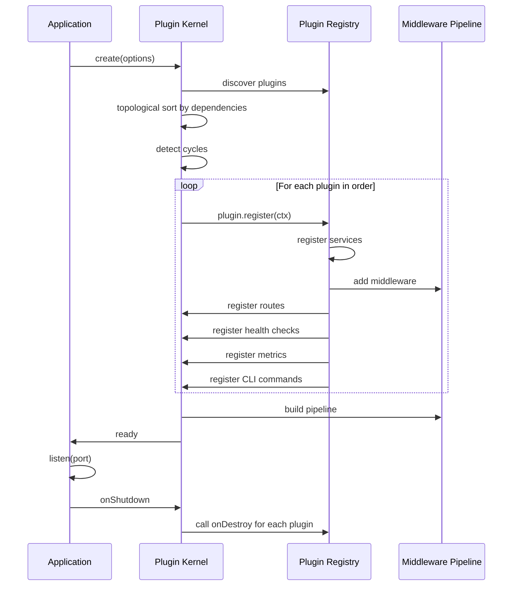

# Hono Enterprise Framework — Plugin-First Architecture Roadmap

## Design Philosophy

**NOT a NestJS clone.** This is a Fastify-inspired, Spring Boot-organized, ASP.NET Core-pipelined,
Hono-performant framework where **everything is a plugin**.

### Core Tenets

| Principle                         | Meaning                                                                                     |
| --------------------------------- | ------------------------------------------------------------------------------------------- |
| Everything is a plugin            | Every capability (DI, logging, validation, database, auth, etc.) is implemented as a plugin |
| Decorators are optional           | Full programmatic API exists; decorators are a thin layer on top                            |
| DI is optional                    | Plugins can use DI, manual wiring, or factory functions                                     |
| Reflection is optional            | Metadata is stored in plain objects; reflection is one way to populate them                 |
| Everything has a programmatic API | No capability requires decorators or reflection                                             |
| Everything is replaceable         | Any plugin can be swapped without touching application code                                 |
| Everything is runtime independent | No Node.js APIs in core; runtime adapters provided by RuntimePlugin                         |
| Every capability is a plugin      | Framework ships zero hardcoded features                                                     |

### Architectural Inspirations

| Source       | What We Take                                                          |
| ------------ | --------------------------------------------------------------------- |
| Hono         | Performance, runtime portability, routing engine                      |
| Spring Boot  | Plugin auto-configuration, starter packages, conditional registration |
| ASP.NET Core | Middleware pipeline, request/response abstractions                    |
| Fastify      | Plugin encapsulation, decoration pattern, lifecycle hooks             |

---

## Architecture Overview

```mermaid
graph TB
    subgraph Application
        App[Application Instance]
    end

    subgraph Core Kernel
        Kernel[Plugin Kernel]
        Registry[Plugin Registry]
        Pipeline[Middleware Pipeline]
        Router[Router]
        Container[Optional DI Container]
    end

    subgraph Plugins
        Runtime[RuntimePlugin]
        Logger[LoggerPlugin]
        Config[ConfigPlugin]
        Validation[ValidationPlugin]
        Database[DatabasePlugin]
        Auth[AuthenticationPlugin]
        Messaging[MessagingPlugin]
        OpenApi[OpenApiPlugin]
        Scheduler[SchedulerPlugin]
        Metrics[MetricsPlugin]
        Health[HealthPlugin]
        FeatureFlags[FeatureFlagsPlugin]
        Storage[StoragePlugin]
        Mail[MailPlugin]
        Notification[NotificationPlugin]
        Secrets[SecretsPlugin]
        Audit[AuditPlugin]
        Resilience[ResiliencePlugin]
        Cache[CachePlugin]
        Events[EventsPlugin]
        Cqrs[CqrsPlugin]
        Telemetry[TelemetryPlugin]
        MultiTenancy[MultiTenancyPlugin]
        Queue[QueuePlugin]
    end

    App --> Kernel
    Kernel --> Registry
    Kernel --> Pipeline
    Kernel --> Router
    Kernel --> Container

    Registry --> Runtime
    Registry --> Logger
    Registry --> Config
    Registry --> Validation
    Registry --> Database
    Registry --> Auth
    Registry --> Messaging
    Registry --> OpenApi
    Registry --> Scheduler
    Registry --> Metrics
    Registry --> Health
    Registry --> FeatureFlags
    Registry --> Storage
    Registry --> Mail
    Registry --> Notification
    Registry --> Secrets
    Registry --> Audit
    Registry --> Resilience
    Registry --> Cache
    Registry --> Events
    Registry --> Cqrs
    Registry --> Telemetry
    Registry --> MultiTenancy
    Registry --> Queue
```



---

## Plugin Contract

Every plugin implements this contract. `IPlugin` and `IPluginContext` are defined in
`@hono-enterprise/common` (following the `IXxx` interface naming rule) — the kernel consumes them,
it does not define them.

```typescript
interface IPlugin {
  name: string;
  version: string;
  dependencies?: string[];
  optionalDependencies?: string[];
  provides?: string[]; // Capability tokens this plugin provides
  consumes?: string[]; // Capability tokens this plugin needs
  priority?: number; // Lower = earlier registration
  register(ctx: IPluginContext): void | Promise<void>;
}

interface IPluginContext {
  // Service registry — plugins register services by capability token
  services: ServiceRegistry;
  // Middleware pipeline — plugins add middleware
  middleware: MiddlewareApi;
  // Router — plugins register routes
  router: RouterApi;
  // Configuration — plugins read/validate config
  config: ConfigApi;
  // Environment — plugins validate env vars
  environment: EnvironmentApi;
  // Health — plugins register health checks
  health: HealthApi;
  // Metrics — plugins register metrics
  metrics: MetricsApi;
  // OpenAPI — plugins contribute to OpenAPI spec
  openapi: OpenApiApi;
  // Decorators — plugins register decorator handlers
  decorators: DecoratorApi;
  // CLI — plugins register CLI commands
  cli: CliApi;
  // Lifecycle — plugins register lifecycle hooks
  lifecycle: LifecycleApi;
  // Logger (from LoggerPlugin, if registered)
  logger?: ILogger;
  // Runtime services (from RuntimePlugin)
  runtime: IRuntimeServices;
  // Decorator metadata store (from DecoratorPlugin, if registered)
  metadata?: MetadataStore;
  // DI container (from DiPlugin, if registered)
  container?: IContainer;
  // Plugin-specific options
  options: Record<string, unknown>;
  // Application instance
  app: Application;
}
```

> **Runtime bootstrap rule:** `ctx.runtime` is non-optional because a runtime provider is
> **mandatory**. `createApplication()` fails fast at startup if no registered plugin provides the
> `runtime` capability, and the kernel always registers the runtime-providing plugin first,
> regardless of declared priority. Every other plugin can therefore rely on `ctx.runtime` being
> present.

### Service Registry

```typescript
interface ServiceRegistry {
  // Register a service by capability token
  register<T>(token: string, service: T, options?: RegisterOptions): void;
  // Get a service by capability token
  get<T>(token: string): T;
  // Check if a capability is available
  has(token: string): boolean;
  // Get all services for a capability (multi-provider)
  getAll<T>(token: string): T[];
  // Unregister a service
  unregister(token: string): void;
  // Register a factory (lazy)
  registerFactory<T>(token: string, factory: () => T): void;
}

interface RegisterOptions {
  override?: boolean; // Replace existing
  multi?: boolean; // Allow multiple providers
  lazy?: boolean; // Instantiate on first get
}
```

### Capability Tokens

Plugins communicate via **capability tokens** (strings), not concrete types:

```typescript
// Standard capability tokens
const CAPABILITIES = {
  LOGGER: 'logger',
  CONFIG: 'config',
  VALIDATION: 'validation',
  DATABASE: 'database',
  CACHE: 'cache',
  EVENTS: 'events',
  MESSAGING: 'messaging',
  AUTH: 'authentication',
  AUTHORIZATION: 'authorization',
  SCHEDULER: 'scheduler',
  METRICS: 'metrics',
  HEALTH: 'health',
  OPENAPI: 'openapi',
  TELEMETRY: 'telemetry',
  SECRETS: 'secrets',
  AUDIT: 'audit',
  RESILIENCE: 'resilience',
  STORAGE: 'storage',
  MAIL: 'mail',
  NOTIFICATION: 'notification',
  FEATURE_FLAGS: 'feature-flags',
  QUEUE: 'queue',
  CQRS: 'cqrs',
  MULTI_TENANCY: 'multi-tenancy',
  RUNTIME: 'runtime',
  JWT: 'jwt',
  COMMAND_BUS: 'command-bus',
  QUERY_BUS: 'query-bus',
  DI_CONTAINER: 'di-container',
} as const;
```

This constant is the **single source of truth** for capability tokens. Every token used anywhere in
the framework, examples, or documentation must appear here — no ad-hoc token strings (see
AI_GUIDELINES §11.2, No Magic Strings).

---

## Plugin Lifecycle



### Lifecycle Hooks

```typescript
interface LifecycleApi {
  onRegister(fn: () => void | Promise<void>): void;
  onInit(fn: () => void | Promise<void>): void;
  onBootstrap(fn: () => void | Promise<void>): void;
  onRequest(fn: (ctx: RequestContext) => void | Promise<void>): void;
  onResponse(fn: (ctx: RequestContext) => void | Promise<void>): void;
  onError(fn: (err: Error, ctx: RequestContext) => void | Promise<void>): void;
  onShutdown(fn: () => void | Promise<void>): void;
  onClose(fn: () => void | Promise<void>): void;
}
```

---

## Monorepo Structure

```
hono-enterprise/
├── apps/
│   ├── minimal/                 # Minimal app (no plugins)
│   ├── rest-api/                # REST API with common plugins
│   ├── microservices/           # Microservices example
│   ├── cqrs-example/             # CQRS example
│   ├── multi-tenant/            # Multi-tenancy example
│   └── plugin-development/      # How to build a custom plugin
├── packages/
│   ├── kernel/                   # Plugin kernel, pipeline, router, service registry
│   ├── common/                   # Shared types, interfaces, capability tokens
│   ├── runtime/                  # RuntimePlugin + runtime adapters
│   ├── di-plugin/                # Optional DI plugin
│   ├── decorator-plugin/         # Optional decorator/reflect plugin
│   ├── logger-plugin/            # LoggerPlugin (Pino, Console)
│   ├── config-plugin/            # ConfigPlugin
│   ├── validation-plugin/        # ValidationPlugin (Zod)
│   ├── exceptions/               # Exception factories + error handler middleware (plain package)
│   ├── database-plugin/          # DatabasePlugin (Prisma, Drizzle adapters)
│   ├── cache-plugin/             # CachePlugin (Memory, Redis)
│   ├── events-plugin/            # EventsPlugin (in-memory event bus)
│   ├── cqrs-plugin/              # CqrsPlugin (commands, queries, buses)
│   ├── messaging-plugin/         # MessagingPlugin (RabbitMQ, NATS, Kafka)
│   ├── queue-plugin/             # QueuePlugin (Redis, RabbitMQ, Memory)
│   ├── auth-plugin/              # AuthenticationPlugin (JWT, API Key, RBAC)
│   ├── http-security-plugin/     # HttpSecurityPlugin (CORS, headers, CSRF, rate limit)
│   ├── scheduler-plugin/         # SchedulerPlugin (cron, delayed, recurring)
│   ├── metrics-plugin/           # MetricsPlugin (Prometheus)
│   ├── health-plugin/            # HealthPlugin
│   ├── openapi-plugin/           # OpenApiPlugin
│   ├── telemetry-plugin/         # TelemetryPlugin (OpenTelemetry)
│   ├── secrets-plugin/           # SecretsPlugin (KMS, Vault, env)
│   ├── audit-plugin/             # AuditPlugin
│   ├── resilience-plugin/       # ResiliencePlugin (circuit breaker, retry, timeout)
│   ├── storage-plugin/           # StoragePlugin (S3, GCS, local)
│   ├── mail-plugin/              # MailPlugin (SMTP, SES, SendGrid)
│   ├── notification-plugin/      # NotificationPlugin (multi-channel)
│   ├── feature-flags-plugin/    # FeatureFlagsPlugin
│   ├── multi-tenancy-plugin/     # MultiTenancyPlugin
│   ├── testing/                  # Test utilities, mock plugin, test app factory
│   ├── cli/                      # CLI tool with plugin-aware generators
│   ├── sdk/                      # SDK for external consumers
│   └── starters/                 # Starter bundles (opinionated plugin sets)
│       ├── rest-starter/
│       ├── microservice-starter/
│       └── full-stack-starter/
├── docs/
├── docker/
├── kubernetes/
├── scripts/
├── deno.json                     # Root workspace config: members, tasks, strict compilerOptions, lint/fmt
└── deno.lock
```

> **Toolchain:** The monorepo is built with the **Deno toolchain** (Deno 2 workspaces,
> `deno test`/`lint`/`fmt`/`check`). Packages are published to **JSR** under the `@hono-enterprise`
> scope and are consumable from Node/Bun via JSR's npm compatibility layer. There is no build step —
> JSR publishes TypeScript sources directly. Applications built on the framework can be shipped as
> standalone binaries with `deno compile`.

---

## Package Dependencies

```
kernel ────► common
runtime ───► common, kernel
di-plugin ─► common, kernel
decorator-plugin ─► common, kernel
logger-plugin ─► common, kernel, runtime
config-plugin ─► common, kernel, runtime
validation-plugin ─► common, kernel
exceptions ─► common
database-plugin ─► common, kernel, runtime
cache-plugin ─► common, kernel
events-plugin ─► common, kernel
cqrs-plugin ─► common, kernel
messaging-plugin ─► common, kernel, runtime
queue-plugin ─► common, kernel, runtime
auth-plugin ─► common, kernel
http-security-plugin ─► common, kernel
scheduler-plugin ─► common, kernel, runtime
metrics-plugin ─► common, kernel, runtime
health-plugin ─► common, kernel
openapi-plugin ─► common, kernel
telemetry-plugin ─► common, kernel, runtime
secrets-plugin ─► common, kernel, runtime
audit-plugin ─► common, kernel
resilience-plugin ─► common, kernel
storage-plugin ─► common, kernel, runtime
mail-plugin ─► common, kernel
notification-plugin ─► common, kernel
feature-flags-plugin ─► common, kernel
multi-tenancy-plugin ─► common, kernel
testing ─► common, kernel
cli ─► common, kernel
sdk ─► common, kernel
```

**Key rule:** No plugin depends on another plugin — not even at build time. All shared interfaces
(`ILogger`, `IEventBus`, etc.) live in `@hono-enterprise/common`, so a plugin never needs another
plugin's package for type definitions. Plugins communicate exclusively via capability tokens
resolved through the ServiceRegistry: `ctx.services.get<T>(CAPABILITIES.X)`.

---

## Milestones

---

## Milestone 0: Monorepo Foundation

**Objective:** Establish the Deno-based monorepo, task pipeline, and base configurations.

### Tasks

1. **Initialize Monorepo**
   - Initialize the git repository (`git init`, initial commit of design docs)
   - Replace the scaffold `deno.json`/`main.ts`/`main_test.ts` with a root workspace `deno.json`
   - Configure workspace members (`packages/*`, `apps/*`)
   - Define root tasks: `check`, `test`, `test:coverage`, `lint`, `fmt`, `fmt:check`
   - Set strict TypeScript `compilerOptions` in the root `deno.json`
   - Configure `deno lint` rules and `deno fmt` options
   - Create `.gitignore`, `.editorconfig`

2. **Create Directory Structure**
   - Create `apps/`, `packages/`, `examples/`, `docs/`, `docker/`, `kubernetes/`, `scripts/`
   - Create stub `deno.json` for each package with `@hono-enterprise/[name]` JSR naming, version,
     and exports

3. **Configure Tooling**
   - Workspace-wide task orchestration via root `deno task`
   - Import maps for cross-package resolution during development
   - `deno doc --lint` for JSDoc enforcement on exports

4. **CI/CD Foundation**
   - GitHub Actions workflow
   - `deno fmt --check`, `deno lint`, `deno check`, `deno test --coverage` pipeline
   - Node and Bun compatibility jobs (consume packages via JSR npm compatibility; run the compat
     test suite)
   - Dependency vulnerability scanning via `deno audit`

### Deliverables

- [x] Git repository initialized
- [x] Working Deno workspace monorepo
- [x] Root task pipeline (`check`, `test`, `lint`, `fmt`)
- [x] Strict TypeScript via root `deno.json`
- [x] All package stubs created with JSR metadata
- [x] CI passing on Deno, with Node/Bun compat jobs stubbed (verified green on PR #1)

---

## Milestone 1: Common Package — Types and Capability Tokens

**Objective:** Define all shared types, interfaces, and capability tokens.

### Package: `@hono-enterprise/common`

**Contents:**

1. **Capability Tokens**
   - All standard capability token constants
   - Token registry for custom tokens

2. **Core Interfaces**
   - `ILogger` — Logger interface (no implementation)
   - `IRuntimeServices` — Runtime abstraction (uuid, timers, crypto, fs)
   - `IContainer` — DI container interface (optional)
   - `IServiceRegistry` — Service registry interface
   - `IPlugin` — Plugin contract
   - `IPluginContext` — Plugin registration context
   - `IMiddleware` — Middleware interface
   - `IRequestContext` — Request context interface
   - `IRequest` — HTTP request abstraction
   - `IResponse` — HTTP response abstraction
   - `IConfig` — Configuration interface
   - `IValidationService` — Validation interface
   - `IHealthIndicator` — Health check interface
   - `IMetric` — Metric interface
   - `IOrmAdapter` — ORM adapter interface
   - `ICacheStore` — Cache store interface
   - `IEventBus` — Event bus interface
   - `IMessageBroker` — Message broker interface
   - `IQueue` — Queue interface
   - `IJwtService` — JWT interface
   - `ISecretManager` — Secret manager interface
   - `IAuditLogger` — Audit logger interface
   - `ICircuitBreaker` — Circuit breaker interface
   - `IStorage` — Storage interface
   - `IMailer` — Mail interface
   - `INotifier` — Notification interface
   - `IFeatureFlags` — Feature flags interface
   - `ITenantResolver` — Tenant resolver interface

3. **Shared Types**
   - `HttpMethod` — HTTP method union
   - `RuntimePlatform` — Runtime identifier
   - `PluginPriority` — Priority constants
   - `LifecyclePhase` — Lifecycle phase enum
   - `HealthStatus` — Health status union
   - `MetricType` — Metric type union

4. **Utilities**
   - `CapabilityToken` — Token creation helper
   - `Result<T, E>` — Result type for error handling
   - `Option<T>` — Optional type

### Deliverables

- [x] All shared interfaces defined
- [x] Capability token constants
- [x] Zero runtime dependencies
- [x] JSDoc on all exports
- [x] Full type tests

---

## Milestone 2: Kernel — Plugin Kernel and Service Registry

**Objective:** Build the plugin kernel that orchestrates plugin registration and execution.

### Package: `@hono-enterprise/kernel`

**Core Components:**

1. **Plugin Registry**
   - Plugin registration with dependency resolution
   - Topological sort by dependencies
   - Circular dependency detection
   - Priority-based ordering
   - Optional dependency handling

2. **Service Registry**
   - Capability token-based service registration
   - Single and multi-provider support
   - Lazy factory registration
   - Override support
   - Service lookup by token

3. **Middleware Pipeline**
   - ASP.NET Core-style middleware pipeline
   - Ordered middleware execution
   - Context propagation
   - Error propagation
   - Early termination

4. **Router**
   - Route registration (programmatic API)
   - Route matching (path + method)
   - Parameter extraction
   - Route groups
   - Route middleware

5. **Application**
   - Application creation and configuration
   - Plugin loading
   - Lifecycle orchestration
   - Graceful shutdown
   - HTTP server management (delegated to RuntimePlugin)

6. **Request Context**
   - Per-request context object
   - Service access
   - State management
   - Request/response access

**Programmatic API (no decorators required):**

```typescript
import { createApplication } from '@hono-enterprise/kernel';

const app = createApplication({
  plugins: [
    RuntimePlugin(),
    LoggerPlugin({ level: 'info' }),
    ConfigPlugin({ envFilePath: '.env' }),
    ValidationPlugin(),
    DatabasePlugin({ type: 'prisma' }),
    AuthPlugin({ jwt: { secret: '...' } }),
  ],
});

// Programmatic route registration
app.router.get('/users', async (ctx) => {
  const db = ctx.services.get<IDatabaseService>('database');
  const users = await db.findAll('users');
  return ctx.response.json(users);
});

app.router.post('/users', {
  handler: async (ctx) => {/* ... */},
  middleware: [validateBody(UserSchema)],
  schema: { body: UserSchema }, // For OpenAPI
});

await app.start({ port: 3000 });
```

**Plugin Registration:**

```typescript
const app = createApplication();

// Register plugins programmatically
app.register(RuntimePlugin());
app.register(LoggerPlugin({ level: 'debug' }));
app.register(ConfigPlugin());

// Register a custom plugin inline
app.register({
  name: 'my-plugin',
  version: '1.0.0',
  dependencies: ['logger'],
  register(ctx) {
    ctx.services.register('my-service', new MyService());
    ctx.middleware.add(myMiddleware);
    ctx.router.get('/health-custom', (ctx) => ctx.response.json({ ok: true }));
    ctx.lifecycle.onShutdown(() => console.log('cleanup'));
  },
});

await app.start();
```

**Implementation Files:**

- `src/application/application.ts`
- `src/application/app-builder.ts`
- `src/registry/plugin-registry.ts`
- `src/registry/plugin-resolver.ts` — Topological sort, cycle detection
- `src/registry/service-registry.ts`
- `src/pipeline/middleware-pipeline.ts`
- `src/pipeline/middleware-context.ts`
- `src/router/router.ts`
- `src/router/route-matcher.ts`
- `src/router/route-group.ts`
- `src/context/request-context.ts`
- `src/context/request.ts`
- `src/context/response.ts`
- `src/lifecycle/lifecycle-manager.ts`
- `src/lifecycle/lifecycle-hooks.ts`
- `src/shutdown/graceful-shutdown.ts`
- `src/index.ts`

### Tests

- Plugin registration and resolution
- Dependency topological sort
- Circular dependency detection
- Service registry operations
- Middleware pipeline execution
- Route registration and matching
- Application lifecycle
- Graceful shutdown
- Programmatic API (no decorators)

### Deliverables

- [x] Plugin kernel
- [x] Service registry
- [x] Middleware pipeline
- [x] Router with programmatic API
- [x] Application lifecycle
- [x] Full test coverage

---

## Milestone 3: Runtime Plugin — Runtime Independence

**Objective:** Provide runtime-agnostic services (UUID, timers, crypto, fs, env).

> **Scope change:** HTTP server adapters are **deferred** to a new milestone (see "HTTP Server
> Adapters" at the end of the milestone list). M3 scope is runtime services + detection + plugin
> only. The `IHttpAdapter` contract hands the adapter a `Promise<IResponse>`, but `IResponse` is
> write-only (no read/snapshot surface), so an adapter cannot serialize the response without
> reaching into kernel internals. That seam needs its own design pass against the kernel. The
> framework already runs via `app.inject()` with no server, so nothing is blocked.

### Package: `@hono-enterprise/runtime`

**Runtime Services Interface:**

```typescript
interface IRuntimeServices {
  // Identity
  platform(): RuntimePlatform;
  version(): string;

  // Time
  now(): number;
  hrtime(): [number, number];
  setTimeout(fn: () => void, ms: number): TimerHandle;
  clearTimeout(handle: TimerHandle): void;
  setInterval(fn: () => void, ms: number): TimerHandle;
  clearInterval(handle: TimerHandle): void;

  // Crypto
  uuid(): string;
  randomBytes(length: number): Uint8Array;
  getRandomValues(buffer: Uint8Array): Uint8Array;
  subtle: SubtleCrypto;

  // Environment
  env: Record<string, string | undefined>;
  exit(code?: number): never;

  // File System (optional, not on edge)
  fs?: IFileSystem;

  // Network
  hostname(): string;
}

interface IFileSystem {
  readFile(path: string): Promise<Uint8Array>;
  writeFile(path: string, data: Uint8Array): Promise<void>;
  stat(path: string): Promise<StatResult>;
  readdir(path: string): Promise<string[]>;
  mkdir(path: string, options?: any): Promise<void>;
  rm(path: string, options?: any): Promise<void>;
}
```

**Runtime Adapters:**

- `NodeRuntimeServices` — Node.js implementation
- `DenoRuntimeServices` — Deno implementation
- `BunRuntimeServices` — Bun implementation
- `CloudflareRuntimeServices` — Cloudflare Workers (future)

**Auto-detection:**

```typescript
function detectRuntime(): RuntimePlatform {
  // Check for Deno
  if (typeof Deno !== 'undefined') return 'deno';
  // Check for Bun
  if (typeof Bun !== 'undefined') return 'bun';
  // Check for Cloudflare Workers
  if (
    typeof caches !== 'undefined' && typeof navigator !== 'undefined' &&
    navigator.userAgent?.includes('cloudflare')
  ) return 'cloudflare-workers';
  // Default to Node
  return 'node';
}
```

**HTTP Adapter:** The RuntimePlugin also provides HTTP server adapters:

- `NodeHttpAdapter` — Node.js `http` module
- `DenoHttpAdapter` — Deno `serve` API
- `BunHttpAdapter` — Bun.serve

**Plugin Registration:**

```typescript
const app = createApplication({
  plugins: [RuntimePlugin({ httpAdapter: 'auto' })],
});
```

**Implementation Files:**

- `src/plugin/runtime-plugin.ts`
- `src/services/runtime-services.interface.ts`
- `src/adapters/node/node-runtime.ts`
- `src/adapters/node/node-http-adapter.ts`
- `src/adapters/deno/deno-runtime.ts`
- `src/adapters/deno/deno-http-adapter.ts`
- `src/adapters/bun/bun-runtime.ts`
- `src/adapters/bun/bun-http-adapter.ts`
- `src/adapters/cloudflare/cf-runtime.ts` (stub for future)
- `src/adapters/cloudflare/cf-http-adapter.ts` (stub for future)
- `src/detector/runtime-detector.ts`
- `src/index.ts`

### Tests

- Runtime detection
- UUID generation across runtimes
- Timer operations
- Crypto operations
- Environment variable access
- HTTP adapter request/response
- File system operations (Node, Deno, Bun)

### Deliverables

- [x] Runtime services interface
- [x] Node, Deno, Bun adapters
- [ ] HTTP server adapters (deferred — see "HTTP Server Adapters" milestone)
- [x] Runtime auto-detection
- [x] Full test coverage

---

## Milestone 4: Logger Plugin — Structured Logging

**Objective:** Provide logging capability via plugin.

### Package: `@hono-enterprise/logger-plugin`

**Plugin Registration:**

```typescript
app.register(LoggerPlugin({
  level: 'info',
  transport: 'pino', // or 'console'
  redact: ['password', 'token'],
  pretty: config.get('NODE_ENV') === 'development', // via ConfigPlugin, never process.env
}));
```

**Programmatic API:**

```typescript
// In a plugin or route handler
const logger = ctx.services.get<ILogger>('logger');
logger.info('User created', { userId: '123' });

// Child logger with bindings
const childLogger = logger.child({ requestId: ctx.request.id });
childLogger.debug('Processing request');
```

**Implementations:**

- `PinoLogger` — Pino-based (Node.js optimized)
- `ConsoleLogger` — Runtime-independent console
- `NoopLogger` — For testing

**Automatic Request Logging:** The plugin registers middleware that logs:

- Incoming requests (method, path, requestId)
- Outgoing responses (status, duration)
- Slow requests (configurable threshold)
- Unhandled errors

**Implementation Files:**

- `src/plugin/logger-plugin.ts`
- `src/loggers/pino-logger.ts`
- `src/loggers/console-logger.ts`
- `src/loggers/noop-logger.ts`
- `src/middleware/request-logger.ts`
- `src/middleware/slow-request-logger.ts`
- `src/index.ts`

### Tests

- Log level filtering
- Structured output
- Child logger
- Request logging middleware
- Slow request detection
- Redaction
- All logger implementations

### Deliverables

- [ ] LoggerPlugin
- [ ] Pino, Console, Noop implementations
- [ ] Request logging middleware
- [ ] Full test coverage

---

## Milestone 5: Config Plugin — Configuration Management

**Objective:** Provide configuration capability with env validation.

### Package: `@hono-enterprise/config-plugin`

**Plugin Registration:**

```typescript
app.register(ConfigPlugin({
  envFilePath: ['.env.local', '.env'],
  validationSchema: AppConfigSchema,
  expandVariables: true,
}));
```

**Programmatic API:**

```typescript
const config = ctx.services.get<IConfig>(CAPABILITIES.CONFIG);
const port = config.get<number>('PORT', { default: 3000 });
const dbUrl = config.getOrThrow<string>('DATABASE_URL');
```

**Features:**

- Environment variable loading via `IRuntimeServices.env`
- `.env` file parsing via `IRuntimeServices.fs`
- Zod-compatible schema validation at startup (structural schema interface)
- Type-safe access (`get`, `getOrThrow`, `has`)
- Variable expansion (`${NAME}`) with cycle detection
- Immutable application-startup snapshot (caching without mutable cache API)
- Hot reload deferred (runtime contract has no file-watching abstraction)

> **Deferred — configuration hot reload:** ConfigPlugin currently reads environment variables and
> `.env` files once during application startup. Changes made while the application is running take
> effect only after a restart. Cross-runtime hot reload requires a file-watching abstraction (for
> example, `IFileSystem.watch`) to be designed and added to `IRuntimeServices`; implementing it
> directly with Node, Deno, or Bun APIs inside ConfigPlugin would violate runtime independence.
> Revisit this feature when the runtime filesystem contract is extended.

**Environment Validation:**

```typescript
const AppConfigSchema = z.object({
  PORT: z.coerce.number().default(3000),
  DATABASE_URL: z.string().url(),
  JWT_SECRET: z.string().min(32),
  LOG_LEVEL: z.enum(['debug', 'info', 'warn', 'error']).default('info'),
});

app.register(ConfigPlugin({ validationSchema: AppConfigSchema }));
```

**Implementation Files:**

- `src/plugin/config-plugin.ts`
- `src/services/config-service.ts`
- `src/services/env-loader.ts`
- `src/validators/config-validator.ts`
- `src/parsers/env-parser.ts`
- `src/index.ts`

### Tests

- Env file loading (unit, integration, e2e)
- Zod validation (real Zod schema in e2e)
- Type-safe access (unit)
- Default values (unit)
- Variable expansion with cycles and missing references (unit)
- Missing required vars throw (unit)
- Runtime-specific loading (integration)
- Precedence: runtime.env > earlier files > later files (integration)
- Edge runtime: missing fs throws (integration, e2e)

### Deliverables

- [x] ConfigPlugin
- [x] Env file parsing
- [x] Zod validation
- [x] Full test coverage (>90% branches, functions, lines for all src files)

---

## Milestone 6: Validation Plugin — Zod-Based Validation

**Objective:** Provide validation capability with standardized errors.

### Package: `@hono-enterprise/validation-plugin`

**Plugin Registration:**

```typescript
app.register(ValidationPlugin({
  errorFormat: 'rfc7807', // or 'default', 'nestjs', custom
  whitelist: true,
  forbidNonWhitelisted: false,
}));
```

**Programmatic API:**

```typescript
const validation = ctx.services.get<IValidationService>('validation');

// Validate data
const result = validation.validate(UserSchema, requestBody);
if (result.success) {
  const user = result.data;
} else {
  const errors = result.error;
}

// Validate as middleware
app.router.post('/users', {
  middleware: [validation.middleware(UserSchema, 'body')],
  handler: async (ctx) => {/* ... */},
});
```

**Middleware Helper:**

```typescript
function validateBody(schema: ZodSchema): MiddlewareFunction;
function validateQuery(schema: ZodSchema): MiddlewareFunction;
function validateParams(schema: ZodSchema): MiddlewareFunction;
function validateHeaders(schema: ZodSchema): MiddlewareFunction;
function validateCookies(schema: ZodSchema): MiddlewareFunction;
```

**Error Formats:**

- `default` — Framework standard
- `rfc7807` — RFC 7807 Problem Details
- `nestjs` — NestJS-compatible
- Custom formatter function

**Input Sanitization:**

```typescript
interface SanitizationRules {
  htmlEncode?: boolean;
  stripTags?: boolean;
  allowedTags?: string[];
  maxLength?: number;
  pattern?: RegExp;
  trim?: boolean;
  toLowerCase?: boolean;
  toUpperCase?: boolean;
}

const sanitizers = validation.createSanitizer({
  htmlEncode: true,
  stripTags: true,
  maxLength: 1000,
});
```

**Implementation Files:**

- `src/plugin/validation-plugin.ts`
- `src/services/validation-service.ts`
- `src/middleware/validation-middleware.ts`
- `src/sanitizers/sanitizer.ts`
- `src/formatters/error-formatter.ts`
- `src/formatters/rfc7807-formatter.ts`
- `src/formatters/default-formatter.ts`
- `src/index.ts`

### Tests

- Body, query, params, headers, cookies validation
- Sanitization
- Error formatting (all formats)
- Whitelisting
- Middleware integration

### Deliverables

- [ ] ValidationPlugin
- [ ] Validation middleware
- [ ] Sanitization
- [ ] Multiple error formats
- [ ] Full test coverage

---

## Milestone 7: Exceptions Package — Exception Hierarchy

**Objective:** Provide exception types and global error handling.

### Package: `@hono-enterprise/exceptions`

This is a **plain package** (not a plugin) containing exception types and an error handling
middleware factory.

**Exception Types:**

```typescript
// Base
class HttpError extends Error {
  constructor(
    public statusCode: number,
    message: string,
    public details?: Record<string, unknown>,
    public cause?: Error,
  ) {}
}

// Factory functions (composition over inheritance)
function badRequest(message: string, details?: unknown): HttpError;
function unauthorized(message: string): HttpError;
function forbidden(message: string): HttpError;
function notFound(message: string): HttpError;
function conflict(message: string): HttpError;
function validationError(errors: ValidationError[]): HttpError;
function internalServerError(message: string, cause?: Error): HttpError;
// ... etc
```

**Error Handling Middleware:**

```typescript
import { errorHandler } from '@hono-enterprise/exceptions';

app.middleware.add(errorHandler({
  format: 'rfc7807', // or 'default', custom
  includeStackTrace: config.get('NODE_ENV') === 'development', // via ConfigPlugin, never process.env
  logErrors: true,
}));
```

**Implementation Files:**

- `src/errors/http-error.ts`
- `src/errors/exceptions.ts` — Factory functions
- `src/middleware/error-handler.ts`
- `src/formatters/error-formatter.ts`
- `src/formatters/rfc7807-formatter.ts`
- `src/index.ts`

### Tests

- All exception types
- Error handler middleware
- Error formatting
- Stack trace handling
- Cause chaining

### Deliverables

- [x] Exception types (composition-based)
- [x] Error handler middleware
- [x] RFC 7807 support
- [x] Full test coverage

---

## Milestone 8: DI Plugin — Optional Dependency Injection

**Objective:** Provide optional DI container for those who want it.

### Package: `@hono-enterprise/di-plugin`

**Plugin Registration:**

```typescript
app.register(DiPlugin({
  defaultScope: 'singleton',
  autoRegister: true, // Auto-register services from plugins
}));
```

**Programmatic API:**

```typescript
// Access container
const container = ctx.services.get<IContainer>('di-container');

// Register
container.register<UserService>('UserService', { useClass: UserServiceImpl });
container.register<DatabaseService>('DatabaseService', {
  useFactory: () => new DatabaseService(config.get('DATABASE_URL')),
});

// Resolve
const userService = container.resolve<UserService>('UserService');
```

**Features:**

- Singleton, scoped, transient lifecycles
- Constructor injection
- Factory providers
- Value providers
- Circular dependency detection
- Hierarchical containers
- Custom tokens
- **Optional** — not required by any other plugin

**Implementation Files:**

- `src/plugin/di-plugin.ts`
- `src/container/container.ts`
- `src/container/container-builder.ts`
- `src/container/provider-registry.ts`
- `src/container/scope-manager.ts`
- `src/container/circular-detector.ts`
- `src/index.ts`

### Tests

- All DI scenarios
- Lifecycle management
- Circular detection
- Hierarchical containers

### Deliverables

- [x] DiPlugin (optional)
- [x] Full DI container
- [x] Full test coverage

---

## Milestone 9: Decorator Plugin — Optional Decorators and Reflection

**Objective:** Provide optional decorator system for those who prefer NestJS-style DX.

### Package: `@hono-enterprise/decorator-plugin`

**Plugin Registration:**

```typescript
app.register(DecoratorPlugin({
  autoDiscover: true, // Auto-scan for decorated classes
  controllersPath: './src/controllers',
}));
```

**Decorators Provided:**

```typescript
// Controller decorators
@Controller('/users')
class UserController {
  @Get('/')
  async list() {/* ... */}

  @Post('/')
  @UseGuards(JwtGuard)
  async create(@Body() body: CreateUserDto) {/* ... */}
}

// Injectable (requires DiPlugin)
@Injectable()
class UserService {
  @Inject('database')
  private db: IDatabaseService;
}
```

**How It Works:**

1. Decorators store metadata in a `MetadataStore` (plain object, not WeakMap)
2. DecoratorPlugin reads metadata and registers routes/services with kernel
3. No reflection required — metadata is stored explicitly
4. Decorators are **syntactic sugar** over the programmatic API

**Metadata Store:**

```typescript
interface MetadataStore {
  controllers: Map<string, ControllerMetadata>;
  services: Map<string, ServiceMetadata>;
  routes: Map<string, RouteMetadata[]>;
}

interface ControllerMetadata {
  path: string;
  version?: string;
  middleware: string[];
  guards: string[];
  routes: RouteMetadata[];
}

interface RouteMetadata {
  path: string;
  method: HttpMethod;
  handler: string;
  params: ParameterMetadata[];
  middleware: string[];
  guards: string[];
  schema?: {
    body?: ZodSchema;
    query?: ZodSchema;
    params?: ZodSchema;
  };
}
```

**Decorator Files:**

- `src/decorators/controller.ts` — @Controller, @Get, @Post, etc.
- `src/decorators/injection.ts` — @Injectable, @Inject
- `src/decorators/request.ts` — @Body, @Query, @Param, @Header, @Cookie
- `src/decorators/security.ts` — @Roles, @Permissions, @CurrentUser, @Public
- `src/decorators/pipeline.ts` — @UseGuards, @UseInterceptors, @UseFilters
- `src/decorators/validation.ts` — @ValidateBody, @ValidateQuery
- `src/decorators/openapi.ts` — @ApiTags, @ApiOperation, @ApiResponse

**Plugin Implementation:**

- `src/plugin/decorator-plugin.ts` — Reads metadata, registers with kernel
- `src/metadata/metadata-store.ts` — Plain object metadata storage
- `src/discovery/controller-discovery.ts` — Auto-discovery of decorated classes
- `src/resolvers/parameter-resolver.ts` — Resolves @Body, @Query, etc.

### Tests

- Metadata registration
- Controller discovery
- Route registration from decorators
- Parameter resolution
- Guard/interceptor/filter application
- Works with and without DiPlugin

### Deliverables

- [ ] DecoratorPlugin (optional)
- [ ] All decorators
- [ ] Metadata store
- [ ] Controller discovery
- [ ] Full test coverage

---

## Milestone 10: Database Plugin — Repository and Unit of Work

**Objective:** Provide database capability with ORM adapters.

### Package: `@hono-enterprise/database-plugin`

**Plugin Registration:**

```typescript
app.register(DatabasePlugin({
  type: 'prisma',
  options: {
    url: config.get('DATABASE_URL'),
    logQueries: true,
  },
}));
```

**Programmatic API:**

```typescript
const db = ctx.services.get<IDatabaseService>('database');

// Repository pattern
const userRepo = db.getRepository<User>('User');
const users = await userRepo.findAll({ where: { active: true } });
const user = await userRepo.findById('123');
const created = await userRepo.create({ name: 'John' });

// Unit of Work
await db.transaction(async (uow) => {
  const orderRepo = uow.getRepository<Order>('Order');
  const inventoryRepo = uow.getRepository<Inventory>('Inventory');
  await orderRepo.create(orderData);
  await inventoryRepo.decrement(itemId, quantity);
});
```

**Repository Interface:**

```typescript
interface IRepository<Entity, Id = string> {
  findById(id: Id): Promise<Entity | null>;
  findAll(options?: FindOptions): Promise<Entity[]>;
  create(data: Partial<Entity>): Promise<Entity>;
  update(id: Id, data: Partial<Entity>): Promise<Entity>;
  delete(id: Id): Promise<boolean>;
  exists(id: Id): Promise<boolean>;
  count(options?: CountOptions): Promise<number>;
}
```

**ORM Adapters:**

- `PrismaAdapter` — Prisma client wrapper
- `DrizzleAdapter` — Drizzle client wrapper
- `MemoryAdapter` — In-memory for testing

**Implementation Files:**

- `src/plugin/database-plugin.ts`
- `src/services/database-service.ts`
- `src/repositories/base-repository.ts`
- `src/unitOfWork/unit-of-work.ts`
- `src/adapters/prisma/prisma-adapter.ts`
- `src/adapters/prisma/prisma-repository.ts`
- `src/adapters/drizzle/drizzle-adapter.ts`
- `src/adapters/drizzle/drizzle-repository.ts`
- `src/adapters/memory/memory-adapter.ts`
- `src/query/find-options.ts`
- `src/query/query-builder.ts`
- `src/index.ts`

### Tests

- Repository CRUD
- Unit of Work transactions
- Prisma adapter
- Drizzle adapter
- Memory adapter
- Query building

### Deliverables

- [x] DatabasePlugin
- [x] Repository pattern
- [x] Unit of Work
- [x] Prisma, Drizzle, Memory adapters
- [x] Full test coverage

---

## Milestone 11: Cache Plugin — Caching Abstraction

**Objective:** Provide cache capability with multiple stores.

### Package: `@hono-enterprise/cache-plugin`

**Plugin Registration:**

```typescript
app.register(CachePlugin({
  store: 'redis',
  options: {
    url: config.get('REDIS_URL'),
    prefix: 'myapp:',
    defaultTTL: 3600,
  },
}));
```

**Programmatic API:**

```typescript
import { CAPABILITIES } from '@hono-enterprise/common';
import type { ICacheStore } from '@hono-enterprise/common';

const cache = ctx.services.get<ICacheStore>(CAPABILITIES.CACHE);
await cache.set('user:123', userData, 3600);
const user = await cache.get<User>('user:123');
await cache.delete('user:123');
```

**Cache Middleware:**

```typescript
import { cacheMiddleware } from '@hono-enterprise/cache-plugin';

app.router.get('/users/:id', {
  middleware: [cacheMiddleware({ ttlSeconds: 3600, key: (ctx) => `user:${ctx.params.id}` })],
  handler: async (ctx) => {/* ... */},
});
```

**Stores:**

- `MemoryStore` — LRU cache with TTL
- `RedisStore` — Redis-backed
- `NoopStore` — For testing

**Implementation Files:**

- `src/plugin/cache-plugin.ts`
- `src/services/cache-service.ts`
- `src/stores/memory-store.ts`
- `src/stores/redis-store.ts`
- `src/stores/noop-store.ts`
- `src/middleware/cache-middleware.ts`
- `src/index.ts`

### Tests

- All store operations
- TTL management
- Cache middleware
- Key generation
- LRU eviction (memory)

### Deliverables

- [x] CachePlugin
- [x] Memory, Redis, Noop stores
- [x] Cache middleware
- [x] Full test coverage

---

## Milestone 12: Events Plugin — Event Bus and Domain Events

**Objective:** Provide event bus capability.

### Package: `@hono-enterprise/events-plugin`

**Plugin Registration:**

```typescript
app.register(EventsPlugin({
  async: true, // Non-blocking handlers
  errorHandler: (err, event) => logger.error('Event handler failed', { err, event }),
}));
```

**Programmatic API:**

```typescript
const eventBus = ctx.services.get<IEventBus>('events');

// Subscribe
eventBus.subscribe<UserCreated>('UserCreated', async (event) => {
  await sendWelcomeEmail(event.data);
});

// Publish
await eventBus.publish({
  type: 'UserCreated',
  data: { userId: '123', email: 'john@example.com' },
  occurredOn: new Date(),
});
```

**Domain Event Base:**

```typescript
abstract class DomainEvent<T = unknown> {
  abstract readonly type: string;
  readonly id: string;
  readonly occurredOn: Date;
  readonly aggregateId: string;
  readonly data: T;
  readonly version: number;
}
```

**Implementation Files:**

- `src/plugin/events-plugin.ts`
- `src/bus/in-memory-event-bus.ts`
- `src/events/domain-event.ts`
- `src/events/integration-event.ts`
- `src/handlers/event-handler.ts`
- `src/index.ts`

### Tests

- Publish/subscribe
- Multiple handlers
- Error handling
- Event ordering
- Batch publishing

### Deliverables

- [x] EventsPlugin
- [x] In-memory event bus
- [x] Domain event base
- [x] Full test coverage

---

## Milestone 13: CQRS Plugin — Commands, Queries, Buses

**Objective:** Provide CQRS capability.

### Package: `@hono-enterprise/cqrs-plugin`

**Plugin Registration:**

```typescript
// `behaviors` is a consumer-supplied IPipelineBehavior[] (no built-ins ship in M13).
const timingBehavior: IPipelineBehavior = {
  handle: async (request, next) => {
    const result = await next();
    return result;
  },
};

app.register(CqrsPlugin({ behaviors: [timingBehavior] }));
```

**Programmatic API:**

```typescript
const commandBus = ctx.services.get<ICommandBus>('command-bus');
const queryBus = ctx.services.get<IQueryBus>('query-bus');

// Register handlers
commandBus.register<CreateUserCommand, string>('CreateUserCommand', new CreateUserHandler());
queryBus.register<GetUserQuery, User>('GetUserQuery', new GetUserHandler());

// Execute — routed by `request.type`; the single type param is the result type.
// A plain `{ type, data }` object or a class instance both satisfy the request contract.
const userId = await commandBus.execute<string>({
  type: 'CreateUserCommand',
  data: { name: 'John', email: 'john@example.com' },
});

const user = await queryBus.execute<User>({
  type: 'GetUserQuery',
  data: { id: userId },
});
```

**Pipeline Behaviors:**

```typescript
interface IPipelineBehavior<TRequest extends CqrsRequest = CqrsRequest, TResult = unknown> {
  handle(request: TRequest, next: () => Promise<TResult>): TResult | Promise<TResult>;
}
```

Behaviors are consumer-supplied and composable; no built-in behaviors ship in M13.

**Implementation Files:**

- `src/plugin/cqrs-plugin.ts`
- `src/bus/command-bus.ts`
- `src/bus/query-bus.ts`
- `src/behaviors/pipeline-behavior.ts`
- `src/handlers/command-handler.ts`
- `src/handlers/query-handler.ts`
- `src/index.ts`

### Tests

- Command/query bus execution
- Handler registration
- Pipeline behaviors
- Error handling

### Deliverables

- [x] CqrsPlugin
- [x] Command and query buses
- [x] Pipeline behaviors
- [x] Full test coverage

> Note: the ROADMAP file list included `src/handlers/command-handler.ts` and
> `src/handlers/query-handler.ts`; these were intentionally omitted (the handler interfaces
> `ICommandHandler`/`IQueryHandler` are contracts owned by `@hono-enterprise/common`, so plugin
> handler files would be empty re-export shells). See `plans/archive/milestone-13-cqrs-plugin.md`
> §C4.

---

## Milestone 14: Messaging Plugin — Message Brokers ✅ COMPLETE

**Objective:** Provide messaging capability with in-memory and Redis Streams brokers.

> **Status:** Complete. RabbitMQ, NATS, and Kafka brokers deferred to Milestone 14b.

### Package: `@hono-enterprise/messaging-plugin`

**Plugin Registration:**

```typescript
app.register(MessagingPlugin({
  broker: 'memory', // or 'redis-streams'
}));

// With Redis Streams
app.register(MessagingPlugin({
  broker: 'redis-streams',
  options: {
    url: config.get('REDIS_URL'),
    defaultQueue: 'myapp-events',
  },
}));
```

**Programmatic API:**

```typescript
import { CAPABILITIES } from '@hono-enterprise/common';

const broker = ctx.services.get<IMessageBroker>(CAPABILITIES.MESSAGING);

// Publish
await broker.publish('user.created', { userId: '123' });

// Subscribe
await broker.subscribe('user.created', async (message, metadata) => {
  await processUserCreated(message);
}, { queue: 'user-service' });
```

**Implemented Brokers:**

- ✅ `InMemoryBroker` — Fanout + round-robin queue delivery (default for testing)
- ✅ `RedisStreamsBroker` — Redis Streams via ioredis (XADD, XGROUP, XREADGROUP)
- ⏳ `RabbitMqBroker` — Deferred to M14b
- ⏳ `NatsBroker` — Deferred to M14b
- ⏳ `KafkaBroker` — Deferred to M14b

**Serializer Interface:**

- ✅ `ISerializer` — Serialization contract
- ✅ `JsonSerializer` — JSON-based implementation

**Events Bridge (Optional):**

```typescript
// Bridge domain events to messaging broker
app.register(EventsMessagingBridge({
  eventTypes: ['user.created', 'user.updated'],
  brokerToken: CAPABILITIES.MESSAGING,
  errorHandler: (error, eventType) => {
    console.error(`Failed to forward ${eventType}:`, error);
  },
}));
```

**Implementation Files:**

- ✅ `src/plugin/messaging-plugin.ts`
- ✅ `src/brokers/in-memory-broker.ts`
- ✅ `src/brokers/redis-streams-broker.ts`
- ✅ `src/brokers/message-broker.ts` (internal adapter interface)
- ✅ `src/bridge/events-messaging-bridge.ts`
- ✅ `src/serializers/json-serializer.ts`
- ✅ `src/serializers/serializer.ts`
- ✅ `src/interfaces/index.ts`
- ✅ `src/index.ts`

**Test Files:**

- ✅ `test/unit/json-serializer.test.ts`
- ✅ `test/unit/in-memory-broker.test.ts`
- ✅ `test/unit/redis-streams-broker.test.ts`
- ✅ `test/unit/messaging-plugin.test.ts`
- ✅ `test/unit/events-messaging-bridge.test.ts`
- ✅ `test/unit/barrel-exports.test.ts`
- ✅ `test/integration/messaging-integration.test.ts`
- ✅ `test/fixtures/fake-runtime.ts`
- ✅ `test/fixtures/fake-ioredis-client.ts`

### Deliverables

- [x] MessagingPlugin factory with token-based multi-instance support
- [x] InMemoryBroker with fanout + round-robin delivery
- [x] RedisStreamsBroker with consumer groups
- [x] JsonSerializer with ISerializer interface
- [x] EventsMessagingBridge for events-to-messaging forwarding
- [x] Comprehensive test suite (36 tests, 90%+ coverage)
- [x] Documentation updates (PUBLIC_API.md, ARCHITECTURE.md, ROADMAP.md)

### Milestone 14b (Future)

- RabbitMQ broker implementation
- NATS broker implementation
- Kafka broker implementation

---

## Milestone 15: Queue Plugin — Background Jobs

**Objective:** Provide background job queue capability.

### Package: `@hono-enterprise/queue-plugin`

**Plugin Registration:**

```typescript
app.register(QueuePlugin({
  adapter: 'redis',
  options: {
    url: config.get('REDIS_URL'),
    concurrency: 5,
  },
}));
```

**Programmatic API:**

```typescript
const queue = ctx.services.get<IQueue>('queue');

// Add job
await queue.add('send-email', { to: 'john@example.com', subject: 'Welcome' });

// Process jobs
queue.process('send-email', async (job) => {
  await mailer.send(job.data.to, job.data.subject);
}, { concurrency: 3 });

// Scheduled jobs
await queue.addRecurring('cleanup', {}, { cron: '0 * * * *' });
```

**Adapters:**

- `RedisQueue` — BullMQ-based
- `RabbitMqQueue` — RabbitMQ-based
- `MemoryQueue` — For testing

**Implementation Files:**

- `src/plugin/queue-plugin.ts`
- `src/services/queue-service.ts`
- `src/adapters/redis-queue.ts`
- `src/adapters/rabbitmq-queue.ts`
- `src/adapters/memory-queue.ts`
- `src/processors/job-processor.ts`
- `src/retry/retry-strategy.ts`
- `src/index.ts`

### Tests

- All queue adapters
- Job add/process
- Retry strategies
- Recurring jobs
- Concurrency

### Deliverables

- [ ] QueuePlugin
- [ ] Redis, RabbitMQ, Memory adapters
- [ ] Job processor
- [ ] Full test coverage

---

## Milestone 16: Auth Plugin — Authentication and Authorization

**Objective:** Provide authentication, authorization, RBAC, and guards.

### Package: `@hono-enterprise/auth-plugin`

**Plugin Registration:**

```typescript
app.register(AuthPlugin({
  jwt: {
    secret: config.get('JWT_SECRET'),
    expiresIn: '1h',
    refreshExpiresIn: '7d',
  },
  apiKey: {
    header: 'X-API-Key',
    validate: async (key) => await apiKeyService.validate(key),
  },
  rbac: {
    roles: roleDefinitions,
    permissions: permissionDefinitions,
  },
  rateLimit: {
    windowMs: 60000,
    max: 100,
    storage: 'memory',
  },
}));
```

**Programmatic API:**

```typescript
const auth = ctx.services.get<IAuthService>('authentication');
const jwt = ctx.services.get<IJwtService>('jwt');

// Sign token
const token = jwt.sign({ userId: '123', roles: ['admin'] });

// Verify
const payload = jwt.verify(token);

// Middleware
app.router.post('/login', {
  handler: async (ctx) => {
    const token = await auth.authenticate(ctx.request);
    return ctx.response.json({ token });
  },
});

// Guard middleware
app.router.get('/admin', {
  middleware: [auth.requireRole('admin')],
  handler: async (ctx) => {/* ... */},
});

// Permission check
app.router.delete('/users/:id', {
  middleware: [auth.requirePermission('users:delete')],
  handler: async (ctx) => {/* ... */},
});
```

**Strategies:**

- `JwtStrategy` — JWT authentication
- `ApiKeyStrategy` — API key authentication
- `LocalStrategy` — Username/password
- `RefreshTokenStrategy` — Refresh tokens

**Guards (as middleware factories):**

- `requireAuth()` — Require authentication
- `requireRole(role)` — Require specific role
- `requirePermission(permission)` — Require specific permission
- `requireAnyRole(roles)` — Require any of the roles
- `requireAllPermissions(permissions)` — Require all permissions
- `public()` — Bypass auth

**Implementation Files:**

- `src/plugin/auth-plugin.ts`
- `src/services/auth-service.ts`
- `src/services/jwt-service.ts`
- `src/services/rbac-service.ts`
- `src/services/password-hasher.ts`
- `src/strategies/jwt-strategy.ts`
- `src/strategies/api-key-strategy.ts`
- `src/strategies/local-strategy.ts`
- `src/strategies/refresh-token-strategy.ts`
- `src/guards/require-auth.ts`
- `src/guards/require-role.ts`
- `src/guards/require-permission.ts`
- `src/middleware/auth-middleware.ts`
- `src/middleware/rate-limit-middleware.ts`
- `src/index.ts`

### Tests

- JWT sign/verify
- API key validation
- RBAC role checks
- Permission checks
- All guards
- Rate limiting

### Deliverables

- [ ] AuthPlugin
- [ ] JWT, API Key, Local, Refresh strategies
- [ ] RBAC with role hierarchy
- [ ] Guard middleware factories
- [ ] Rate limiting
- [ ] Full test coverage

---

## Milestone 17: HTTP Security Plugin — CORS, Headers, CSRF

**Objective:** Provide HTTP transport security.

### Package: `@hono-enterprise/http-security-plugin`

**Plugin Registration:**

```typescript
app.register(HttpSecurityPlugin({
  cors: {
    origin: ['https://app.example.com'],
    credentials: true,
    methods: ['GET', 'POST', 'PUT', 'DELETE'],
  },
  headers: {
    contentSecurityPolicy: { defaultSrc: ["'self'"] },
    xFrameOptions: 'DENY',
    xContentTypeOptions: true,
    strictTransportSecurity: { maxAge: 31536000 },
  },
  csrf: { enabled: true },
  requestSize: { maxBodySize: 1024 * 1024 },
  ipSecurity: {
    trustProxy: true,
    ipHeader: 'X-Forwarded-For',
  },
}));
```

**Implementation Files:**

- `src/plugin/http-security-plugin.ts`
- `src/middleware/cors-middleware.ts`
- `src/middleware/security-headers-middleware.ts`
- `src/middleware/csrf-middleware.ts`
- `src/middleware/request-size-middleware.ts`
- `src/middleware/ip-security-middleware.ts`
- `src/index.ts`

### Tests

- CORS handling
- Security headers
- CSRF protection
- Request size limiting
- IP security

### Deliverables

- [ ] HttpSecurityPlugin
- [ ] All security middleware
- [ ] Full test coverage

---

## Milestone 18: Scheduler Plugin — Cron and Delayed Jobs

**Objective:** Provide scheduling capability.

### Package: `@hono-enterprise/scheduler-plugin`

**Plugin Registration:**

```typescript
app.register(SchedulerPlugin({
  timezone: 'UTC',
  distributedLock: {
    enabled: true,
    storage: 'redis',
    url: config.get('REDIS_URL'),
  },
}));
```

**Programmatic API:**

```typescript
const scheduler = ctx.services.get<IScheduler>('scheduler');

// Cron job
scheduler.addCron('cleanup', '0 * * * *', async (job) => {
  await cleanupOldRecords();
});

// Delayed job
scheduler.addDelayed('send-reminder', async (job) => {
  await sendReminder(job.data.userId);
}, { delay: 60000 });

// Recurring
scheduler.addRecurring('health-check', async (job) => {
  await runHealthCheck();
}, { every: 300000 });

// With retry
scheduler.addCron('sync-data', '*/5 * * * *', async (job) => {
  await syncData();
}, { retry: { limit: 3, delay: 5000, backoff: 'exponential' } });
```

**Distributed Locking:** For multi-instance deployments, the scheduler uses distributed locks to
ensure only one instance executes a job.

**Implementation Files:**

- `src/plugin/scheduler-plugin.ts`
- `src/services/scheduler-service.ts`
- `src/jobs/job-registry.ts`
- `src/jobs/job-executor.ts`
- `src/cron/cron-parser.ts`
- `src/retry/retry-handler.ts`
- `src/lock/distributed-lock.ts`
- `src/lock/redis-lock.ts`
- `src/lock/memory-lock.ts`
- `src/index.ts`

### Tests

- Cron scheduling
- Delayed jobs
- Recurring jobs
- Retry with backoff
- Distributed locking
- Job pause/resume

### Deliverables

- [ ] SchedulerPlugin
- [ ] Cron, delayed, recurring jobs
- [ ] Distributed locking
- [ ] Full test coverage

---

## Milestone 19: Metrics Plugin — Prometheus

**Objective:** Provide metrics collection and Prometheus endpoint.

### Package: `@hono-enterprise/metrics-plugin`

**Plugin Registration:**

```typescript
app.register(MetricsPlugin({
  endpoint: '/metrics',
  defaultMetrics: true,
  httpMetrics: true,
  customMetrics: [
    { name: 'users_total', help: 'Total users', type: 'counter' },
  ],
}));
```

**Programmatic API:**

```typescript
const metrics = ctx.services.get<IMetricsService>('metrics');

const counter = metrics.counter('requests_total', { labels: ['method', 'path'] });
counter.inc({ method: 'GET', path: '/users' });

const histogram = metrics.histogram('request_duration_seconds', {
  labels: ['method'],
  buckets: [0.1, 0.5, 1, 5],
});
histogram.observe({ method: 'GET' }, 0.234);

const gauge = metrics.gauge('active_connections');
gauge.set(42);
```

**Built-in Collectors:**

- HTTP request duration histogram
- HTTP request counter
- HTTP error counter
- Memory usage gauge
- CPU usage gauge
- Active requests gauge

**Implementation Files:**

- `src/plugin/metrics-plugin.ts`
- `src/services/metrics-service.ts`
- `src/registry/metrics-registry.ts`
- `src/metrics/counter.ts`
- `src/metrics/gauge.ts`
- `src/metrics/histogram.ts`
- `src/metrics/summary.ts`
- `src/collectors/http-collector.ts`
- `src/collectors/memory-collector.ts`
- `src/collectors/cpu-collector.ts`
- `src/renderers/prometheus-renderer.ts`
- `src/index.ts`

### Tests

- All metric types
- Registry operations
- HTTP metrics collection
- Prometheus rendering

### Deliverables

- [ ] MetricsPlugin
- [ ] Counter, Gauge, Histogram, Summary
- [ ] Built-in collectors
- [ ] Prometheus endpoint
- [ ] Full test coverage

---

## Milestone 20: Health Plugin — Health Checks

**Objective:** Provide health check endpoints.

### Package: `@hono-enterprise/health-plugin`

**Plugin Registration:**

```typescript
app.register(HealthPlugin({
  endpoints: {
    health: '/health',
    live: '/live',
    ready: '/ready',
  },
  indicators: [
    databaseIndicator,
    cacheIndicator,
    queueIndicator,
  ],
}));
```

**Programmatic API:**

```typescript
const health = ctx.services.get<IHealthService>('health');

// Register custom indicator
health.registerIndicator('external-api', async () => {
  const ok = await checkExternalApi();
  return { status: ok ? 'up' : 'down', data: { responseTime: 123 } };
});
```

**Built-in Indicators:**

- Database, Cache, Queue, Disk, Memory, HTTP

**Implementation Files:**

- `src/plugin/health-plugin.ts`
- `src/services/health-service.ts`
- `src/indicators/database-indicator.ts`
- `src/indicators/cache-indicator.ts`
- `src/indicators/queue-indicator.ts`
- `src/indicators/disk-indicator.ts`
- `src/indicators/memory-indicator.ts`
- `src/indicators/http-indicator.ts`
- `src/index.ts`

### Tests

- Health check execution
- All indicators
- Endpoint responses

### Deliverables

- [ ] HealthPlugin
- [ ] Built-in indicators
- [ ] Health endpoints
- [ ] Full test coverage

---

## Milestone 21: OpenAPI Plugin — Auto-Generation

**Objective:** Generate OpenAPI docs from route definitions.

### Package: `@hono-enterprise/openapi-plugin`

**Plugin Registration:**

```typescript
app.register(OpenApiPlugin({
  endpoint: '/docs',
  specEndpoint: '/openapi.json',
  title: 'My API',
  version: '1.0.0',
  swagger: true,
}));
```

**Route Schema Definition:**

```typescript
// Programmatic
app.router.post('/users', {
  handler: async (ctx) => {/* ... */},
  schema: {
    body: CreateUserSchema, // Zod schema
    response: {
      201: UserSchema,
      400: ErrorSchema,
    },
    tags: ['Users'],
    summary: 'Create a new user',
  },
});

// With decorators (if DecoratorPlugin registered)
@Controller('/users')
class UserController {
  @Post('/')
  @ApiTags('Users')
  @ApiOperation('Create a new user')
  @ApiResponse(201, UserSchema)
  async create(@Body(CreateUserSchema) body: CreateUserDto) {/* ... */}
}
```

**Zod to OpenAPI:** The plugin automatically converts Zod schemas to OpenAPI schemas.

**Implementation Files:**

- `src/plugin/openapi-plugin.ts`
- `src/generators/openapi-generator.ts`
- `src/transformers/zod-to-openapi.ts`
- `src/ui/swagger-ui.ts`
- `src/index.ts`

### Tests

- OpenAPI generation from routes
- Zod to OpenAPI conversion
- Swagger UI serving
- Schema deduplication

### Deliverables

- [ ] OpenApiPlugin
- [ ] Zod to OpenAPI transformer
- [ ] Swagger UI
- [ ] Full test coverage

---

## Milestone 22: Telemetry Plugin — OpenTelemetry

**Objective:** Provide distributed tracing.

### Package: `@hono-enterprise/telemetry-plugin`

**Plugin Registration:**

```typescript
app.register(TelemetryPlugin({
  serviceName: 'my-service',
  exporter: 'otlp',
  endpoint: config.get('OTLP_ENDPOINT'),
  instrumentations: ['http', 'database', 'queue'],
}));
```

**Programmatic API:**

```typescript
const telemetry = ctx.services.get<ITelemetryService>('telemetry');

await telemetry.withSpan('process-order', async (span) => {
  span.setAttribute('orderId', orderId);
  await processOrder(orderId);
  span.setStatus('ok');
});
```

**Implementation Files:**

- `src/plugin/telemetry-plugin.ts`
- `src/services/telemetry-service.ts`
- `src/tracing/tracer.ts`
- `src/instrumentation/http-instrumentation.ts`
- `src/instrumentation/database-instrumentation.ts`
- `src/exporters/otlp-exporter.ts`
- `src/exporters/console-exporter.ts`
- `src/index.ts`

### Tests

- Span creation
- Context propagation
- Instrumentation
- Exporters

### Deliverables

- [ ] TelemetryPlugin
- [ ] Tracing service
- [ ] Instrumentation
- [ ] Full test coverage

---

## Milestone 23: Secrets Plugin — Secret Management

**Objective:** Provide secret management with KMS/Vault integration.

### Package: `@hono-enterprise/secrets-plugin`

**Plugin Registration:**

```typescript
app.register(SecretsPlugin({
  provider: 'aws-kms',
  options: {
    region: config.get('AWS_REGION'),
    accessKeyId: config.get('AWS_ACCESS_KEY_ID'),
    secretAccessKey: config.get('AWS_SECRET_ACCESS_KEY'),
  },
}));
```

**Programmatic API:**

```typescript
const secrets = ctx.services.get<ISecretManager>('secrets');
const dbPassword = await secrets.get('database/password');
await secrets.rotate('database/password', newPassword);
```

**Providers:**

- `AwsKmsProvider`
- `GcpSecretManagerProvider`
- `AzureKeyVaultProvider`
- `HashiCorpVaultProvider`
- `EnvProvider` — From environment variables

**Implementation Files:**

- `src/plugin/secrets-plugin.ts`
- `src/services/secrets-service.ts`
- `src/providers/aws-kms.ts`
- `src/providers/gcp-secret-manager.ts`
- `src/providers/azure-key-vault.ts`
- `src/providers/vault.ts`
- `src/providers/env-provider.ts`
- `src/index.ts`

### Tests

- All providers (mocked)
- Secret retrieval
- Secret rotation
- Caching

### Deliverables

- [ ] SecretsPlugin
- [ ] All providers
- [ ] Full test coverage

---

## Milestone 24: Audit Plugin — Audit Logging

**Objective:** Provide audit trail logging.

### Package: `@hono-enterprise/audit-plugin`

**Plugin Registration:**

```typescript
app.register(AuditPlugin({
  storage: 'database',
  options: {
    table: 'audit_logs',
  },
}));
```

**Programmatic API:**

```typescript
const audit = ctx.services.get<IAuditLogger>('audit');

await audit.log({
  action: 'user.delete',
  resource: 'user',
  resourceId: '123',
  userId: ctx.request.user?.id,
  result: 'success',
  before: { active: true },
  after: { active: false },
});
```

**Storage Adapters:**

- `DatabaseAuditStorage`
- `FileAuditStorage`
- `LogAuditStorage`

**Implementation Files:**

- `src/plugin/audit-plugin.ts`
- `src/services/audit-service.ts`
- `src/storage/database-audit.ts`
- `src/storage/file-audit.ts`
- `src/storage/log-audit.ts`
- `src/index.ts`

### Tests

- Audit logging
- All storage adapters
- Audit trail retrieval

### Deliverables

- [ ] AuditPlugin
- [ ] Storage adapters
- [ ] Full test coverage

---

## Milestone 25: Resilience Plugin — Circuit Breaker, Retry, Timeout

**Objective:** Provide resilience patterns.

### Package: `@hono-enterprise/resilience-plugin`

**Plugin Registration:**

```typescript
app.register(ResiliencePlugin({
  defaultCircuitBreaker: {
    threshold: 5,
    timeout: 60000,
    resetTimeout: 30000,
  },
  defaultRetry: {
    limit: 3,
    delay: 1000,
    backoff: 'exponential',
  },
}));
```

**Programmatic API:**

```typescript
const resilience = ctx.services.get<IResilienceService>('resilience');

// Wrap a function with circuit breaker + retry
const safeCall = resilience.wrap(async () => {
  return await externalApi.call();
}, {
  circuitBreaker: true,
  retry: true,
  timeout: 5000,
});

const result = await safeCall();
```

**Implementation Files:**

- `src/plugin/resilience-plugin.ts`
- `src/services/resilience-service.ts`
- `src/patterns/circuit-breaker.ts`
- `src/patterns/retry.ts`
- `src/patterns/timeout.ts`
- `src/patterns/bulkhead.ts`
- `src/index.ts`

### Tests

- Circuit breaker states
- Retry with backoff
- Timeout
- Bulkhead
- Combined patterns

### Deliverables

- [ ] ResiliencePlugin
- [ ] Circuit breaker, retry, timeout, bulkhead
- [ ] Full test coverage

---

## Milestone 26: Storage Plugin — File Storage

**Objective:** Provide file storage abstraction.

### Package: `@hono-enterprise/storage-plugin`

**Plugin Registration:**

```typescript
app.register(StoragePlugin({
  provider: 's3',
  options: {
    bucket: config.get('S3_BUCKET'),
    region: config.get('AWS_REGION'),
  },
}));
```

**Programmatic API:**

```typescript
const storage = ctx.services.get<IStorage>('storage');

await storage.put('uploads/photo.jpg', fileBuffer);
const file = await storage.get('uploads/photo.jpg');
const url = await storage.getSignedUrl('uploads/photo.jpg', { expiresIn: 3600 });
await storage.delete('uploads/photo.jpg');
```

**Providers:**

- `S3Provider`
- `GcsProvider`
- `LocalStorageProvider`
- `MemoryProvider`

**File Upload Middleware:**

```typescript
app.router.post('/upload', {
  middleware: [storage.upload({ fieldname: 'file', maxSize: 10 * 1024 * 1024 })],
  handler: async (ctx) => {
    const file = ctx.request.file('file');
    const url = await storage.put(`uploads/${file.name}`, file.data);
    return ctx.response.json({ url });
  },
});
```

**Implementation Files:**

- `src/plugin/storage-plugin.ts`
- `src/services/storage-service.ts`
- `src/providers/s3-provider.ts`
- `src/providers/gcs-provider.ts`
- `src/providers/local-provider.ts`
- `src/providers/memory-provider.ts`
- `src/middleware/upload-middleware.ts`
- `src/index.ts`

### Tests

- All providers
- Upload/download
- Signed URLs
- Upload middleware

### Deliverables

- [ ] StoragePlugin
- [ ] S3, GCS, Local, Memory providers
- [ ] Upload middleware
- [ ] Full test coverage

---

## Milestone 27: Mail Plugin — Email Sending

**Objective:** Provide email capability.

### Package: `@hono-enterprise/mail-plugin`

**Plugin Registration:**

```typescript
app.register(MailPlugin({
  provider: 'smtp',
  options: {
    host: config.get('SMTP_HOST'),
    port: 587,
    auth: { user: config.get('SMTP_USER'), pass: config.get('SMTP_PASS') },
  },
}));
```

**Programmatic API:**

```typescript
const mailer = ctx.services.get<IMailer>('mail');

await mailer.send({
  to: 'user@example.com',
  subject: 'Welcome',
  html: '<h1>Welcome!</h1>',
  text: 'Welcome!',
});

// Template
await mailer.sendTemplate('welcome', { to: 'user@example.com' }, { name: 'John' });
```

**Providers:**

- `SmtpProvider`
- `SesProvider`
- `SendGridProvider`
- `MailgunProvider`
- `LogProvider` — For testing

**Implementation Files:**

- `src/plugin/mail-plugin.ts`
- `src/services/mail-service.ts`
- `src/providers/smtp-provider.ts`
- `src/providers/ses-provider.ts`
- `src/providers/sendgrid-provider.ts`
- `src/providers/log-provider.ts`
- `src/templates/template-engine.ts`
- `src/index.ts`

### Tests

- All providers (mocked)
- Email sending
- Template rendering

### Deliverables

- [ ] MailPlugin
- [ ] SMTP, SES, SendGrid, Log providers
- [ ] Template engine
- [ ] Full test coverage

---

## Milestone 28: Notification Plugin — Multi-Channel

**Objective:** Provide multi-channel notifications.

### Package: `@hono-enterprise/notification-plugin`

**Plugin Registration:**

```typescript
app.register(NotificationPlugin({
  channels: {
    email: { provider: 'mail', options: {/* ... */} },
    sms: { provider: 'twilio', options: {/* ... */} },
    push: { provider: 'fcm', options: {/* ... */} },
    slack: { provider: 'slack', options: {/* ... */} },
  },
}));
```

**Programmatic API:**

```typescript
const notifier = ctx.services.get<INotifier>('notification');

await notifier.send({
  channels: ['email', 'sms'],
  to: { email: 'user@example.com', phone: '+1234567890' },
  subject: 'Order Shipped',
  body: 'Your order has been shipped.',
});

// Channel-specific
await notifier.sendEmail('user@example.com', 'Welcome', 'Welcome!');
await notifier.sendSms('+1234567890', 'Your code is 123456');
```

**Implementation Files:**

- `src/plugin/notification-plugin.ts`
- `src/services/notification-service.ts`
- `src/channels/email-channel.ts`
- `src/channels/sms-channel.ts`
- `src/channels/push-channel.ts`
- `src/channels/slack-channel.ts`
- `src/providers/twilio-provider.ts`
- `src/providers/fcm-provider.ts`
- `src/providers/slack-provider.ts`
- `src/index.ts`

### Tests

- Multi-channel dispatch
- Individual channels
- Error handling per channel

### Deliverables

- [ ] NotificationPlugin
- [ ] Email, SMS, Push, Slack channels
- [ ] Full test coverage

---

## Milestone 29: Feature Flags Plugin

**Objective:** Provide feature flag capability.

### Package: `@hono-enterprise/feature-flags-plugin`

**Plugin Registration:**

```typescript
app.register(FeatureFlagsPlugin({
  provider: 'config',
  options: {
    flags: {
      'new-dashboard': { enabled: true, percentage: 50 },
      'beta-features': { enabled: false, users: ['user1', 'user2'] },
    },
  },
}));
```

**Programmatic API:**

```typescript
const flags = ctx.services.get<IFeatureFlags>('feature-flags');

if (flags.isEnabled('new-dashboard', { userId: '123' })) {
  // Show new dashboard
}

// Middleware
app.router.get('/dashboard', {
  middleware: [flags.middleware('new-dashboard', { fallback: '/old-dashboard' })],
  handler: async (ctx) => {/* ... */},
});
```

**Providers:**

- `ConfigProvider` — From config
- `DatabaseProvider` — From database
- `LaunchDarklyProvider` — LaunchDarkly
- `MemoryProvider` — For testing

**Implementation Files:**

- `src/plugin/feature-flags-plugin.ts`
- `src/services/feature-flags-service.ts`
- `src/providers/config-provider.ts`
- `src/providers/database-provider.ts`
- `src/providers/launchdarkly-provider.ts`
- `src/middleware/feature-flag-middleware.ts`
- `src/index.ts`

### Tests

- Flag evaluation
- Percentage rollout
- User targeting
- Middleware

### Deliverables

- [ ] FeatureFlagsPlugin
- [ ] All providers
- [ ] Middleware
- [ ] Full test coverage

---

## Milestone 30: Multi-Tenancy Plugin

**Objective:** Provide multi-tenancy support.

### Package: `@hono-enterprise/multi-tenancy-plugin`

**Plugin Registration:**

```typescript
app.register(MultiTenancyPlugin({
  resolver: 'subdomain',
  database: 'schema-per-tenant',
  cache: { prefix: true },
}));
```

**Programmatic API:**

```typescript
const tenancy = ctx.services.get<IMultiTenancyService>('multi-tenancy');

// Access current tenant
const tenant = ctx.request.tenant;

// Tenant-aware repository
const userRepo = tenancy.getRepository<User>('User');
const users = await userRepo.findAll(); // Scoped to current tenant
```

**Resolvers:**

- `SubdomainResolver`
- `HeaderResolver`
- `PathResolver`
- `JwtResolver`

**Database Strategies:**

- `SchemaPerTenant`
- `DatabasePerTenant`
- `ColumnPerTenant`

**Implementation Files:**

- `src/plugin/multi-tenancy-plugin.ts`
- `src/services/multi-tenancy-service.ts`
- `src/resolvers/subdomain-resolver.ts`
- `src/resolvers/header-resolver.ts`
- `src/resolvers/path-resolver.ts`
- `src/strategies/schema-strategy.ts`
- `src/strategies/database-strategy.ts`
- `src/strategies/column-strategy.ts`
- `src/middleware/tenant-middleware.ts`
- `src/index.ts`

### Tests

- All resolvers
- All database strategies
- Tenant context
- Tenant-aware repositories

### Deliverables

- [ ] MultiTenancyPlugin
- [ ] Resolvers and strategies
- [ ] Full test coverage

---

## Milestone 31: Testing Package — Test Utilities

**Objective:** Provide testing utilities.

### Package: `@hono-enterprise/testing`

**Test Application Factory:**

```typescript
import { createTestApp } from '@hono-enterprise/testing';

const testApp = await createTestApp({
  plugins: [
    RuntimePlugin(),
    LoggerPlugin({ transport: 'noop' }),
    ValidationPlugin(),
    DatabasePlugin({ type: 'memory' }),
  ],
});

const response = await testApp.inject({
  method: 'GET',
  url: '/users',
});

expect(response.statusCode).toBe(200);
```

**Mock Plugin:**

```typescript
const mockDb = createMockPlugin({
  name: 'database',
  service: mockDatabaseService,
});

const testApp = await createTestApp({
  plugins: [RuntimePlugin(), mockDb],
});
```

**Utilities:**

- `createTestApp` — Test application factory
- `createMockPlugin` — Mock a plugin's service
- `inject` — HTTP request injection without network
- `createTestContext` — Create a mock request context
- `MockServiceRegistry` — Mock service registry

**Implementation Files:**

- `src/test-app.ts`
- `src/mock-plugin.ts`
- `src/inject.ts`
- `src/mock-context.ts`
- `src/mock-registry.ts`
- `src/fixtures/fixture-manager.ts`
- `src/index.ts`

### Tests

- Test app creation
- Mock plugin
- Request injection
- Mock context

### Deliverables

- [ ] Test app factory
- [ ] Mock plugin utility
- [ ] Request injection
- [ ] Full test coverage

---

## Milestone 32: CLI — Plugin-Aware Generators

**Objective:** Provide CLI with plugin-aware scaffolding.

### Package: `@hono-enterprise/cli`

**Commands:**

```
hono-enterprise new <project-name>
hono-enterprise generate plugin <name>
hono-enterprise generate controller <name>
hono-enterprise generate service <name>
hono-enterprise generate route <name>
hono-enterprise generate middleware <name>
hono-enterprise generate guard <name>
hono-enterprise generate health-indicator <name>
hono-enterprise generate metric <name>
hono-enterprise generate command-handler <name>
hono-enterprise generate query-handler <name>
hono-enterprise generate event-handler <name>
hono-enterprise generate job <name>
hono-enterprise generate migration <name>
```

**Scaffolding Is Deno-First:** `hono-enterprise new` generates a Deno project (`deno.json` with
tasks, JSR imports). A `--runtime node|bun` flag generates an npm-based variant that consumes the
packages via JSR's npm compatibility layer.

**Plugin-Aware Generation:** The CLI detects installed plugins and offers relevant generators:

- If `database-plugin` installed → offer repository generator
- If `auth-plugin` installed → offer guard generator
- If `cqrs-plugin` installed → offer command/query handler generators
- If `events-plugin` installed → offer event handler generator

**Custom Schematics:** Projects can define custom schematics in `.hono-enterprise/schematics/`.

**Implementation Files:**

- `src/cli.ts`
- `src/commands/new.ts`
- `src/commands/generate.ts`
- `src/schematics/plugin.ts`
- `src/schematics/controller.ts`
- `src/schematics/service.ts`
- `src/schematics/route.ts`
- `src/schematics/middleware.ts`
- `src/schematics/guard.ts`
- `src/schematics/health-indicator.ts`
- `src/schematics/command-handler.ts`
- `src/schematics/query-handler.ts`
- `src/schematics/event-handler.ts`
- `src/schematics/job.ts`
- `src/utils/plugin-detector.ts`
- `src/index.ts`

### Tests

- All commands
- Plugin detection
- File generation
- Custom schematics

### Deliverables

- [ ] CLI tool
- [ ] All generators
- [ ] Plugin-aware detection
- [ ] Full test coverage

---

## Milestone 33: SDK — Client SDK

**Objective:** Provide client SDK for external consumers.

### Package: `@hono-enterprise/sdk`

**Features:**

- HTTP client
- Authentication (JWT, API Key)
- Retry with backoff
- Circuit breaker
- Rate limiting
- Request/response interceptors
- Type-safe API generation from OpenAPI

**Implementation Files:**

- `src/sdk.ts`
- `src/http/http-client.ts`
- `src/auth/auth-interceptor.ts`
- `src/retry/retry-strategy.ts`
- `src/circuit-breaker/circuit-breaker.ts`
- `src/codegen/openapi-codegen.ts`
- `src/index.ts`

### Tests

- HTTP client
- Authentication
- Retry
- Circuit breaker
- Code generation

### Deliverables

- [ ] SDK
- [ ] HTTP client with interceptors
- [ ] Code generation from OpenAPI
- [ ] Full test coverage

---

## Milestone 34: Starters — Opinionated Bundles

**Objective:** Provide starter bundles for common use cases.

### Packages: `@hono-enterprise/starter-*`

**Starters:**

1. **REST Starter**
   ```typescript
   import { createRestApp } from '@hono-enterprise/rest-starter';
   const app = await createRestApp({ port: 3000 });
   ```
   Includes: Runtime, Logger, Config, Validation, Database, Auth, OpenApi, Health, Metrics,
   HttpSecurity

2. **Microservice Starter**
   ```typescript
   import { createMicroserviceApp } from '@hono-enterprise/microservice-starter';
   const app = await createMicroserviceApp({ port: 3000 });
   ```
   Includes: REST Starter + Messaging, Queue, Telemetry, Resilience

3. **Full-Stack Starter** Includes: Microservice Starter + Cache, Events, CQRS, Scheduler, Storage,
   Mail, Notifications, FeatureFlags, MultiTenancy, Secrets, Audit

**Implementation:** Each starter is a thin package that registers the appropriate plugins with
sensible defaults.

### Deliverables

- [ ] REST starter
- [ ] Microservice starter
- [ ] Full-stack starter
- [ ] Documentation

---

## Milestone 35: Examples — Sample Applications

**Objective:** Create example applications.

### Examples

1. **Minimal** — Single file, no plugins, just kernel
2. **REST API** — REST starter with CRUD, auth, OpenAPI
3. **Microservices** — Multiple services with messaging
4. **CQRS** — Command/query separation example
5. **Multi-tenant** — Multi-tenancy example
6. **Plugin Development** — How to build a custom plugin
7. **Compiled Binary** — Shipping an application as a standalone `deno compile` binary

### Deliverables

- [ ] All example apps
- [ ] Documentation for each
- [ ] `deno compile` example produces a working standalone binary

---

## Milestone 36: Documentation

**Objective:** Generate comprehensive documentation.

### Documentation

- Getting started
- Plugin architecture guide
- Each plugin documented
- Programmatic API reference
- Decorator API reference (optional)
- Custom plugin development
- Migration from NestJS
- Migration from Fastify
- Examples
- API reference generation via `deno doc` (JSR also renders docs on publish)

### Deliverables

- [ ] All documentation
- [ ] `deno doc` API reference generation
- [ ] API reference

---

## Milestone 37: Docker and Kubernetes

**Objective:** Containerization and orchestration.

### Docker

- Dockerfiles for each example (`denoland/deno` base images)
- `deno compile` multi-stage builds producing minimal distroless/scratch images
- Docker Compose for local dev

### Kubernetes

- Deployments, Services, Ingress
- ConfigMaps, Secrets
- HPA, PDB

### Deliverables

- [ ] Docker configurations
- [ ] Kubernetes manifests
- [ ] Helm chart (optional)

---

## Milestone 38: Final Polish and Release

**Objective:** Final integration, testing, and release.

### Tasks

1. Integration testing across all plugins
2. Performance benchmarks
3. Code quality audit
4. Security audit
5. Documentation review
6. Release preparation (JSR publish dry-run, npm-compat verification from Node and Bun)

### Deliverables

- [ ] All tests passing (Deno suite + Node/Bun compat suites)
- [ ] Benchmarks documented
- [ ] Security audit complete
- [ ] Release notes
- [ ] Packages published to JSR (verified consumable from Deno, Node, and Bun)

---

## Milestone 39: HTTP Server Adapters

**Objective:** Provide HTTP server adapters for Node.js, Deno, and Bun, registering them under
`CAPABILITIES.HTTP_ADAPTER` so the kernel can listen on a real port.

> **Deferred from Milestone 3.** The `IHttpAdapter` contract in `common` hands the adapter a
> `Promise<IResponse>`, but `IResponse` is write-only (no read/snapshot surface), so an adapter
> cannot serialize the response without reaching into kernel internals. This milestone designs a
> web-standard `Request`/`Response` seam against the kernel before implementing the adapters. The
> framework already runs via `app.inject()` with no server, so nothing is blocked by the deferral.

### Package: `@hono-enterprise/runtime` (continued)

**Tasks:**

1. Design a response-snapshot/read seam on `IResponse` (or a new `IResponseSnapshot` interface) that
   lets an HTTP adapter serialize the response using web-standard `Response` without reaching into
   kernel internals.
2. Implement HTTP server adapters:
   - `NodeHttpAdapter` — Node.js `http` module
   - `DenoHttpAdapter` — Deno `serve` API
   - `BunHttpAdapter` — `Bun.serve`
3. Register adapters under `CAPABILITIES.HTTP_ADAPTER` via the `RuntimePlugin`.
4. Wire `app.start({ port })` to create and listen on the adapter.

### Deliverables

- [ ] Response read/snapshot seam designed and implemented
- [ ] Node, Deno, Bun HTTP server adapters
- [ ] `app.start({ port })` listens on a real server
- [ ] Full test coverage (request/response round-trip per adapter)

---

## Plugin-First vs NestJS Comparison

| Aspect           | NestJS          | Hono Enterprise (Plugin-First)       |
| ---------------- | --------------- | ------------------------------------ |
| Architecture     | Module-based    | Plugin-based                         |
| DI               | Required        | Optional (DiPlugin)                  |
| Decorators       | Required        | Optional (DecoratorPlugin)           |
| Reflection       | Required        | Optional                             |
| Programmatic API | Limited         | Full API for everything              |
| Replaceability   | Difficult       | Any plugin swappable                 |
| Runtime Support  | Node.js only    | Node, Deno, Bun, CF Workers          |
| Bundle Size      | Large           | Pay only for what you use            |
| Learning Curve   | Steep           | Gradual (start minimal, add plugins) |
| Extensibility    | Modules         | Plugins with capability tokens       |
| Middleware       | Tied to modules | Independent, pipeline-based          |
| Testing          | Mock modules    | Mock plugins/services                |

---

## Developer Experience Journey

### Minimal (Just Kernel)

```typescript
import { createApplication } from '@hono-enterprise/kernel';
import { RuntimePlugin } from '@hono-enterprise/runtime';

const app = createApplication({
  plugins: [RuntimePlugin()],
});

app.router.get('/', (ctx) => ctx.response.json({ hello: 'world' }));

await app.start({ port: 3000 });
```

### With Logging and Config

```typescript
import { createApplication } from '@hono-enterprise/kernel';
import { RuntimePlugin } from '@hono-enterprise/runtime';
import { LoggerPlugin } from '@hono-enterprise/logger-plugin';
import { ConfigPlugin } from '@hono-enterprise/config-plugin';

const app = createApplication({
  plugins: [
    RuntimePlugin(),
    LoggerPlugin({ level: 'info' }),
    ConfigPlugin({ validationSchema: AppConfigSchema }),
  ],
});

app.router.get('/', (ctx) => {
  const logger = ctx.services.get('logger');
  logger.info('Request received');
  ctx.response.json({ hello: 'world' });
});

await app.start({ port: 3000 });
```

### With REST Starter

```typescript
import { createRestApp } from '@hono-enterprise/rest-starter';

const app = await createRestApp({
  port: 3000,
  // Starters load config via ConfigPlugin; reference env keys, never process.env
  database: { type: 'prisma', urlFromConfig: 'DATABASE_URL' },
  auth: { jwt: { secretFromConfig: 'JWT_SECRET' } },
});

app.router.get('/users', {
  middleware: [app.services.auth.requireAuth()],
  handler: async (ctx) => {
    const db = ctx.services.get('database');
    const users = await db.getRepository('User').findAll();
    ctx.response.json(users);
  },
});

await app.start();
```

### Custom Plugin

```typescript
const MyPlugin = (options: MyPluginOptions): IPlugin => ({
  name: 'my-plugin',
  version: '1.0.0',
  dependencies: ['logger'],
  register(ctx) {
    // Register service
    ctx.services.register('my-service', new MyService(options));

    // Add middleware
    ctx.middleware.add(myMiddleware);

    // Register routes
    ctx.router.get('/my-route', (ctx) => {
      const myService = ctx.services.get<MyService>('my-service');
      return ctx.response.json(myService.getData());
    });

    // Register health check
    ctx.health.register('my-service', async () => {
      return { status: 'up', data: { version: '1.0.0' } };
    });

    // Register CLI command
    ctx.cli.register('my-command', () => console.log('Hello from my plugin'));

    // Lifecycle hook
    ctx.lifecycle.onShutdown(() => {
      console.log('Cleaning up my plugin');
    });
  },
});

app.register(MyPlugin({ option1: 'value' }));
```

---

## Progress Tracking

| Milestone | Status | Package              |
| --------- | ------ | -------------------- |
| 0         | ✅     | Monorepo Foundation  |
| 1         | ✅     | common               |
| 2         | ✅     | kernel               |
| 3         | ✅     | runtime              |
| 4         | ✅     | logger-plugin        |
| 5         | ✅     | config-plugin        |
| 6         | ✅     | validation-plugin    |
| 7         | ✅     | exceptions           |
| 8         | ✅     | di-plugin            |
| 9         | ✅     | decorator-plugin     |
| 10        | ✅     | database-plugin      |
| 11        | ✅     | cache-plugin         |
| 12        | ✅     | events-plugin        |
| 13        | ✅     | cqrs-plugin          |
| 14        | ✅     | messaging-plugin     |
| 15        | ⬜     | queue-plugin         |
| 16        | ⬜     | auth-plugin          |
| 17        | ⬜     | http-security-plugin |
| 18        | ⬜     | scheduler-plugin     |
| 19        | ⬜     | metrics-plugin       |
| 20        | ⬜     | health-plugin        |
| 21        | ⬜     | openapi-plugin       |
| 22        | ⬜     | telemetry-plugin     |
| 23        | ⬜     | secrets-plugin       |
| 24        | ⬜     | audit-plugin         |
| 25        | ⬜     | resilience-plugin    |
| 26        | ⬜     | storage-plugin       |
| 27        | ⬜     | mail-plugin          |
| 28        | ⬜     | notification-plugin  |
| 29        | ⬜     | feature-flags-plugin |
| 30        | ⬜     | multi-tenancy-plugin |
| 31        | ⬜     | testing              |
| 32        | ⬜     | cli                  |
| 33        | ⬜     | sdk                  |
| 34        | ⬜     | starters             |
| 35        | ⬜     | examples             |
| 36        | ⬜     | documentation        |
| 37        | ⬜     | docker/kubernetes    |
| 38        | ⬜     | final release        |
| 39        | ⬜     | http-adapters        |
