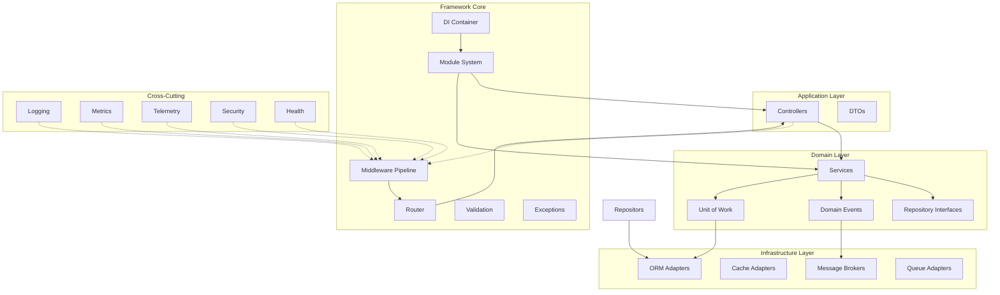

# Hono Enterprise Framework - Implementation Roadmap

## Project Overview

**Framework Name:** Hono Enterprise  
**Goal:** Production-quality, reusable enterprise framework combining Hono's performance with NestJS architecture and Spring Boot organization.  
**Runtime Support:** Node.js, Deno, Bun (Cloudflare Workers extensible)  
**Monorepo:** pnpm + Turborepo + TypeScript  

---

## Monorepo Structure

```
hono-enterprise/
├── apps/
│   ├── demo/                    # Full-featured demo application
│   ├── minimal/                 # Minimal example application
│   └── cli/                     # CLI application
├── packages/
│   ├── core/                    # Core framework (DI, modules, lifecycle)
│   ├── common/                  # Shared types, interfaces, utilities
│   ├── config/                  # Configuration module
│   ├── auth/                    # Authentication and authorization
│   ├── database/                # Database abstractions and adapters
│   ├── cache/                   # Cache abstractions and adapters
│   ├── events/                  # Event bus and domain events
│   ├── messaging/               # Messaging abstractions (RabbitMQ, NATS, Kafka)
│   ├── validation/              # Zod-based validation pipeline
│   ├── exceptions/              # Exception hierarchy and filters
│   ├── middleware/              # Middleware definitions and pipeline
│   ├── security/                # Security utilities (rate limiting, headers, CORS)
│   ├── scheduler/               # Cron jobs, delayed jobs, recurring jobs
│   ├── health/                  # Health check system
│   ├── metrics/                 # Prometheus metrics
│   ├── telemetry/               # OpenTelemetry integration
│   ├── logger/                  # Pino-based logging
│   ├── decorators/              # Decorator definitions
│   ├── testing/                 # Testing utilities and mocks
│   ├── cli/                     # CLI library (generators, commands)
│   ├── sdk/                     # SDK for external consumers
│   └── plugins/                 # Plugin system
├── examples/
│   ├── rest-api/                # REST API example
│   ├── microservices/           # Microservices example
│   ├── cqrs-pattern/            # CQRS pattern example
│   └── multi-tenant/            # Multi-tenancy example
├── docs/                        # Documentation
├── docker/                      # Docker configurations
├── kubernetes/                  # Kubernetes manifests
├── scripts/                     # Build and release scripts
├── pnpm-workspace.yaml
├── turbo.json
├── package.json
└── tsconfig.base.json
```

---

## Package Dependencies Map

```
core ────► common
          ├── decorators
          ├── exceptions
          └── logger

auth ────► core, common, security
cache ───► core, common
config ──► core, common, logger
database ─► core, common, exceptions
events ───► core, common, logger
messaging ─► core, common, events, logger
validation ─► core, common, exceptions
security ──► core, common
scheduler ─► core, common, events, logger
health ────► core, common, cache, database, logger
metrics ───► core, common, logger
telemetry ─► core, common, logger
middleware ─► core, common, logger
testing ───► core, common, decorators, exceptions
cli ───────► core, common, decorators
sdk ───────► core, common, decorators, validation
plugins ───► core, common
```

---

## Milestone 0: Monorepo Foundation and Build Infrastructure

**Objective:** Establish the monorepo structure, build system, and base configurations.

### Tasks

1. **Initialize Monorepo**
   - Remove existing Deno files
   - Create `pnpm-workspace.yaml`
   - Create root `package.json` with workspace configuration
   - Create `turbo.json` with task orchestration
   - Create `tsconfig.base.json` with strict TypeScript settings
   - Create `.gitignore`, `.editorconfig`, `.prettierrc`, `.eslintrc`

2. **Create Directory Structure**
   - Create `apps/`, `packages/`, `examples/`, `docs/`, `docker/`, `kubernetes/`, `scripts/`
   - Create stub `package.json` for each package

3. **Configure Build System**
   - Set up Turborepo tasks: `build`, `test`, `lint`, `typecheck`, `clean`
   - Configure TypeScript path mappings for cross-package imports
   - Set up ESLint with TypeScript rules
   - Configure Prettier for code formatting

4. **Package Configuration Template**
   - Each package gets:
     - `package.json` with proper naming (`@hono-enterprise/[package]`)
     - `tsconfig.json` extending base
     - `src/` directory
     - `test/` directory
     - `src/index.ts` barrel export

5. **CI/CD Foundation**
   - Create GitHub Actions workflow for CI
   - Configure linting, type checking, and tests

### Deliverables
- [ ] Working monorepo with pnpm
- [ ] Turborepo task orchestration
- [ ] Strict TypeScript configuration
- [ ] ESLint and Prettier configured
- [ ] All package stubs created
- [ ] CI pipeline passing

---

## Milestone 1: Core DI Container and Dependency Injection

**Objective:** Build the foundation of the framework - the dependency injection container.

### Package: `@hono-enterprise/common`

**Files:**
- `src/types/container.ts` - Container interfaces
- `src/types/provider.ts` - Provider type definitions
- `src/types/lifecycle.ts` - Lifecycle hook interfaces
- `src/types/module.ts` - Module interfaces
- `src/utils/id-generator.ts` - Unique ID generation
- `src/utils/reflection.ts` - Reflection utilities (runtime-independent)
- `src/utils/constants.ts` - Magic string constants
- `src/index.ts`

### Package: `@hono-enterprise/core`

**Core Types:**
```typescript
// Provider types
type ProviderScope = 'singleton' | 'scoped' | 'transient';
type ProviderType = 'class' | 'factory' | 'value' | 'useExisting';

interface Provider<T = any> {
  token: string | symbol;
  scope: ProviderScope;
  type: ProviderType;
  useClass?: new (...args: any[]) => T;
  useFactory?: (container: Container) => T;
  useValue?: T;
  useExisting?: string | symbol;
  inject?: (string | symbol)[];
}

interface Container {
  register<T>(token: string | symbol, provider: Provider<T>): void;
  resolve<T>(token: string | symbol): T;
  isRegistered(token: string | symbol): boolean;
  unregister(token: string | symbol): void;
  getScopeContainer(): Container;
  getParent(): Container | null;
}

interface ContainerBuilder {
  register<T>(token: string | symbol, provider: Provider<T>): ContainerBuilder;
  build(): Container;
}
```

**Implementation Files:**
- `src/di/container.ts` - Main container implementation
- `src/di/container-builder.ts` - Fluent builder for containers
- `src/di/provider-registry.ts` - Provider registration and storage
- `src/di/injection-token.ts` - Token creation utilities
- `src/di/circular-detector.ts` - Circular dependency detection
- `src/di/scope-manager.ts` - Scoped and transient lifecycle management
- `src/di/index.ts`

**Features:**
- Singleton, Scoped, Transient lifecycles
- Constructor injection
- Factory providers
- Value providers
- UseExisting providers
- Circular dependency detection with depth tracking
- Hierarchical containers (parent-child scope resolution)
- Custom injection tokens (strings and symbols)
- Provider registration validation

### Tests
- Container registration and resolution
- Singleton lifecycle verification
- Scoped lifecycle verification
- Transient lifecycle verification
- Constructor injection
- Factory provider execution
- Circular dependency detection
- Hierarchical container resolution
- Custom tokens
- Provider validation

### Deliverables
- [ ] `@hono-enterprise/common` package with core types
- [ ] `@hono-enterprise/core` DI container
- [ ] Full test coverage for DI scenarios
- [ ] Zero `any` types
- [ ] JSDoc on all public APIs

---

## Milestone 2: Decorators and Metadata Registration System

**Objective:** Implement decorator system that registers metadata without executing logic.

### Package: `@hono-enterprise/decorators`

**Decorator Categories:**

**Module Decorators:**
- `@Module(options)` - Register a module with controllers, providers, imports, exports
- `@Global()` - Mark module as globally available

**Controller Decorators:**
- `@Controller(path?, version?, prefix?)` - Register a controller with route prefix
- `@Get(path?)` - GET route handler
- `@Post(path?)` - POST route handler
- `@Put(path?)` - PUT route handler
- `@Patch(path?)` - PATCH route handler
- `@Delete(path?)` - DELETE route handler
- `@All(path?)` - All HTTP methods
- `@Head(path?)` - HEAD method
- `@Options(path?)` - OPTIONS method

**Injection Decorators:**
- `@Injectable()` - Mark class as injectable
- `@Inject(token)` - Inject dependency via constructor parameter
- `@Scope(scope)` - Override default provider scope

**Request Data Decorators:**
- `@Body()` - Extract request body
- `@Query(name?, required?)` - Extract query parameters
- `@Param(name?, required?)` - Extract route parameters
- `@Header(name?)` - Extract headers
- `@Cookie(name?)` - Extract cookies
- `@Request()` - Access full request object
- `@Response()` - Access response object

**Security Decorators:**
- `@CurrentUser()` - Inject authenticated user
- `@Roles(...roles)` - Require specific roles
- `@Permissions(...permissions)` - Require specific permissions
- `@Public()` - Bypass authentication
- `@ApiKey()` - Require API key authentication

**Cross-Cutting Concern Decorators:**
- `@UseGuards(...guards)` - Apply guards
- `@UseInterceptors(...interceptors)` - Apply interceptors
- `@UseFilters(...filters)` - Apply exception filters
- `@Cache(options)` - Enable caching
- `@Transactional(options)` - Wrap in transaction
- `@RateLimit(options)` - Apply rate limiting
- `@Version(version)` - API version targeting

**Implementation Files:**
- `src/metadata/storage.ts` - Metadata storage (WeakMap-based)
- `src/metadata/keys.ts` - Symbol keys for metadata
- `src/decorators/module.ts` - @Module, @Global
- `src/decorators/controller.ts` - @Controller, HTTP method decorators
- `src/decorators/injection.ts` - @Injectable, @Inject, @Scope
- `src/decorators/request.ts` - @Body, @Query, @Param, etc.
- `src/decorators/security.ts` - @Roles, @Permissions, @CurrentUser
- `src/decorators/pipeline.ts` - @UseGuards, @UseInterceptors, @UseFilters
- `src/decorators/concerns.ts` - @Cache, @Transactional, @RateLimit
- `src/decorators/index.ts`

**Metadata Storage Design:**
```typescript
interface ControllerMetadata {
  path: string;
  version?: string;
  middleware: MiddlewareMetadata[];
  guards: GuardMetadata[];
  interceptors: InterceptorMetadata[];
  filters: FilterMetadata[];
  routes: RouteMetadata[];
}

interface RouteMetadata {
  path: string;
  method: HttpMethod;
  handler: string;
  params: ParameterMetadata[];
  middleware: MiddlewareMetadata[];
  guards: GuardMetadata[];
  interceptors: InterceptorMetadata[];
  filters: FilterMetadata[];
  cache?: CacheOptions;
  transactional?: TransactionOptions;
  rateLimit?: RateLimitOptions;
}

interface ParameterMetadata {
  index: number;
  type: 'body' | 'query' | 'param' | 'header' | 'cookie' | 'request' | 'response' | 'user';
  name?: string;
  required?: boolean;
  schema?: any; // Zod schema reference
}
```

### Tests
- Metadata registration for each decorator
- Multiple decorators on same class/method
- Parameter decorator index resolution
- Metadata retrieval and validation
- Inherited decorator behavior

### Deliverables
- [ ] Complete decorator library
- [ ] Metadata storage system
- [ ] Type-safe decorator parameters
- [ ] Full test coverage
- [ ] JSDoc documentation

---

## Milestone 3: Module System and Application Bootstrap

**Objective:** Implement module discovery, loading, and application lifecycle.

### Package: `@hono-enterprise/core` (Extended)

**Module System:**
```typescript
interface ModuleDefinition {
  global?: boolean;
  imports?: (ModuleType | DynamicModule)[];
  controllers?: ControllerType[];
  providers?: (Provider | ClassType)[];
  exports?: (string | symbol | ClassType | DynamicModule)[];
}

interface Module {
  id: string;
  definition: ModuleDefinition;
  controllers: Controller[];
  providers: Map<string | symbol, Provider>;
  imports: Module[];
  exports: Set<string | symbol>;
  isGlobal: boolean;
  lifecycle: ModuleLifecycle;
}

interface ModuleLifecycle {
  onModuleInit?: () => Promise<void> | void;
  onModuleDestroy?: () => Promise<void> | void;
  onApplicationBootstrap?: () => Promise<void> | void;
  onApplicationShutdown?: () => Promise<void> | void;
}

interface DynamicModule {
  module: ModuleType;
  imports?: (ModuleType | DynamicModule)[];
  controllers?: ControllerType[];
  providers?: (Provider | ClassType)[];
  exports?: (string | symbol | ClassType | DynamicModule)[];
  global?: boolean;
}
```

**Application Bootstrap:**
```typescript
interface Application {
  init(): Promise<void>;
  listen(port: number, hostname?: string): Promise<Server>;
  requestContext(): RequestContext;
  use(middleware: Middleware): void;
  getHttpAdapter(): HttpAdapter;
  stop(): Promise<void>;
}

interface ApplicationOptions {
  port?: number;
  hostname?: string;
  cors?: CorsOptions;
  openapi?: OpenApiOptions;
  health?: HealthOptions;
  metrics?: MetricsOptions;
  logger?: LoggerOptions;
  runtime?: RuntimeType;
}
```

**Implementation Files:**
- `src/modules/module-graph.ts` - Module dependency graph
- `src/modules/module-scanner.ts` - Module discovery and scanning
- `src/modules/module-loader.ts` - Module loading and initialization
- `src/modules/module-compiler.ts` - Dynamic module compilation
- `src/modules/index.ts`
- `src/application/app.ts` - Main application class
- `src/application/app-builder.ts` - Fluent application builder
- `src/application/lifecycle-hooks.ts` - Lifecycle hook management
- `src/application/graceful-shutdown.ts` - Graceful shutdown handler
- `src/application/index.ts`

**Lifecycle Flow:**
1. Application created with options
2. Modules scanned and graph built
3. Circular dependency detection
4. Providers registered in DI container
5. Controllers discovered and routes registered
6. Middleware pipeline configured
7. `onModuleInit` hooks executed
8. Server starts listening
9. `onApplicationBootstrap` hooks executed
10. Request processing begins
11. On shutdown: `onApplicationShutdown` -> `onModuleDestroy` -> server close

### Tests
- Module graph construction
- Circular module dependency detection
- Module initialization order
- Global module availability
- Dynamic module configuration
- Application bootstrap sequence
- Graceful shutdown
- Lifecycle hook execution order

### Deliverables
- [ ] Module system with graph resolution
- [ ] Application bootstrap with lifecycle hooks
- [ ] Graceful shutdown implementation
- [ ] Module discovery and scanning
- [ ] Full test coverage

---

## Milestone 4: Middleware Pipeline and Middleware System

**Objective:** Implement ASP.NET Core-style middleware pipeline.

### Package: `@hono-enterprise/middleware`

**Middleware Interface:**
```typescript
interface MiddlewareContext {
  request: Request;
  response: Response;
  next(): Promise<void>;
  abort(status?: number, body?: any): void;
  get<K extends string>(key: K): any;
  set<K extends string>(key: K, value: any): void;
  state: Map<string, any>;
}

interface Middleware {
  name: string;
  order?: number;
  match?(path: string, method: string): boolean;
  handle(context: MiddlewareContext): Promise<void>;
}

interface MiddlewarePipeline {
  use(middleware: Middleware): MiddlewarePipeline;
  build(): (context: MiddlewareContext) => Promise<void>;
  execute(context: MiddlewareContext): Promise<void>;
}
```

**Built-in Middleware:**
- `LoggingMiddleware` - Request/response logging
- `RequestIdMiddleware` - Generate unique request ID
- `CorrelationIdMiddleware` - Propagate correlation ID
- `CorsMiddleware` - CORS handling
- `SecurityHeadersMiddleware` - Secure HTTP headers
- `TimingMiddleware` - Request timing
- `CompressionMiddleware` - Response compression

**Pipeline Order:**
```
1.  LoggingMiddleware (order: 100)
2.  RequestIdMiddleware (order: 200)
3.  CorrelationIdMiddleware (order: 300)
4.  CorsMiddleware (order: 400)
5.  SecurityHeadersMiddleware (order: 500)
6.  AuthenticationMiddleware (order: 600)
7.  AuthorizationMiddleware (order: 700)
8.  ValidationMiddleware (order: 800)
9.  ControllerDispatcher (order: 900)
10. ResponseInterceptors (order: 1000)
11. ErrorHandlingMiddleware (order: 1100)
12. MetricsMiddleware (order: 1200)
```

**Implementation Files:**
- `src/pipeline/middleware-context.ts`
- `src/pipeline/middleware-pipeline.ts`
- `src/pipeline/middleware-executor.ts`
- `src/middleware/logging.middleware.ts`
- `src/middleware/request-id.middleware.ts`
- `src/middleware/correlation-id.middleware.ts`
- `src/middleware/cors.middleware.ts`
- `src/middleware/security-headers.middleware.ts`
- `src/middleware/timing.middleware.ts`
- `src/middleware/compression.middleware.ts`
- `src/middleware/index.ts`

### Tests
- Middleware execution order
- Middleware matching rules
- Context data passing between middleware
- Early response (abort) behavior
- Error propagation through pipeline
- Built-in middleware functionality

### Deliverables
- [ ] Middleware pipeline implementation
- [ ] Built-in middleware set
- [ ] Context object with state management
- [ ] Middleware ordering and matching
- [ ] Full test coverage

---

## Milestone 5: Controller Discovery, Routing, and HTTP Handling

**Objective:** Implement controller discovery, route registration, and HTTP adapter system.

### Package: `@hono-enterprise/core` (Extended)

**HTTP Adapter Interface:**
```typescript
interface HttpAdapter {
  createServer(app: Application): any;
  listen(port: number, hostname?: string): Promise<any>;
  close(): Promise<void>;
  getRequest(ctx: any): HonoRequest;
  getResponse(ctx: any): HonoResponse;
  send(ctx: any, data: any, status: number): void;
  setError(ctx: any, error: any): void;
}

interface HonoRequest {
  method: string;
  url: string;
  path: string;
  headers: Headers;
  body(): Promise<any>;
  query(): Promise<Record<string, string>>;
  params(): Promise<Record<string, string>>;
  cookies(): Promise<Record<string, string>>;
  ip(): string;
  protocol: string;
}

interface HonoResponse {
  status(code: number): HonoResponse;
  header(name: string, value: string): HonoResponse;
  cookie(name: string, value: string, options?: any): HonoResponse;
  send(data: any): void;
  json(data: any): void;
  html(content: string): void;
  redirect(url: string, status?: number): void;
}
```

**Router:**
```typescript
interface Router {
  registerController(controller: Controller): void;
  match(path: string, method: string): RouteMatch | null;
  getRoutes(): RouteDefinition[];
}

interface RouteMatch {
  controller: Controller;
  handler: Method;
  params: Record<string, string>;
  metadata: RouteMetadata;
}
```

**Controller Dispatcher:**
```typescript
interface ControllerDispatcher {
  dispatch(request: HonoRequest, routeMatch: RouteMatch): Promise<any>;
  resolveParameters(metadata: ParameterMetadata[], request: HonoRequest): any[];
  executeHandler(handler: Function, params: any[]): Promise<any>;
}
```

**Runtime Adapters:**
- `NodeHttpAdapter` - Node.js HTTP server
- `DenoHttpAdapter` - Deno HTTP server
- `BunHttpAdapter` - Bun HTTP server

**Implementation Files:**
- `src/router/router.ts`
- `src/router/route-matcher.ts`
- `src/router/controller-discovery.ts`
- `src/router/controller-dispatcher.ts`
- `src/router/parameter-resolver.ts`
- `src/adapters/http-adapter.interface.ts`
- `src/adapters/node-http-adapter.ts`
- `src/adapters/deno-http-adapter.ts`
- `src/adapters/bun-http-adapter.ts`
- `src/adapters/runtime-detector.ts`
- `src/adapters/index.ts`
- `src/request/hono-request.ts`
- `src/request/hono-response.ts`
- `src/request/index.ts`

### Tests
- Controller discovery from modules
- Route registration and matching
- Parameter resolution (@Body, @Query, @Param, etc.)
- HTTP adapter abstractions
- Runtime detection
- Controller dispatch execution
- Response formatting

### Deliverables
- [ ] Router with route matching
- [ ] Controller discovery and registration
- [ ] HTTP adapter interface and runtime adapters
- [ ] Parameter resolution system
- [ ] Controller dispatcher
- [ ] Full test coverage

---

## Milestone 6: Validation Pipeline with Zod Integration

**Objective:** Implement automatic request validation using Zod.

### Package: `@hono-enterprise/validation`

**Validation System:**
```typescript
interface ValidationPipe {
  validate<T>(schema: ZodSchema<T>, data: unknown): Promise<T>;
  transform<T>(schema: ZodSchema<T>, data: unknown): Promise<T>;
  validateAndTransform<T>(schema: ZodSchema<T>, data: unknown): Promise<T>;
}

interface ValidationOptions {
  whitelist?: boolean;
  forbidNonWhitelisted?: boolean;
  transform?: boolean;
  disableErrorMessages?: boolean;
  errorHttpStatusCode?: number;
  exceptionFactory?: (errors: ValidationError[]) => HttpException;
  transformOptions?: { enableImplicitToString?: boolean; enableImplicitCoachmarks?: boolean };
}

// Decorator for schema binding
@Validate(schema: ZodSchema, target: 'body' | 'query' | 'params' | 'headers')
```

**Zod to OpenAPI Transformation:**
```typescript
function zodToOpenAPI(schema: ZodSchema): OpenAPISchema;
function zodToJSONSchema(schema: ZodSchema): JSONSchema;
```

**Implementation Files:**
- `src/pipes/validation-pipe.ts`
- `src/pipes/argument-host.ts`
- `src/decorators/validate.decorator.ts`
- `src/decorators/validate-body.decorator.ts`
- `src/decorators/validate-query.decorator.ts`
- `src/decorators/validate-param.decorator.ts`
- `src/decorators/validate-header.decorator.ts`
- `src/decorators/validate-cookie.decorator.ts`
- `src/transformers/zod-transformer.ts`
- `src/openapi/zod-to-openapi.ts`
- `src/exceptions/validation-exception.ts`
- `src/exceptions/validation-error.ts`
- `src/index.ts`

**Standardized Validation Error Response:**
```typescript
interface ValidationErrorResponse {
  statusCode: number;
  error: 'Validation Error';
  message: string;
  details: ValidationErrorDetail[];
  timestamp: string;
  path: string;
}

interface ValidationErrorDetail {
  field: string;
  message: string;
  code: string;
  expected?: any;
  received?: any;
}
```

### Tests
- Body validation with Zod schemas
- Query parameter validation
- Path parameter validation
- Header validation
- Cookie validation
- Transformation pipeline
- Error formatting
- Whitelisting and forbidding non-whitelisted properties
- Zod to OpenAPI transformation

### Deliverables
- [ ] Validation pipe implementation
- [ ] Validation decorators
- [ ] Standardized error responses
- [ ] Zod to OpenAPI transformation
- [ ] Full test coverage

---

## Milestone 7: Exception System and Global Exception Filters

**Objective:** Implement hierarchical exception system and global exception handling.

### Package: `@hono-enterprise/exceptions`

**Exception Hierarchy:**
```
HttpError (base)
├── BadRequestException (400)
│   └── ValidationException
├── UnauthorizedException (401)
├── ForbiddenException (403)
├── NotFoundException (404)
├── MethodNotAllowedException (405)
├── ConflictException (409)
├── GoneException (410)
├── UnprocessableContentException (422)
├── TooManyRequestsException (429)
├── InternalServerException (500)
├── NotImplementedException (501)
├── BadGatewayException (502)
├── ServiceUnavailableException (503)
└── GatewayTimeoutException (504)
```

**Exception Interface:**
```typescript
interface HttpError extends Error {
  statusCode: number;
  message: string;
  errors?: any;
  cause?: Error;
  getResponse(): any;
}

interface ExceptionFilter {
  catch(exception: Error, host: ExceptionFilterHost): void;
}

interface ExceptionFilterHost {
  getArg(): any;
  getHandler(): ReflectableMethod;
}

interface GlobalExceptionFilter {
  filters: ExceptionFilter[];
  catch(exception: Error, host: ExceptionFilterHost): void;
}
```

**Standardized Error Response:**
```typescript
interface ErrorResponse {
  statusCode: number;
  error: string;
  message: string;
  details?: any;
  timestamp: string;
  path: string;
  correlationId?: string;
}
```

**Implementation Files:**
- `src/errors/http-error.ts`
- `src/errors/bad-request.exception.ts`
- `src/errors/unauthorized.exception.ts`
- `src/errors/forbidden.exception.ts`
- `src/errors/not-found.exception.ts`
- `src/errors/conflict.exception.ts`
- `src/errors/validation.exception.ts`
- `src/errors/internal-server.exception.ts`
- `src/errors/not-implemented.exception.ts`
- `src/errors/service-unavailable.exception.ts`
- `src/errors/too-many-requests.exception.ts`
- `src/filters/exception-filter.interface.ts`
- `src/filters/global-exception-filter.ts`
- `src/filters/base-exception-filter.ts`
- `src/filters/http-exception-filter.ts`
- `src/decorators/use-filters.decorator.ts`
- `src/index.ts`

### Tests
- Exception hierarchy and status codes
- Exception response formatting
- Global exception filter
- Custom exception filters
- Filter execution order
- Exception propagation
- Error cause chaining

### Deliverables
- [ ] Complete exception hierarchy
- [ ] Global exception filter
- [ ] Custom filter support
- [ ] Standardized error responses
- [ ] Full test coverage

---

## Milestone 8: Configuration Module with Runtime Support

**Objective:** Implement strongly-typed configuration with environment variable validation.

### Package: `@hono-enterprise/config`

**Configuration System:**
```typescript
interface ConfigModuleOptions {
  isGlobal?: boolean;
  envFilePath?: string;
    envFilePaths?: string[];
  cache?: boolean;
  expandVariables?: boolean;
  validationSchema?: ZodSchema;
  validationOptions?: ValidationErrorConfig;
}

interface ConfigService {
  get<T = string>(key: string, options?: ConfigGetOptions): T;
  set<T = any>(key: string, value: T): void;
  has(key: string): boolean;
  getOrThrow<T = string>(key: string, options?: ConfigGetOptions): T;
  getOrCreateDefault<T = any>(key: string, defaultValue: T): T;
  parseBoolean(value: string): boolean;
  parseNumber(value: string): number;
  parseArray(value: string): string[];
  parseJson(value: string): any;
}

interface ConfigGetOptions {
  defaultValue?: any;
  infer?: boolean;
  timeout?: number;
  throwOnNotFound?: boolean;
}
```

**Runtime Adapters:**
- `NodeConfigLoader` - Node.js process.env
- `DenoConfigLoader` - Deno.env
- `BunConfigLoader` - Bun.env

**Implementation Files:**
- `src/config-module.ts`
- `src/config-service.ts`
- `src/config-validator.ts`
- `src/env-config.loader.ts`
- `src/loaders/node-config.loader.ts`
- `src/loaders/deno-config.loader.ts`
- `src/loaders/bun-config.loader.ts`
- `src/loaders/runtime-config.loader.ts`
- `src/decorators/config.decorator.ts`
- `src/decorators/configurable.decorator.ts`
- `src/exceptions/config-validation.exception.ts`
- `src/index.ts`

### Tests
- Configuration loading from environment
- Configuration validation with Zod
- Type-safe configuration access
- Runtime-specific configuration loading
- Default values
- Configuration caching
- Environment file loading
- Variable expansion

### Deliverables
- [ ] Configuration module
- [ ] ConfigService with type inference
- [ ] Runtime-specific config loaders
- [ ] Zod-based validation
- [ ] Full test coverage

---

## Milestone 9: Logger Package with Pino Integration

**Objective:** Implement structured logging with Pino.

### Package: `@hono-enterprise/logger`

**Logger Interface:**
```typescript
type LogLevel = 'fatal' | 'error' | 'warn' | 'info' | 'debug' | 'trace';

interface LogEntry {
  level: LogLevel;
  timestamp: string;
  pid: number;
  pidName?: string;
  hostname: string;
  msg: string;
  context?: string;
  trace?: string;
  correlationId?: string;
  requestId?: string;
  [key: string]: any;
}

interface Logger {
  fatal(msg: string, context?: string): void;
  error(msg: string, trace?: string, context?: string): void;
  warn(msg: string, context?: string): void;
  info(msg: string, context?: string): void;
  debug(msg: string, context?: string): void;
  trace(msg: string, context?: string): void;
  child(bindings: any): Logger;
  setLevel(level: LogLevel): void;
}

interface LoggerOptions {
  level?: LogLevel;
  prettyPrint?: boolean;
  redact?: string[];
  formatters?: any;
  transport?: any;
  customSerializer?: any;
}
```

**Implementation Files:**
- `src/logger.service.ts`
- `src/pino-logger.service.ts`
- `src/console-logger.service.ts`
- `src/logger.module.ts`
- `src/logger.service-provider.ts`
- `src/decorators/log-level.decorator.ts`
- `src/filters/slow-request.filter.ts`
- `src/middleware/request-logger.middleware.ts`
- `src/index.ts`

**Automatic Logging:**
- Incoming requests with method, path, status, duration
- Outgoing responses
- Exceptions with stack traces
- Slow requests (configurable threshold)
- Database queries (when integrated)
- External HTTP calls (when integrated)

### Tests
- Log level filtering
- Structured log output
- Context binding
- Child logger inheritance
- Request logging middleware
- Slow request detection
- Redaction of sensitive fields

### Deliverables
- [ ] Pino-based logger service
- [ ] Console logger fallback
- [ ] Logger module for DI integration
- [ ] Request logging middleware
- [ ] Full test coverage

---

## Milestone 10: Security Package (JWT, RBAC, Guards)

**Objective:** Implement authentication tokens, RBAC, and guard system.

### Package: `@hono-enterprise/security`

**JWT Service:**
```typescript
interface JwtService {
  sign(payload: any, options?: JwtSignOptions): string;
  verify(token: string, options?: JwtVerifyOptions): JwtPayload;
  decode(token: string): JwtPayload | null;
  signAsync(payload: any, options?: JwtSignOptions): Promise<string>;
  verifyAsync(token: string, options?: JwtVerifyOptions): Promise<JwtPayload>;
}

interface JwtSignOptions {
  secret?: string;
  expiresIn?: string | number;
  issuer?: string;
  audience?: string;
  algorithm?: string;
  jwtid?: string;
  notBefore?: string | number;
  subject?: string;
}

interface JwtVerifyOptions {
  secret?: string;
  issuer?: string;
  audience?: string;
  complete?: boolean;
}
```

**RBAC System:**
```typescript
interface Role {
  name: string;
  description?: string;
  permissions: Permission[];
  inherits?: Role[];
}

interface Permission {
  resource: string;
  action: string;
  description?: string;
}

interface RolesService {
  hasRole(user: User, role: string): boolean;
  hasPermission(user: User, permission: Permission): boolean;
  hasAnyRole(user: User, roles: string[]): boolean;
  hasAllRoles(user: User, roles: string[]): boolean;
  hasAnyPermission(user: User, permissions: Permission[]): boolean;
  hasAllPermissions(user: User, permissions: Permission[]): boolean;
}
```

**Guard System:**
```typescript
interface Guard {
  canActivate(context: ExecutionContext): boolean | Promise<boolean>;
}

interface ExecutionContext {
  getType(): 'http' | 'ws' | 'wss';
  switchToHttp(): HttpArgumentsHost;
  switchToWs(): WsArgumentsHost;
  getArg(): any;
  getArgs(): any[];
  getClass(): Type<any>;
  getHandler(): Function;
}

interface CanActivate {
  canActivate(context: ExecutionContext): boolean | Promise<boolean>;
}
```

**Implementation Files:**
- `strategies/jwt.strategy.ts`
- `strategies/api-key.strategy.ts`
- `strategies/local.strategy.ts`
- `guards/rbac.guard.ts`
- `guards/permissions.guard.ts`
- `guards/jwt-auth.guard.ts`
- `guards/api-key.guard.ts`
- `guards/base.guard.ts`
- `services/jwt.service.ts`
- `services/roles.service.ts`
- `services/password-hasher.ts`
- `utils/token-generator.ts`
- `utils/crypto-utils.ts`
- `interfaces/guard.interface.ts`
- `interfaces/execution-context.interface.ts`
- `interfaces/user.interface.ts`
- `interfaces/role.interface.ts`
- `interfaces/permission.interface.ts`
- `decorators/current-user.decorator.ts`
- `decorators/roles.decorator.ts`
- `decorators/permissions.decorator.ts`
- `decorators/public.decorator.ts`
- `decorators/optional.decorator.ts`
- `index.ts`

### Tests
- JWT signing and verification
- Role hierarchy and inheritance
- Permission checks
- Guard execution context
- RBAC guard
- Permission guard
- Password hashing
- Token generation

### Deliverables
- [ ] JWT service
- [ ] RBAC system with role hierarchy
- [ ] Guard system with execution context
- [ ] Authentication strategies
- [ ] Password hashing utilities
- [ ] Full test coverage

---

## Milestone 11: Authentication and Authorization Middleware

**Objective:** Implement authentication and authorization middleware.

### Package: `@hono-enterprise/auth`

**Auth Module:**
```typescript
interface AuthModuleOptions {
  jwt?: JwtAuthOptions;
  apiKey?: ApiKeyAuthOptions;
  session?: SessionAuthOptions;
  oauth?: OAuthOptions;
  rateLimit?: RateLimitOptions;
}

interface JwtAuthOptions {
  secret: string;
  expiresIn: string;
  refreshExpiresIn?: string;
  algorithm?: string;
  issuer?: string;
  audience?: string;
}
```

**Middleware:**
- `AuthenticationMiddleware` - Extract and validate credentials
- `AuthorizationMiddleware` - Check roles and permissions
- `RateLimitMiddleware` - Rate limiting with Redis/memory store
- `CookieSecurityMiddleware` - Secure cookie handling

**Implementation Files:**
- `src/auth.module.ts`
- `src/auth.service.ts`
- `src/auth-options.factory.ts`
- `src/middleware/authentication.middleware.ts`
- `src/middleware/authorization.middleware.ts`
- `src/middleware/rate-limit.middleware.ts`
- `src/middleware/cookie-security.middleware.ts`
- `src/strategies/jwt.strategy.ts`
- `src/strategies/api-key.strategy.ts`
- `src/strategies/local.strategy.ts`
- `src/strategies/refresh-token.strategy.ts`
- `src/guards/jwt-auth.guard.ts`
- `src/guards/api-key.guard.ts`
- `src/guards/rbac.guard.ts`
- `src/guards/permissions.guard.ts`
- `src/decorators/public.decorator.ts`
- `src/decorators/roles.decorator.ts`
- `src/decorators/permissions.decorator.ts`
- `src/decorators/current-user.decorator.ts`
- `src/interfaces/user.interface.ts`
- `src/interfaces/auth-request.interface.ts`
- `src/index.ts`

### Tests
- Authentication middleware
- Authorization middleware
- JWT strategy
- API key strategy
- Rate limiting
- Role-based access control
- Permission-based access control
- Public route bypass

### Deliverables
- [ ] Authentication middleware
- [ ] Authorization middleware
- [ ] Auth strategies (JWT, API Key, Local)
- [ ] Rate limiting middleware
- [ ] Full test coverage

---

## Milestone 12: Repository Layer and Unit of Work Pattern

**Objective:** Implement repository pattern and unit of work for data access.

### Package: `@hono-enterprise/database`

**Repository Interface:**
```typescript
interface IRepository<Entity, Id> {
  findById(id: Id): Promise<Entity | null>;
  findAll(options?: FindOptions): Promise<Entity[]>;
  create(data: CreateEntityInput): Promise<Entity>;
  update(id: Id, data: UpdateEntityInput): Promise<Entity>;
  delete(id: Id): Promise<boolean>;
  exists(id: Id): Promise<boolean>;
  count(options?: CountOptions): Promise<number>;
}

interface IReadRepository<Entity, Id> {
  findById(id: Id): Promise<Entity | null>;
  findAll(options?: FindOptions): Promise<Entity[]>;
  exists(id: Id): Promise<boolean>;
  count(options?: CountOptions): Promise<number>;
}

interface IWriteRepository<Entity, Id> {
  create(data: CreateEntityInput): Promise<Entity>;
  update(id: Id, data: UpdateEntityInput): Promise<Entity>;
  delete(id: Id): Promise<boolean>;
}
```

**Unit of Work:**
```typescript
interface IUnitOfWork {
  beginTransaction(): Promise<void>;
  commit(): Promise<void>;
  rollback(): Promise<void>;
  getRepository<T extends BaseEntity>(entityClass: Type<T>): IRepository<T, any>;
}

interface TransactionOptions {
  isolationLevel?: IsolationLevel;
  timeout?: number;
  name?: string;
}

type IsolationLevel = 'READ UNCOMMITTED' | 'READ COMMITTED' | 'REPEATABLE READ' | 'SERIALIZABLE';
```

**Base Repository:**
```typescript
abstract class BaseRepository<Entity, Id> implements IRepository<Entity, Id> {
  protected constructor(protected unitOfWork: IUnitOfWork, protected entityClass: Type<Entity>) {}
  // Implementation delegates to ORM adapter
}
```

**Implementation Files:**
- `src/interfaces/repository.interface.ts`
- `src/interfaces/unitOfWork.interface.ts`
- `src/interfaces/orm-adapter.interface.ts`
- `src/repositories/base.repository.ts`
- `src/repositories/base-read.repository.ts`
- `src/repositories/base-write.repository.ts`
- `src/unitOfWork/unitOfWork.ts`
- `src/unitOfWork/transaction-manager.ts`
- `src/unitOfWork/transaction-context.ts`
- `src/decorators/transactional.decorator.ts`
- `src/decorators/repository.decorator.ts`
- `src/decorators/inject-repository.decorator.ts`
- `src/filters/query-builder.ts`
- `src/filters/find-options.ts`
- `src/utils/pagination.ts`
- `src/utils/sorting.ts`
- `src/utils/filtering.ts`
- `src/index.ts`

### Tests
- Repository CRUD operations
- Unit of Work transactions
- Transaction rollback
- Transaction commit
- @Transactional decorator
- Query building
- Pagination
- Sorting
- Filtering

### Deliverables
- [ ] Repository interfaces
- [ ] Base repository implementation
- [ ] Unit of Work pattern
- [ ] Transaction management
- [ ] @Transactional decorator
- [ ] Query building utilities
- [ ] Full test coverage

---

## Milestone 13: Database Package with Prisma/Drizzle Adapters

**Objective:** Implement ORM adapters for Prisma and Drizzle.

### Package: `@hono-enterprise/database` (Extended)

**ORM Adapter Interface:**
```typescript
interface IOrmAdapter {
  connect(): Promise<void>;
  disconnect(): Promise<void>;
  isReady(): boolean;
  createTransaction(): ITransaction;
  executeQuery<T>(query: string, params?: any[]): Promise<T[]>;
  migrate(): Promise<void>;
  seed(): Promise<void>;
}

interface ITransaction {
  execute<T>(query: string, params?: any[]): Promise<T>;
  commit(): Promise<void>;
  rollback(): Promise<void>;
}
```

**Prisma Adapter:**
- `PrismaAdapter` - Wraps PrismaClient
- `PrismaRepository` - Implements IRepository using Prisma
- `PrismaUnitOfWork` - Implements IUnitOfWork using Prisma transactions

**Drizzle Adapter:**
- `DrizzleAdapter` - Wraps drizzle() instance
- `DrizzleRepository` - Implements IRepository using Drizzle
- `DrizzleUnitOfWork` - Implements IUnitOfWork using Drizzle transactions

**Database Module:**
```typescript
interface DatabaseModuleOptions {
  type: 'prisma' | 'drizzle';
  prisma?: PrismaOptions;
  drizzle?: DrizzleOptions;
}
```

**Implementation Files:**
- `src/adapters/prisma/prisma.adapter.ts`
- `src/adapters/prisma/prisma.repository.ts`
- `src/adapters/prisma/prisma-unit-of-work.ts`
- `src/adapters/drizzle/drizzle.adapter.ts`
- `src/adapters/drizzle/drizzle.repository.ts`
- `src/adapters/drizzle/drizzle-unit-of-work.ts`
- `src/database.module.ts`
- `src/database.service.ts`
- `src/database-options.factory.ts`
- `src/index.ts`

### Tests
- Prisma adapter CRUD
- Prisma transactions
- Drizzle adapter CRUD
- Drizzle transactions
- Database module configuration
- Connection management
- Query execution

### Deliverables
- [ ] Prisma adapter
- [ ] Drizzle adapter
- [ ] Database module
- [ ] ORM-agnostic repository implementations
- [ ] Full test coverage

---

## Milestone 14: Cache Abstraction with Memory/Redis Adapters

**Objective:** Implement caching abstraction with memory and Redis adapters.

### Package: `@hono-enterprise/cache`

**Cache Interface:**
```typescript
interface ICache {
  get<T>(key: string): Promise<T | null>;
  set<T>(key: string, value: T, ttl?: number): Promise<void>;
  delete(key: string): Promise<boolean>;
  has(key: string): Promise<boolean>;
  clear(): Promise<void>;
  getMany<T>(keys: string[]): Promise<(T | null)[]>;
  setMany<T>(entries: [string, T][], ttl?: number): Promise<void>;
  deleteMany(keys: string[]): Promise<boolean[]>;
  incr(key: string): Promise<number>;
  decr(key: string): Promise<number>;
  ttl(key: string): Promise<number>;
  expire(key: string, ttl: number): Promise<void>;
}

interface CacheOptions {
  ttl?: number;
  prefix?: string;
  keyGenerator?: (args: any[]) => string;
  storage?: 'memory' | 'redis';
}
```

**Cache Decorator:**
```typescript
@Cache(options?: CacheOptions)
@CacheKey(keyGenerator: (args: any[]) => string)
@CacheTTL(ttl: number)
@CacheForget(keys: string[])
```

**Implementation Files:**
- `src/interfaces/cache.interface.ts`
- `src/cache.module.ts`
- `src/cache.service.ts`
- `src/cache-manager.ts`
- `src/interceptors/cache.interceptor.ts`
- `src/decorators/cache.decorator.ts`
- `src/decorators/cache-key.decorator.ts`
- `src/decorators/cache-ttl.decorator.ts`
- `src/decorators/cache-forget.decorator.ts`
- `src/stores/memory-store.ts`
- `src/stores/redis-store.ts`
- `src/stores/store-factory.ts`
- `src/utils/cache-key-generator.ts`
- `src/index.ts`

### Tests
- Memory store operations
- Redis store operations
- Cache service abstraction
- Cache decorator
- Cache interceptor
- TTL management
- Key generation
- Cache invalidation

### Deliverables
- [ ] Cache interface and service
- [ ] Memory store
- [ ] Redis store
- [ ] Cache decorators
- [ ] Cache interceptor
- [ ] Full test coverage

---

## Milestone 15: Event Bus and Domain Events

**Objective:** Implement in-memory event bus and domain event system.

### Package: `@hono-enterprise/events`

**Event System:**
```typescript
interface IEvent {
  readonly id: string;
  readonly occurredOn: Date;
  readonly aggregateId: string;
  readonly type: string;
  readonly version: number;
  readonly data: any;
}

interface IEventHandler<T extends IEvent = IEvent> {
  handle(event: T): Promise<void>;
  getEventType(): string;
}

interface IEventBus {
  publish(event: IEvent): Promise<void>;
  publishBatch(events: IEvent[]): Promise<void>;
  subscribe<T extends IEvent>(handler: IEventHandler<T>): void;
  unsubscribe(handler: IEventHandler<IEvent>): void;
  getHandlers<T extends IEvent>(eventType: string): IEventHandler<T>[];
}
```

**Domain Event:**
```typescript
abstract class DomainEvent extends IEvent {
  constructor(aggregateId: string, data: any) {
    super();
    this.id = uuid();
    this.occurredOn = new Date();
    this.aggregateId = aggregateId;
    this.type = this.getEventType();
    this.version = 1;
    this.data = data;
  }
  abstract getEventType(): string;
}
```

**Implementation Files:**
- `src/interfaces/event.interface.ts`
- `src/interfaces/event-handler.interface.ts`
- `src/interfaces/event-bus.interface.ts`
- `src/events/domain-event.ts`
- `src/events/integration-event.ts`
- `src/events/command-event.ts`
- `src/bus/in-memory-event-bus.ts`
- `src/bus/event-subscription.ts`
- `src/bus/event-dispatcher.ts`
- `src/handlers/base-event-handler.ts`
- `src/decorators/event-handler.decorator.ts`
- `src/decorators/event-payload.decorator.ts`
- `src/exceptions/event-handler.exception.ts`
- `src/index.ts`

### Tests
- Domain event creation
- Event bus publish/subscribe
- Event handler execution
- Event ordering
- Batch publishing
- Handler registration/unregistration
- Error handling in event handlers

### Deliverables
- [ ] Event interfaces
- [ ] Domain event base class
- [ ] In-memory event bus
- [ ] Event handler system
- [ ] Event decorators
- [ ] Full test coverage

---

## Milestone 16: CQRS Implementation

**Objective:** Implement Command Query Responsibility Segregation pattern.

### Package: `@hono-enterprise/events` (Extended) or New Package `@hono-enterprise/cqrs`

**CQRS Interfaces:**
```typescript
interface ICommand {
  readonly id: string;
  readonly createdAt: Date;
}

interface IQuery {
  readonly id: string;
  readonly createdAt: Date;
}

interface ICommandHandler<TCommand extends ICommand, TResult = void> {
  handle(command: TCommand): Promise<TResult>;
}

interface IQueryHandler<TQuery extends IQuery, TResult> {
  handle(query: TQuery): Promise<TResult>;
}

interface ICommandBus {
  execute<TCommand extends ICommand, TResult = void>(command: TCommand): Promise<TResult>;
  subscribe<TCommand extends ICommand, TResult = void>(handler: ICommandHandler<TCommand, TResult>): void;
}

interface IQueryBus {
  execute<TQuery extends IQuery, TResult>(query: TQuery): Promise<TResult>;
  subscribe<TQuery extends IQuery, TResult>(handler: IQueryHandler<TQuery, TResult>): void;
}
```

**Pipeline Behaviors:**
```typescript
interface PipelineBehavior<TRequest, TResult> {
  handle(request: TRequest, next: () => Promise<TResult>): Promise<TResult>;
}

// Built-in behaviors
class LoggingBehavior<TRequest, TResult> implements PipelineBehavior<TRequest, TResult>
class ValidationBehavior<TRequest, TResult> implements PipelineBehavior<TRequest, TResult>
class TransactionBehavior<TRequest, TResult> implements PipelineBehavior<TRequest, TResult>
class CachingBehavior<TRequest, TResult> implements PipelineBehavior<TRequest, TResult>
class TimingBehavior<TRequest, TResult> implements PipelineBehavior<TRequest, TResult>
```

**Implementation Files:**
- `src/interfaces/command.interface.ts`
- `src/interfaces/query.interface.ts`
- `src/interfaces/command-handler.interface.ts`
- `src/interfaces/query-handler.interface.ts`
- `src/interfaces/pipeline-behavior.interface.ts`
- `src/bus/command-bus.ts`
- `src/bus/query-bus.ts`
- `src/handlers/base-command-handler.ts`
- `src/handlers/base-query-handler.ts`
- `src/behaviors/logging-behavior.ts`
- `src/behaviors/validation-behavior.ts`
- `src/behaviors/transaction-behavior.ts`
- `src/behaviors/caching-behavior.ts`
- `src/behaviors/timing-behavior.ts`
- `src/decorators/command-handler.decorator.ts`
- `src/decorators/query-handler.decorator.ts`
- `src/decorators/command.decorator.ts`
- `src/decorators/query.decorator.ts`
- `src/cqrs.module.ts`
- `src/index.ts`

### Tests
- Command bus execution
- Query bus execution
- Handler registration
- Pipeline behavior chaining
- Logging behavior
- Validation behavior
- Transaction behavior
- Caching behavior

### Deliverables
- [ ] Command and query interfaces
- [ ] Command bus and query bus
- [ ] Handler base classes
- [ ] Pipeline behaviors
- [ ] CQRS decorators
- [ ] CQRS module
- [ ] Full test coverage

---

## Milestone 17: Messaging Package

**Objective:** Implement messaging abstractions with RabbitMQ, NATS, and Kafka adapters.

### Package: `@hono-enterprise/messaging`

**Messaging Interfaces:**
```typescript
interface IMessage {
  readonly id: string;
  readonly type: string;
  readonly data: any;
  readonly metadata: MessageMetadata;
  readonly timestamp: Date;
}

interface MessageMetadata {
  correlationId?: string;
  causationId?: string;
  contentType?: string;
  headers?: Record<string, string>;
  [key: string]: any;
}

interface IMessageBroker {
  connect(): Promise<void>;
  disconnect(): Promise<void>;
  publish<T>(topic: string, message: T, options?: PublishOptions): Promise<void>;
  subscribe<T>(topic: string, handler: MessageHandler<T>, options?: SubscribeOptions): Promise<Subscription>;
  createTopic(name: string, options?: TopicOptions): Promise<void>;
  deleteTopic(name: string): Promise<void>;
}

interface MessageHandler<T = any> {
  handle(message: T, metadata: MessageMetadata): Promise<void>;
}

interface Subscription {
  unsubscribe(): Promise<void>;
}
```

**Adapters:**
- `RabbitMqBroker` - RabbitMQ implementation
- `NatsBroker` - NATS implementation
- `KafkaBroker` - Kafka implementation
- `RedisStreamsBroker` - Redis Streams implementation

**Implementation Files:**
- `src/interfaces/message.interface.ts`
- `src/interfaces/message-broker.interface.ts`
- `src/interfaces/message-handler.interface.ts`
- `src/broker/message-broker.module.ts`
- `src/broker/message-broker.service.ts`
- `src/adapters/rabbitmq/rabbitmq.broker.ts`
- `src/adapters/rabbitmq/rabbitmq.connection.ts`
- `src/adapters/nats/nats.broker.ts`
- `src/adapters/nats/nats.connection.ts`
- `src/adapters/kafka/kafka.broker.ts`
- `src/adapters/kafka/kafka.connection.ts`
- `src/adapters/redis/redis-streams.broker.ts`
- `src/adapters/redis/redis.connection.ts`
- `src/decorators/message-handler.decorator.ts`
- `src/decorators/message-pattern.decorator.ts`
- `src/serializers/json-serializer.ts`
- `src/serializers/message-serializer.interface.ts`
- `src/index.ts`

### Tests
- Message broker abstraction
- RabbitMQ adapter
- NATS adapter
- Kafka adapter
- Message serialization
- Subscription management
- Error handling

### Deliverables
- [ ] Messaging interfaces
- [ ] RabbitMQ adapter
- [ ] NATS adapter
- [ ] Kafka adapter
- [ ] Message serialization
- [ ] Decorators
- [ ] Full test coverage

---

## Milestone 18: Scheduler and Background Job System

**Objective:** Implement cron jobs, delayed jobs, and recurring jobs.

### Package: `@hono-enterprise/scheduler`

**Scheduler Interfaces:**
```typescript
interface IScheduler {
  addJob<T>(name: string, handler: JobHandler<T>, options?: JobOptions): Job<T>;
  removeJob(name: string): Promise<void>;
  pauseJob(name: string): Promise<void>;
  resumeJob(name: string): Promise<void>;
  getNextRunTime(name: string): Promise<Date | null>;
  getJobs(): Job[];
  start(): Promise<void>;
  stop(): Promise<void>;
}

interface Job<T = any> {
  name: string;
  handler: JobHandler<T>;
  options: JobOptions;
  state: JobState;
  runData?: T;
  execute(data?: T): Promise<void>;
}

interface JobOptions {
  cron?: string;
  every?: string | number;
  delay?: string | number;
  repeat?: number;
  retry?: RetryOptions;
  timezone?: string;
  data?: any;
}

interface RetryOptions {
  limit: number;
  delay: number;
  backoff?: 'fixed' | 'exponential';
}

type JobState = 'waiting' | 'active' | 'paused' | 'completed' | 'failed';
```

**Implementation Files:**
- `src/interfaces/scheduler.interface.ts`
- `src/interfaces/job.interface.ts`
- `src/scheduler/scheduler.module.ts`
- `src/scheduler/scheduler.service.ts`
- `src/scheduler/job-registry.ts`
- `src/scheduler/job-executor.ts`
- `src/scheduler/cron-parser.ts`
- `src/scheduler/retry-handler.ts`
- `src/decorators/cron.decorator.ts`
- `src/decorators/every.decorator.ts`
- `src/decorators/delay.decorator.ts`
- `src/decorators/retry.decorator.ts`
- `src/decorators/job.decorator.ts`
- `src/index.ts`

### Tests
- Cron job scheduling
- Delayed job execution
- Recurring job execution
- Job retry with backoff
- Job pause/resume
- Job registration/removal
- Scheduler start/stop

### Deliverables
- [ ] Scheduler service
- [ ] Job registry and executor
- [ ] Cron parsing
- [ ] Retry handler with backoff
- [ ] Job decorators
- [ ] Full test coverage

---

## Milestone 19: Background Queue Abstraction

**Objective:** Implement background job queue with RabbitMQ and Redis adapters.

### Package: `@hono-enterprise/messaging` (Extended) or New Package

**Queue Interface:**
```typescript
interface IQueue {
  add<T>(jobName: string, data: T, options?: JobOptions): Promise<Job<T>>;
  addBatch<T>(jobs: { name: string; data: T; options?: JobOptions }[]): Promise<Job<T>[]>;
  process<T>(jobName: string, concurrency?: number, handler: JobHandler<T>): void;
  remove<T>(jobName: string): Promise<void>;
  pause<T>(jobName: string): Promise<void>;
  resume<T>(jobName: string): Promise<void>;
  getJob<T>(jobId: string): Promise<Job<T> | null>;
  getJobs(states?: JobState[]): Promise<Job[]>;
  clean(gracePeriodMs: number, strictTimeChecks?: boolean): Promise<string[]>;
  isRecurringJobActive(jobId: string): Promise<boolean>;
  addRecurring<T>(jobName: string, data: T, pattern: string | RecurrencePattern): Promise<Job<T>>;
}
```

**Adapters:**
- `RabbitMqQueue` - RabbitMQ-based queue
- `RedisQueue` - BullMQ/Redis-based queue
- `MemoryQueue` - In-memory queue for testing

**Implementation Files:**
- `src/interfaces/queue.interface.ts`
- `src/interfaces/job.interface.ts`
- `src/queue/queue.module.ts`
- `src/queue/queue.service.ts`
- `src/queue/job-processor.ts`
- `src/queue/retry-strategy.ts`
- `src/adapters/rabbitmq/rabbitmq.queue.ts`
- `src/adapters/redis/redis.queue.ts`
- `src/adapters/memory/memory.queue.ts`
- `src/decorators/process.decorator.ts`
- `src/decorators/queue.decorator.ts`
- `src/index.ts`

### Tests
- Queue add/process
- Job concurrency
- Job retry
- Job pause/resume
- Recurring jobs
- Batch processing
- Memory queue for testing

### Deliverables
- [ ] Queue interface and service
- [ ] RabbitMQ queue adapter
- [ ] Redis queue adapter
- [ ] Memory queue adapter
- [ ] Job processor
- [ ] Retry strategy
- [ ] Full test coverage

---

## Milestone 20: Health Checks Package

**Objective:** Implement health check system with multiple health indicators.

### Package: `@hono-enterprise/health`

**Health Check Interfaces:**
```typescript
interface HealthCheckResult {
  status: 'ok' | 'error' | 'warning';
  info?: Record<string, any>;
  error?: Record<string, any>;
  details?: Record<string, HealthIndicatorResult>;
}

interface HealthIndicatorResult {
  status: 'up' | 'down';
  data?: Record<string, any>;
}

interface HealthIndicator {
  name: string;
  check(): Promise<HealthIndicatorResult>;
}

interface HealthCheckOptions {
  indicators?: HealthIndicator[];
  thresholds?: HealthThresholds;
}
```

**Built-in Indicators:**
- `DatabaseHealthIndicator` - Check database connectivity
- `CacheHealthIndicator` - Check cache connectivity
- `QueueHealthIndicator` - Check queue connectivity
- `DiskHealthIndicator` - Check filesystem health
- `HttpHealthIndicator` - Check external API health
- `MemoryHealthIndicator` - Check memory usage

**Endpoints:**
- `/health` - Full health check
- `/live` - Liveness probe
- `/ready` - Readiness probe

**Implementation Files:**
- `src/health.module.ts`
- `src/health.service.ts`
- `src/health-check-executor.ts`
- `src/indicators/database.health-indicator.ts`
- `src/indicators/cache.health-indicator.ts`
- `src/indicators/queue.health-indicator.ts`
- `src/indicators/disk.health-indicator.ts`
- `src/indicators/http.health-indicator.ts`
- `src/indicators/memory.health-indicator.ts`
- `src/indicators/base.health-indicator.ts`
- `src/controllers/health.controller.ts`
- `src/interfaces/health-indicator.interface.ts`
- `src/interfaces/health-result.interface.ts`
- `src/index.ts`

### Tests
- Health check execution
- Database health indicator
- Cache health indicator
- Disk health indicator
- HTTP health indicator
- Memory health indicator
- Health controller endpoints

### Deliverables
- [ ] Health check service
- [ ] Built-in health indicators
- [ ] Health controller with endpoints
- [ ] Full test coverage

---

## Milestone 21: Metrics Package with Prometheus Integration

**Objective:** Implement metrics collection and Prometheus exposure.

### Package: `@hono-enterprise/metrics`

**Metrics Interfaces:**
```typescript
interface IMetric {
  name: string;
  help: string;
  labelNames?: string[];
}

interface Counter extends IMetric {
  inc(labels?: Record<string, string>, value?: number): void;
}

interface Gauge extends IMetric {
  set(labels?: Record<string, string>, value?: number): void;
  inc(labels?: Record<string, string>, value?: number): void;
  dec(labels?: Record<string, string>, value?: number): void;
}

interface Histogram extends IMetric {
  observe(labels?: Record<string, string>, value?: number): void;
}

interface Summary extends IMetric {
  observe(labels?: Record<string, string>, value?: number): void;
}

interface MetricsRegistry {
  createCounter(opts: CounterOptions): Counter;
  createGauge(opts: GaugeOptions): Gauge;
  createHistogram(opts: HistogramOptions): Histogram;
  createSummary(opts: SummaryOptions): Summary;
  register(metric: IMetric): void;
  unregister(metric: IMetric): void;
  getMetrics(): Promise<string>;
}
```

**Built-in Metrics:**
- HTTP request latency histogram
- HTTP request counter
- HTTP error counter
- Memory usage gauge
- CPU usage gauge
- Active requests gauge
- Database query latency histogram
- Queue processing latency histogram

**Endpoint:**
- `/metrics` - Prometheus metrics endpoint

**Implementation Files:**
- `src/metrics.module.ts`
- `src/metrics.service.ts`
- `src/registry/metrics-registry.ts`
- `src/metrics/counter.ts`
- `src/metrics/gauge.ts`
- `src/metrics/histogram.ts`
- `src/metrics/summary.ts`
- `src/collectors/http-metrics.collector.ts`
- `src/collectors/memory-metrics.collector.ts`
- `src/collectors/cpu-metrics.collector.ts`
- `src/collectors/database-metrics.collector.ts`
- `src/collectors/queue-metrics.collector.ts`
- `src/middleware/metrics.middleware.ts`
- `src/controllers/metrics.controller.ts`
- `src/renderers/prometheus-renderer.ts`
- `src/index.ts`

### Tests
- Counter operations
- Gauge operations
- Histogram operations
- Summary operations
- Metrics registry
- HTTP metrics collection
- Memory metrics collection
- Prometheus rendering

### Deliverables
- [ ] Metrics interfaces and types
- [ ] Counter, Gauge, Histogram, Summary implementations
- [ ] Metrics registry
- [ ] Built-in metric collectors
- [ ] Prometheus endpoint
- [ ] Full test coverage

---

## Milestone 22: Telemetry and OpenTelemetry Integration

**Objective:** Implement distributed tracing with OpenTelemetry.

### Package: `@hono-enterprise/telemetry`

**Telemetry Interfaces:**
```typescript
interface Tracer {
  startSpan(name: string, options?: SpanOptions): Span;
  startActiveSpan<T>(name: string, fn: (span: Span) => T): T;
  getTracer(name: string, version?: string): Tracer;
}

interface Span {
  setAttribute(key: string, value: any): void;
  addEvent(name: string, attributes?: Record<string, any>): void;
  setStatus(code: number, message?: string): void;
  recordException(exception: Error): void;
  updateName(name: string): void;
  end(options?: SpanEndOptions): void;
  isActive(): boolean;
}

interface Propagator {
  inject(carrier: any, context: any): void;
  extract(carrier: any, context?: any): any;
  fields(): string[];
}
```

**Automatic Instrumentation:**
- HTTP server incoming requests
- HTTP client outgoing requests
- Database queries
- Queue message processing
- External HTTP calls

**Implementation Files:**
- `src/telemetry.module.ts`
- `src/telemetry.service.ts`
- `src/tracing/tracer.provider.ts`
- `src/tracing/span-manager.ts`
- `src/tracing/propagator.ts`
- `src/instrumentation/http-server.instrumentation.ts`
- `src/instrumentation/http-client.instrumentation.ts`
- `src/instrumentation/database.instrumentation.ts`
- `src/instrumentation/queue.instrumentation.ts`
- `src/middleware/tracing.middleware.ts`
- `src/processors/span-processor.ts`
- `src/exporters/otlp-exporter.ts`
- `src/exporters/console-exporter.ts`
- `src/index.ts`

### Tests
- Tracer creation and span management
- Span attributes and events
- Context propagation
- HTTP server instrumentation
- HTTP client instrumentation
- Span processors
- Exporters

### Deliverables
- [ ] Telemetry module
- [ ] Tracer provider
- [ ] Span management
- [ ] Context propagation
- [ ] Automatic instrumentation
- [ ] OTLP exporter
- [ ] Full test coverage

---

## Milestone 23: OpenAPI/Swagger Auto-Generation

**Objective:** Automatically generate OpenAPI documentation from controllers.

### Package: `@hono-enterprise/core` (Extended) or New Package `@hono-enterprise/openapi`

**OpenAPI Generation:**
```typescript
interface OpenAPIGenerator {
  generate(controllers: Controller[]): OpenAPIDocument;
  generateSchema<T>(zodSchema: ZodSchema<T>): OpenAPISchema;
}

interface OpenAPIOptions {
  path?: string;
  title: string;
  version: string;
  description?: string;
  tags?: OpenAPITag[];
  securitySchemes?: Record<string, any>;
}
```

**Decorators for OpenAPI:**
```typescript
@ApiTags(...tags: string[])
@ApiOperation(summary: string, description?: string)
@ApiParam(name: string, required?: boolean, schema?: any)
@ApiQuery(name: string, required?: boolean, schema?: any)
@ApiResponse(status: number, description?: string, schema?: any)
@ApiSecurity(name: string, scopes?: string[])
```

**Implementation Files:**
- `src/openapi.module.ts`
- `src/openapi.service.ts`
- `src/generators/openapi-generator.ts`
- `src/generators/schema-generator.ts`
- `src/generators/path-generator.ts`
- `src/generators/parameter-generator.ts`
- `src/generators/response-generator.ts`
- `src/generators/security-generator.ts`
- `src/generators/tag-generator.ts`
- `src/transformers/zod-to-openapi.ts`
- `src/transformers/reflection-to-openapi.ts`
- `src/decorators/api-tags.decorator.ts`
- `src/decorators/api-operation.decorator.ts`
- `src/decorators/api-param.decorator.ts`
- `src/decorators/api-query.decorator.ts`
- `src/decorators/api-response.decorator.ts`
- `src/decorators/api-security.decorator.ts`
- `src/controllers/docs.controller.ts`
- `src/index.ts`

### Tests
- OpenAPI document generation
- Schema generation from Zod
- Path generation from controllers
- Parameter generation
- Response generation
- Security scheme generation
- Tag generation
- Docs controller

### Deliverables
- [ ] OpenAPI generator
- [ ] Zod to OpenAPI transformer
- [ ] OpenAPI decorators
- [ ] Docs controller with Swagger UI
- [ ] Full test coverage

---

## Milestone 24: Interceptors and Response Pipeline

**Objective:** Implement interceptor system for cross-cutting concerns.

### Package: `@hono-enterprise/core` (Extended)

**Interceptor Interfaces:**
```typescript
interface NestInterceptor<TRequest = any, TResult = any> {
  intercept(context: ExecutionContext, callback: CallHandler<TRequest, TResult>): Observable<TResult>;
}

interface CallHandler<TData = any> {
  handle(): Observable<TData>;
}

interface ExecutionContext {
  getType(): 'http' | 'ws';
  switchToHttp(): HttpArgumentsHost;
  getArg(): any;
  getArgs(): any[];
  getClass(): Type<any>;
  getHandler(): Function;
}
```

**Built-in Interceptors:**
- `LoggingInterceptor` - Log request/response
- `TimingInterceptor` - Measure execution time
- `CacheInterceptor` - Cache responses
- `TransformInterceptor` - Transform response data
- `TimeoutInterceptor` - Enforce request timeout
- `CompressionInterceptor` - Compress responses

**Implementation Files:**
- `src/interceptors/interceptor.interface.ts`
- `src/interceptors/interceptors-consumer.ts`
- `src/interceptors/interceptors-context-creator.ts`
- `src/interceptors/logging.interceptor.ts`
- `src/interceptors/timing.interceptor.ts`
- `src/interceptors/cache.interceptor.ts`
- `src/interceptors/transform.interceptor.ts`
- `src/interceptors/timeout.interceptor.ts`
- `src/interceptors/compression.interceptor.ts`
- `src/interceptors/index.ts`

### Tests
- Interceptor execution order
- Interceptor chaining
- Logging interceptor
- Timing interceptor
- Cache interceptor
- Transform interceptor
- Timeout interceptor

### Deliverables
- [ ] Interceptor interface
- [ ] Interceptor consumer
- [ ] Built-in interceptors
- [ ] Full test coverage

---

## Milestone 25: API Versioning System

**Objective:** Implement API versioning with URI, Header, and Media Type strategies.

### Package: `@hono-enterprise/core` (Extended)

**Versioning Interfaces:**
```typescript
interface VersioningOptions {
  type: VersioningType;
  prefix?: string;
  header?: string;
  defaultVersion?: string;
}

type VersioningType = 'uri' | 'header' | 'mediaType';

interface Version {
  value: string;
  routes: RouteDefinition[];
}
```

**Version Strategies:**
- `UriVersioning` - `/v1/users`, `/v2/users`
- `HeaderVersioning` - `X-API-Version: 1`
- `MediaTypeVersioning` - `Accept: application/vnd.api.v1+json`

**Implementation Files:**
- `src/versioning/versioning-options.factory.ts`
- `src/versioning/versioning-strategy.interface.ts`
- `src/versioning/uri-versioning.strategy.ts`
- `src/versioning/header-versioning.strategy.ts`
- `src/versioning/media-type-versioning.strategy.ts`
- `src/versioning/version-extractor.ts`
- `src/decorators/version.decorator.ts`
- `src/decorators/api-version.decorator.ts`
- `src/index.ts`

### Tests
- URI versioning
- Header versioning
- Media type versioning
- Version extraction
- Versioned controller routing
- Default version fallback

### Deliverables
- [ ] Versioning interfaces
- [ ] URI versioning strategy
- [ ] Header versioning strategy
- [ ] Media type versioning strategy
- [ ] Version decorators
- [ ] Full test coverage

---

## Milestone 26: Multi-tenancy Support

**Objective:** Implement multi-tenant support with tenant resolution and isolation.

### Package: `@hono-enterprise/core` (Extended) or New Package `@hono-enterprise/multi-tenancy`

**Multi-Tenancy Interfaces:**
```typescript
interface Tenant {
  id: string;
  name: string;
  metadata?: Record<string, any>;
}

interface TenantContext {
  tenant: Tenant;
  get<T>(key: string): T | undefined;
  set<T>(key: string, value: T): void;
}

interface TenantResolver {
  resolve(request: Request): Promise<Tenant>;
}

interface TenantDatabaseStrategy {
  getConnectionString(tenant: Tenant): string;
  getSchema(tenant: Tenant): string;
}

type TenantDatabaseStrategyType = 'schema' | 'database' | 'column';
```

**Components:**
- `TenantResolver` - Extract tenant from request (subdomain, header, path)
- `TenantContext` - Thread-local tenant context
- `TenantDatabaseStrategy` - Schema-per-tenant, database-per-tenant, column-based
- `TenantCacheStrategy` - Tenant-prefixed cache keys
- `TenantMiddleware` - Inject tenant into request context

**Implementation Files:**
- `src/multi-tenancy.module.ts`
- `src/tenant/tenant.interface.ts`
- `src/tenant/tenant-context.ts`
- `src/tenant/tenant-resolver.ts`
- `src/tenant/tenant-resolvers/subdomain.resolver.ts`
- `src/tenant/tenant-resolvers/header.resolver.ts`
- `src/tenant/tenant-resolvers/path.resolver.ts`
- `src/tenant/strategies/schema.strategy.ts`
- `src/tenant/strategies/database.strategy.ts`
- `src/tenant/strategies/column.strategy.ts`
- `src/tenant/tenant-cache.strategy.ts`
- `src/middleware/tenant.middleware.ts`
- `src/guards/tenant.guard.ts`
- `src/decorators/tenant.decorator.ts`
- `src/decorators/current-tenant.decorator.ts`
- `src/index.ts`

### Tests
- Tenant resolution from subdomain
- Tenant resolution from header
- Tenant resolution from path
- Tenant context management
- Schema-per-tenant strategy
- Database-per-tenant strategy
- Column-based strategy
- Tenant cache strategy
- Tenant middleware

### Deliverables
- [ ] Multi-tenancy module
- [ ] Tenant resolution strategies
- [ ] Tenant context
- [ ] Database isolation strategies
- [ ] Tenant cache strategy
- [ ] Tenant middleware and guards
- [ ] Full test coverage

---

## Milestone 27: Plugin System

**Objective:** Implement plugin architecture for extensibility.

### Package: `@hono-enterprise/plugins`

**Plugin Interfaces:**
```typescript
interface Plugin {
  name: string;
  version: string;
  description?: string;
  register(app: Application, options?: any): void;
}

interface PluginOptions {
  [key: string]: any;
}

interface PluginMetadata {
  name: string;
  version: string;
  description?: string;
  author?: string;
  dependencies?: string[];
  hooks?: PluginHook[];
}

interface PluginHook {
  name: string;
  handler: Function;
  priority?: number;
}

type PluginHookType = 
  | 'onModuleInit'
  | 'onApplicationBootstrap'
  | 'onHttpAdapter'
  | 'onRequest'
  | 'onResponse'
  | 'onError'
  | 'onShutdown';
```

**Plugin Discovery:**
- Auto-discovery from `node_modules/@hono-enterprise/plugin-*`
- Manual registration via `app.registerPlugin(plugin)`
- Plugin configuration via module options

**Implementation Files:**
- `src/plugin.interface.ts`
- `src/plugin-metadata.ts`
- `src/plugin-loader.ts`
- `src/plugin-registry.ts`
- `src/plugin-discovery.ts`
- `src/plugin-hooks.ts`
- `src/plugin-manager.ts`
- `src/builtins/openapi.plugin.ts`
- `src/builtins/health.plugin.ts`
- `src/builtins/metrics.plugin.ts`
- `src/builtins/docs.plugin.ts`
- `src/decorators/plugin.decorator.ts`
- `src/index.ts`

### Tests
- Plugin registration
- Plugin discovery
- Plugin loading order
- Plugin hooks execution
- Plugin configuration
- Built-in plugins

### Deliverables
- [ ] Plugin interface and metadata
- [ ] Plugin loader and registry
- [ ] Plugin discovery
- [ ] Plugin hook system
- [ ] Built-in plugins
- [ ] Full test coverage

---

## Milestone 28: Testing Utilities and Mock Framework

**Objective:** Provide testing utilities for unit, integration, and E2E testing.

### Package: `@hono-enterprise/testing`

**Testing Utilities:**
```typescript
interface TestingModuleBuilder {
  imports(modules: any[]): TestingModuleBuilder;
  controllers(controllers: any[]): TestingModuleBuilder;
  providers(providers: any[]): TestingModuleBuilder;
  overrideProvider(token: any, provider: any): TestingModuleBuilder;
  useMock(token: any, mock: any): TestingModuleBuilder;
  compile(): Promise<TestingModule>;
}

interface TestingModule {
  createNestApplication(): Application;
  get<T>(token: any): T;
  close(): Promise<void>;
}

interface Test {
  app: Application;
  httpService: HttpTestTool;
}

interface HttpTestTool {
  axios: any;
  fetch: any;
  baseURL: string;
  setBaseURL(url: string): void;
  get(path: string, options?: any): Promise<any>;
  post(path: string, data?: any, options?: any): Promise<any>;
  put(path: string, data?: any, options?: any): Promise<any>;
  patch(path: string, data?: any, options?: any): Promise<any>;
  delete(path: string, options?: any): Promise<any>;
}
```

**Mock Utilities:**
- `MockProvider` - Create mock providers
- `MockRepository` - Create mock repositories
- `MockService` - Create mock services
- `MockFactory` - Factory for creating mocks

**Test Application Factory:**
```typescript
function createTestApplication(options?: TestApplicationOptions): Promise<Test>;
```

**Implementation Files:**
- `src/testing-module.builder.ts`
- `src/testing-module.ts`
- `src/test-application.factory.ts`
- `src/http-test-tool.ts`
- `src/mock/mock-provider.ts`
- `src/mock/mock-repository.ts`
- `src/mock/mock-service.ts`
- `src/mock/mock-factory.ts`
- `src/decorators/test.decorator.ts`
- `src/decorators/mock.decorator.ts`
- `src/utils/test-utils.ts`
- `src/index.ts`

### Tests
- Testing module builder
- Testing module compilation
- Mock provider creation
- Mock repository creation
- Mock service creation
- Test application factory
- HTTP test tool

### Deliverables
- [ ] Testing module builder
- [ ] Mock utilities
- [ ] Test application factory
- [ ] HTTP test tool
- [ ] Full test coverage

---

## Milestone 29: CLI Tool with Generators

**Objective:** Implement NestJS-like CLI with scaffolding commands.

### Package: `@hono-enterprise/cli`

**CLI Commands:**
```
hono-enterprise new <project-name>                    # Create new project
hono-enterprise generate <schematic> [options]        # Generate artifact
hono-enterprise g <schematic> [options]               # Alias for generate

Schematics:
  application                           # Generate application
  controller                            # Generate controller
  service                               # Generate service
  repository                            # Generate repository
  module                                # Generate module
  middleware                            # Generate middleware
  guard                                 # Generate guard
  interceptor                           # Generate interceptor
  filter                                # Generate filter
  pipe                                  # Generate pipe
  provider                              # Generate provider
  event                                 # Generate event
  event-handler                         # Generate event handler
  command                               # Generate command
  command-handler                       # Generate command handler
  query                                 # Generate query
  query-handler                         # Generate query handler
  job                                   # Generate job
  migration                             # Generate migration
```

**Implementation Files:**
- `src/cli.ts`
- `src/commands/new.command.ts`
- `src/commands/generate.command.ts`
- `src/commands/version.command.ts`
- `src/schematics/application.schematic.ts`
- `src/schematics/controller.schematic.ts`
- `src/schematics/service.schematic.ts`
- `src/schematics/repository.schematic.ts`
- `src/schematics/module.schematic.ts`
- `src/schematics/middleware.schematic.ts`
- `src/schematics/guard.schematic.ts`
- `src/schematics/interceptor.schematic.ts`
- `src/schematics/filter.schematic.ts`
- `src/schematics/pipe.schematic.ts`
- `src/schematics/provider.schematic.ts`
- `src/schematics/event.schematic.ts`
- `src/schematics/command.schematic.ts`
- `src/schematics/query.schematic.ts`
- `src/schematics/job.schematic.ts`
- `src/schematics/migration.schematic.ts`
- `src/utils/file-system.ts`
- `src/utils/prompt.ts`
- `src/utils/ast.ts`
- `src/utils/name-parser.ts`
- `src/index.ts`

### Tests
- CLI command parsing
- Schematic generation
- File generation
- AST manipulation
- Name parsing
- Prompt utilities

### Deliverables
- [ ] CLI application
- [ ] Generate commands
- [ ] All schematics
- [ ] File system utilities
- [ ] AST manipulation
- [ ] Full test coverage

---

## Milestone 30: SDK Package

**Objective:** Create SDK for external consumers of the framework.

### Package: `@hono-enterprise/sdk`

**SDK Features:**
- HTTP client with automatic serialization
- API key and JWT authentication
- Request/response interceptors
- Retry policies
- Circuit breaker
- Rate limiting client-side
- Type-safe API generation from OpenAPI

**Implementation Files:**
- `src/sdk.module.ts`
- `src/sdk.service.ts`
- `src/http/http-client.ts`
- `src/http/http-interceptor.ts`
- `src/auth/auth-interceptor.ts`
- `src/retry/retry-strategy.ts`
- `src/retry/retry-interceptor.ts`
- `src/circuit-breaker/circuit-breaker.ts`
- `src/circuit-breaker/circuit-breaker-interceptor.ts`
- `src/rate-limit/rate-limiter.ts`
- `src/serialization/json-serializer.ts`
- `src/openapi/openapi-codegen.ts`
- `src/index.ts`

### Tests
- HTTP client
- Authentication interceptor
- Retry strategy
- Circuit breaker
- Rate limiter
- JSON serialization
- OpenAPI code generation

### Deliverables
- [ ] SDK module
- [ ] HTTP client
- [ ] Authentication interceptor
- [ ] Retry strategy
- [ ] Circuit breaker
- [ ] Rate limiter
- [ ] OpenAPI code generation
- [ ] Full test coverage

---

## Milestone 31: Example Applications

**Objective:** Create example applications demonstrating framework capabilities.

### Examples

1. **REST API Example**
   - Users CRUD with full validation
   - JWT authentication
   - RBAC with roles and permissions
   - OpenAPI documentation
   - Health checks
   - Metrics
   - Testing

2. **Microservices Example**
   - API Gateway
   - User Service
   - Order Service
   - Notification Service
   - Message passing with RabbitMQ
   - Distributed tracing
   - Service discovery

3. **CQRS Pattern Example**
   - Command handlers
   - Query handlers
   - Event sourcing
   - Projections
   - Read models

4. **Multi-Tenancy Example**
   - Tenant resolution
   - Schema-per-tenant
   - Tenant isolation
   - Tenant-specific configurations

---

## Milestone 32: Documentation Generation

**Objective:** Generate comprehensive documentation.

### Documentation

- API reference for all packages
- Getting started guide
- Architecture overview
- Package documentation
- Examples and tutorials
- Migration guides
- Best practices
- Contributing guide

---

## Milestone 33: Docker and Kubernetes Configuration

**Objective:** Provide containerization and orchestration configurations.

### Docker

- Dockerfile for each example application
- Docker Compose for local development
- Multi-stage builds
- Health check configurations

### Kubernetes

- Deployment manifests
- Service manifests
- Ingress configurations
- ConfigMap and Secret templates
- Horizontal Pod Autoscaler
- Pod Disruption Budgets

---

## Milestone 34: Final Integration, Polish, and Release Preparation

**Objective:** Final integration testing, code review, and release preparation.

### Tasks

1. **Integration Testing**
   - Full application integration tests
   - Cross-package compatibility tests
   - Performance benchmarks

2. **Code Quality**
   - ESLint audit
   - TypeScript strict mode verification
   - Circular dependency check
   - Tree-shaking verification

3. **Documentation**
   - README for each package
   - JSDoc generation
   - CHANGELOG
   - LICENSE

4. **Release**
   - Version tagging
   - Package publishing preparation
   - Release notes

---

## Development Rules

1. **Strict TypeScript** - No `any`, no `unknown` without handling
2. **No Duplicated Logic** - DRY principle enforced
3. **No Magic Strings** - Use constants
4. **No Circular Dependencies** - Enforced by tooling
5. **No Hidden Globals** - Explicit dependencies
6. **100% Dependency Inversion** - Depend on abstractions
7. **Feature-First Organization** - Organize by feature, not type
8. **Enterprise Scalability** - Designed for large-scale applications
9. **Testability** - Every component must be testable
10. **Production-Ready** - No tutorial-quality code

## Architecture Rules

- Controllers depend only on services
- Services depend only on repositories or abstractions
- Repositories depend only on adapters
- Framework code never depends on application code
- Application code never depends on runtime-specific implementations

---

## Mermaid Architecture Diagram



---

## Progress Tracking

| Milestone | Status | Notes |
|-----------|--------|-------|
| 0 | ⬜ Not Started | Monorepo Foundation |
| 1 | ⬜ Not Started | Core DI Container |
| 2 | ⬜ Not Started | Decorators |
| 3 | ⬜ Not Started | Module System |
| 4 | ⬜ Not Started | Middleware Pipeline |
| 5 | ⬜ Not Started | Controllers and Routing |
| 6 | ⬜ Not Started | Validation |
| 7 | ⬜ Not Started | Exceptions |
| 8 | ⬜ Not Started | Configuration |
| 9 | ⬜ Not Started | Logger |
| 10 | ⬜ Not Started | Security |
| 11 | ⬜ Not Started | Auth Middleware |
| 12 | ⬜ Not Started | Repository Layer |
| 13 | ⬜ Not Started | Database Adapters |
| 14 | ⬜ Not Started | Cache |
| 15 | ⬜ Not Started | Event Bus |
| 16 | ⬜ Not Started | CQRS |
| 17 | ⬜ Not Started | Messaging |
| 18 | ⬜ Not Started | Scheduler |
| 19 | ⬜ Not Started | Background Queue |
| 20 | ⬜ Not Started | Health Checks |
| 21 | ⬜ Not Started | Metrics |
| 22 | ⬜ Not Started | Telemetry |
| 23 | ⬜ Not Started | OpenAPI |
| 24 | ⬜ Not Started | Interceptors |
| 25 | ⬜ Not Started | API Versioning |
| 26 | ⬜ Not Started | Multi-tenancy |
| 27 | ⬜ Not Started | Plugin System |
| 28 | ⬜ Not Started | Testing Utilities |
| 29 | ⬜ Not Started | CLI |
| 30 | ⬜ Not Started | SDK |
| 31 | ⬜ Not Started | Examples |
| 32 | ⬜ Not Started | Documentation |
| 33 | ⬜ Not Started | Docker/K8s |
| 34 | ⬜ Not Started | Final Release |

---

## Next Steps

The roadmap is complete. The recommended approach is:

1. **Review** this roadmap and provide feedback
2. **Approve** Milestone 0 for implementation
3. **Switch to Code mode** to begin implementation
4. **Complete** each milestone sequentially
5. **Update** progress tracking after each milestone

Each milestone is designed to be independently buildable and testable. The framework grows incrementally, with each milestone adding capabilities while maintaining backward compatibility.
