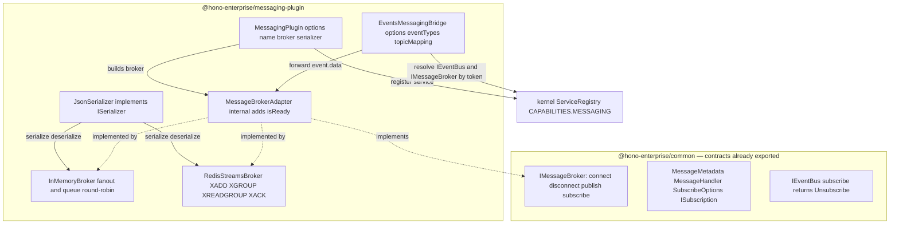

# Milestone 14 — Messaging Plugin (`@hono-enterprise/messaging-plugin`)

> **Status:** Planning. Branch to be created: `feat/m14-messaging-plugin`. `main` is protected — all
> work (implementation + fixes) stays on this one branch until it merges via a single PR.

## 0. Objective & scope

Provide the messaging capability: a message-broker abstraction for cross-service **integration
events**, registered as an `IMessageBroker` under `CAPABILITIES.MESSAGING`. Producers `publish` to a
topic; consumers `subscribe` to a topic (optionally load-balanced via a consumer-group `queue`) and
receive deserialized payloads with transport `MessageMetadata`. An optional `EventsMessagingBridge`
forwards in-process domain events from `IEventBus` onto a broker so local events become
cross-service messages without coupling the two capabilities.

This is a **single-package milestone**: `@hono-enterprise/messaging-plugin` only. The contracts it
implements — `IMessageBroker`, `ISubscription`, `MessageHandler`, `MessageMetadata`,
`SubscribeOptions` — **already exist and are already exported** from `@hono-enterprise/common`
(`packages/common/src/services/messaging.ts`, re-exported at `index.ts:109`), so `common` is **not
touched** (verified — see §1). This is the key difference from M11/M13, which had to add contracts.

**Scope is deliberately phased (user-approved, Redis-first).** M14 ships the in-memory broker, the
Redis Streams broker, the shared serializer, the plugin factory, and the bridge. The three remaining
brokers are deferred to a follow-up milestone **M14b** (RabbitMQ, NATS, Kafka) — see §9 and the
ROADMAP-deviation deliverable C7. Phasing avoids repeating the M10 failure mode (all adapters
shipped as non-functional stubs): every broker M14 ships is exercised through a real path and read
back.

Roadmap reference: `ROADMAP.md` → "Milestone 14: Messaging Plugin — Message Brokers".

- **In scope:** `MessagingPlugin` factory (multi-instance via `name`); `InMemoryBroker`;
  `RedisStreamsBroker` (ioredis, inject-or-lazy); `JsonSerializer` + `ISerializer` extension seam;
  `EventsMessagingBridge`; option types; the barrel; PUBLIC_API/ARCHITECTURE/ROADMAP/CLAUDE doc
  updates shipped in the same PR (including the M14b deferral entry, C7).
- **NOT this milestone:** RabbitMQ / NATS / Kafka brokers (deferred to M14b — C7); cross-process
  command dispatch (that is the consuming application's concern, not the broker); automatic
  dead-letter / redelivery reprocessing of the Redis Streams PEL (out of scope, §9); decorator-based
  message handling (no such decorators exist; future work on M9 primitives).

---

## 1. Contracts verified from SOURCE (not names)

Every design below is checked against the committed source. A name that was not opened is not
verified.

| Reference                              | Source                                               | What it actually is                                                                                                                                                                                                                                                                                                                                                                           |
| -------------------------------------- | ---------------------------------------------------- | --------------------------------------------------------------------------------------------------------------------------------------------------------------------------------------------------------------------------------------------------------------------------------------------------------------------------------------------------------------------------------------------- |
| `IMessageBroker`                       | `packages/common/src/services/messaging.ts:70`       | **4 methods only**: `connect(): Promise<void>`, `disconnect(): Promise<void>`, `publish<T>(topic, message): Promise<void>`, `subscribe<T>(topic, handler, options?): Promise<ISubscription>`. No `ack`, no batch, no health surface.                                                                                                                                                          |
| `MessageMetadata`                      | `packages/common/src/services/messaging.ts:14`       | `{ readonly topic: string; readonly messageId?: string; readonly timestamp?: Date; readonly headers?: Readonly<Record<string,string>> }`.                                                                                                                                                                                                                                                     |
| `MessageHandler<T>`                    | `packages/common/src/services/messaging.ts:33`       | `(message: T, metadata: MessageMetadata) => void \| Promise<void>`.                                                                                                                                                                                                                                                                                                                           |
| `SubscribeOptions`                     | `packages/common/src/services/messaging.ts:43`       | `{ readonly queue?: string }` — consumer-group / load-balanced delivery selector. The only subscribe option.                                                                                                                                                                                                                                                                                  |
| `ISubscription`                        | `packages/common/src/services/messaging.ts:53`       | `{ unsubscribe(): Promise<void> }`.                                                                                                                                                                                                                                                                                                                                                           |
| common re-exports them                 | `packages/common/src/index.ts:109-115`               | `IMessageBroker`, `ISubscription`, `MessageHandler`, `MessageMetadata`, `SubscribeOptions` are **already exported** ⇒ M14 adds nothing to `common`. Verified no implementor exists today (workspace grep).                                                                                                                                                                                    |
| `CAPABILITIES.MESSAGING`               | `packages/common/src/tokens.ts:55`                   | `'messaging'` — lowercase, no colon; valid under `createCapabilityToken`.                                                                                                                                                                                                                                                                                                                     |
| token grammar (for multi-instance)     | `packages/common/src/tokens.ts:139`                  | lowercase kebab-case, dot namespacing; **colons are illegal**. ⇒ `'messaging:<name>'` in PUBLIC_API.md is illegal; the legal form is `'messaging.<name>'`.                                                                                                                                                                                                                                    |
| `IEventBus` (bridge target)            | `packages/common/src/services/events.ts:60`          | `publish<T>(event): Promise<void>`, `publishBatch(events): Promise<void>`, `subscribe<T>(type, handler): Unsubscribe` (**sync**, returns an `Unsubscribe` function). Bridge stores the unsubscribe fn.                                                                                                                                                                                        |
| `IDomainEvent` (bridge payload)        | `packages/common/src/services/events.ts`             | has `readonly type: string` + `readonly data: T` (+ optional `aggregateId`/`version`). Bridge forwards `event.data` keyed by `event.type`.                                                                                                                                                                                                                                                    |
| duplicate-token detection              | `packages/kernel/src/registry/plugin-resolver.ts`    | two plugins advertising the same token (name **or** `provides`) throw at startup; a single plugin listing several tokens is fine. ⇒ default MessagingPlugin claims bare `'messaging'`; a named instance claims `'messaging.<name>'` and a distinct name `'messaging-plugin.<name>'`.                                                                                                          |
| dependency resolution                  | `packages/kernel/src/registry/plugin-resolver.ts`    | `dependencies`/`optionalDependencies` resolve against the provider index built from `plugin.provides` **and** `plugin.name`. ⇒ a consumer's `dependencies: ['messaging']` resolves only because MessagingPlugin `provides: ['messaging']`. The bridge's `optionalDependencies: ['events','messaging','logger']` makes it register **after** all three (so it can resolve them in `register`). |
| `IPlugin` shape                        | `packages/common/src/plugin.ts:437`                  | `name`, `version`, `dependencies?`, `optionalDependencies?`, `provides?`, `consumes?`, `priority?`, `register(ctx): void \| Promise<void>`.                                                                                                                                                                                                                                                   |
| `IPluginContext.runtime`               | `packages/common/src/plugin.ts:402`                  | Non-optional by contract (a runtime provider is mandatory and registers first). M14 uses it for `uuid()`/`now()`/`setInterval`/`clearInterval` — no `Date.now()`, no global timers (CLAUDE.md clock + runtime rules).                                                                                                                                                                         |
| `IPluginContext.health.register`       | `packages/common/src/plugin.ts:163`                  | `register(name, indicator: HealthIndicatorFn): void`. Precedent: events-plugin registers `'events'`.                                                                                                                                                                                                                                                                                          |
| `IPluginContext.lifecycle.onClose`     | `packages/common/src/plugin.ts`                      | `onClose(fn: () => void \| Promise<void>): void`. Precedent: events-plugin `bus.clear()`; M11 `backend.disconnect()`.                                                                                                                                                                                                                                                                         |
| `PLUGIN_PRIORITY.NORMAL`               | `packages/common/src/types.ts`                       | `500` — messaging is an ordinary capability plugin (precedent: events/cache use `NORMAL`).                                                                                                                                                                                                                                                                                                    |
| Precedent: lifecycle-plugin pattern    | `packages/events-plugin/src/plugin/events-plugin.ts` | Factory shape, `provides`, `priority`, service/health/onClose wiring, optional-logger resolution (`ctx.services.has('logger')` before `get`). M14 mirrors it.                                                                                                                                                                                                                                 |
| Precedent: inject-or-lazy external dep | `packages/cache-plugin/src/stores/redis-store.ts`    | `loadIoredis()` → `import('npm:ioredis@5.x')`, `validateClient()` structural check, `resolveClient(url, injected?)`. `RedisStreamsBroker` reuses this exact seam with stream commands.                                                                                                                                                                                                        |
| Plugin independence (bridge)           | AI_GUIDELINES §3.3                                   | "A plugin must never import from another plugin's internal modules … accesses other plugins' capabilities only via `ctx.services.get<T>(token)`." ⇒ the bridge resolves `IEventBus` by token; it does **not** import `events-plugin`.                                                                                                                                                         |

### 1.1 Why `common` is NOT touched

Unlike M11 (added `IResponse.snapshot`) and M13 (added `services/cqrs.ts`), every contract M14 needs
already lives in `common` and is already exported. Adding anything would be redundant surface with
no consumer. The plugin re-exports those common types for convenience (PUBLIC_API marks them as
re-exports, `common` is the owning source — same convention as events/cqrs).

---

## 2. Committed-doc conflicts — resolved HERE, shipped as named doc deliverables

(CLAUDE.md rule: when two committed documents disagree, the plan picks a side and lists the doc
correction as a PR deliverable — never silent, never inherited.)

| #  | Conflict                                                                                                                                                                                                                                                                                                                                                                                                   | Resolution (picked side)                                                                                                                                                                                                                                                                                                                                                                                                                                                                    | Doc deliverable (same PR)                                                                                                                                                                                                                                                                                                                                                                                                 |
| -- | ---------------------------------------------------------------------------------------------------------------------------------------------------------------------------------------------------------------------------------------------------------------------------------------------------------------------------------------------------------------------------------------------------------- | ------------------------------------------------------------------------------------------------------------------------------------------------------------------------------------------------------------------------------------------------------------------------------------------------------------------------------------------------------------------------------------------------------------------------------------------------------------------------------------------- | ------------------------------------------------------------------------------------------------------------------------------------------------------------------------------------------------------------------------------------------------------------------------------------------------------------------------------------------------------------------------------------------------------------------------- |
| C1 | PUBLIC_API.md `MessagingPlugin({ broker:'rabbitmq', name:'events' })` then resolves `'messaging:events'` / `'messaging:audit'` (`PUBLIC_API.md:1352-1353`). The colon form is **illegal** under `createCapabilityToken` (§1) — same defect class as M10's `database:primary`.                                                                                                                              | **Dot-namespaced tokens win.** Default instance → bare `'messaging'`; a named instance → `createCapabilityToken('messaging.<name>')` → `'messaging.<name>'`, with plugin name `'messaging-plugin.<name>'`. Multi-instance is supported via a `name` option (mirrors M11 cache-plugin). Two instances with distinct names register distinct tokens + names (no startup throw); two default instances collide (correct kernel behavior, documented).                                          | PUBLIC_API.md: rewrite the multi-instance example to `'messaging.<name>'` tokens; document the `name` option and the default-vs-named rule.                                                                                                                                                                                                                                                                               |
| C2 | ROADMAP M14 shows a single instance (`MessagingPlugin({ broker, options })`, no `name`); PUBLIC_API shows multi-instance. ARCHITECTURE §1206 Public API lists only `MessagingPlugin()` + `IMessageBroker`.                                                                                                                                                                                                 | **Ship the `name` option** (C1); the full exported surface (brokers, bridge, serializer, option types) is documented — see §4.8.                                                                                                                                                                                                                                                                                                                                                            | ARCHITECTURE.md: update the `@hono-enterprise/messaging-plugin` Public API row to the full surface; note `common` owns `IMessageBroker` (re-exported). PUBLIC_API.md: add `InMemoryBroker`, `RedisStreamsBroker`, `JsonSerializer`, `ISerializer`, `EventsMessagingBridge`, and the option types.                                                                                                                         |
| C3 | The M12 plan (`plans/archive/milestone-12-events-plugin.md` §C3/§254) stated M14's bridge would discriminate cross-service events via `event instanceof IntegrationEvent`. That would require importing `IntegrationEvent` from `events-plugin`, which violates plugin independence (§1). The archived architecture-review (`plans/archive/architecture-review.md:216`) flagged messaging↔events coupling. | **Bridge resolves by token + explicit `eventTypes` list — no events-plugin import.** The bridge resolves `IEventBus` via `ctx.services.get<IEventBus>(CAPABILITIES.EVENTS)` and subscribes to the configured `eventTypes` (the ROADMAP contract: `EventsMessagingBridge({ eventTypes, topicMapping })`), forwarding `event.data`. `IntegrationEvent` discrimination is **dropped** (it would force a cross-plugin import). This fully decouples messaging from events at the package level. | PUBLIC_API.md + ARCHITECTURE.md: document the bridge as token-resolved, `eventTypes`-driven, no events-package import. Note this supersedes the M12 `instanceof` aspiration — and that dropping it leaves M12's `IntegrationEvent` with **no in-framework consumer** (it was M12's sole stated reader); it survives only as public extension surface for application subclasses, not as a discriminator the bridge reads. |
| C4 | ARCHITECTURE.md messaging dependencies (`ARCHITECTURE.md:1205`) list `common, kernel, runtime`.                                                                                                                                                                                                                                                                                                            | **No hard package dependency on `runtime`.** `ctx.runtime` is mandatory-by-contract (always present, always registered first), so declaring it is redundant (events-plugin declares none). The plugin uses `ctx.runtime` for `uuid`/`now`/timers. Package-level deps remain `common` (types) + the kernel context surface; `ioredis` is a lazy `npm:` import (never bundled).                                                                                                               | ARCHITECTURE.md: clarify the messaging dependency note — `ctx.runtime` used but not a declared hard dep; broker clients lazy-loaded.                                                                                                                                                                                                                                                                                      |
| C5 | PUBLIC_API.md / ROADMAP examples resolve with bare strings (`ctx.services.get<IMessageBroker>('messaging')`) and read URLs via `config.get('RABBITMQ_URL')`. AI_GUIDELINES §11.2 forbids magic strings.                                                                                                                                                                                                    | **Use the `CAPABILITIES.MESSAGING` constant** in all examples. Broker URLs arrive via plugin **options** (`url`) or an **injected client** (the inject-or-lazy seam); the plugin never reads `process.env` or a config capability directly.                                                                                                                                                                                                                                                 | PUBLIC_API.md + ROADMAP.md M14 examples: `'messaging'` → `CAPABILITIES.MESSAGING`; show `url`/`client` options.                                                                                                                                                                                                                                                                                                           |
| C6 | ROADMAP M14 file list includes `rabbitmq-broker.ts`, `nats-broker.ts`, `kafka-broker.ts`. M14 (phased) ships none of these.                                                                                                                                                                                                                                                                                | **Omit the three deferred broker files in M14** (they are M14b deliverables). This is a deliberate, user-approved deviation; the ROADMAP file list is a guide, not a contract (same stance as M13 C4).                                                                                                                                                                                                                                                                                      | ROADMAP.md M14: note the three brokers are deferred (see C7). No PUBLIC_API change for the omission.                                                                                                                                                                                                                                                                                                                      |
| C7 | ROADMAP M14 Deliverables imply all five brokers ship together. M14 ships two (InMemory + Redis Streams); the other three are deferred.                                                                                                                                                                                                                                                                     | **Split the deliverables.** M14 marks InMemory, Redis Streams, the bridge, and the serializer done; RabbitMQ/NATS/Kafka move to a new **Milestone 14b** subsection in ROADMAP. When M14b lands, each broker gets the real inject/lazy + guarded-import treatment (no stubs).                                                                                                                                                                                                                | ROADMAP.md: rewrite the M14 Brokers/Deliverables to the phased split; **add a "Milestone 14b: Messaging — RabbitMQ, NATS, Kafka" subsection** transferring the three deferred brokers + their file list; mark the M14 in-scope deliverables `[x]`. CLAUDE.md "Current status": M14 → complete (PR pending), point "Next milestone" at M14b until M14b is also done.                                                       |

All corrections ship **in the same M14 PR** as code edits (never silent, never a follow-up).

---

## 3. Capability-token & plugin-name grammar (passes kernel constraints)

`createCapabilityToken` grammar: lowercase kebab-case, dot namespacing; colons are illegal (§1).
`plugin-resolver.ts` throws at startup on duplicate plugin names and duplicate capability providers.

| Instance | Tokens (`provides`)                                     | Plugin name                 |
| -------- | ------------------------------------------------------- | --------------------------- |
| default  | `CAPABILITIES.MESSAGING` (`'messaging'`)                | `'messaging-plugin'`        |
| named    | `createCapabilityToken('messaging.<name>')` → dot token | `'messaging-plugin.<name>'` |

**Multi-instance is supported via `name`.** The default instance claims the bare `'messaging'`
token; only one instance may be the default. A named instance claims a distinct dot-token and a
distinct plugin name, so multiple brokers (e.g. `'messaging.events'`, `'messaging.audit'`) coexist —
the exact PUBLIC_API scenario C1 legalizes. Two instances with the same name collide (correct kernel
throw, documented).

The bridge does **not** `provides` a capability token (it is a wiring plugin, not a service
provider); it declares `optionalDependencies: ['events', 'messaging', 'logger']` and resolves
events/messaging by token at `register` (logger optionally, for the default `errorHandler`).

---

## 4. Design decisions (each behavior a test can assert has a home here)



### 4.1 Serializer seam (shared; kills duplicated JSON logic)

`src/serializers/serializer.ts` (exported interface) + `src/serializers/json-serializer.ts`:

```typescript
export interface ISerializer {
  serialize<T>(value: T): string;
  deserialize(payload: string): unknown;
}
export class JsonSerializer implements ISerializer {
  serialize<T>(value: T): string {
    return JSON.stringify(value);
  }
  deserialize(payload: string): unknown {
    return JSON.parse(payload);
  }
}
```

- Every broker serializes the payload on `publish` and deserializes before invoking the handler
  through this one seam (CLAUDE.md: duplicated logic is a defect — route it through a shared
  helper). `ISerializer` is **exported** so consumers can supply a custom serializer (ARCHITECTURE
  §1207 extension point). The plugin injects the serializer into the chosen broker; default
  `JsonSerializer`.
- **Test home:** `json-serializer.test.ts` round-trips objects, nested values, arrays, and a
  primitive.

### 4.2 Internal broker seam (lifecycle + readiness; NOT exported from the barrel)

`src/brokers/message-broker.ts`:

```typescript
export interface MessageBrokerAdapter extends IMessageBroker {
  isReady(): boolean;
}
```

- Adds an internal `isReady()` (consumed by the health indicator + tests) that is **not** on the
  public `IMessageBroker`. `InMemoryBroker` and `RedisStreamsBroker` implement
  `MessageBrokerAdapter`. `MessagingPlugin` holds a `MessageBrokerAdapter` and reads `isReady()` for
  health. Mirrors M11's internal `CacheStore.isReady()`. Internal seam (not re-exported) so the
  readiness branch is unit-testable directly.

### 4.3 `InMemoryBroker` — fanout + load-balanced delivery (pure; the default + test backend)

- Subscribers stored as `Map<topic, Array<{ handler: MessageHandler; queue?: string; id: string }>>`
  plus a per-(topic,queue) round-robin cursor.
- **`publish(topic, message)`**: build
  `metadata = { topic, messageId: runtime.uuid(), timestamp: new Date(runtime.now()) }` (**no
  `Date.now()`** — CLAUDE.md clock rule; `runtime.now()` for the wall-clock timestamp). Partition
  the topic's subscribers by `queue`:
  - subscribers **without** a `queue` each receive the message (fanout);
  - for each distinct `queue`, deliver to **one** subscriber, round-robin (load-balanced). Handlers
    are `await`ed **sequentially in subscription order** (deterministic for tests); a handler
    rejection propagates to the `publish` caller (a local broker surfaces failures loudly, unlike
    the isolated async event bus).
- **`subscribe(topic, handler, options?)`**: push the subscriber; resolve an `ISubscription` whose
  `unsubscribe()` removes it by id.
- **`connect()`**: idempotent — flips a `#ready` flag (no-op the second time). **`disconnect()`**:
  stops all delivery, clears the subscriber map, flips `#ready` off. `isReady()` returns the flag.
- **Test home:** `in-memory-broker.test.ts` asserts fanout (no-queue subs all receive), queue
  round-robin (one of N per publish, cycling), `messageId`/`timestamp` populated, sequential
  ordering, handler rejection propagating to `publish`, idempotent `connect`, `disconnect` clears +
  `isReady` flips, and the READ-BACK round-trip (publish → handler receives the same payload).

### 4.4 `RedisStreamsBroker` — Redis Streams via ioredis (inject-or-lazy)

Reuses the M11 [`loadIoredis`](packages/cache-plugin/src/stores/redis-store.ts:18) /
`validateClient` / `resolveClient` seam, adapted to stream commands.

- **Client resolution** (`src/brokers/redis-streams-broker.ts`, internal helpers exported within the
  file for direct unit-test import, exactly like M11): prefer `options.client`; else
  `await import('npm:ioredis@5.x')` (pinned 5.x), constructing with `options.url` (default
  `redis://localhost:6379`). `validateClient()` checks the exact stream methods the broker calls —
  `xadd`, `xgroup`, `xreadgroup`, `xack`, `quit`, and `connect` when present (no duplicates).
- **`publish(topic, message)`**:
  `await client.xadd(topic, '*', 'payload', serializer.serialize(message))`. Redis assigns the entry
  id; `publish` is fire-and-forget of the returned id.
- **`subscribe(topic, handler, options?)`**:
  - consumer group = `options.queue ?? this.#defaultQueue` (the `defaultQueue` plugin option, §4.7,
    default `'messaging-consumers'` — read the field, never a hardcoded literal, or the option is
    dead); consumer name = `runtime.uuid()`.
  - Ensure the group exists: `xgroup('CREATE', topic, group, '$', 'MKSTREAM')`, swallowing a
    `BUSYGROUP` reply (group already present) — a tested branch.
  - Start a poll loop with `runtime.setInterval(pollIntervalMs, …)` (default e.g. 100 ms). Each tick
    runs **under an in-flight guard** (skip if the previous poll has not settled — prevents
    overlapping `xreadgroup` calls) and calls
    `xreadgroup('GROUP', group, consumer, 'COUNT', N, 'BLOCK', blockSizeMs, 'STREAMS', topic, '>')`.
    For each returned entry `[id, [field, value, …]]`: `deserialize(value)` → `message`, build
    `metadata = { topic, messageId: id, timestamp: <entry ts> }`,
    `await handler(message, metadata)`, then `xack(topic, group, id)` **only on success**. On a
    handler failure the broker logs (optional logger) and does **not** ack, leaving the entry in the
    pending entries list (PEL).
  - Resolve an `ISubscription` whose `unsubscribe()` calls `runtime.clearInterval(loop)` and drops
    the consumer from the broker's tracking.
- **`connect()`**: `resolveClient` + `client.connect()` (when present) + set `#ready`.
  **Idempotent.**
- **`disconnect()`**: stop every active poll loop, `client.quit()`, clear `#ready`.
- **PEL reprocessing is out of scope** (§9): M14 does not re-deliver the pending entries list
  automatically. This is a documented, tested boundary (success → ack; failure → no ack, loop
  continues).
- **Test home:** `redis-streams-broker.test.ts` drives the branching through an injected **fake
  ioredis client** (records calls, honors the stream-command shape): `publish` emits an `xadd` with
  the serialized payload; `subscribe` creates the group (and swallows BUSYGROUP); the poll loop
  deserializes and invokes the handler then `xack`s on success; on handler failure `xack` is **not**
  called and the loop continues; the in-flight guard skips a concurrent tick; `unsubscribe` stops
  the loop; `validateClient` rejects a bad shape; `resolveClient` prefers the injected client;
  connect is idempotent; `disconnect` quits. **Plus one guarded REAL-import test**
  (`await import('npm:ioredis@5.x')`, skipped when the package is absent) — a stubbed fake is never
  the only path the suite runs (M9 pino / M11 ioredis precedent).

### 4.5 `MessagingPlugin(options?)` — factory, lifecycle, health

Mirrors `packages/events-plugin/src/plugin/events-plugin.ts` + the M11 lifecycle/health pattern.

- `provides: [token]` where the token follows the named-instance rule in §3: the default instance
  uses `CAPABILITIES.MESSAGING`; a named instance uses a dot token built from its name
  (`createCapabilityToken` with a `messaging.` prefix plus the name). The plugin name mirrors it
  (`'messaging-plugin'` default, `'messaging-plugin.<name>'` named).
- `optionalDependencies: ['logger']`; resolve an optional logger via `ctx.services.has('logger')`
  before `get`.
- Select the backend from `options.broker` (`'memory'` default, `'redis-streams'`), construct it
  with the serializer (`options.serializer ?? new JsonSerializer()`), `options.url`,
  `options.client`, and the redis poll/block settings. Pass `ctx.runtime` into the broker
  (uuid/now/timers).
- **`register` is async**: `await broker.connect()` so the registered service is ready immediately
  (mirror M11; InMemory connect is a no-op). Register `IMessageBroker` under `token`.
- **Health**: `ctx.health.register(token, …)` →
  `{ status: broker.isReady() ? 'up' : 'down', data: { broker: options.broker ?? 'memory' } }`.
- **Shutdown**: `ctx.lifecycle.onClose(async () => { await broker.disconnect(); })`.
- These are asserted by §6 tests; this bullet is their design-decision home (CLAUDE.md: no test may
  assert behavior the design did not specify).

### 4.6 `EventsMessagingBridge(options)` — forwards domain events to a broker

`src/bridge/events-messaging-bridge.ts`. Returns an `IPlugin`:

```typescript
export interface EventsMessagingBridgeOptions {
  readonly eventTypes: readonly string[];
  readonly token?: string; // broker capability token, default CAPABILITIES.MESSAGING
  readonly topicMapping?: (eventType: string) => string; // default: eventType as-is
  readonly errorHandler?: (error: unknown, eventType: string) => void; // default: log via optional logger, else swallow
}
```

The bridge is **publish-only**: it subscribes to the in-process `IEventBus` and forwards each event
to `broker.publish(topic, message)`. It never calls `broker.subscribe`, and `IMessageBroker.publish`
takes no options argument — so there is **no consumer-group / `queue` option here** (a `queue` would
be dead surface: nothing could read it). Consumer-group selection is a `broker.subscribe` concern,
exercised by the broker's own `SubscribeOptions.queue`, not by this bridge.

- `optionalDependencies: ['events', 'messaging', 'logger']` (so it registers after all three).
  `provides: []`.
- In `register`: resolve `const bus = ctx.services.get<IEventBus>(CAPABILITIES.EVENTS)` and
  `const broker = ctx.services.get<IMessageBroker>(options.token ?? CAPABILITIES.MESSAGING)`. If a
  required capability is absent, **throw a clear `Error`** naming the missing capability (the user
  explicitly registered the bridge; a missing dependency is a misconfiguration, not a silent no-op).
  Tested. Resolve an optional logger via `ctx.services.has('logger')` before `get` (mirrors the
  plugin, §4.5).
- **Default error handling.** Build an effective handler once at `register`:
  `const onError = options.errorHandler ?? ((e, type) => logger?.error?.(...) )` — when
  `options.errorHandler` is omitted, the default logs via the resolved optional logger if present,
  and **swallows** otherwise (no logger, no throw). This makes the §4.7 "default logs via the
  optional logger" claim true on the real code path (docs-match-behavior). Tested under both a
  non-default `errorHandler` and the default.
- For each `eventType` in `options.eventTypes`:
  `const unsub = bus.subscribe(eventType, async (event) => {
  try { await broker.publish(options.topicMapping?.(event.type) ?? event.type, event.data); }
  catch (e) { onError(e, eventType); } })`.
  Collect the `Unsubscribe` fns.
- `ctx.lifecycle.onClose(() => { for (const u of unsubs) u(); })`.
- **READ-BACK test home** (§6): publish a domain event of a bridged type on a running app → the
  broker subscriber receives `event.data` on the mapped topic.

### 4.7 Options — every option names its consumer (no dead options)

| Option                                   | Consumer                | Behavior                                                                                                                                                                                                                                           |
| ---------------------------------------- | ----------------------- | -------------------------------------------------------------------------------------------------------------------------------------------------------------------------------------------------------------------------------------------------- |
| `broker` (`'memory' \| 'redis-streams'`) | MessagingPlugin factory | selects backend; default `'memory'`.                                                                                                                                                                                                               |
| `name`                                   | MessagingPlugin factory | derives token/plugin name (§3); default `undefined` → bare `'messaging'`.                                                                                                                                                                          |
| `serializer`                             | both brokers            | `ISerializer` (default `new JsonSerializer()`); injected into the chosen broker.                                                                                                                                                                   |
| `url`                                    | RedisStreamsBroker      | Redis URL (default `redis://localhost:6379`); consumed by `resolveClient`.                                                                                                                                                                         |
| `client`                                 | RedisStreamsBroker      | injected ioredis-compatible client (skips the lazy import); validated by `validateClient`.                                                                                                                                                         |
| `pollIntervalMs`                         | RedisStreamsBroker      | consumer poll cadence for `runtime.setInterval` (default 100).                                                                                                                                                                                     |
| `blockSizeMs`                            | RedisStreamsBroker      | `XREADGROUP BLOCK` value (default 100).                                                                                                                                                                                                            |
| `defaultQueue`                           | RedisStreamsBroker      | consumer-group fallback: `subscribe` uses `subscribeOpts.queue ?? this.#defaultQueue` (§4.4 reads the field, **not** a string literal — the option must be wired or it is dead); default `'messaging-consumers'`. Tested with a non-default value. |
| Bridge `eventTypes`                      | EventsMessagingBridge   | the domain event types to forward (required).                                                                                                                                                                                                      |
| Bridge `token`                           | EventsMessagingBridge   | which messaging token to publish to (default `CAPABILITIES.MESSAGING`); enables forwarding to a named broker.                                                                                                                                      |
| Bridge `topicMapping`                    | EventsMessagingBridge   | maps an event type to a broker topic (default identity).                                                                                                                                                                                           |
| Bridge `errorHandler`                    | EventsMessagingBridge   | invoked when a forwarding `publish` fails; default logs via the resolved optional logger if present, else swallows (§4.6). Bridge is publish-only — no `queue`/consumer-group option (would be dead surface).                                      |

(Each name is read beyond its declaration/assignment — grep will confirm during implementation.)

### 4.8 Exported surface — every symbol names its consumer

Every symbol the barrel exports, with the real code path that reads it (CLAUDE.md dead-surface
rule).

| Exported symbol                                                                                        | Kind                 | Consumer / real code path that READS it                                                                        |
| ------------------------------------------------------------------------------------------------------ | -------------------- | -------------------------------------------------------------------------------------------------------------- |
| `MessagingPlugin`                                                                                      | plugin factory       | `app.register(MessagingPlugin(...))`; §6 integration test drives publish/subscribe through a running kernel.   |
| `EventsMessagingBridge`                                                                                | plugin factory       | `app.register(EventsMessagingBridge(...))`; §6 integration + bridge tests forward a domain event to a broker.  |
| `InMemoryBroker`                                                                                       | class                | constructed by `MessagingPlugin` (`broker:'memory'`); unit tests; default backend.                             |
| `RedisStreamsBroker`                                                                                   | class                | constructed by `MessagingPlugin` (`broker:'redis-streams'`); unit tests via fake client + guarded real import. |
| `JsonSerializer`                                                                                       | class                | default serializer constructed by `MessagingPlugin` when `serializer` is omitted; unit test.                   |
| `ISerializer`                                                                                          | interface (exported) | the `serializer` option type; consumers implement custom serializers (ARCHITECTURE extension point).           |
| `MessagingPluginOptions`, `MessagingBrokerType`, `RedisStreamsOptions`, `EventsMessagingBridgeOptions` | option types         | the factory parameters (§4.7).                                                                                 |
| `IMessageBroker`, `ISubscription`, `MessageHandler`, `MessageMetadata`, `SubscribeOptions`             | re-exports (common)  | convenience only — owned by `common`; consumers implement/resolve them. PUBLIC_API marks them as re-exports.   |

Internal (NOT exported from the barrel): `MessageBrokerAdapter`, `loadIoredis`/`validateClient`/
`resolveClient` — all unit-tested by direct path import (the M11 precedent). No symbol is exported
without a consumer beyond its own test.

---

## 5. Implementation files

`packages/common` — **no changes** (contracts already committed + exported, §1.1).

| File                                    | Purpose                                                                                                                                                                                                                                                                                                                             |
| --------------------------------------- | ----------------------------------------------------------------------------------------------------------------------------------------------------------------------------------------------------------------------------------------------------------------------------------------------------------------------------------- |
| `src/index.ts`                          | Barrel: `MessagingPlugin`, `EventsMessagingBridge`, `InMemoryBroker`, `RedisStreamsBroker`, `JsonSerializer`, `ISerializer`, option types. **Type-only** re-export of `IMessageBroker`/`ISubscription`/`MessageHandler`/`MessageMetadata`/`SubscribeOptions` from common (common owns them). Replace the current `export {};` stub. |
| `src/interfaces/index.ts`               | `MessagingBrokerType`, `MessagingPluginOptions`, `RedisStreamsOptions`, `EventsMessagingBridgeOptions`, and the internal `IRedisStreamsClient` structural type (used by `validateClient`).                                                                                                                                          |
| `src/serializers/serializer.ts`         | `ISerializer` interface (exported — custom-serializer extension point).                                                                                                                                                                                                                                                             |
| `src/serializers/json-serializer.ts`    | `JsonSerializer implements ISerializer`.                                                                                                                                                                                                                                                                                            |
| `src/brokers/message-broker.ts`         | **INTERNAL** `MessageBrokerAdapter extends IMessageBroker` + `isReady()`. Not re-exported.                                                                                                                                                                                                                                          |
| `src/brokers/in-memory-broker.ts`       | `InMemoryBroker implements MessageBrokerAdapter` (fanout + queue round-robin; `runtime` uuid/now).                                                                                                                                                                                                                                  |
| `src/brokers/redis-streams-broker.ts`   | `RedisStreamsBroker implements MessageBrokerAdapter` + internal `loadIoredis`/`validateClient`/`resolveClient` (ioredis inject-or-lazy) + the `runtime.setInterval` consumer loop with in-flight guard.                                                                                                                             |
| `src/plugin/messaging-plugin.ts`        | `MessagingPlugin(options?)` factory (token/name derivation per §3; backend selection; serializer injection; async `connect` at register; service registration; health indicator; `onClose` disconnect; optional logger).                                                                                                            |
| `src/bridge/events-messaging-bridge.ts` | `EventsMessagingBridge(options)` factory (token-resolved `IEventBus` + `IMessageBroker`; `eventTypes` subscriptions; `topicMapping`; `errorHandler`; `onClose` unsubscribe; clear throw on missing capability).                                                                                                                     |
| `deno.json`                             | Already exists (`@hono-enterprise/messaging-plugin`, exports `./src/index.ts`). **No hard dep on ioredis** (lazy `npm:ioredis@5.x` import). Add nothing else.                                                                                                                                                                       |

---

## 6. Test plan (every `src/` file mapped; per-file 90% bar)

| Test file                                        | Covers                               | Key assertions (and the signature each call type-checks against)                                                                                                                                                                                                                                                                                                                                                                                                                                                                                                                                                                                                                                                                                                            |
| ------------------------------------------------ | ------------------------------------ | --------------------------------------------------------------------------------------------------------------------------------------------------------------------------------------------------------------------------------------------------------------------------------------------------------------------------------------------------------------------------------------------------------------------------------------------------------------------------------------------------------------------------------------------------------------------------------------------------------------------------------------------------------------------------------------------------------------------------------------------------------------------------- |
| `test/unit/barrel-exports.test.ts`               | `src/index.ts`                       | Runtime-asserts the **value** exports (`MessagingPlugin`, `EventsMessagingBridge`, `InMemoryBroker`, `RedisStreamsBroker`, `JsonSerializer`). The re-exported common **types** erase at runtime and cannot be asserted here — verified by `deno task check` (a type-only import fails to compile if a re-export is missing). Mirrors `events-plugin/test/unit/barrel-exports.test.ts`.                                                                                                                                                                                                                                                                                                                                                                                      |
| `test/unit/json-serializer.test.ts`              | `serializers/json-serializer.ts`     | `serialize`/`deserialize` round-trip on objects, nested values, arrays, a primitive, and a string containing JSON-special characters; non-object input handled.                                                                                                                                                                                                                                                                                                                                                                                                                                                                                                                                                                                                             |
| `test/unit/in-memory-broker.test.ts`             | `brokers/in-memory-broker.ts`        | fanout (no-queue subs all receive); queue round-robin (one of N per publish, cycling across publishes); `messageId`/`timestamp` populated (via an injected fake `IRuntimeServices`); sequential handler ordering; a handler rejection propagates to `publish`; `subscribe` returns an `ISubscription` whose `unsubscribe()` removes the sub; idempotent `connect`; `disconnect` clears subs + flips `isReady`; READ-BACK (publish a payload → handler receives the identical payload). Calls type-check against `IMessageBroker.subscribe<T>(topic, handler, options?) => Promise<ISubscription>`.                                                                                                                                                                          |
| `test/unit/redis-streams-broker.test.ts`         | `brokers/redis-streams-broker.ts`    | Drives the branching via an injected **fake ioredis client** (records calls, honors `IRedisStreamsClient`): `publish` emits `xadd(topic,'*','payload',<serialized>)`; `subscribe` issues `xgroup CREATE … MKSTREAM` and swallows a simulated `BUSYGROUP`; the poll loop `xreadgroup`s, deserializes, invokes the handler, and `xack`s on success; on a handler rejection `xack` is **not** called and the loop keeps running; the in-flight guard skips an overlapping tick; `unsubscribe` stops the loop; `validateClient` rejects a malformed client; `resolveClient` prefers `options.client`; `connect` is idempotent; `disconnect` calls `quit`. **Plus one guarded REAL-import test** (`await import('npm:ioredis@5.x')`, `it.skip`/guard when absent) mirroring M11. |
| `test/unit/messaging-plugin.test.ts`             | `plugin/messaging-plugin.ts`         | `name === 'messaging-plugin'` (default) and `'messaging-plugin.<name>'` (named); `provides` is the derived token; `priority === PLUGIN_PRIORITY.NORMAL`; `optionalDependencies` includes `'logger'`; selects `memory` vs `redis-streams` backend; injects the serializer; async `register` connects the broker, registers `IMessageBroker` under the token (READ-BACK: resolve + `publish`/`subscribe` work); health indicator registered under the token reporting `up`/`down` from `isReady()`; `onClose` calls `disconnect()`; optional logger resolved. Harness mirrors `events-plugin/test/unit/events-plugin.test.ts` (fake `IPluginContext`).                                                                                                                        |
| `test/unit/events-messaging-bridge.test.ts`      | `bridge/events-messaging-bridge.ts`  | `provides: []`, `optionalDependencies: ['events','messaging','logger']`; resolves `IEventBus` + `IMessageBroker` from a fake registry; subscribes to each `eventType`; `topicMapping` applied (default identity); a published event → `broker.publish(mappedTopic, event.data)` called (READ-BACK); a custom `errorHandler` invoked when `publish` rejects; the **default** `errorHandler` logs via an injected fake logger when present and **swallows** (no throw) when no logger is registered; **throws a clear error when events or messaging is absent**; `onClose` unsubscribes all.                                                                                                                                                                                 |
| `test/integration/messaging-integration.test.ts` | end-to-end via kernel `app.inject()` | RuntimePlugin + MessagingPlugin(`memory`) under `CAPABILITIES.MESSAGING`; a route that `broker.publish`es and a subscriber that records; assert the subscriber received the payload through the public token (READ-BACK). Then `EventsMessagingBridge` + EventsPlugin: publish a domain event of a bridged type → the broker subscriber receives `event.data` on the mapped topic (READ-BACK through two capabilities). A named-instance plugin resolves under `'messaging.<name>'`.                                                                                                                                                                                                                                                                                        |
| `test/fixtures/fake-runtime.ts`                  | integration bootstrap                | `IRuntimeServices` fake (uuid/now/hrtime/setInterval/clearInterval) so the kernel's mandatory-runtime-first check passes and brokers get a deterministic clock — mirrors existing fake-runtime fixtures. `startTime` set from the fake's `hrtime()` (monotonic), never `Date.now()` (CLAUDE.md fixture rule).                                                                                                                                                                                                                                                                                                                                                                                                                                                               |
| `test/fixtures/fake-ioredis-client.ts`           | redis-streams-broker test            | records calls + simulates `xadd`/`xgroup`/`xreadgroup`/`xack`/`quit`/`connect`, including a configurable `BUSYGROUP` and a pending/entries feed; honors `IRedisStreamsClient` (per "test doubles honor the real contract").                                                                                                                                                                                                                                                                                                                                                                                                                                                                                                                                                 |

External-dep (ioredis) coverage rule (CLAUDE.md): one guarded REAL-import test + the branching logic
around the import unit-tested via the injected-client seam (`resolveClient`/`validateClient`).
`src/interfaces/index.ts` and `src/serializers/serializer.ts` and `src/brokers/message-broker.ts`
are type-only with no runtime lines (covered transitively by usage, as in events-plugin).

---

## 7. Public API / doc deliverables (ship in same PR)

- `PUBLIC_API.md`: (C1) rewrite the multi-instance example to `'messaging.<name>'` tokens + document
  the `name` option/default rule; (C2) add `InMemoryBroker`, `RedisStreamsBroker`, `JsonSerializer`,
  `ISerializer`, `EventsMessagingBridge`, and the option types; (C3) document the bridge as
  token-resolved + `eventTypes`-driven (no events-package import), superseding the M12 `instanceof`
  aspiration; (C5) use `CAPABILITIES.MESSAGING` in examples, show `url`/`client` options. Mark the
  re-exported common types as re-exports (common owns them).
- `ARCHITECTURE.md`: (C2) update the `@hono-enterprise/messaging-plugin` Public API row to the full
  surface, note `common` ownership of `IMessageBroker`; (C4) clarify the dependency note —
  `ctx.runtime` used but not a declared hard dep, broker clients lazy-loaded.
- `ROADMAP.md`: (C6/C7) rewrite the M14 Brokers/Deliverables to the phased split — mark InMemory,
  Redis Streams, the bridge, and the serializer `[x]`; **add a "Milestone 14b: Messaging — RabbitMQ,
  NATS, Kafka" subsection** that takes the three deferred brokers + their file list and states each
  gets real inject/lazy + guarded-import tests when it lands; update the M14 code samples to
  `CAPABILITIES.MESSAGING` (C5).
- `CLAUDE.md`: flip "Current status" M14 → complete (PR pending), point "Next milestone" at M14b (in
  the PR, before merge).
- JSDoc on every new export (AI_GUIDELINES §7.2/§10.5).

---

## 8. Verification gates (must all pass; per-file 90% enforced by reading the table)

```bash
git branch --show-current   # MUST be feat/m14-messaging-plugin, never main
deno task check:plan        # this plan lints clean (required sections, no unresolved seams)
deno task fmt:check
deno task lint
deno task check
deno task test
deno task test:coverage     # read ANSI-stripped per-file table; >=90% branch/function/line every src file in messaging-plugin
```

End-of-task grep (must be empty, comments excepted):

```bash
grep -rn "new Function\|eval(\| require(\|as any\|@ts-ignore\|Date.now()\|globalThis.__" packages/messaging-plugin/src
```

---

## 9. Risks & mitigations

- **External-broker stubs that pass the gates.** Mitigation (DECIDED in §0/§4.4, the whole reason
  for phasing): M14 ships only brokers it can really exercise — `InMemoryBroker` end-to-end and
  `RedisStreamsBroker` via an injected fake that records real `xadd`/`xreadgroup`/`xack` calls plus
  one guarded real `import('npm:ioredis@5.x')`. No broker ships untested-against-its-transport. The
  three deferred brokers are an explicit M14b deliverable, not a silent gap.
- **Illegal multi-instance tokens.** Mitigation (DECIDED C1/§3): dot-namespaced `messaging.<name>`
  tokens via `createCapabilityToken`; the PUBLIC_API colon form is corrected in the same PR.
- **Monotonic clock / runtime APIs.** Mitigation (DECIDED §4.3/§4.4): `runtime.uuid()` for message
  ids, `runtime.now()` for the metadata wall-clock timestamp, `runtime.setInterval`/`clearInterval`
  for the consumer loop. No `Date.now()` and no global timers outside `packages/runtime` (the gates
  do not catch `Date.now()` — on you).
- **Overlapping consumer polls.** Mitigation (DECIDED §4.4): an in-flight guard skips a poll tick
  while the previous `xreadgroup` is unsettled; unit-tested via the fake.
- **Messages lost on handler failure (PEL).** Mitigation: ack-on-success-only leaves failures in the
  pending entries list; automatic PEL reprocessing is out of scope (§9 below) and documented, not
  silently swallowed.
- **messaging↔events coupling.** Mitigation (DECIDED C3/§4.6): the bridge resolves `IEventBus` by
  token and never imports `events-plugin`; the `instanceof IntegrationEvent` idea is dropped. The
  package stays decoupled.
- **`register` is async (connect at startup).** Mitigation: the kernel awaits each plugin's
  `register` before the next in dependency order (the bridge's `optionalDependencies` guarantee it
  registers after messaging); brokers are idempotent on `connect()` so a consumer re-call is
  harmless. Tested.

## 10. Out of scope

- **RabbitMQ, NATS, Kafka brokers** — deferred to **Milestone 14b** (C7), where each gets the real
  inject/lazy + guarded-import treatment. No stubs ship in M14.
- **Automatic PEL redelivery / dead-lettering / retry policies** — out of scope for M14; a handler
  failure leaves the Redis Streams entry in the pending entries list for manual or future-tooling
  inspection. Retry/backoff is the consuming application's concern (or a future resilience-plugin
  wrapper).
- **Decorator-based message handling** (`@MessageHandler`) — M9 ships decorator primitives only; no
  such decorators exist. A decorator registration layer is future work on those primitives.
- **Distributed transactions / exactly-once delivery** — not provided by the broker abstraction; the
  `IMessageBroker` contract is at-least-once-ish (broker-dependent) and M14 does not add
  transactional outbox semantics.
- **HTTP/server adapters** — unrelated (M39).
