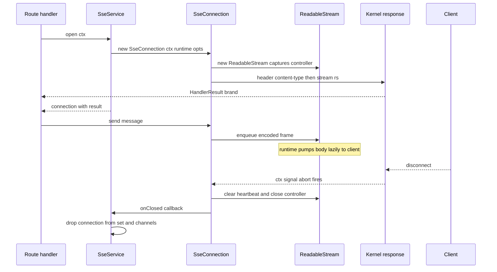

# Milestone 43 — SSE Plugin (`@hono-enterprise/sse-plugin`)

> **Status:** Planning. Branch: `feat/43-sse-plugin`. `main` is protected — all work
> (implementation + fixes) stays on this one branch until it merges via a single PR.

## 0. Objective & scope

Provide Server-Sent Events (`text/event-stream`) as a first-class, in-process capability, built
entirely on the Milestone 42 streaming primitive
([`IResponse.stream()`](packages/common/src/http.ts:169) and
[`IRequestContext.signal`](packages/common/src/http.ts:221)). The plugin owns SSE wire-format
encoding, per-connection lifecycle over a web-standard `ReadableStream`, named broadcast channels,
keep-alive heartbeats, `Last-Event-ID` resume, and bounded backpressure. A handler opens a
connection, the connection stays open after the handler returns (the runtime pumps the stream body
lazily), and the connection tears itself down on client disconnect.

- **In scope:**
  - A new `CAPABILITIES.SSE` (`'sse'`) token and the `ISseService` / `ISseConnection` / `SseChannel`
    / `SseMessage` contracts in `@hono-enterprise/common` (additive, documented in PUBLIC_API.md).
  - `SsePlugin` registering a single `SseService` under `CAPABILITIES.SSE`.
  - Pure SSE frame encoding (`id:` / `event:` / multi-line `data:` / `retry:`, blank-line
    terminator, `:` comment frames).
  - Per-connection streaming over `IResponse.stream()` with abort-driven cleanup and heartbeat.
  - Named channels with broadcast (`publish`) and auto-remove membership on disconnect.
  - `Last-Event-ID` header surfaced to the handler for resume logic.
- **NOT this milestone:**
  - WebSocket support — a separate transport, not SSE (no milestone owns it yet).
  - Cross-process / multi-instance broadcast (Redis pub-sub fan-out) — the messaging capability
    (Milestone 14) owns cross-service messaging; this plugin is in-memory, single-instance. A future
    milestone may bridge `ISseService` channels to `IMessageBroker`.
  - Per-channel authorization / authentication — the app composes auth middleware and guards
    (Milestone 16) around the SSE route; the plugin does not encode a security model.
  - HTTP/2 server push and response compression of the event stream.

## 1. Contracts verified from SOURCE (not names)

Every external reference this design leans on was opened and read; the surface cited is what the
source actually declares, not a name or memory.

| Reference                       | Source (file:line)                                                                                           | Verified surface / fact                                                                                                                                                                         |
| ------------------------------- | ------------------------------------------------------------------------------------------------------------ | ----------------------------------------------------------------------------------------------------------------------------------------------------------------------------------------------- |
| `IResponse.stream`              | [packages/common/src/http.ts:169](packages/common/src/http.ts:169)                                           | `stream(body: ReadableStream<Uint8Array>): HandlerResult` — terminal method; `@since 0.2.0` (M42).                                                                                              |
| `IRequestContext.signal`        | [packages/common/src/http.ts:221](packages/common/src/http.ts:221)                                           | `readonly signal: AbortSignal` — required; populated from the native `Request.signal` with a non-aborting sentinel fallback.                                                                    |
| `IRequest.signal`               | [packages/common/src/http.ts:58](packages/common/src/http.ts:58)                                             | `signal?: AbortSignal` — adapter-populated; optional for injected/test requests.                                                                                                                |
| `ResponseSnapshot`              | [packages/common/src/http.ts:326](packages/common/src/http.ts:326)                                           | Discriminated union keyed on `streaming`; `streaming: true` carries the live `ReadableStream<Uint8Array>`.                                                                                      |
| `HandlerResult`                 | [packages/common/src/http.ts:22](packages/common/src/http.ts:22)                                             | Opaque brand only the kernel constructs; obtained from `IResponse` terminal methods.                                                                                                            |
| `IPlugin`                       | [packages/common/src/plugin.ts:470](packages/common/src/plugin.ts:470)                                       | `name`, `version`, `dependencies?`, `optionalDependencies?`, `provides?`, `priority?`, `register(ctx): void \| Promise<void>`.                                                                  |
| `IPluginContext`                | [packages/common/src/plugin.ts:409](packages/common/src/plugin.ts:409)                                       | `services`, `runtime` (non-optional), `logger?`, `lifecycle`, `health`, `options`.                                                                                                              |
| `IServiceRegistry`              | [packages/common/src/registry.ts:66](packages/common/src/registry.ts:66)                                     | `register<T>(token, service, options?)`, `get<T>(token)`, `has(token)`, `getAll<T>(token)`; `RegisterOptions { override?, multi? }`.                                                            |
| `IRuntimeServices` timers       | [packages/common/src/runtime.ts:162](packages/common/src/runtime.ts:162)                                     | `setTimeout`/`clearTimeout`/`setInterval`/`clearInterval` returning/consuming opaque `TimerHandle` — the only sanctioned timer surface outside `packages/runtime`.                              |
| `CAPABILITIES` + token grammar  | [packages/common/src/tokens.ts:39](packages/common/src/tokens.ts:39)                                         | `CAPABILITIES` const object; `createCapabilityToken` regex `^[a-z][a-z0-9]*(?:-[a-z0-9]+)*(?:\.[a-z][a-z0-9]*(?:-[a-z0-9]+)*)*$` — `'sse'` is valid lowercase kebab-case.                       |
| `PLUGIN_PRIORITY.NORMAL`        | [packages/common/src/types.ts:84](packages/common/src/types.ts:84)                                           | `500` — the band for ordinary capability plugins (matches `EventsPlugin`).                                                                                                                      |
| Kernel `ResponseBuilder.stream` | [packages/kernel/src/context/response.ts:79](packages/kernel/src/context/response.ts:79)                     | Stores the `ReadableStream` reference, sets `#streaming = true`, returns the brand — the body is **not** consumed at terminal time, so a held controller can enqueue after the handler returns. |
| Kernel signal wiring            | [packages/kernel/src/context/request-context.ts:62](packages/kernel/src/context/request-context.ts:62)       | `const signal = request.signal ?? NEVER_ABORT_CONTROLLER.signal` — `ctx.signal` is always live.                                                                                                 |
| Runtime stream pass-through     | [packages/runtime/test/unit/fetch-mapping.test.ts:165](packages/runtime/test/unit/fetch-mapping.test.ts:165) | A `streaming: true` snapshot maps to a web `Response` whose `body` **is** the `ReadableStream`, pumped lazily as the client reads (chunk arrives before the producer closes).                   |
| `inject()` streaming limitation | [packages/kernel/src/application/application.ts:413](packages/kernel/src/application/application.ts:413)     | `body: typeof snapshot.body === 'string' ? snapshot.body : null` — `inject()` discards a streaming body and never pumps it; SSE integration tests cannot use `inject()`.                        |
| M42 socket test template        | [packages/runtime/test/integration/streaming.test.ts](packages/runtime/test/integration/streaming.test.ts)   | `app.start({ port })` + real `fetch()` + `response.body.getReader()` + `TextDecoder` + `AbortController` — the proven pattern for a real streaming round-trip and abort.                        |
| Sibling plugin convention       | [packages/events-plugin/src/plugin/events-plugin.ts](packages/events-plugin/src/plugin/events-plugin.ts)     | Factory `XxxPlugin(options?)` returning an `IPlugin` literal; optional logger resolved via `ctx.services.has('logger')`; health indicator + `onClose` cleanup.                                  |

## 2. Committed-doc conflicts — resolved here, shipped as named doc deliverables

| #  | Conflict                                                                                                                                                                                                                                                                                                                                                                   | Resolution (picked side)                             | Doc deliverable (same PR)                                                                                                                                                                                                                                                                                                                                                                                                                                          |
| -- | -------------------------------------------------------------------------------------------------------------------------------------------------------------------------------------------------------------------------------------------------------------------------------------------------------------------------------------------------------------------------- | ---------------------------------------------------- | ------------------------------------------------------------------------------------------------------------------------------------------------------------------------------------------------------------------------------------------------------------------------------------------------------------------------------------------------------------------------------------------------------------------------------------------------------------------ |
| C1 | None found (checked ROADMAP §43, PUBLIC_API.md `@hono-enterprise/common` reference + plugin sections, ARCHITECTURE.md §6/§7/§10, and the `common` source). The SSE capability is net-new — no prior committed SSE shape exists to conflict with. The ROADMAP token `CAPABILITIES.SSE = 'sse'` satisfies the grammar in [tokens.ts:139](packages/common/src/tokens.ts:139). | Net-new additive capability; no conflict to resolve. | PUBLIC_API.md extensions (required by AI_GUIDELINES §10.2 because `common` exports change): add `SSE` to the `CAPABILITIES` const listing; add a new `SSE` row to the common Types table (`ISseService`, `ISseConnection`, `SseChannel`, `SseMessage`); add a contract note describing `CAPABILITIES.SSE`; add a new top-level `## SsePlugin()` section (registration, options, usage, interface reference) mirroring the `EventsPlugin()` / `Telemetry` sections. |

## 3. Design decisions

Every behavior a planned test asserts has a decision here; each seam resolves to exactly one
mechanism.

### 3.1 Connection transport — stream held by reference, controller retained

- **Decision:** `ISseService.open(ctx)` constructs a `ReadableStream<Uint8Array>`, captures its
  `ReadableStreamDefaultController` on the connection, sets the SSE response headers, and calls
  [`ctx.response.stream(rs)`](packages/common/src/http.ts:169) to obtain the `HandlerResult`. The
  handler returns `conn.result`. The runtime later maps that snapshot to
  `new Response(streamBody, { status, headers })` and pumps the body lazily, so the connection keeps
  enqueuing frames **after** the handler returns. This is sound because
  [`ResponseBuilder.stream`](packages/kernel/src/context/response.ts:79) stores the stream reference
  without consuming it.
- **Why:** Verified against the M42 fetch-mapping pass-through test
  ([fetch-mapping.test.ts:165](packages/runtime/test/unit/fetch-mapping.test.ts:165)) — the live
  stream becomes the `Response` body verbatim. No buffer-then-send, no per-platform write path.
- **Test home:** `sse-service.test.ts` asserts `open()` sets headers and returns a connection whose
  `result` is a `HandlerResult`; `sse-integration.test.ts` proves a frame enqueued after the handler
  returns is delivered to a real client.



### 3.2 Frame encoding — pure encoder, spec-shaped output

- **Decision:** A pure, internal function `encodeSseMessage(msg)` returns the exact wire string;
  `encodeSseComment(text)` returns a comment frame. Field order is `id:`, `event:`, `data:` (one
  `data:` line per line of the payload), `retry:`, terminated by a blank line (a trailing `\n` after
  the last field's `\n`, i.e. the event ends with `\n\n`). Omitted fields emit **no** line. `data`
  serialization: a `string` is taken literally and split on `\n` into multiple `data:` lines; any
  non-string is `JSON.stringify`-ed. `undefined` data throws `TypeError`. Comment frames are
  `: <text>\n\n`.
- **Why:** The SSE wire format is the spec-shaped output this milestone produces; asserting it
  field-by-field (present fields present, absent fields absent) is the gate that catches shape drift
  (CLAUDE.md self-review). Extracting it as a pure internal seam lets the encoder be unit-tested
  directly without a stream or server (CLAUDE.md "extract decidable logic into an internal seam").
- **Test home:** `sse-frame.test.ts` asserts each frame byte-for-byte, including absent
  `id`/`event`/ `retry` lines and multi-line `data`.

### 3.3 Lifecycle and abort cleanup — `ctx.signal` is the single disconnect signal

- **Decision:** Each connection registers
  `ctx.signal.addEventListener('abort', cleanup, { once: true })`. `cleanup` is idempotent: it
  clears the heartbeat interval via [`runtime.clearInterval`](packages/common/src/runtime.ts:182),
  closes the stream controller, marks the connection closed, and invokes the service's `onClosed`
  callback (which removes the connection from the live set and from every channel). The stream's own
  `cancel()` reason also routes to `cleanup` (covers a consumer that cancels the body reader).
- **Why:** [`ctx.signal`](packages/kernel/src/context/request-context.ts:62) is the native
  `Request.signal` forwarded by the M42 adapter and "fires reliably on client disconnect across
  every platform" (ROADMAP §43). It is the one mechanism — no hand-wired socket events.
- **Test home:** `sse-connection.test.ts` drives cleanup via an `AbortController` and asserts the
  heartbeat interval is cleared and `isOpen` flips false; `sse-integration.test.ts` aborts a real
  `fetch` and asserts no leaked interval (the leaked-timer guard from ROADMAP §43).

### 3.4 Heartbeat and advertised retry — `runtime.setInterval`, omitted disables

- **Decision:** When `heartbeatMs` is set, `open()` schedules
  [`runtime.setInterval`](packages/common/src/runtime.ts:176) writing a `: heartbeat\n\n` comment
  frame; the handle is stored and cleared in `cleanup` (§3.3). Omitting `heartbeatMs` disables the
  heartbeat entirely (no timer created). When `retryMs` is set, `open()` enqueues a single
  `retry: <ms>\n\n` frame as the first bytes on the stream, advertising the reconnect delay.
- **Why:** Keeps the connection open through proxies that close idle sockets, and gives clients a
  declared reconnect delay (the two ROADMAP §43 options, each with exactly one consumer).
- **Test home:** `sse-service.test.ts` asserts the heartbeat interval is created only when
  `heartbeatMs` is set and that `retryMs` emits the initial `retry:` frame;
  `sse-integration.test.ts` observes a heartbeat comment frame delivered over a real socket.

### 3.5 Named channels and broadcast — registry get-or-create, broadcast skips closed

- **Decision:** `SseService` owns a `ChannelRegistry` (a `Map<string, SseChannel>`). `channel(name)`
  get-or-creates a channel. A channel's `add(conn)` registers membership; `remove` and `publish` are
  the other members. `publish(msg)` iterates members and calls `conn.send(msg)`, skipping any
  connection whose `isOpen` is false (a slow/closed member never breaks a broadcast). The
  connection's `onClosed` callback (§3.3) removes it from every channel, so disconnect auto-prunes
  membership.
- **Why:** One broadcast path, no per-connection branching; closed connections are filtered at the
  one place that can know (`isOpen`).
- **Test home:** `channel-registry.test.ts` asserts broadcast reaches every member, skipped closed
  members do not throw, and `size` reflects membership.

### 3.6 Backpressure — bounded by stream HWM plus a fail-fast backlog cap

- **Decision:** The connection's `ReadableStream` uses a
  `ByteLengthQueuingStrategy({ highWaterMark: SSE_HWM_BYTES })` (internal constant, 64 KiB). Before
  each enqueue, `send`/`comment` read `controller.desiredSize`; when
  `desiredSize !== null && desiredSize < -SSE_MAX_BACKLOG_BYTES` (internal constant, 1 MiB) the
  connection calls `close()` and drops the frame (fail-fast) rather than grow unbounded memory.
- **Why:** `send` is synchronous to match the ROADMAP `conn.send({...})` API, so full async
  pull-based backpressure is not offered (offering it would force `send` to return `Promise<void>`
  and invent a pump loop the API does not need). The HWM gives natural flow control as the runtime
  drains; the backlog cap gives a hard, deterministic memory bound for a stuck client (AI_GUIDELINES
  §14.5 — no memory leaks). These are internal constants, **not** options, so there is no
  dead-option surface; the behavior is still tested directly.
- **Test home:** `sse-connection.test.ts` enqueues past the cap without a reader and asserts the
  connection closes itself and stops accepting frames.

### 3.7 Resume — `Last-Event-ID` header read on open

- **Decision:** `open()` reads `ctx.request.headers.get('last-event-id')` and exposes it as
  `conn.lastEventId` (string or `null`). The `id:` field on an outbound message sets the client's
  last event ID, which the browser sends back as `Last-Event-ID` on reconnect — the handler uses
  `conn.lastEventId` to decide where to resume.
- **Why:** Surfaces the standard resume header to handler code (ROADMAP §43) without the plugin
  inventing replay storage (out of scope, §9).
- **Test home:** `sse-service.test.ts` asserts the header value flows to `conn.lastEventId` and
  defaults to `null` when absent.

### 3.8 Single instance — one `SseService`, no per-instance name option

- **Decision:** `SsePlugin` registers exactly one `SseService` under `CAPABILITIES.SSE` and exposes
  no `name` option. Duplicate registration would throw at startup
  ([registry.ts:66](packages/common/src/registry.ts:66) without `override`/`multi`), which is the
  correct behavior for a single in-process hub.
- **Why:** A per-instance name option with no consumer is dead surface (CLAUDE.md "every option
  names its consumer"); the events-plugin made the same call.
- **Test home:** `sse-plugin.test.ts` asserts `provides: [CAPABILITIES.SSE]` and that a second
  `SsePlugin()` registration throws.

### 3.9 Plugin lifecycle — health indicator and shutdown teardown

- **Decision:** `SsePlugin.register` calls
  [`ctx.health.register`](packages/common/src/plugin.ts:187) with name `'sse'` and an indicator that
  returns `{ status: 'up', data: { connections: service.connectionCount } }` — mirroring the
  events-plugin indicator shape (`{ status, data }`) exactly. The indicator never reports `'down'`:
  an in-process SSE hub with zero connections is healthy, so `status` is always `'up'` and the live
  connection count is surfaced as `data.connections`. `register` also calls
  [`ctx.lifecycle.onClose`](packages/common/src/plugin.ts:409) with a hook that closes every live
  connection (each connection's `close()` runs the idempotent `cleanup` from §3.3, clearing its
  heartbeat and controller) and then clears the `ChannelRegistry`, so no timer or channel membership
  survives application shutdown.
- **Why:** The health indicator and shutdown hook are behaviors the §6 tests assert, so each needs a
  design-decision home here (CLAUDE.md: "Every behavior a planned test asserts needs a
  design-decision home") — and the indicator's reported shape must be pinned at plan time so the
  test asserts the documented `{ status, data: { connections } }` fields, not an improvised shape.
  The teardown is the shutdown counterpart to the per-connection abort cleanup (§3.3): abort handles
  a single client disconnect, `onClose` handles the whole hub going down.
- **Test home:** `sse-plugin.test.ts` asserts the `'sse'` indicator is registered and returns
  `{ status: 'up', data: { connections: <count> } }` reflecting open connections, and that the
  `onClose` hook closes all connections (each `isOpen` flips false, heartbeat intervals cleared) and
  empties the channel registry.

## 4. Exported surface — every symbol names its consumer

| Exported symbol                                                                                          | Kind                                | Consumer / real code path that READS it                                                                                                                                                             |
| -------------------------------------------------------------------------------------------------------- | ----------------------------------- | --------------------------------------------------------------------------------------------------------------------------------------------------------------------------------------------------- |
| `SsePlugin`                                                                                              | factory function                    | `app.register(SsePlugin({ heartbeatMs, retryMs }))` — the application entry point; builds and registers the `SseService`.                                                                           |
| `SseService`                                                                                             | class (implements `ISseService`)    | Constructed by `SsePlugin.register`; exported for custom wiring, `instanceof` checks, and direct instantiation in tests. Resolved at runtime via `ctx.services.get<ISseService>(CAPABILITIES.SSE)`. |
| `SseConnection`                                                                                          | class (implements `ISseConnection`) | Returned by `SseService.open`; exported for `instanceof` narrowing and custom construction in tests.                                                                                                |
| `ISseService`, `ISseConnection`, `SseChannel`, `SseMessage` (re-exported from `@hono-enterprise/common`) | types                               | Route handlers and consumer code: `ctx.services.get<ISseService>(CAPABILITIES.SSE)`, `const conn: ISseConnection = sse.open(ctx)`, `sse.channel('room').publish(msg)`.                              |
| `CAPABILITIES` (re-exported from `@hono-enterprise/common`)                                              | const                               | Consumers reference `CAPABILITIES.SSE` instead of the string literal (AI_GUIDELINES §11.2).                                                                                                         |

Internal (NOT exported from `src/index.ts`, tested directly via relative import): the frame encoder
in `src/utils/sse-frame.ts`, the `ChannelRegistry` and `SseChannel` implementation in
`src/channels/channel-registry.ts`, and `SsePluginOptions` lives in `src/interfaces/index.ts`.

### 4.1 Options — every option names its consumer

| Option                 | Consumer                                          | Behavior (per implementation)                                                                                                            |
| ---------------------- | ------------------------------------------------- | ---------------------------------------------------------------------------------------------------------------------------------------- |
| `heartbeatMs?: number` | `SseService.open` → `runtime.setInterval` (§3.4)  | When set, schedules a repeating `: heartbeat` comment frame at this interval; cleared on disconnect. Omit to disable (no timer created). |
| `retryMs?: number`     | `SseService.open` → initial `retry:` frame (§3.4) | When set, the first bytes on every new stream are `retry: <ms>` advertising the reconnect delay. Omit to send no `retry:` field.         |

No other options. Backpressure constants (`SSE_HWM_BYTES`, `SSE_MAX_BACKLOG_BYTES`) are internal and
not configurable (§3.6), so there is no dead-option surface.

## 5. Implementation files

Common (additive contract change, shipped in this PR with the PUBLIC_API.md delta — C1):

| File                                                           | Purpose                                                                                                                     |
| -------------------------------------------------------------- | --------------------------------------------------------------------------------------------------------------------------- |
| [packages/common/src/tokens.ts](packages/common/src/tokens.ts) | Add `SSE: 'sse'` to the `CAPABILITIES` const (valid per the grammar at [tokens.ts:139](packages/common/src/tokens.ts:139)). |
| `packages/common/src/services/sse.ts` (new)                    | `ISseService`, `ISseConnection`, `SseChannel`, `SseMessage` contracts, with full JSDoc (`@since` tagged).                   |
| [packages/common/src/index.ts](packages/common/src/index.ts)   | Re-export the new SSE types from `./services/sse.ts`.                                                                       |

Plugin package (`@hono-enterprise/sse-plugin`, version `0.1.0`, minimal `deno.json` matching the
events-plugin shape):

| File                               | Purpose                                                                                                                                                                                                                                                                                                                                                                                           |
| ---------------------------------- | ------------------------------------------------------------------------------------------------------------------------------------------------------------------------------------------------------------------------------------------------------------------------------------------------------------------------------------------------------------------------------------------------- |
| `src/plugin/sse-plugin.ts`         | `SsePlugin(options?)` factory → `IPlugin` (`name: 'sse-plugin'`, `version: '0.1.0'`, `optionalDependencies: ['logger']`, `provides: [CAPABILITIES.SSE]`, `priority: PLUGIN_PRIORITY.NORMAL`); async `register` resolves runtime + optional logger, builds `SseService`, registers it, registers the `sse` health indicator, and wires `onClose` to close every connection and clear the registry. |
| `src/services/sse-service.ts`      | `SseService` implements `ISseService`: `open(ctx)`, `channel(name)`, `connectionCount`; owns the live connection set and the `ChannelRegistry`; passes an `onClosed` callback into each connection.                                                                                                                                                                                               |
| `src/connection/sse-connection.ts` | `SseConnection` implements `ISseConnection`: builds the `ReadableStream` + captured controller, sets SSE headers, calls `ctx.response.stream(rs)`, exposes `result`/`id`/`lastEventId`/`isOpen`; `send`/`comment`/`close`; heartbeat via `runtime.setInterval`; abort + stream-`cancel` cleanup (§3.3); backpressure guard (§3.6).                                                                |
| `src/channels/channel-registry.ts` | `ChannelRegistry` (name → channel map, `size`, `removeFromAll`, `clear`) and the `SseChannel` implementation (`add`/`remove`/`size`/`publish` skipping closed members).                                                                                                                                                                                                                           |
| `src/utils/sse-frame.ts`           | Pure `encodeSseMessage(msg)` and `encodeSseComment(text)` (§3.2). Internal seam, not exported from the barrel.                                                                                                                                                                                                                                                                                    |
| `src/interfaces/index.ts`          | `SsePluginOptions` type (`heartbeatMs?`, `retryMs?`).                                                                                                                                                                                                                                                                                                                                             |
| `src/index.ts`                     | Barrel: exports `SsePlugin`, `SseService`, `SseConnection`; re-exports `ISseService`, `ISseConnection`, `SseChannel`, `SseMessage`, `CAPABILITIES` from `@hono-enterprise/common`.                                                                                                                                                                                                                |

The `src/utils/sse-frame.ts` file is a deliberate, justified addition beyond the literal ROADMAP §43
file list: extracting the pure encoder into its own internal seam is what makes the spec-shaped wire
format unit-testable field-by-field (CLAUDE.md "extract decidable logic into an internal seam"). It
is not exported from `src/index.ts`.

## 6. Test plan (every `src/` file mapped; per-file 90% bar)

Tests use `@std/testing/bdd` (`describe`/`it`) + `@std/expect` (`expect`), in
`test/{unit,integration}/` per package (CLAUDE.md key conventions). Unit tests inject a fake
`IRuntimeServices` (timers) and a fake request context so timer/abort/backpressure branches are
exercised deterministically; the integration test uses a real socket.

| Test file                                                        | src covered                                 | Key assertions (and the signature each call type-checks against)                                                                                                                                                                                                                                                                                                                                                                                                                                                             |
| ---------------------------------------------------------------- | ------------------------------------------- | ---------------------------------------------------------------------------------------------------------------------------------------------------------------------------------------------------------------------------------------------------------------------------------------------------------------------------------------------------------------------------------------------------------------------------------------------------------------------------------------------------------------------------- |
| `test/unit/sse-frame.test.ts`                                    | `src/utils/sse-frame.ts`                    | `encodeSseMessage({data:'a\nb'})` → `data: a\ndata: b\n\n`; `{id:'1',event:'tick',data:{n:1}}` → `id: 1\nevent: tick\ndata: {"n":1}\n\n`; omitted `id`/`event`/`retry` produce no line; `retry:7` line present only when set; `encodeSseComment('heartbeat')` → `: heartbeat\n\n`; `data: undefined` throws `TypeError`.                                                                                                                                                                                                     |
| `test/unit/sse-connection.test.ts`                               | `src/connection/sse-connection.ts`          | `send(msg)` enqueues the encoded frame into the captured stream (read back via a `getReader()`); `close()` closes the controller, clears the heartbeat interval (fake-runtime records `clearInterval`), and flips `isOpen` false; aborting the context `AbortController` triggers cleanup and is idempotent; backpressure: enqueuing past `SSE_MAX_BACKLOG_BYTES` with no reader closes the connection and subsequent `send` is a no-op; `result` is a `HandlerResult`.                                                      |
| `test/unit/channel-registry.test.ts`                             | `src/channels/channel-registry.ts`          | `publish(msg)` invokes `send` on every member; a closed member is skipped and does not throw; `add`/`remove` update `size`; `removeFromAll(conn)` prunes a connection from every channel.                                                                                                                                                                                                                                                                                                                                    |
| `test/unit/sse-service.test.ts`                                  | `src/services/sse-service.ts`               | `open(ctx)` sets `content-type: text/event-stream` + `cache-control: no-cache` and returns a connection whose `result` is a `HandlerResult`; `conn.lastEventId` equals the `last-event-id` header and is `null` when absent; `heartbeatMs` set → a heartbeat interval is created, unset → none; `retryMs` set → the first enqueued frame is `retry: <ms>`; `channel('x')` is get-or-create; `connectionCount` tracks opens/closes; `onClosed` removes the connection from the set and channels.                              |
| `test/unit/sse-plugin.test.ts`                                   | `src/plugin/sse-plugin.ts`                  | Plugin has `name 'sse-plugin'`, `version '0.1.0'`, `provides: [CAPABILITIES.SSE]`, `priority 500`; `register` registers `ISseService` under `CAPABILITIES.SSE` and a `sse` health indicator returning `{ status: 'up', data: { connections } }` reflecting the open-connection count (§3.9); a second `SsePlugin()` registration throws; `onClose` closes all connections (each `isOpen` false, heartbeat cleared) and clears the registry (§3.9); logger is optional (resolved only when `ctx.services.has('logger')`).     |
| `test/unit/barrel-exports.test.ts`                               | `src/index.ts`, `src/interfaces/index.ts`   | Every named export (`SsePlugin`, `SseService`, `SseConnection`) and re-exported type (`ISseService`, `ISseConnection`, `SseChannel`, `SseMessage`, `CAPABILITIES`) is present; `SsePluginOptions` is exported as a type. Mirrors the events-plugin barrel-exports test.                                                                                                                                                                                                                                                      |
| `test/integration/sse-integration.test.ts`                       | end-to-end through kernel + runtime adapter | Following the M42 template ([streaming.test.ts](packages/runtime/test/integration/streaming.test.ts)): `app.start({ port })` + real `fetch('/events')` + `response.body.getReader()` + `TextDecoder` asserts a frame enqueued after the handler returns is delivered; a channel broadcast reaches two real clients; the `Last-Event-ID` request header is echoed in resume logic; aborting the `fetch` `AbortController` stops the heartbeat with no leaked interval; a heartbeat comment frame is observed over the socket. |
| `test/fixtures/fake-runtime.ts`, `test/fixtures/fake-context.ts` | (test fixtures, excluded from coverage)     | `createFakeRuntime()` provides controllable `setInterval`/`clearInterval` (records handles so cleanup is assertable) mirroring the events-plugin fixture; `createFakeContext()` builds an `IRequestContext` with a real response builder, a controllable `AbortController.signal`, and settable headers.                                                                                                                                                                                                                     |

Forbidden-construct grep (must be empty, comments excepted), run end-of-task:

```bash
grep -rn "new Function\|eval(\| require(\|as any\|@ts-ignore\|Date.now()\|globalThis.__" packages/sse-plugin/src packages/common/src/services/sse.ts
```

`Date.now()` is a runtime-API / clock-mixing smell outside `packages/runtime`; the plugin takes all
time and timers through `IRuntimeServices`. `TextEncoder` is a web-standard global uniform across
Node, Deno, Bun, and Workers, so it is used directly (it is not in the AI_GUIDELINES §4.2 list of
runtime-specific operations that must be abstracted).

## 7. Verification gates

```bash
git branch --show-current   # MUST be feat/43-sse-plugin, never main
deno task check:plan        # this plan lints clean
deno task fmt:check
deno task lint
deno task check
deno task test
deno task test:coverage     # read ANSI-stripped per-file table; ≥90% branch/function/line every src file in sse-plugin, plus packages/common/src/services/sse.ts
```

## 8. Risks & mitigations

- **Leaked heartbeat intervals on disconnect** → the only disconnect signal is
  [`ctx.signal`](packages/kernel/src/context/request-context.ts:62); `cleanup` (§3.3) clears the
  interval and is idempotent, and the integration test asserts no interval survives an aborted
  `fetch`.
- **Cloudflare Workers streaming/duration limits** → long-lived `text/event-stream` responses on
  Workers are bounded by the platform's limits and are not equivalent to a Node long-lived socket
  (ROADMAP §43 caveat). The plugin opens the stream the same way everywhere via `app.fetch`; the
  limit is a platform constraint, not a plugin defect, and is documented in PUBLIC_API.md. No code
  path assumes an indefinite connection.
- **`inject()` cannot read SSE bodies** → `inject()` discards streaming bodies
  ([application.ts:413](packages/kernel/src/application/application.ts:413)); the integration test
  uses the real-socket path (§6), never `inject()`, for any assertion that reads frames.
- **Unbounded memory on a slow client** → bounded by the stream HWM plus the fail-fast backlog cap
  (§3.6); a stuck client is closed, not buffered indefinitely.
- **Double cleanup (abort plus stream `cancel`)** → `cleanup` is guarded by an `isOpen` flag so
  clearing the interval and closing the controller happen exactly once.

## 9. Out of scope

- WebSocket transport (separate milestone; SSE is one-way server-to-client over HTTP).
- Cross-process / multi-instance channel fan-out (Redis pub-sub) — owned by the messaging capability
  (Milestone 14); a future milestone may bridge `SseChannel` to `IMessageBroker`.
- Server-side event replay storage — the plugin surfaces `Last-Event-ID` for the handler to resume;
  it does not store or replay missed events.
- Per-channel authentication — composed by the application via auth middleware and guards
  (Milestone 16) around the SSE route.
- HTTP/2 server push and response compression of the event stream.
