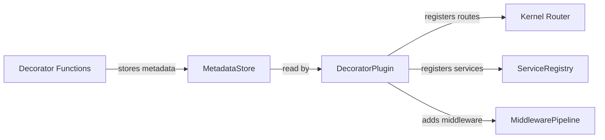

# Milestone 9: Decorator Plugin — Optional Decorators and Reflection

## Overview

**Objective:** Provide an optional decorator system for developers who prefer NestJS-style DX. All
decorators are **syntactic sugar** over the programmatic API — the framework works identically
without them.

**Package:** `@hono-enterprise/decorator-plugin` **Dependencies:** `@hono-enterprise/common`,
`@hono-enterprise/kernel` **Branch:** `feat/m9-decorator-plugin`

## Architecture



### How Decorators Work

1. **Decorator execution** — When a class/method/parameter is decorated, the decorator function
   stores metadata in the `MetadataStore` (plain `Map`, not `WeakMap`).
2. **Metadata storage** — Metadata is keyed by class reference. No reflection is used.
3. **DecoratorPlugin registration** — When `DecoratorPlugin` is registered, it scans the
   `MetadataStore` for decorated classes.
4. **Kernel registration** — The plugin calls the kernel's programmatic API (`ctx.router`,
   `ctx.services`, `ctx.middleware`) to register routes, services, and middleware from the metadata.

### Key Design Decisions

- **No reflection required** — Metadata is stored explicitly in plain objects, not via
  `Reflect.getMetadata()`. This means no `reflect-metadata` polyfill dependency.
- **Decorators are inert without DecoratorPlugin** — If the plugin is not registered, decorators
  store metadata that is never read. The application works identically.
- **Programmatic API equivalence** — Every decorator has a 1:1 programmatic equivalent. Decorators
  never add capabilities that don't already exist.
- **MetadataStore keyed by `Constructor`** — Uses `Map<Constructor, Metadata>` from `IMetadataStore`
  in `@hono-enterprise/common`.

---

## File Structure

```
packages/decorator-plugin/
├── deno.json                          # JSR metadata, exports, dependencies
├── src/
│   ├── index.ts                       # Barrel exports (public API)
│   ├── plugin/
│   │   └── decorator-plugin.ts        # DecoratorPlugin factory + options
│   ├── metadata/
│   │   └── metadata-store.ts          # MetadataStore implementation
│   ├── decorators/
│   │   ├── controller.ts              # @Controller, @Version
│   │   ├── http.ts                    # @Get, @Post, @Put, @Patch, @Delete, @Head, @Options
│   │   ├── injection.ts               # @Injectable, @Inject
│   │   ├── request.ts                 # @Body, @Query, @Param, @Header, @Cookie
│   │   ├── security.ts                # @Roles, @Permissions, @CurrentUser, @Public
│   │   ├── pipeline.ts                # @UseGuards, @UseInterceptors, @UseFilters
│   │   ├── validation.ts              # @ValidateBody, @ValidateQuery
│   │   └── openapi.ts                 # @ApiTags, @ApiOperation, @ApiResponse
│   ├── discovery/
│   │   └── controller-discovery.ts    # Auto-discovery of decorated classes
│   └── resolvers/
│       └── parameter-resolver.ts      # Resolves @Body, @Query, @Param at runtime
├── test/
│   ├── fixtures/
│   │   └── fake-context.ts            # Fake IPluginContext for tests
│   ├── unit/
│   │   ├── metadata-store.test.ts
│   │   ├── controller-decorators.test.ts
│   │   ├── http-decorators.test.ts
│   │   ├── injection-decorators.test.ts
│   │   ├── request-decorators.test.ts
│   │   ├── security-decorators.test.ts
│   │   ├── pipeline-decorators.test.ts
│   │   ├── validation-decorators.test.ts
│   │   ├── openapi-decorators.test.ts
│   │   ├── parameter-resolver.test.ts
│   │   └── create-decorator.test.ts
│   ├── integration/
│   │   └── decorator-plugin.test.ts   # Plugin registration, route discovery
│   └── e2e/
│       └── decorator-application.test.ts  # Full decorator-driven app
└── README.md
```

---

## Implementation Details

### 1. MetadataStore (`src/metadata/metadata-store.ts`)

The `IMetadataStore` from `@hono-enterprise/common` uses `Map<Constructor, ...>`. The kernel's
`IPluginContext` resolves `ctx.metadata` lazily via `CAPABILITIES.METADATA_STORE` (see
[`application.ts`](packages/kernel/src/application/application.ts:223)). The DecoratorPlugin must
register its `MetadataStore` under that token.

**Internal metadata shapes** (implementation detail — NOT exported from `index.ts`):

```typescript
// Controller metadata stored per class
interface ControllerMetadata {
  path: string;
  version?: string;
  middleware: MiddlewareFunction[];
  guards: string[];
  interceptors: string[];
}

// Route metadata stored per controller class
interface RouteMetadata {
  path: string;
  method: HttpMethod;
  handler: string; // method name on the controller
  params: ParameterMetadata[];
  middleware: MiddlewareFunction[];
  guards: string[];
  interceptors: string[];
  filters: string[];
  schema?: {
    body?: unknown;
    query?: unknown;
    params?: unknown;
  };
  openapi?: {
    operationId?: string;
    summary?: string;
    description?: string;
    responses?: Record<string, unknown>;
    tags?: string[];
  };
  isPublic?: boolean; // @Public decorator flag
  roles?: string[]; // @Roles decorator
  permissions?: string[]; // @Permissions decorator
}

// Parameter metadata
interface ParameterMetadata {
  index: number;
  type: 'body' | 'query' | 'param' | 'header' | 'cookie' | 'custom';
  name?: string; // for @Query('name'), @Param('id'), etc.
  customType?: string; // for custom parameter decorators
}

// Service metadata stored per class
interface ServiceMetadata {
  scope?: ServiceScope; // 'singleton' | 'scoped' | 'transient'
  inject?: string[]; // constructor injection tokens from @Inject
  token?: string; // capability token to register under
}
```

Implements `IMetadataStore` from `@hono-enterprise/common`:

```typescript
interface IMetadataStore {
  readonly controllers: Map<Constructor, Readonly<Record<string, unknown>>>;
  readonly services: Map<Constructor, Readonly<Record<string, unknown>>>;
  readonly routes: Map<Constructor, ReadonlyArray<Readonly<Record<string, unknown>>>>;
}
```

**Responsibilities:**

- Internal metadata storage using plain `Map` objects
- Methods: `storeController()`, `storeService()`, `storeRoute()`, `storeParam()`
- Methods: `getController()`, `getService()`, `getRoutes()`, `getParams()`
- `clear()` for testing
- `hasController()`, `hasService()` existence checks

**Internal metadata shapes** (not exported; implementation detail):

```typescript
// Controller metadata stored per class
interface ControllerMetadata {
  path: string;
  version?: string;
  middleware: MiddlewareFunction[];
  guards: string[];
  interceptors: string[];
}

// Route metadata stored per controller class
interface RouteMetadata {
  path: string;
  method: HttpMethod;
  handler: string; // method name on the controller
  params: ParameterMetadata[];
  middleware: MiddlewareFunction[];
  guards: string[];
  interceptors: string[];
  filters: string[];
  schema?: {
    body?: unknown;
    query?: unknown;
    params?: unknown;
  };
  openapi?: {
    operationId?: string;
    summary?: string;
    description?: string;
    responses?: Record<string, unknown>;
    tags?: string[];
  };
}

// Parameter metadata
interface ParameterMetadata {
  index: number;
  type: 'body' | 'query' | 'param' | 'header' | 'cookie' | 'custom';
  name?: string; // for @Query('name'), @Param('id'), etc.
  customType?: string; // for custom parameter decorators
}
```

### 2. DecoratorPlugin (`src/plugin/decorator-plugin.ts`)

**Options:**

```typescript
interface DecoratorPluginOptions {
  /** Auto-scan for decorated classes in the specified path */
  readonly autoDiscover?: boolean;
  /** Glob path for controller discovery (used when autoDiscover: true) */
  readonly controllersPath?: string;
  /** Explicit list of controller classes to register */
  readonly controllers?: Constructor[];
  /** Explicit list of service classes to register */
  readonly services?: Constructor[];
}
```

**Registration flow:**

1. Create `MetadataStore` instance
2. Register it under `CAPABILITIES.METADATA_STORE` (if such token exists) and expose via
   `ctx.metadata`
3. On `onBootstrap` lifecycle hook, discover decorated classes
4. For each controller: instantiate (via DI container if available, else `new`), register routes
   with `ctx.router`
5. For each service: register with `ctx.services` or `ctx.container`
6. Middleware/guards/filters from decorator metadata are applied per-route

### 3. Controller Decorators (`src/decorators/controller.ts`)

**Purpose:** Mark classes as controllers and declare a base path prefix.

**Signatures:**

````typescript
/**
 * Marks a class as a controller and assigns a base path.
 *
 * @param path - Base path prefix for all routes in this controller
 * @returns Class decorator factory
 * @example
 * ```typescript
 * @Controller('/users')
 * class UserController { /* ... */ }
 * ```
 */
export function Controller(path: string): ClassDecorator;

/**
 * Assigns an API version prefix to a controller. Combined with @Controller,
 * the effective path is `${version}${path}` (e.g., `/api/v1/users`).
 *
 * @param version - Version prefix (e.g., `'v1'`, `'api/v1'`)
 * @returns Class decorator factory
 */
export function Version(version: string): ClassDecorator;
````

**Storage:** `storeController(target, { path, version?, middleware: [], guards: [] })`

**Kernel Integration:** At registration time, the DecoratorPlugin iterates the controller's stored
routes and registers each with `ctx.router.<method>(joinedPath, routeDef)` where
`joinedPath = baseVersion + basePath + routePath`.

---

### 4. HTTP Method Decorators (`src/decorators/http.ts`)

**Purpose:** Declare route handlers on controller methods.

**Signatures:**

```typescript
export type HttpMethodDecorator = (path?: string) => MethodDecorator;

/** Registers a GET route on the decorated method. */
export const Get: HttpMethodDecorator;
/** Registers a POST route on the decorated method. */
export const Post: HttpMethodDecorator;
/** Registers a PUT route on the decorated method. */
export const Put: HttpMethodDecorator;
/** Registers a PATCH route on the decorated method. */
export const Patch: HttpMethodDecorator;
/** Registers a DELETE route on the decorated method. */
export const Delete: HttpMethodDecorator;
/** Registers a HEAD route on the decorated method. */
export const Head: HttpMethodDecorator;
/** Registers an OPTIONS route on the decorated method. */
export const Options: HttpMethodDecorator;
```

**Internal implementation pattern:**

```typescript
function createMethodDecorator(method: HttpMethod): HttpMethodDecorator {
  return (path?: string): MethodDecorator => {
    return (_target, propertyKey, descriptor) => {
      storeRoute(_target.constructor, {
        path: path ?? '',
        method,
        handler: String(propertyKey),
        params: [],
        middleware: [],
        guards: [],
        interceptors: [],
        filters: [],
      });
      return descriptor;
    };
  };
}
export const Get = createMethodDecorator('GET');
// ... same for Post, Put, Patch, Delete, Head, Options
```

**Storage:** `storeRoute(controllerClass, routeMetadata)` — appends to the route list. Multiple HTTP
decorators on the same method produce multiple route entries.

**Kernel Integration:** For each route, the plugin builds a `RouteDefinition` with a handler wrapper
that resolves decorator parameters before calling the original method. Middleware from controller +
route levels are merged.

---

### 5. Injection Decorators (`src/decorators/injection.ts`)

**Purpose:** Mark services for DI container registration and declare constructor injection tokens.

**Signatures:**

```typescript
/**
 * Marks a class as injectable (eligible for DI container registration).
 *
 * @param options - Optional DI scope and token
 * @returns Class decorator factory
 */
export function Injectable(options?: {
  readonly scope?: ServiceScope;
  readonly token?: string;
}): ClassDecorator;

/**
 * Declares constructor parameter injection tokens.
 *
 * @param tokens - Capability tokens to inject, in constructor argument order
 * @returns Class decorator factory
 */
export function Inject(...tokens: string[]): ClassDecorator;
```

**Storage:** `storeService(target, { scope, token, inject })`

**Kernel Integration:**

- If `ctx.container` exists: `ctx.container.register(token, { useClass: target, inject })`
- Otherwise: instantiate via `new target(...resolvedDeps)`, resolving deps from
  `ctx.services.get(token)`

---

### 6. Request Parameter Decorators (`src/decorators/request.ts`)

**Purpose:** Extract values from the `IRequestContext` and inject them as handler arguments.

**Signatures:**

```typescript
export function Body(): ParameterDecorator;
export function Query(name?: string): ParameterDecorator;
export function Param(name: string): ParameterDecorator;
export function Header(name: string): ParameterDecorator;
export function Cookie(name: string): ParameterDecorator;
```

**Storage:** `storeParam(controllerClass, methodName, { index, type, name? })`

**Kernel Integration:** The `ParameterResolver` builds an argument array before calling the handler:

```typescript
function resolveParams(ctx: IRequestContext, params: ParameterMetadata[]): unknown[] {
  const args: unknown[] = [];
  for (const p of params) {
    switch (p.type) {
      case 'body':
        args.push(ctx.request.json());
        break;
      case 'query':
        args.push(p.name ? ctx.query[p.name] : ctx.query);
        break;
      case 'param':
        args.push(ctx.params[p.name!]);
        break;
      case 'header':
        args.push(ctx.request.headers.get(p.name!));
        break;
      case 'cookie':
        args.push(parseCookie(ctx.request.headers, p.name!));
        break;
      case 'custom': /* look up CAPABILITIES.DECORATOR_HANDLER */
        break;
    }
  }
  return args;
}
```

---

### 7. Security Decorators (`src/decorators/security.ts`)

**Purpose:** Declare authorization requirements and extract the authenticated user.

**Signatures:**

```typescript
export function Roles(...roles: string[]): ClassDecorator & MethodDecorator;
export function Permissions(...permissions: string[]): ClassDecorator & MethodDecorator;
export function CurrentUser(): ParameterDecorator;
export function Public(): MethodDecorator;
```

**Storage:** `@Roles`/`@Permissions`/`@Public` append to `RouteMetadata` or `ControllerMetadata`.
`@CurrentUser` stores `ParameterMetadata` with `type: 'custom'`, `customType: 'current-user'`.

**Kernel Integration:** Security metadata is stored but NOT enforced by the decorator plugin.
Enforcement is the responsibility of guard middleware registered by the auth plugin.

---

### 8. Pipeline Decorators (`src/decorators/pipeline.ts`)

**Purpose:** Add middleware, guards, interceptors, and error filters to routes.

**Signatures:**

```typescript
export function UseGuards(
  ...middlewares: (MiddlewareFunction | { new (): IMiddleware })[]
): ClassDecorator & MethodDecorator;

export function UseInterceptors(
  ...interceptors: (MiddlewareFunction | { new (): IMiddleware })[]
): ClassDecorator & MethodDecorator;

export function UseFilters(
  ...filters: MiddlewareFunction[]
): ClassDecorator & MethodDecorator;
```

**Storage:** Class decorators append to `ControllerMetadata.middleware`; method decorators append to
`RouteMetadata.middleware`.

**Kernel Integration:** Middleware from controller and route levels are merged:

```typescript
const allMiddleware = [...controllerMetadata.middleware, ...routeMetadata.middleware];
```

---

### 9. Validation Decorators (`src/decorators/validation.ts`)

**Purpose:** Attach validation schemas to routes. Delegates to the ValidationPlugin when present.

**Signatures:**

```typescript
export function ValidateBody(schema: unknown): MethodDecorator;
export function ValidateQuery(schema: unknown): MethodDecorator;
export function ValidateParams(schema: unknown): MethodDecorator;
```

**Storage:** Stored in `RouteMetadata.schema.body`, `.query`, `.params`.

**Kernel Integration:** Schema is attached to the `RouteDefinition.schema`. When the
ValidationPlugin is registered, it reads `RouteDefinition.schema` and generates validation
middleware. Without the ValidationPlugin, the schema metadata is inert.

---

### 10. OpenAPI Decorators (`src/decorators/openapi.ts`)

**Purpose:** Contribute OpenAPI specification metadata.

**Signatures:**

```typescript
export function ApiTags(...tags: string[]): ClassDecorator;

export function ApiOperation(config: {
  readonly operationId?: string;
  readonly summary?: string;
  readonly description?: string;
}): MethodDecorator;

export function ApiResponse(config: {
  readonly status: number;
  readonly description?: string;
  readonly schema?: unknown;
}): MethodDecorator;
```

**Storage:** Stored in `RouteMetadata.openapi` and `ControllerMetadata` for tags.

**Kernel Integration:** Metadata is stored for consumption by the OpenAPIPlugin. The decorator
plugin does NOT call `ctx.openapi` directly.

---

### 11. Custom Decorator Factory

**Purpose:** Allow consumers to create their own decorators that integrate with the framework.

**Signatures:**

```typescript
/**
 * Creates a custom class or method decorator that stores metadata readable
 * by the DecoratorPlugin and custom decorator handlers.
 *
 * @param name - Unique decorator name (convention: `plugin-name:decorator`)
 * @param metadata - Arbitrary metadata payload
 * @returns Class or method decorator
 */
export function createDecorator(
  name: string,
  metadata: Record<string, unknown>,
): ClassDecorator & MethodDecorator;

/**
 * Creates a custom parameter decorator that stores metadata for the
 * ParameterResolver.
 *
 * @param name - Unique parameter decorator type name
 * @param metadata - Optional metadata payload
 * @returns Parameter decorator
 */
export function createParameterDecorator(
  name: string,
  metadata?: Record<string, unknown>,
): ParameterDecorator;
```

**Kernel Integration:** `createDecorator` stores metadata on the controller/route.
`createParameterDecorator` stores `ParameterMetadata` with `type: 'custom'` and `customType: name`.
The DecoratorPlugin looks up custom decorator handlers from `CAPABILITIES.DECORATOR_HANDLER`.

### 12. ControllerDiscovery (`src/discovery/controller-discovery.ts`)

**Purpose:** Auto-discover decorated controller and service classes from the file system,
eliminating the need for manual class lists.

**Design Constraints:**

- Must use `IRuntimeServices.fs` (`IFileSystem`) for all file operations — no `Deno`, `fs`, or
  `process` imports
- Must use `await import(specifier)` for dynamic module loading — no `require()`, `eval()`, or
  `new Function()`
- Must handle edge platforms where `runtime.fs` is `undefined` (graceful degradation)
- Must not crash the application if discovery fails — log warning, continue with explicit lists

#### 12.1 Discovery Modes

The DecoratorPlugin supports three mutually exclusive discovery modes (controlled by
`DecoratorPluginOptions`):

| Mode          | Option                                                     | Behavior                                                                       |
| ------------- | ---------------------------------------------------------- | ------------------------------------------------------------------------------ |
| **Explicit**  | `controllers: [ClassA, ClassB]`                            | Use the provided classes directly — no file I/O                                |
| **Auto-scan** | `autoDiscover: true, controllersPath: './src/controllers'` | Walk the directory, import `.ts`/`.js` files, scan for `@Controller` metadata  |
| **Mixed**     | Both `controllers` and `autoDiscover`                      | Merge: explicit classes + discovered classes (deduplicated by class reference) |

#### 12.2 Auto-Scan Algorithm

```
1. Resolve controllersPath to an absolute path using runtime.fs
2. Recursively walk the directory using runtime.fs.readdir() + runtime.fs.stat()
3. Filter: keep only .ts, .mts, .js, and .mjs files
4. Filter: skip files matching ignore patterns (default: */*.test.ts, */*.spec.ts, */__snapshots__/*)
5. For each remaining file:
   a. Build import specifier: `import(pathToFile)` (file:// URL for Deno, bare specifier for Node)
   b. await import(specifier) — dynamically load the module
   c. Scan the MetadataStore for any new entries added by this import
   d. If new controller metadata was found, track the class
6. Return discovered classes
```

**Implementation sketch:**

```typescript
import type { Constructor, IRuntimeServices } from '@hono-enterprise/common';

export interface DiscoveryOptions {
  /** Directory path to scan (relative or absolute) */
  readonly path: string;
  /** File extensions to include (default: ['.ts', '.mts', '.js', '.mjs']) */
  readonly extensions?: readonly string[];
  /** Glob patterns to exclude (default: ['*.test.ts', '*.spec.ts']) */
  readonly exclude?: readonly string[];
}

export interface DiscoveryResult {
  /** Discovered controller classes */
  readonly controllers: Constructor[];
  /** Discovered service classes */
  readonly services: Constructor[];
  /** Files that failed to import (with error messages) */
  readonly errors: ReadonlyArray<{ file: string; error: string }>;
}

/**
 * Discovers decorated classes by scanning a directory and importing files.
 *
 * @param options - Discovery configuration
 * @param runtime - Runtime services for file I/O
 * @returns Discovery result with controllers, services, and any import errors
 */
export async function discoverControllers(
  options: DiscoveryOptions,
  runtime: IRuntimeServices,
): Promise<DiscoveryResult> {
  // 1. Guard: runtime.fs must be available
  if (runtime.fs === undefined) {
    return {
      controllers: [],
      services: [],
      errors: [{ file: options.path, error: 'File system not available on this runtime' }],
    };
  }

  // 2. Resolve path
  const absPath = resolveAbsolutePath(options.path);

  // 3. Walk directory
  const files = await walkDirectory(absPath, runtime.fs, options);

  // 4. Import and scan
  const controllers = new Set<Constructor>();
  const services = new Set<Constructor>();
  const errors: DiscoveryResult['errors'] = [];

  for (const file of files) {
    try {
      const snapshotBefore = getMetadataSnapshot();
      const module = await import(file);
      const snapshotAfter = getMetadataSnapshot();

      // Compare snapshots to find new metadata entries
      for (const cls of snapshotAfter.newControllers) {
        controllers.add(cls);
      }
      for (const cls of snapshotAfter.newServices) {
        services.add(cls);
      }
    } catch (error) {
      errors.push({ file, error: String(error) });
    }
  }

  return {
    controllers: [...controllers],
    services: [...services],
    errors,
  };
}
```

#### 12.3 Metadata Snapshot Mechanism

To detect which classes were decorated by a specific import, we use a **snapshot-diff** approach:

```typescript
// Before import: record current set of known controllers/services
const before = {
  controllerKeys: new Set(metadataStore.controllers.keys()),
  serviceKeys: new Set(metadataStore.services.keys()),
};

await import('./some-controller.ts');

// After import: find keys that appeared
const afterControllers = [...metadataStore.controllers.keys()].filter(
  (k) => !before.controllerKeys.has(k),
);
const afterServices = [...metadataStore.services.keys()].filter(
  (k) => !before.serviceKeys.has(k),
);
```

**Why snapshot-diff instead of module introspection?**

- Modules may export controllers indirectly (re-exports, barrel files)
- A single file may define multiple decorated classes
- Decorators execute at module evaluation time, before any exports are accessed
- Snapshot-diff captures ALL decorator side effects, regardless of export patterns

#### 12.4 Directory Walking

The walker uses `IFileSystem` recursively:

```typescript
async function walkDirectory(
  dir: string,
  fs: IFileSystem,
  options: DiscoveryOptions,
): Promise<string[]> {
  const files: string[] = [];
  const entries = await fs.readdir(dir);

  for (const entry of entries) {
    const fullPath = `${dir}/${entry}`;
    const stat = await fs.stat(fullPath);

    if (stat.isDirectory) {
      // Skip hidden directories and node_modules
      if (!entry.startsWith('.') && entry !== 'node_modules') {
        const subFiles = await walkDirectory(fullPath, fs, options);
        files.push(...subFiles);
      }
    } else if (stat.isFile) {
      const ext = getFileExtension(entry);
      const excluded = matchesExclude(entry, options.exclude);

      if (ext && !excluded) {
        files.push(fullPath);
      }
    }
  }
  return files;
}
```

**Exclusions (default):**

- Files matching `*.test.ts`, `*.spec.ts`, `*.test.js`, `*.spec.js`
- Directories starting with `.` (hidden)
- `node_modules/` directory

**Rationale:** Test files import decorators but are not controllers. Including them would register
test doubles as real routes.

#### 12.5 Dynamic Import Strategy

**Deno:** Uses `file://` URLs for local imports:

```typescript
const specifier = `file://${filePath}`;
const module = await import(specifier);
```

**Node.js:** Uses `file://` URLs (ESM mode):

```typescript
const specifier = `file://${filePath}`;
const module = await import(specifier);
```

**Edge platforms:** `runtime.fs` is `undefined` — discovery returns empty result with a warning
logged via `ctx.logger`.

#### 12.6 Error Handling and Graceful Degradation

| Failure Mode                   | Behavior                                                         |
| ------------------------------ | ---------------------------------------------------------------- |
| `runtime.fs` is `undefined`    | Returns empty result; warns via logger                           |
| Directory does not exist       | Returns empty result; warns via logger                           |
| Permission denied on directory | Skips directory; warns via logger                                |
| Module import fails            | Logs error for specific file; continues with remaining files     |
| Module has syntax error        | Same as import failure — file skipped                            |
| No controllers found           | Returns empty result; no warning (user may not have controllers) |

**Critical rule:** Discovery failures MUST NOT crash the application. The DecoratorPlugin treats
discovery errors as warnings. If no controllers are discovered, the plugin still registers
successfully — it just has no routes to add.

#### 12.7 Deduplication

When explicit and auto-discovered controllers are merged, deduplication by class reference prevents
double registration:

```typescript
const allControllers = new Map<Constructor, true>();
for (const cls of explicitControllers) {
  allControllers.set(cls, true);
}
for (const cls of discoveredControllers) {
  allControllers.set(cls, true); // No-op if already present
}
const uniqueControllers = [...allControllers.keys()];
```

#### 12.8 Test Coverage

| Test                                 | Verifies                       |
| ------------------------------------ | ------------------------------ |
| Discovers controllers from directory | Basic auto-scan flow           |
| Skips test files                     | Exclusion patterns work        |
| Handles missing directory            | Graceful degradation           |
| Handles import failure               | Continues with remaining files |
| Deduplicates explicit + discovered   | Merge mode                     |
| Works without runtime.fs             | Edge platform guard            |
| Handles circular imports             | No infinite recursion          |

### 13. ParameterResolver (`src/resolvers/parameter-resolver.ts`)

- Resolves decorator metadata to actual values at request time
- Maps `ParameterMetadata` to `IRequestContext` values
- Used internally by the DecoratorPlugin when binding handler arguments

---

### 12. Decorator Composition Rules

**Purpose:** Document how multiple decorators on the same target interact, merge, and resolve — the
most complex aspect of the decorator system.

#### 12.1 TypeScript Decorator Execution Order

TypeScript executes decorators in a defined order. Our metadata store must handle this correctly:

| Target               | Execution Order                        | Example                                         |
| -------------------- | -------------------------------------- | ----------------------------------------------- |
| Class decorators     | Bottom-up (closest to class runs last) | `@A @B class X` → A runs first, B runs last     |
| Method decorators    | Bottom-up per method                   | `@A @B method()` → A runs first, B runs last    |
| Parameter decorators | Top-down by parameter index            | `f(@A a, @B b)` → A on `a` first, then B on `b` |

**Implication for our MetadataStore:** Because decorators execute bottom-up on classes, the _last_
decorator in source order is the one whose metadata is finalized. Our store uses **append-merge**
semantics — each decorator call appends to the existing arrays rather than overwriting:

```typescript
// MetadataStore.mergeController() — called by every class decorator
function mergeController(target: Constructor, partial: Partial<ControllerMetadata>): void {
  const existing = controllers.get(target) ?? defaultControllerMetadata();
  controllers.set(target, {
    ...existing,
    ...partial,
    // Arrays are merged, not replaced:
    middleware: [...(existing.middleware ?? []), ...(partial.middleware ?? [])],
    guards: [...(existing.guards ?? []), ...(partial.guards ?? [])],
    interceptors: [...(existing.interceptors ?? []), ...(partial.interceptors ?? [])],
  });
}
```

#### 12.2 Multiple HTTP Method Decorators on Same Method

A single method can have multiple HTTP decorators, producing multiple route entries:

```typescript
@Controller('/items')
class ItemController {
  @Get('/:id')
  @Head('/:id')
  async getItem(@Param('id') id: string) {/* shared handler */}
}
```

**Result:** Two routes registered:

- `GET /items/:id` → `ItemController.getItem`
- `HEAD /items/:id` → `ItemController.getItem`

**Rule:** Each HTTP method decorator stores an independent `RouteMetadata` entry. The handler,
parameter decorators, and non-route-specific metadata (validation, security, pipeline) apply to
_all_ generated routes.

#### 12.3 Parameter Decorator Index Resolution

Parameter decorators receive `parameterIndex: number` from the TypeScript `ParameterDecorator`
callback. Our store uses this index to place the metadata in the correct argument position:

```typescript
class UserController {
  @Post('/')
  async create(
    @Body() body: CreateUserDto, // parameterIndex = 0
    @CurrentUser() user: IPrincipal, // parameterIndex = 1
    @Header('x-request-id') rid: string, // parameterIndex = 2
  ) {/* ... */}
}
```

**Storage:** Three `ParameterMetadata` entries with `index: 0`, `1`, `2` respectively.

**Resolution order:** The `ParameterResolver` sorts by `index` before building the argument array,
ensuring correct positional mapping regardless of the order decorators executed.

#### 12.4 Cross-Category Decorator Merging

When decorators from different categories target the same method, metadata is merged into a single
`RouteMetadata`:

```typescript
@Controller('/users')
class UserController {
  @Post('/')
  @ValidateBody(CreateUserSchema)
  @UseGuards(JwtGuard)
  @Roles('admin')
  @ApiResponse({ status: 201, description: 'Created' })
  async create(@Body() body: CreateUserDto, @CurrentUser() user: IPrincipal) {/* ... */}
}
```

**Merged `RouteMetadata`:**

```typescript
{
  path: '/',
  method: 'POST',
  handler: 'create',
  params: [
    { index: 0, type: 'body' },
    { index: 1, type: 'custom', customType: 'current-user' },
  ],
  middleware: [JwtGuard],           // from @UseGuards
  schema: { body: CreateUserSchema }, // from @ValidateBody
  roles: ['admin'],                  // from @Roles
  openapi: {                        // from @ApiResponse
    responses: { '201': { description: 'Created' } },
  },
}
```

**Merge strategy:** Each decorator category writes to a distinct field on `RouteMetadata`. There are
no field collisions between categories — the metadata shape is a union of all category
contributions.

#### 12.5 Class-Level vs Method-Level Inheritance

Class-level decorators provide defaults that method-level decorators extend or override:

| Decorator          | Class-Level                  | Method-Level                  | Merge Rule                                         |
| ------------------ | ---------------------------- | ----------------------------- | -------------------------------------------------- |
| `@UseGuards`       | Applies to all routes        | Appends to class guards       | Class guards run first, then method guards         |
| `@UseInterceptors` | Applies to all routes        | Appends to class interceptors | Same as guards                                     |
| `@Roles`           | Default roles for all routes | Method-specific roles         | Method roles take precedence (replace class roles) |
| `@Permissions`     | Default permissions          | Method-specific               | Method permissions take precedence (replace class) |
| `@ApiTags`         | Default tags for all routes  | N/A (class only)              | Inherited by all method routes                     |
| `@Public`          | N/A (method only)            | Bypasses auth                 | Overrides class/method `@Roles`/`@Permissions`     |
| `@ValidateBody`    | N/A                          | Method-specific               | No inheritance — each method declares own schema   |

**Implementation:**

```typescript
// When building RouteDefinition for a method:
function buildRouteMetadata(
  controllerMeta: ControllerMetadata,
  routeMeta: RouteMetadata,
): RouteMetadata {
  return {
    ...routeMeta,
    // Middleware: class-level first, then method-level
    middleware: [...controllerMeta.middleware, ...routeMeta.middleware],
    interceptors: [...controllerMeta.interceptors, ...routeMeta.interceptors],
    // Security: method overrides class (not merged)
    roles: routeMeta.roles ?? controllerMeta.roles,
    permissions: routeMeta.permissions ?? controllerMeta.permissions,
    isPublic: routeMeta.isPublic ?? false,
    // OpenAPI: merge tags
    openapi: {
      tags: [...(controllerMeta.openapi?.tags ?? []), ...(routeMeta.openapi?.tags ?? [])],
      ...routeMeta.openapi,
    },
  };
}
```

#### 12.6 Decorator Conflicts and Edge Cases

| Scenario                                            | Behavior                                                                        | Test Coverage                   |
| --------------------------------------------------- | ------------------------------------------------------------------------------- | ------------------------------- |
| `@Controller` called twice on same class            | Last call wins for `path`; middleware merges                                    | `controller-decorators.test.ts` |
| `@Get` without path on method with no `@Controller` | Route path defaults to `''`                                                     | `http-decorators.test.ts`       |
| `@Param('id')` but route has no `:id` segment       | Resolves to `undefined` at runtime (no error thrown)                            | `parameter-resolver.test.ts`    |
| `@Body()` on GET route (no body expected)           | `ctx.request.json()` returns `undefined` or throws; behavior depends on request | `parameter-resolver.test.ts`    |
| `@Public()` + `@Roles('admin')` on same method      | `@Public` takes precedence — auth is bypassed                                   | `security-decorators.test.ts`   |
| `@Inject` with unknown token                        | Fails at registration time with descriptive error                               | `injection-decorators.test.ts`  |
| Multiple `@Injectable` on same class                | Last call wins for `scope`/`token`                                              | `injection-decorators.test.ts`  |

#### 12.7 Decorator Inertness Without Plugin

When the DecoratorPlugin is **not** registered:

1. Decorators still execute at class-definition time (TypeScript behavior).
2. `storeController()`, `storeRoute()`, etc. still store metadata in the `MetadataStore` singleton.
3. But the `MetadataStore` is never registered under `CAPABILITIES.METADATA_STORE`, so
   `ctx.metadata` is `undefined`.
4. No routes, services, or middleware are ever registered from decorator metadata.
5. The application behaves identically to having no decorators at all.

**This is guaranteed by design:** The decorators call internal `store*` functions that write to a
module-level singleton. The singleton exists regardless of whether the plugin is loaded. Only the
plugin's `register()` method reads from the store and calls the kernel APIs.

**Test:** `decorator-plugin.test.ts` includes a test proving that decorated controllers produce NO
routes when the plugin is absent.

```json
{
  "name": "@hono-enterprise/decorator-plugin",
  "version": "0.1.0",
  "exports": "./src/index.ts",
  "dependencies": {
    "@hono-enterprise/common": "jsr:@hono-enterprise/common@^0.1.0",
    "@hono-enterprise/kernel": "jsr:@hono-enterprise/kernel@^0.1.0"
  }
}
```

---

## Test Fixtures and Strategy

### Fixture Design Principles

Follow the established patterns from
[`packages/di-plugin/test/fixtures/fake-context.ts`](packages/di-plugin/test/fixtures/fake-context.ts)
and
[`packages/config-plugin/test/fixtures/fake-runtime.ts`](packages/config-plugin/test/fixtures/fake-runtime.ts):

1. **No runtime-specific APIs** — Fixtures use only web-standard APIs (`TextEncoder`, `Map`,
   `Headers`). No `Deno`, `process`, or `fs`.
2. **Deterministic values** — UUIDs are sequential (`test-uuid-1`, `test-uuid-2`), clocks are manual
   (`tick()`).
3. **Observable internals** — Fixtures expose internal maps/arrays so tests can assert on calls
   made.
4. **Minimal surface** — Fixtures implement only the interfaces they need; unimplemented methods
   throw `Error('not implemented')`.

### Fixture: `test/fixtures/fake-context.ts`

Creates a fake `IPluginContext` with observable internals. Follows the pattern from the di-plugin
fixture but extends the router to track registered routes.

```typescript
/**
 * Creates a fake plugin context for decorator-plugin tests.
 *
 * @returns Context with observable internals for assertions
 */
export function createFakeContext(): {
  ctx: IPluginContext;
  services: Map<string, unknown>;
  middleware: { fn: MiddlewareFunction; options?: MiddlewareOptions }[];
  routes: RegisteredRoute[];
} {
  const services = new Map<string, unknown>();
  const middleware: { fn: MiddlewareFunction; options?: MiddlewareOptions }[] = [];
  const routes: RegisteredRoute[] = [];
  const runtime = createFakeRuntime();

  const serviceRegistry: IServiceRegistry = {
    // ... same as di-plugin fake-context
    register<T extends object>(token: string, service: T, options?: RegisterOptions): void {
      if (options?.multi) {
        // Multi-registration not used by decorator-plugin but must exist
        services.set(token, service);
      } else {
        services.set(token, service);
      }
    },
    // ... get, getAll, has, unregister
  };

  const router: IRouterApi = {
    get(path: string, route: RouteHandler | RouteDefinition): void {
      routes.push({ method: 'GET', path, route });
    },
    post(path: string, route: RouteHandler | RouteDefinition): void {
      routes.push({ method: 'POST', path, route });
    },
    put(path: string, route: RouteHandler | RouteDefinition): void {
      routes.push({ method: 'PUT', path, route });
    },
    patch(path: string, route: RouteHandler | RouteDefinition): void {
      routes.push({ method: 'PATCH', path, route });
    },
    delete(path: string, route: RouteHandler | RouteDefinition): void {
      routes.push({ method: 'DELETE', path, route });
    },
    head(path: string, route: RouteHandler | RouteDefinition): void {
      routes.push({ method: 'HEAD', path, route });
    },
    options(path: string, route: RouteHandler | RouteDefinition): void {
      routes.push({ method: 'OPTIONS', path, route });
    },
    group(prefix: string, configure: (router: IRouterApi) => void): void {
      // Decorator plugin does not use groups directly
      configure(router);
    },
  };

  const ctx: IPluginContext = {
    runtime,
    services: serviceRegistry,
    middleware: {
      add(fn, options) {
        middleware.push({ fn, options });
      },
    },
    router,
    lifecycle: createFakeLifecycle(),
    health: { register() {} },
    metrics: { register() {} },
    openapi: { addSchema() {} },
    decorators: { register() {} },
    cli: { register() {} },
    environment: { validate() {} },
    options: {},
    app: {} as IApplication,
  };

  return { ctx, services, middleware, routes };
}
```

**Observable internals:**

| Property     | Type                   | Purpose                                                     |
| ------------ | ---------------------- | ----------------------------------------------------------- |
| `services`   | `Map<string, unknown>` | Assert which tokens/services were registered                |
| `middleware` | `MiddlewareEntry[]`    | Assert which middleware was added                           |
| `routes`     | `RegisteredRoute[]`    | Assert which routes were registered (method, path, handler) |

### Fixture: `test/fixtures/fake-runtime.ts`

Same pattern as
[`packages/logger-plugin/test/fixtures/fake-runtime.ts`](packages/logger-plugin/test/fixtures/fake-runtime.ts:27).
Provides deterministic clock and UUIDs.

```typescript
export function createFakeRuntime(): {
  runtime: IRuntimeServices;
  tick: (ms: number) => void;
};
```

**Key difference for decorator-plugin:** No `fs` by default (decorators don't need filesystem). The
`controller-discovery.test.ts` provides its own `fs` fixture when testing discovery.

### Fixture: `test/fixtures/fake-request-context.ts`

Creates a fake `IRequestContext` for parameter resolver tests. This is specific to the
decorator-plugin and does not exist in other packages.

```typescript
export function createFakeRequestContext(options?: {
  body?: unknown;
  query?: Record<string, string>;
  params?: Record<string, string>;
  headers?: Record<string, string>;
  cookies?: Record<string, string>;
  user?: IPrincipal;
}): IRequestContext {
  const encoder = new TextEncoder();
  const bodyJson = options?.body !== undefined ? JSON.stringify(options.body) : '';

  const headerMap = new Headers();
  for (const [key, value] of Object.entries(options?.headers ?? {})) {
    headerMap.set(key, value);
  }
  if (options?.cookies) {
    headerMap.set(
      'cookie',
      Object.entries(options.cookies)
        .map(([k, v]) => `${k}=${v}`).join('; '),
    );
  }

  return {
    id: 'test-request-id',
    request: {
      method: 'GET',
      url: 'http://localhost/test',
      path: '/test',
      headers: headerMap,
      json: async <T>(): Promise<T> => JSON.parse(bodyJson) as T,
      text: async (): Promise<string> => bodyJson,
      bytes: async (): Promise<Uint8Array> => encoder.encode(bodyJson),
    },
    response: createFakeResponse(),
    services: createChildlessServiceRegistry(),
    params: options?.params ?? {},
    query: options?.query ?? {},
    state: new Map(),
    startTime: 0,
  };
}
```

**Test example:**

```typescript
import { assertEquals } from '@std/expect';
import { createFakeRequestContext } from '../fixtures/fake-request-context.ts';
import { resolveParameters } from '../../../src/resolvers/parameter-resolver.ts';
import type { ParameterMetadata } from '../../../src/metadata/metadata-store.ts';

it('resolves @Body parameter', async () => {
  const ctx = createFakeRequestContext({
    body: { name: 'Alice' },
  });
  const params: ParameterMetadata[] = [{ index: 0, type: 'body' }];

  const args = await resolveParameters(ctx, params);
  assertEquals(args, [{ name: 'Alice' }]);
});

it('resolves @Query(name) parameter', () => {
  const ctx = createFakeRequestContext({
    query: { name: 'Alice', page: '2' },
  });
  const params: ParameterMetadata[] = [{ index: 0, type: 'query', name: 'name' }];

  const args = resolveParametersSync(ctx, params);
  assertEquals(args, ['Alice']);
});
```

### Fixture: `test/fixtures/fake-lifecycle.ts`

Minimal lifecycle manager that tracks hook registration:

```typescript
export function createFakeLifecycle(): ILifecycleApi {
  const hooks: Record<string, Function[]> = {
    onRegister: [],
    onInit: [],
    onBootstrap: [],
    onRequest: [],
    onResponse: [],
    onError: [],
    onShutdown: [],
    onClose: [],
  };

  return {
    onRegister(fn) {
      hooks.onRegister.push(fn);
    },
    onInit(fn) {
      hooks.onInit.push(fn);
    },
    onBootstrap(fn) {
      hooks.onBootstrap.push(fn);
    },
    onRequest(fn) {
      hooks.onRequest.push(fn);
    },
    onResponse(fn) {
      hooks.onResponse.push(fn);
    },
    onError(fn) {
      hooks.onError.push(fn);
    },
    onShutdown(fn) {
      hooks.onShutdown.push(fn);
    },
    onClose(fn) {
      hooks.onClose.push(fn);
    },
  };
}
```

### Unit Tests

| File                           | Coverage Target                                      | Key Assertions                                                                                               |
| ------------------------------ | ---------------------------------------------------- | ------------------------------------------------------------------------------------------------------------ |
| `metadata-store.test.ts`       | `MetadataStore` CRUD, existence checks, clear        | `storeController()` creates entry; `hasController()` returns correct bool; `clear()` empties all maps        |
| `controller-decorator.test.ts` | `@Controller`, `@Version`                            | Decorated class has correct path/version in store; multiple `@Controller` on same class uses last path       |
| `http-decorator.test.ts`       | All HTTP method decorators                           | Each method stores correct `RouteMetadata`; multiple HTTP decorators on same method produce multiple entries |
| `injection-decorator.test.ts`  | `@Injectable`, `@Inject`                             | Class has correct scope/token/inject in service metadata; unknown token throws at registration               |
| `request-decorator.test.ts`    | `@Body`, `@Query`, `@Param`, `@Header`, `@Cookie`    | Each stores correct `ParameterMetadata`; index mapping is correct                                            |
| `security-decorator.test.ts`   | `@Roles`, `@Permissions`, `@CurrentUser`, `@Public`  | Roles/permissions stored on route; `@Public` sets `isPublic: true`; `@CurrentUser` stores custom param type  |
| `pipeline-decorator.test.ts`   | `@UseGuards`, `@UseInterceptors`, `@UseFilters`      | Middleware appended to correct level (class vs method)                                                       |
| `validation-decorator.test.ts` | `@ValidateBody`, `@ValidateQuery`, `@ValidateParams` | Schema stored in correct field on `RouteMetadata.schema`                                                     |
| `openapi-decorator.test.ts`    | `@ApiTags`, `@ApiOperation`, `@ApiResponse`          | Tags on controller; operation metadata on route                                                              |
| `parameter-resolver.test.ts`   | `resolveParameters()`                                | Each param type resolves correctly from `IRequestContext`; sort by index before building array               |
| `create-decorator.test.ts`     | `createDecorator`, `createParameterDecorator`        | Custom decorator stores metadata; custom param decorator stores correct type                                 |
| `controller-discovery.test.ts` | `discoverControllers()`                              | Walks directory, imports files, detects new metadata; skips test files; handles errors gracefully            |

### Integration Tests

| File                       | Coverage Target                                                   | Key Assertions                                                                                                                                      |
| -------------------------- | ----------------------------------------------------------------- | --------------------------------------------------------------------------------------------------------------------------------------------------- |
| `decorator-plugin.test.ts` | Plugin registration, metadata reading, route/service registration | After `plugin.register(ctx)`, `ctx.routes` contains expected routes; `ctx.services` has expected tokens; middleware merged from class+method levels |

**Self-review test requirements (from CLAUDE.md):**

| Test Requirement                                                                                                                          | Test File                                      |
| ----------------------------------------------------------------------------------------------------------------------------------------- | ---------------------------------------------- |
| **Short-circuit test**: middleware that responds without `next()` prevents handler from running                                           | `decorator-plugin.test.ts`                     |
| **One capability, one implementation**: both decorator entry point and programmatic API produce identical output under non-default config | `decorator-plugin.test.ts`                     |
| **Output spec assertions**: route definitions match `RouteDefinition` contract field-by-field                                             | `decorator-plugin.test.ts`                     |
| **Option consumed on real code path**: `autoDiscover`, `controllersPath`, `controllers` are all read in `register()`                      | grep verification + `decorator-plugin.test.ts` |
| **Decorators inert without plugin**: decorated classes produce NO routes when plugin is absent                                            | `decorator-plugin.test.ts`                     |

### E2E Tests

| File                            | Coverage Target                                                                                                      |
| ------------------------------- | -------------------------------------------------------------------------------------------------------------------- |
| `decorator-application.test.ts` | Full application with decorated controllers, `app.inject()` HTTP testing, parameter resolution through full pipeline |

**E2E test scenario:**

```typescript
it('full decorator-driven application', async () => {
  const app = createApplication({
    plugins: [
      RuntimePlugin(),
      DecoratorPlugin({
        controllers: [UserController],
      }),
    ],
  });

  await app.start();

  // Inject a POST request
  const response = await app.inject({
    method: 'POST',
    url: 'http://localhost/users',
    body: { name: 'Alice' },
    headers: { 'content-type': 'application/json' },
  });

  assertEquals(response.statusCode, 201);
  assertEquals(response.json(), { id: '1', name: 'Alice' });
});
```

**Coverage requirement:** 90%+ on branch, function, AND line for every `src/` file.

---

## Verification Gates

Before declaring done, ALL of the following must pass:

```bash
deno task fmt:check
deno task lint
deno task check
deno task test
deno task test:coverage    # 90%+ per file on branch/function/line
```

**Forbidden construct grep:**

```bash
grep -rn "new Function\|eval(\| require(\|as any\|@ts-ignore\|Date.now()\|globalThis.__" packages/decorator-plugin/src
```

**Self-review checks:**

1. Every option/parameter is consumed on a real code path (grep for usage)
2. `IMetadataStore` implementation matches `@hono-enterprise/common` contract exactly
3. Decorators are inert without DecoratorPlugin (metadata stored but never read)
4. No decorator imports from another plugin
5. JSDoc on every export in `src/index.ts`
6. PUBLIC_API.md updated with all new exports

---

## Progress Tracking

| Task                                                  | Status |
| ----------------------------------------------------- | ------ |
| Create feature branch                                 | ⬜     |
| MetadataStore implementation                          | ⬜     |
| Controller decorators                                 | ⬜     |
| HTTP method decorators                                | ⬜     |
| Injection decorators                                  | ⬜     |
| Request parameter decorators                          | ⬜     |
| Security decorators                                   | ⬜     |
| Pipeline decorators                                   | ⬜     |
| Validation decorators                                 | ⬜     |
| OpenAPI decorators                                    | ⬜     |
| Custom decorator factory                              | ⬜     |
| DecoratorPlugin implementation                        | ⬜     |
| ControllerDiscovery                                   | ⬜     |
| ParameterResolver                                     | ⬜     |
| Unit tests (all decorators + metadata)                | ⬜     |
| Integration tests                                     | ⬜     |
| E2E tests                                             | ⬜     |
| deno.json configuration                               | ⬜     |
| Barrel exports (index.ts) with JSDoc                  | ⬜     |
| PUBLIC_API.md update                                  | ⬜     |
| Verification gates (fmt, lint, check, test, coverage) | ⬜     |
| CLAUDE.md / ROADMAP.md tracking update                | ⬜     |
