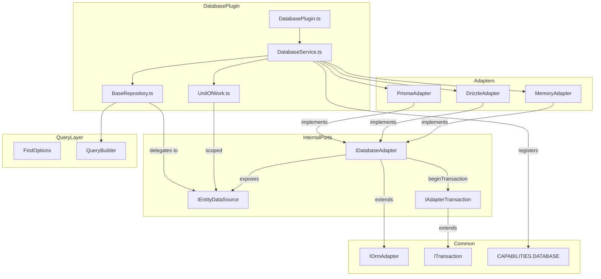

# Milestone 10: Database Plugin — Implementation Plan

**Objective:** Provide database capability with repository pattern, Unit of Work, and ORM adapters
(Prisma, Drizzle, Memory).

**Package:** `@hono-enterprise/database-plugin` **Branch:** `feat/m10-database-plugin`

---

## Architecture



Repositories implement `IRepository` (the public contract) and delegate to `IEntityDataSource` (the
internal adapter port). Adapters implement `IOrmAdapter` from `common` (lifecycle) extended by the
internal `IDatabaseAdapter` (data access) — see Design Decision 2.

---

## Mandatory Documents Read

1. `CLAUDE.md` — Session instructions, branch rules, verification gates
2. `AI_GUIDELINES.md` — All rules mandatory. Key: §1 SOLID, §3 Plugin Rules, §4 Runtime
   Independence, §5 TypeScript Rules, §6 Testing, §7 Documentation, §8 Milestone Rules, §10 Public
   API Rules, §12 Dependency Rules
3. `ROADMAP.md` — Milestone 10 section for scope; Progress Tracking table
4. `ARCHITECTURE.md` — §8 Package Architecture, §5 Plugin Architecture, §6 Service Registry
5. `packages/common/src/services/database.ts` — `IOrmAdapter`, `ITransaction` (lifecycle-only port:
   `connect`/`disconnect`/`isReady`/`beginTransaction` — it has NO data-access surface; the plugin
   owns that seam, see Design Decision 2)
6. `packages/common/src/tokens.ts` — `CAPABILITIES.DATABASE`, `createCapabilityToken` (token
   grammar: lowercase kebab-case with dot namespacing; colons are ILLEGAL)
7. `packages/kernel/src/registry/plugin-resolver.ts` — duplicate plugin names and duplicate
   capability providers THROW at startup (constrains multi-database registration, Design Decision 5)
8. `packages/logger-plugin/` — Reference plugin for structure, the real-`import('npm:pino')` +
   injectable-factory pattern, and the guarded real-import test

---

## Implementation Files

Following the ROADMAP.md file list and the plugin layout from AI_GUIDELINES §2.3:

| File                                         | Purpose                                                                                                           |
| -------------------------------------------- | ----------------------------------------------------------------------------------------------------------------- |
| `src/plugin/database-plugin.ts`              | Plugin entry point — `DatabasePlugin(options): IPlugin` factory                                                   |
| `src/services/database-service.ts`           | `DatabaseService` implementing `IDatabaseService`; central query-logging wrapper                                  |
| `src/repositories/base-repository.ts`        | `BaseRepository` implementing `IRepository` by delegating to an `IEntityDataSource`                               |
| `src/unitOfWork/unit-of-work.ts`             | `UnitOfWork` class — transaction-scoped repository access                                                         |
| `src/adapters/adapter.ts`                    | Internal ports: `IDatabaseAdapter`, `IEntityDataSource`, `IAdapterTransaction` (NOT exported from `src/index.ts`) |
| `src/adapters/prisma/prisma-adapter.ts`      | Prisma adapter (injected client preferred; lazy `npm:@prisma/client` fallback)                                    |
| `src/adapters/prisma/prisma-repository.ts`   | Prisma `IEntityDataSource` implementation (model delegate mapping)                                                |
| `src/adapters/drizzle/drizzle-adapter.ts`    | Drizzle adapter (injected instance preferred; lazy `npm:drizzle-orm` fallback)                                    |
| `src/adapters/drizzle/drizzle-repository.ts` | Drizzle `IEntityDataSource` implementation                                                                        |
| `src/adapters/memory/memory-adapter.ts`      | In-memory adapter for testing (zero external deps)                                                                |
| `src/query/find-options.ts`                  | `FindOptions`, `CountOptions`, `OrderBy` types                                                                    |
| `src/query/query-builder.ts`                 | Normalizes/validates `FindOptions` into the canonical query shape data sources consume                            |
| `src/interfaces/index.ts`                    | Plugin-specific public interfaces (`IDatabaseService`, `IRepository`, `IUnitOfWork`)                              |
| `src/index.ts`                               | Public API barrel export                                                                                          |

**Test Files:**

Every `src/` file must clear the 90% per-file bar — including all four Prisma/Drizzle files, which
are driven by injected fake clients (unit) plus one guarded REAL import test each (integration).

| File                                       | Purpose                                                                                |
| ------------------------------------------ | -------------------------------------------------------------------------------------- |
| `test/unit/base-repository.test.ts`        | Repository CRUD delegation to a fake `IEntityDataSource`                               |
| `test/unit/database-service.test.ts`       | Service resolution, health checks, query-logging wrapper on/off                        |
| `test/unit/unit-of-work.test.ts`           | Transaction commit/rollback, shared tx across repositories                             |
| `test/unit/memory-adapter.test.ts`         | All CRUD via memory store; tx begin/commit/rollback; `query()`/`migrate()` throw       |
| `test/unit/prisma-adapter.test.ts`         | Lifecycle, injected-client validation, tx bridge — via fake Prisma client              |
| `test/unit/prisma-repository.test.ts`      | Data-source ops mapped to Prisma delegate calls — via fake client                      |
| `test/unit/drizzle-adapter.test.ts`        | Lifecycle, injected-instance validation, tx handling — via fake instance               |
| `test/unit/drizzle-repository.test.ts`     | Data-source ops mapped to Drizzle calls — via fake instance                            |
| `test/unit/query-builder.test.ts`          | FindOptions normalization: pagination, ordering, filtering, select                     |
| `test/integration/database-plugin.test.ts` | Plugin registration via `IPluginContext`; token, health indicator, shutdown hook       |
| `test/integration/real-import.test.ts`     | Guarded REAL `import('npm:drizzle-orm')` / `import('npm:@prisma/client')` paths        |
| `test/e2e/database-application.test.ts`    | Full app with database plugin, CRUD via `app.inject()`                                 |
| `test/fixtures/fake-runtime.ts`            | Test fixture for runtime services (cross-checked against real kernel/runtime behavior) |
| `test/fixtures/fake-prisma-client.ts`      | Fake Prisma client honoring the real delegate/`$transaction`/`$queryRawUnsafe` shapes  |
| `test/fixtures/fake-drizzle-instance.ts`   | Fake Drizzle instance honoring the real query-builder shape                            |

Real-import tests are skipped when the package is not installed (like the logger-plugin pino test
and the M9 real-import discovery test — grant read/import perms so they run under coverage). The
branching logic AROUND the import lives in the adapter and is unit-tested via injection; only the
external I/O line itself sits behind the guard. For `@prisma/client`, a bare import without a
generated client throws — the real-path test asserts the adapter surfaces the documented
install/generate error message.

---

## Public Interfaces (in `src/interfaces/index.ts`)

### `IRepository<Entity, Id>`

> Deliberate widening of the committed PUBLIC_API.md shape (`IRepository<Entity>` with `string`
> ids): adds an `Id = string` generic default. Source-compatible for all documented usage, but it IS
> a public API change — PUBLIC_API.md's Database Interface section must be updated in the same PR
> (see "PUBLIC_API.md changes shipped in this PR").

```typescript
interface IRepository<Entity, Id = string> {
  /** Fetch entity by primary key. */
  findById(id: Id): Promise<Entity | null>;
  /** Fetch entities with optional filtering, sorting, pagination. */
  findAll(options?: FindOptions): Promise<Entity[]>;
  /** Insert a new entity. */
  create(data: Partial<Entity>): Promise<Entity>;
  /** Update an existing entity by primary key. */
  update(id: Id, data: Partial<Entity>): Promise<Entity>;
  /** Delete entity by primary key. Returns true if deleted. */
  delete(id: Id): Promise<boolean>;
  /** Check if entity with primary key exists. */
  exists(id: Id): Promise<boolean>;
  /** Count entities with optional filtering. */
  count(options?: CountOptions): Promise<number>;
}
```

### `IDatabaseService`

```typescript
interface IDatabaseService {
  /** Get a repository for the named entity type. */
  getRepository<Entity, Id = string>(entity: string): IRepository<Entity, Id>;
  /** Execute work in a transactional Unit of Work. Commits on success, rolls back and rethrows on error. */
  transaction<T>(work: (uow: IUnitOfWork) => Promise<T>): Promise<T>;
  /** Execute raw query. @throws {Error} on adapters without raw-SQL support (memory). */
  query<T>(sql: string, params?: unknown[]): Promise<T[]>;
  /** Run database migrations. @throws {Error} on adapters without migration support (memory, drizzle without a migrator). */
  migrate(): Promise<void>;
  /** Health check probe. */
  isHealthy(): Promise<boolean>;
  /** Gracefully close connections. */
  close(): Promise<void>;
}
```

### `IUnitOfWork`

```typescript
interface IUnitOfWork {
  /** Get a transaction-scoped repository. */
  getRepository<Entity, Id = string>(entity: string): IRepository<Entity, Id>;
}
```

### `FindOptions`, `CountOptions`, `OrderBy`

```typescript
/** Sort specification: field name to direction. */
type OrderBy = Record<string, 'asc' | 'desc'>;

interface FindOptions {
  /** Filter conditions. */
  where?: Record<string, unknown>;
  /** Sort specification. */
  orderBy?: OrderBy;
  /** Maximum results. */
  limit?: number;
  /** Skip count. */
  offset?: number;
  /** Select specific fields. */
  select?: string[];
}

interface CountOptions {
  /** Filter conditions for the count. */
  where?: Record<string, unknown>;
}
```

---

## Internal Ports (in `src/adapters/adapter.ts` — NOT exported from `src/index.ts`)

`IOrmAdapter` in `common` is lifecycle-only. The data-access seam between repositories and adapters
is owned by this plugin:

```typescript
/** Canonical query shape produced by QueryBuilder from FindOptions. */
interface EntityQuery {
  where?: Record<string, unknown>;
  orderBy?: OrderBy;
  limit?: number;
  offset?: number;
  select?: string[];
}

/** Entity-scoped data access every adapter must provide. BaseRepository's only dependency. */
interface IEntityDataSource {
  findById(entity: string, id: unknown): Promise<Record<string, unknown> | null>;
  findMany(entity: string, query: EntityQuery): Promise<Record<string, unknown>[]>;
  insert(entity: string, data: Record<string, unknown>): Promise<Record<string, unknown>>;
  update(
    entity: string,
    id: unknown,
    data: Record<string, unknown>,
  ): Promise<Record<string, unknown>>;
  delete(entity: string, id: unknown): Promise<boolean>;
  count(entity: string, where?: Record<string, unknown>): Promise<number>;
}

/** Transaction handle carrying its own transaction-scoped data source (consumed by UnitOfWork). */
interface IAdapterTransaction extends ITransaction {
  readonly dataSource: IEntityDataSource;
}

/** Full adapter contract: common's lifecycle port plus this plugin's data-access surface. */
interface IDatabaseAdapter extends IOrmAdapter {
  readonly dataSource: IEntityDataSource;
  beginTransaction(): Promise<IAdapterTransaction>;
  rawQuery<T>(sql: string, params?: unknown[]): Promise<T[]>;
  migrate(): Promise<void>;
}
```

`BaseRepository` is concrete, not abstract: it implements the full `IRepository` contract against
any `IEntityDataSource`, using `QueryBuilder` to normalize `FindOptions` (clamp `limit`/`offset` to
non-negative integers, validate `orderBy` directions, drop empty clauses — omitting optional
properties rather than assigning `undefined`, per `exactOptionalPropertyTypes`). Adapter-specific
repositories (`prisma-repository.ts`, `drizzle-repository.ts`) implement `IEntityDataSource`, not
`IRepository` — they map the canonical `EntityQuery` onto ORM calls.

---

## Plugin Options (`DatabasePluginOptions`)

```typescript
type DatabaseAdapterType = 'prisma' | 'drizzle' | 'memory';

interface DatabasePluginOptions {
  /** ORM adapter type. Defaults to `'memory'`. */
  type?: DatabaseAdapterType;
  /** Named connection for multi-database support. Defaults to `'default'`. */
  name?: string;
  /** Adapter-specific options. */
  options?: {
    /** Database connection URL (pool sizing is configured here or on the injected client). */
    url?: string;
    /** Log every repository/raw-query operation through CAPABILITIES.LOGGER. Defaults to false. */
    logQueries?: boolean;
    /** Custom Prisma client instance (injected; preferred over the lazy import). */
    prismaClient?: unknown;
    /** Custom Drizzle database instance (injected; preferred over the lazy import). */
    drizzleInstance?: unknown;
  };
}
```

**Dropped from the committed PUBLIC_API.md example: `poolSize`.** No adapter can honestly consume it
— Prisma configures pooling via the connection URL, Drizzle pooling belongs to the injected driver,
and the memory adapter has no pool. Per the dead-option rule (an option that is only declared and
stored is a defect), it is cut rather than stored; PUBLIC_API.md's registration example is amended
in this PR to configure pool size on the URL/client instead.

**Injected clients are `unknown` and validated at `connect()`**: each adapter narrows the injected
value with a structural check (Prisma: `$connect`/`$disconnect`/`$transaction` functions; Drizzle:
the query-builder surface it uses) and throws a clear "injected client does not look like X" error
on mismatch. That validation branch is unit-tested.

---

## Key Design Decisions

### 1. Adapter Injection over Hard Dependencies

Following AI_GUIDELINES §12.2 and the "lazy import" rules in CLAUDE.md:

- **Injection via `options.prismaClient` / `options.drizzleInstance` is the PRIMARY path** —
  matching §12.2's stated preference.
- The lazy-import fallback uses the correct runtime packages: **`npm:@prisma/client`** (NOT
  `npm:prisma`, which is the CLI) and **`npm:drizzle-orm`**. Each failed import throws a clear
  install instruction (for Prisma, the error also covers the ungenerated-client case: "install
  @prisma/client and run prisma generate, or inject a client via options").
- Practical note: `@prisma/client` is unusable without generated code, so the lazy import mainly
  exists to produce the correct error; real deployments inject the generated client. Drizzle
  similarly needs a driver instance, so `drizzleInstance` injection is effectively required for real
  use — the lazy import of `drizzle-orm` only verifies availability for URL-based setup.
- The `memory` adapter has zero external deps and is the default for testing.
- No `globalThis.__x` fake loaders — only real `import()` or option injection. `register()` is async
  where the real import forces it.

### 2. Repository Pattern over an Explicit Data-Access Port

`IOrmAdapter` (common) is lifecycle-only, so this plugin defines the internal `IEntityDataSource`
port (see "Internal Ports" above). `BaseRepository` implements `IRepository` against that port; each
adapter ships an `IEntityDataSource` implementation. Business logic stays decoupled from ORM
internals, and the seam is directly unit-testable with a fake data source.

### 3. Unit of Work for Transactions

- `IDatabaseAdapter.beginTransaction()` returns an `IAdapterTransaction` — commit/rollback plus a
  transaction-scoped `IEntityDataSource`. `UnitOfWork.getRepository()` builds repositories on that
  scoped data source, so all operations in the UoW share one transaction handle.
- `DatabaseService.transaction(work)`: begin → run `work(uow)` → **commit on success and return the
  result; rollback and rethrow on error**. Both paths are tested, including that two repositories
  from the same UoW observe the same transaction.
- **Prisma has no imperative begin/commit API** — its client only offers callback-style
  `$transaction(async tx => …)`. The Prisma adapter bridges with a deferred promise: it invokes
  `$transaction`, captures the `tx` client for the scoped data source, holds the callback open, and
  resolves it on `commit()` / rejects it on `rollback()`. The bridge (including rollback-rejection
  and double-settle guards) is unit-tested against the fake client.
- Memory adapter transactions: snapshot/restore of the store (commit keeps mutations, rollback
  restores the snapshot).

### 4. Capability Token Registration and Health/Shutdown Wiring

- Registers `IDatabaseService` under `CAPABILITIES.DATABASE` for the default connection.
- Registers a health indicator via
  `ctx.health.register('database' /* or database.<name> */,
  () => service.isHealthy() …)` — this
  is what the integration test asserts.
- Registers `ctx.lifecycle.onShutdown(() => service.close())` so connections close with the app.
- `optionalDependencies: [CAPABILITIES.LOGGER]` for query logging; missing logger must not fail
  registration (tested).
- Uses `PLUGIN_PRIORITY.NORMAL` (500) — database is an ordinary capability.

### 5. Named Connections — Token Grammar and Multi-Registration Constraints

The committed PUBLIC_API.md "Multiple Databases" example uses `database:primary`, but
`createCapabilityToken` (tokens.ts, AI_GUIDELINES §11.2) forbids colons — only lowercase kebab-case
with **dot** namespacing is legal. And the kernel throws at startup on duplicate plugin names AND on
two plugins providing the same capability token (`plugin-resolver.ts: assertUniqueNames`,
`buildProviderIndex`); the service registry throws on duplicate token registration. Therefore:

- **Token convention is dot-namespaced**: named connections register under
  `createCapabilityToken('database.<name>')`, e.g. `database.primary`. PUBLIC_API.md's Multiple
  Databases section is corrected in this PR (`database:primary` → `database.primary`).
- **Per-instance plugin names**: default connection → plugin name `database-plugin`; named
  connection → `database-plugin.<name>`. Connection names are validated to lowercase kebab-case (so
  the derived token passes `createCapabilityToken`).
- **Per-instance `provides`**: default connection provides `[CAPABILITIES.DATABASE]`; a named
  connection provides ONLY `['database.<name>']` and does NOT claim the bare `database` token —
  otherwise two named instances collide at startup. Consumers of a named connection resolve
  `database.<name>` explicitly.
- `name: 'default'` (or omitted) is the bare-token instance; registering two default instances
  throws by design (duplicate name + duplicate token), which a test asserts.

### 6. One Query-Logging Implementation

`logQueries` is consumed in exactly ONE place: `DatabaseService` wraps every data-source and
raw-query call (both the service's own repositories and UoW-scoped ones funnel through the same
wrapper) and, when enabled, logs entity, operation, and duration via
`ctx.services.get<ILogger>(CAPABILITIES.LOGGER)` — durations computed from `runtime.hrtime()`
(monotonic), never `Date.now()`. This keeps the option honestly consumed for every adapter
uniformly, avoids per-adapter log-API differences (an injected Prisma client cannot have log events
attached retroactively), and satisfies the one-capability-one-implementation rule. Tested with
`logQueries: true` and `false`, via both the service repository path and the UoW path.

### 7. Unsupported Operations Fail Loudly

- Memory adapter: `rawQuery()` and `migrate()` throw
  `Error('The memory adapter does not support raw SQL queries / migrations.')`.
- Drizzle adapter: `migrate()` throws unless a migrator is available for the injected instance.
- JSDoc `@throws` on `IDatabaseService.query`/`migrate` documents exactly these behaviors — docs
  must match what the code actually does, and tests assert the throw.

### 8. No Plugin-to-Plugin Imports

`database-plugin` depends only on `common` (and consumes runtime services via `ctx.runtime`). Logger
access via `ctx.services.get<ILogger>(CAPABILITIES.LOGGER)`.

---

## Test Strategy

### Unit Tests (per file, 90%+ branch/function/line)

| Area                                                                                                     | What to test                                                                              |
| -------------------------------------------------------------------------------------------------------- | ----------------------------------------------------------------------------------------- |
| `DatabasePlugin`                                                                                         | Metadata (name, version, provides, priority, dependencies). Registration path. Missing    |
| optional logger does not fail. Named instance: derived plugin name, `provides: ['database.<name>']`,     |                                                                                           |
| bare token NOT claimed. Invalid connection name throws.                                                  |                                                                                           |
| `DatabaseService`                                                                                        | Repository creation, `isHealthy()`, `close()`. Transaction wrapping (commit on success,   |
| rollback + rethrow on error). Query-logging wrapper: on/off, covers repository path AND UoW path,        |                                                                                           |
| duration from monotonic clock. `query()`/`migrate()` delegation and adapter-unsupported throws.          |                                                                                           |
| `BaseRepository`                                                                                         | All CRUD methods delegate to the data source correctly. `findById` returns null for       |
| missing. `exists` returns boolean. `count` returns number. FindOptions normalized via QueryBuilder.      |                                                                                           |
| `UnitOfWork`                                                                                             | Commit propagates to adapter. Rollback on error restores state. Two repositories from one |
| UoW share the same transaction-scoped data source.                                                       |                                                                                           |
| `MemoryAdapter`                                                                                          | All CRUD via memory store. Transaction begin/commit/rollback (snapshot semantics).        |
| `isReady()` state. `disconnect()` clears store. `rawQuery()`/`migrate()` throw the documented errors.    |                                                                                           |
| `PrismaAdapter`                                                                                          | Injected-client structural validation (accept/reject). Lifecycle (`connect`/`disconnect`/ |
| `isReady`). `$transaction` deferred-promise bridge: commit resolves, rollback rejects, no double-settle. |                                                                                           |
| Lazy-import failure surfaces the install/generate error. All via `test/fixtures/fake-prisma-client.ts`.  |                                                                                           |
| `PrismaRepository`                                                                                       | Each `IEntityDataSource` op maps to the right delegate call (`findUnique`, `findMany`     |
| with where/orderBy/take/skip/select, `create`, `update`, `delete`, `count`); missing-row paths.          |                                                                                           |
| `DrizzleAdapter`                                                                                         | Injected-instance validation, lifecycle, transaction handling, unsupported `migrate()`    |
| throw. Via `test/fixtures/fake-drizzle-instance.ts`.                                                     |                                                                                           |
| `DrizzleRepository`                                                                                      | Each `IEntityDataSource` op maps to the right Drizzle calls; pagination/ordering.         |
| `QueryBuilder`                                                                                           | `FindOptions` → canonical `EntityQuery`: pagination clamping, ordering validation,        |
| filtering, select, empty-clause omission (`exactOptionalPropertyTypes`-safe).                            |                                                                                           |

Fixtures must honor the real contracts: the fake Prisma client reproduces real `$transaction`
callback semantics and delegate shapes (cross-checked against Prisma docs/types); the fake runtime
sets time via monotonic `hrtime` semantics exactly as `packages/runtime` does.

### Integration Tests

| Area                                                                                                    | What to test                                                                          |
| ------------------------------------------------------------------------------------------------------- | ------------------------------------------------------------------------------------- |
| `DatabasePlugin`                                                                                        | Full plugin registration flow through `IPluginContext`. Service resolvable by         |
| `CAPABILITIES.DATABASE`. Health indicator registered via `ctx.health`. `onShutdown` closes the adapter. |                                                                                       |
| Two named instances coexist (`database.primary` + `database.analytics`); duplicate default throws.      |                                                                                       |
| Real imports                                                                                            | REAL `await import('npm:drizzle-orm')` succeeds when installed (skip otherwise). REAL |
| `await import('npm:@prisma/client')` path exercises the adapter's documented error when the client is   |                                                                                       |
| not generated (skip when not installed). Grant read/import perms so these run under coverage.           |                                                                                       |

### E2E Test

| Area                                                                                                      | What to test                                                                      |
| --------------------------------------------------------------------------------------------------------- | --------------------------------------------------------------------------------- |
| `Database Application`                                                                                    | Create app with DatabasePlugin (memory) + RuntimePlugin. Register routes that use |
| the database service, including one route using `db.transaction`. Execute via `app.inject()`. Assert CRUD |                                                                                   |
| responses, and that a route whose transaction callback throws returns an error response with no partial   |                                                                                   |
| writes visible afterwards.                                                                                |                                                                                   |

### Self-Review Checklist Items

1. **Per-file coverage ≥ 90%** on branch, function, AND line — read the ANSI-stripped table for
   EVERY `src/` file, explicitly including the four Prisma/Drizzle files.
2. **No forbidden constructs**:
   `grep -rn "new Function\|eval(\|as any\|@ts-ignore\|Date.now()\|globalThis.__" packages/database-plugin/src`
3. **Every option read on a real code path**: `logQueries` drives the logging wrapper (both entry
   points), `url`/`prismaClient`/`drizzleInstance` consumed by adapters; `poolSize` was CUT, not
   stored.
4. **Short-circuit tests**: transaction rollback when work callback throws; error rethrown; nothing
   committed.
5. **One capability, one implementation**: query logging funnels through the single
   `DatabaseService` wrapper for service repositories AND UoW repositories — tested under
   non-default config (`logQueries: true`).
6. **Token binding is correct**: `CAPABILITIES.DATABASE` resolves to `IDatabaseService`; named
   tokens are built with `createCapabilityToken('database.<name>')` — never colon strings.
7. **No `any` types**: injected clients are `unknown`, narrowed structurally with tested validation
   branches.
8. **Exact optional property types**: never assign `undefined` to optional properties — QueryBuilder
   omits empty clauses.
9. **JSDoc on every export**: `@param`, `@returns`, `@throws`, `@since`, `@example` — and every
   `@throws` claim matches a tested behavior.
10. **Real import exercised at least once** per external dep (guarded/skipped when absent); the
    branching logic around the import is unit-tested via the injection seam.
11. **Fixtures honor real contracts** — fake Prisma/Drizzle shapes cross-checked against the real
    libraries; fake runtime clock is monotonic like the real one.

---

## PUBLIC_API.md Changes Shipped in This PR

These touch already-committed doc content, so they are explicit deliverables, not incidental:

1. **Multiple Databases section**: `database:primary` / `database:analytics` → `database.primary` /
   `database.analytics` (colon tokens violate the committed token grammar in `tokens.ts`; dot
   namespacing is the legal form). Document the per-instance plugin-name and `provides` rules from
   Design Decision 5.
2. **Registration example**: remove `poolSize` (dead option — pool sizing lives on the connection
   URL or injected client); show `prismaClient`/`drizzleInstance` injection as the preferred path.
3. **Database Interface section**: `IRepository<Entity, Id = string>` /
   `getRepository<Entity, Id = string>` generic widening; document `query()`/`migrate()` `@throws`
   behavior per adapter.

---

## Milestone Completion Criteria

- [ ] All implementation files created with full JSDoc
- [ ] `deno task check` passes (zero type errors)
- [ ] `deno task lint` passes
- [ ] `deno task fmt:check` passes
- [ ] `deno task test` passes (all tests green)
- [ ] `deno task test:coverage` — every `src/` file ≥ 90% on branch, function, AND line (read the
      ANSI-stripped per-file table; includes the Prisma/Drizzle adapter and repository files)
- [ ] Real-import tests exist for `npm:@prisma/client` and `npm:drizzle-orm` (guarded/skipped when
      not installed)
- [ ] PUBLIC_API.md updated: DatabasePlugin section reflects actual behavior, including the three
      committed-doc corrections listed above
- [ ] `src/index.ts` exports match PUBLIC_API.md (internal ports in `src/adapters/adapter.ts` NOT
      exported)
- [ ] ROADMAP.md Milestone 10 deliverables checked
- [ ] CLAUDE.md "Current status" updated (in the same PR, on the feature branch)

---

## Execution Order

1. Create feature branch `feat/m10-database-plugin`
2. Implement query types (`FindOptions`, `CountOptions`, `OrderBy`)
3. Implement `QueryBuilder` (FindOptions → canonical `EntityQuery`)
4. Implement internal ports (`IEntityDataSource`, `IAdapterTransaction`, `IDatabaseAdapter`)
5. Implement `IRepository`, `IDatabaseService`, `IUnitOfWork` public interfaces
6. Implement `BaseRepository` (against `IEntityDataSource`)
7. Implement `MemoryAdapter` + its data source (zero external deps, testable first)
8. Implement `UnitOfWork`
9. Implement `DatabaseService` (including the query-logging wrapper)
10. Implement `PrismaAdapter` + `PrismaRepository` (injection primary, lazy `npm:@prisma/client`
    fallback, `$transaction` deferred-promise bridge)
11. Implement `DrizzleAdapter` + `DrizzleRepository` (injection primary, lazy `npm:drizzle-orm`
    fallback)
12. Implement `DatabasePlugin` factory (token derivation, health indicator, `onShutdown` wiring)
13. Implement `src/index.ts` barrel exports
14. Write unit tests (memory adapter first, then repository/UoW/service, then Prisma/Drizzle via
    fakes, then plugin)
15. Write integration tests (plugin flow + guarded real-import tests)
16. Write e2e test
17. Update PUBLIC_API.md (including the three committed-doc corrections)
18. Run verification gates; read per-file coverage ANSI-stripped
19. Update milestone tracking (ROADMAP.md, CLAUDE.md) on the feature branch
