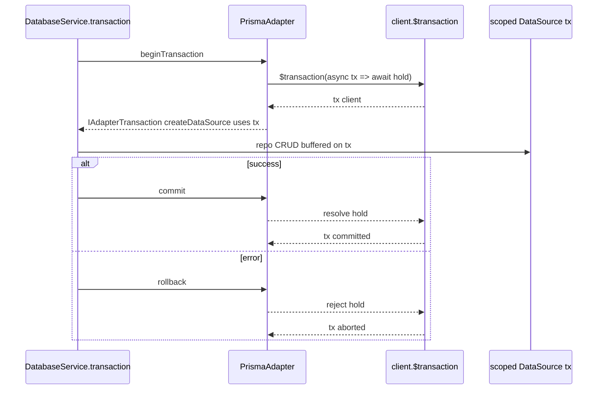

# Milestone 10 — Fix Round 2 Plan (`packages/database-plugin`)

**Branch:** `feat/m10-database-plugin` (verify with `git branch --show-current` FIRST; never touch
`main`). All fixes + tests + doc edits commit here. **Do NOT push or open a PR** — hand back the
push/PR commands.

**Scope:** Fix the 5 critical behavioral defects + 5 documentation/tracking defects from the round‑2
runtime verification. The shipped code passes gates at 90%+ because its tests assert the broken
behavior — fixing a defect means rewriting the tests that codified it.

---

## Architecture changes (foundational — do these first)

The shipped code diverged from
[`plans/milestone-10-database-plugin.md`](plans/milestone-10-database-plugin.md:225). It uses an
internal [`DataSource`](packages/database-plugin/src/repositories/base-repository.ts:27) seam in
`base-repository.ts` (equivalent to the plan's `IEntityDataSource`) and makes
[`beginTransaction()`](packages/database-plugin/src/adapters/memory/memory-adapter.ts:63) return the
bare common [`ITransaction`](packages/common/src/services/database.ts:16) — which carries **no**
scoped data source. That is the root cause of defect #2. Reconcile with the plan's intent (not its
exact file name) by introducing the transaction contract.

### A1. New internal contract — `src/adapters/adapter.ts` (NOT exported from `src/index.ts`)

```ts
import type { IOrmAdapter, ITransaction } from '@hono-enterprise/common';
import type { DataSource } from '../repositories/base-repository.ts';

/** Transaction handle that also exposes a transaction-scoped DataSource factory. @internal */
export interface IAdapterTransaction extends ITransaction {
  /** Build a DataSource bound to THIS transaction for the named entity. */
  createDataSource(entity: string): DataSource;
}

/** Internal adapter contract: common lifecycle port + this plugin's data-access surface. @internal */
export interface IDatabaseAdapter extends IOrmAdapter {
  /** Returns a handle carrying commit/rollback AND a scoped DataSource factory. */
  beginTransaction(): Promise<IAdapterTransaction>;
  /** Raw SQL. Memory throws; Prisma/Drizzle delegate to the client/instance. */
  rawQuery<T>(sql: string, params?: unknown[]): Promise<T[]>;
}
```

> **Plan deviation (called out):** the plan put
> `IEntityDataSource`/`IAdapterTransaction`/`IDatabaseAdapter` in `adapter.ts`. We reuse the
> already-shipped [`DataSource`](packages/database-plugin/src/repositories/base-repository.ts:27)
> (equivalent to `IEntityDataSource`) rather than rename it, and we **drop `migrate()` from the
> adapter contract** because it is unimplementable for all three ORMs (see defect #3).
> `IDatabaseAdapter` adds `rawQuery` + a `beginTransaction` override returning
> `IAdapterTransaction`. Update the plan file's "Internal Ports" section to match in the same
> commit.

### A2. `DatabaseService` constructor + the single query-logging wrapper (defect #4)

- Change the adapter param type from
  [`IOrmAdapter`](packages/database-plugin/src/services/database-service.ts:11) to the new internal
  `IDatabaseAdapter`.
- Add a `now: () => number` constructor param (monotonic clock). The plugin injects
  `() => ctx.runtime.hrtime()`. **Never** `Date.now()`.
- Add **one** private `wrapDataSource(entity, ds): DataSource` that, when `logQueries` is true,
  times each of the 6 data-source ops (`findAll`/`findById`/`create`/`update`/`delete`/`count`) with
  `now()` and logs `{ entity, operation, durationMs }` via the logger on completion. When false,
  returns `ds` unwrapped.
- `getRepository(entity)` builds a repo from
  `wrapDataSource(entity, this._createDataSource(entity))`.
- Rename the `MemoryRepository` class in `database-service.ts` — it is the repo used for ALL adapter
  types, and the misnomer is a landmine; call it what A2 implies (an internal generic repository).
- `transaction(work)`:
  ```ts
  const txn = await this._adapter.beginTransaction(); // IAdapterTransaction
  const uow = new UnitOfWork(
    txn,
    (entity) => new InternalRepo(this._wrapDataSource(entity, txn.createDataSource(entity))),
  );
  ```
  → UoW repositories are built from the **scoped** factory, never the service-level one.
- Delete the `query()` "Raw query executed" log line (the lie). `query()`/`migrate()` are NOT
  wrapped by the logging wrapper (only entity CRUD ops are).

### A3. `query()` / `migrate()` (defect #3)

- `query<T>(sql, params?)`: delegate to `this._adapter.rawQuery<T>(sql, params)`.
  - Prisma → `await client.$queryRawUnsafe(sql, ...params)` returned as `T[]`.
  - Drizzle → the injected instance's raw-execute surface (`instance.execute(sql)` / `$client` raw
    run), returned as `T[]`.
  - Memory → throws the documented error, **with no log line**.
- `migrate()`: throw a single uniform error for ALL adapters:
  `Error('Programmatic migrations are not supported by the current database adapters.')` (no
  per-adapter branch; drop `migrate()` from the adapter contract).

### A4. `DatabasePlugin.register()` (defect #4)

- Inject `now: () => ctx.runtime.hrtime()` into `DatabaseService`.
- `createAdapter` return type → `IDatabaseAdapter`.
- Remove the `logger` arg to `PrismaAdapter` (no more `$use`).

---

## Per-defect implementation

### Defect 1 — real Prisma + Drizzle data sources

**`src/adapters/prisma/prisma-repository.ts`** — `createPrismaDataSource(client, entity)`:

- Resolve the model delegate by **lowercasing the first letter** of the entity name (`'User'` →
  `client.user`). Document this convention in JSDoc.
- Map each op onto the delegate:
  - `findById` → `delegate.findUnique({ where: { id } })`
  - `findAll` →
    `delegate.findMany({ where, orderBy, take: limit>0?limit:undefined, skip: offset>0?offset:undefined, select: select.length?{...}:undefined })`
  - `create` → `delegate.create({ data })`
  - `update` → `delegate.update({ where: { id }, data })` — on Prisma's not-found error code
    (`P2025`) return… NO: `update` returns the row; map Prisma not-found → throw the same
    `Entity not found` error the memory adapter throws (so `BaseRepository.update` behavior is
    uniform).
  - `delete` → `delegate.delete({ where: { id } })`; catch Prisma not-found (`P2025`) → return
    `false` (do NOT leak the Prisma error).
  - `count` → `delegate.count({ where })`.
- Missing delegate → throw
  `Error("Prisma client has no model '<entity>' (delegate accessed as '<lowercased>'); …")` naming
  the entity + convention.
- Signature changes from `(adapter, model)` to `(client, entity)` (the raw Prisma client — needed
  for both service path and the `tx` client in transactions). Update the plugin's data-source
  factory and the transaction `createDataSource` to pass the resolved client/tx.
- Remove the `// deno-lint-ignore-file require-await` (no longer stubs) if the methods become
  genuinely async.

**`src/adapters/drizzle/drizzle-repository.ts`** —
`createDrizzleDataSource(instance, entity, table)`:

- New adapter option `drizzleTables: Record<string, unknown>` on
  [`DatabaseAdapterOptions`](packages/database-plugin/src/interfaces/index.ts:220) (PUBLIC_API
  change → document it). Maps entity name → Drizzle table object.
- Map ops through the injected instance's builder API: reads via `instance.select().from(table)`;
  writes via `instance.insert(table).values(...)`, `instance.update(table).set(...).where(...)`,
  `instance.delete(table).where(...)`; count via a count select. After each write, **read the row
  back** through a select instead of relying on `.returning()` — `.returning()` is
  Postgres/SQLite-only and breaks MySQL instances.
- `where`/`orderBy` composition needs the drizzle-orm operators (`eq`/`and`/`asc`/`desc`). These are
  **module exports of `drizzle-orm`, NOT instance members** — there is no "via the instance" path.
  Load them once at `connect()` with `await import('npm:drizzle-orm@0.33.0')` (already in
  `deno.lock`), failing with a clear install error if unavailable. Unit tests combine the REAL
  operators (import perms are already granted, see below) with the fake instance, which records the
  where-expressions it receives.
- Unknown entity → throw naming the entity AND the `drizzleTables` option.

### Defect 2 — real transaction scoping

**`src/adapters/prisma/prisma-adapter.ts`** — deferred-promise bridge. The bridge needs TWO
deferreds and must track the outer `$transaction` promise; each detail below is load-bearing:

- Create a `txReady` deferred AND a `hold` deferred. Call
  `outer = client.$transaction(async (tx) => { txReady.resolve(tx); await hold.promise; })`.
  `beginTransaction()` MUST `await txReady.promise` before returning — otherwise
  `createDataSource(entity)` races `$transaction` starting and binds to `undefined`. If `outer`
  rejects before `txReady` settles (client not connected, tx failed to open), `beginTransaction()`
  itself must reject with that error.
  - `commit()` → resolve `hold`, then **`await outer`** so commit failures surface to the caller and
    control does not return before Prisma has actually committed. Guard double-settle.
  - `rollback()` → reject `hold` with a private sentinel, then **`await outer` and swallow ONLY the
    sentinel** (rethrow anything else). Without awaiting/catching `outer`, every rollback produces
    an unhandled promise rejection — fatal in Deno. Guard double-settle.
- Prisma interactive transactions have a **~5s default timeout** and this bridge holds the callback
  open for the entire Unit of Work. Pass a transaction timeout through (adapter option, forwarded as
  `$transaction`'s options arg) and document the constraint in the plugin JSDoc.
- `$queryRawUnsafe` added for `rawQuery`.
- Remove `$use` from the `PrismaClient` type and delete `enableQueryLogging` entirely.
- Keep `connect`/`disconnect`/`isReady`; structural-validate the injected client at `connect`
  (`$connect`/`$disconnect`/`$transaction` functions present).

**`src/adapters/drizzle/drizzle-adapter.ts`** — same bridge pattern via the instance's
`transaction(fn)`. Validate the instance + table registry at `connect()` (each table has the query
surface used).

**`src/adapters/memory/memory-adapter.ts`** — replace the global snapshot with a per-transaction
overlay that covers ALL THREE write kinds, not just creates:

- `beginTransaction()` returns `IAdapterTransaction` whose `createDataSource(entity)` returns a data
  source backed by an overlay: buffered creates, **update shadows** (id → new row) for updates of
  committed rows, and **delete tombstones** (id set) for deletes of committed rows. Transaction
  reads see committed rows with shadows applied, tombstoned rows removed, buffered creates added. If
  updates/deletes mutate the live store directly, rollback cannot undo them and the
  outside-visibility guarantee breaks — that is the current bug reshaped.
  - `commit()` applies creates + shadows + tombstones to the real stores (last-write-wins on rows
    concurrently modified outside — acceptable for a test adapter; say so in JSDoc).
  - `rollback()` discards the overlay untouched.
- An unrelated write made OUTSIDE the open transaction (directly to the store) MUST survive a
  rollback, and uncommitted transaction writes MUST NOT be visible outside before commit. Add tests
  for both — and for **update-in-tx and delete-in-tx**: each rolled back leaves the committed row
  intact, each invisible outside before commit.

### Defect 4 — see A2/A4 (single logging wrapper, monotonic clock).

### Defect 5 — fixtures

**`test/fixtures/fake-prisma-client.ts`** — align to real `@prisma/client` v7:

- Remove `$use`/`middlewares` entirely.
- Implement: `$connect`, `$disconnect`, callback-style `$transaction(fn)` (hands a transaction
  client with the SAME delegate surface), `$queryRawUnsafe(sql, ...params)`, and model delegates
  (`user.findUnique/findMany/create/update/delete/count`). Keep an **in-memory store** + a
  **recorded-calls list** so tests/behavioral probe can assert
  `create`/`findMany`/`$transaction`/`$queryRawUnsafe` actually arrive. Every method implemented
  MUST exist on the real client. The delegates' `update`/`delete` on a missing row MUST throw a
  **`{ code: 'P2025' }`-shaped error** exactly like real Prisma — otherwise the data source's
  not-found catch branches are untestable and `prisma-repository.ts` misses the coverage bar.
- **`test/fixtures/fake-drizzle-instance.ts`** — reproduce the real Drizzle instance surface the
  adapter uses (`transaction(fn)`, relational `query[entity]`, `insert/update/delete/select`, raw
  `execute`), with an in-memory store + recorded-calls list.

---

## Test rewrites (these codified the broken behavior — they MUST change)

| Test file                                                                                                       | What currently asserts broken behavior                                                      | New assertion                                                                                                                                                                                                        |
| --------------------------------------------------------------------------------------------------------------- | ------------------------------------------------------------------------------------------- | -------------------------------------------------------------------------------------------------------------------------------------------------------------------------------------------------------------------- |
| [`test/unit/prisma-repository.test.ts`](packages/database-plugin/test/unit/prisma-repository.test.ts:66)        | asserts `findAll`→`[]`, `create` echoes input, `delete`→`false`, `count`→`0` (the stub)     | drive the fixed fake client; assert each op maps to the right delegate call AND **read the write back** (data intact)                                                                                                |
| [`test/unit/drizzle-repository.test.ts`](packages/database-plugin/test/unit/drizzle-repository.test.ts)         | same stub assertions                                                                        | same, via fixed fake instance + `drizzleTables` registry                                                                                                                                                             |
| [`test/unit/prisma-adapter.test.ts`](packages/database-plugin/test/unit/prisma-adapter.test.ts:86)              | `query logging` / `enableQueryLogging` blocks assert `$use` middleware registered           | delete those blocks; add: deferred-promise tx bridge (commit resolves, rollback rejects, double-settle guarded), `$queryRawUnsafe` reaches the client, real-v7-shaped client (no `$use`) does not crash on `connect` |
| [`test/unit/drizzle-adapter.test.ts`](packages/database-plugin/test/unit/drizzle-adapter.test.ts)               | `beginTransaction` returns no-op commit/rollback                                            | tx bridge against fixed fake; raw query reaches `execute`                                                                                                                                                            |
| [`test/unit/database-service.test.ts`](packages/database-plugin/test/unit/database-service.test.ts:72)          | "logs query when logQueries is true" asserts the pre-throw log lie; constructor omits `now` | delete the lie test; add: `logQueries:true` logs per-CRUD-op via repo path AND UoW path with monotonic duration; `logQueries:false` logs nothing; `query()` on memory throws with NO log; constructor takes `now`    |
| [`test/unit/memory-adapter.test.ts`](packages/database-plugin/test/unit/memory-adapter.test.ts:159)             | "commit/rollback successfully" (no isolation assertions)                                    | add isolation tests: outside-write survives rollback; uncommitted tx-write invisible outside; commit flushes                                                                                                         |
| [`test/unit/unit-of-work.test.ts`](packages/database-plugin/test/unit/unit-of-work.test.ts)                     | builds repos from a plain factory                                                           | ensure UoW factory is the scoped one (pass through `IAdapterTransaction.createDataSource`)                                                                                                                           |
| [`test/integration/database-plugin.test.ts`](packages/database-plugin/test/integration/database-plugin.test.ts) | registration only                                                                           | keep + ensure `now` injected from runtime; nothing asserts broken CRUD                                                                                                                                               |

### New test files (defect #10)

- **`test/e2e/database-application.test.ts`** — full kernel app via `app.inject()`: register routes
  that do CRUD through `DatabasePlugin` (memory), **read every write back** (fields intact), and a
  transaction route whose callback throws → response is an error AND no partial writes are visible
  afterward. Use `await ctx.request.json<T>()` (NOT `ctx.request.body`).
- **`test/integration/real-import.test.ts`** — guarded
  `try { await import('npm:drizzle-orm@0.33.0') } catch {skip}` and
  `try { await import('npm:@prisma/client@7.8.0') } catch {skip}` — import the SAME pinned
  specifiers the adapters use, or the test resolves a different copy than the code under test
  (logger-plugin pino precedent,
  [`pino-logger.test.ts`](packages/logger-plugin/test/unit/pino-logger.test.ts:146)). When
  `@prisma/client` is importable but ungenerated, assert the adapter surfaces the install/generate
  error.

**No permission changes are needed**: the root `deno task test` / `test:coverage` already run
`deno test -P --allow-read --allow-import` ([`deno.json:42`](deno.json:42)) — that root task is what
the M9 real-import commit changed. Do NOT add a `test.permissions` block to the package `deno.json`
(logger-plugin's block exists only for `net`, which the root flags don't grant).

---

## Documentation fixes (defects #6, #7, #8, #9)

- **#6** Fix `npm:prisma` → `npm:@prisma/client` in:
  [`src/adapters/prisma/prisma-adapter.ts`](packages/database-plugin/src/adapters/prisma/prisma-adapter.ts:3)
  module + class JSDoc, and
  [`src/interfaces/index.ts`](packages/database-plugin/src/interfaces/index.ts:237) (`prismaClient`
  JSDoc, ~line 237).
- **#7** Reword the Prisma lazy-load error to: install `@prisma/client` AND run `prisma generate`,
  or inject via `options.prismaClient`.
- **#8** [`src/index.ts`](packages/database-plugin/src/index.ts:30): trim internals — drop
  `BaseRepository`, `DataSource`, `NormalizedQuery`,
  `applyOrderBy`/`applyPagination`/`matchesWhere`/`normalizeQuery`/
  `normalizeCountOptions`/`projectFields`, `PrismaRepository`, `createPrismaDataSource`,
  `DrizzleRepository`, `createDrizzleDataSource`, `UnitOfWork`, `DatabaseService` UNLESS
  deliberately made public (then document each in PUBLIC_API.md with JSDoc). Keep: `DatabasePlugin`,
  the public interfaces/types (`IDatabaseService`, `IRepository`, `IUnitOfWork`, `FindOptions`,
  `CountOptions`, `OrderDirection`, `DatabasePluginOptions`, `DatabaseAdapterOptions`,
  `DatabaseAdapterType`), and `MemoryAdapter` (documented testing helper — keeping it public means
  ADDING a `MemoryAdapter` entry to PUBLIC_API.md, which is not there today). Then in
  [`PUBLIC_API.md`](PUBLIC_API.md:766):
  - widen `IDatabaseService`/`IRepository` to `getRepository<Entity, Id = string>` /
    `IRepository<Entity, Id = string>`;
  - add per-adapter `@throws` for `query()` (memory throws) and `migrate()` (all adapters throw —
    not supported);
  - fix the `ctx.request.body` examples (lines ~755) → `await ctx.request.json<T>()`;
  - document the new `drizzleTables` option;
  - confirm `database.<name>` dot-namespacing (already in code).
- **#9** [`ROADMAP.md`](ROADMAP.md:3306) row 10 `⬜` → `✅`.

> [`CLAUDE.md`](CLAUDE.md:121) "Current status" already lists M10 as complete (PR pending) — no edit
> needed there beyond recording the eventual PR number.

---

## Prisma deferred-promise bridge (sequence)



---

## Definition of done (evidence, not vibes)

1. `deno task fmt:check && deno task lint && deno task check && deno task test` all pass.
2. `deno task test:coverage | sed 's/\x1b\[[0-9;]*m//g'` — EVERY `packages/database-plugin/src/`
   file ≥90% branch/function/line; paste the table.
3. `grep -rn "new Function\|eval(\| require(\|as any\|@ts-ignore\|Date.now()\|globalThis.__" packages/database-plugin/src`
   empty; paste the result.
4. Behavioral driver in `.verify-m10-fix/` (deleted after) through a real kernel
   `createApplication` + `app.inject()`, pasting output for: memory CRUD read-back; Prisma CRUD via
   call-recording injected client (recorded list proves
   create/findMany/$transaction arrive); transaction isolation probe
   (outside write survives rollback; tx write gone); `logQueries:true` logs per-op, `false` none;
   `query('SELECT 1')` reaches `$queryRawUnsafe`on Prisma, throws on memory with no log; real-v7-shaped
   client (no`$use`) +`logQueries:true`
   starts without crashing.
5. Commit on `feat/m10-database-plugin` with conventional messages; do NOT push. Hand back push/PR
   commands.

## Plan-file deviation summary (must be updated in `plans/milestone-10-database-plugin.md` in the same commit)

1. Internal ports live in `src/adapters/adapter.ts` but reuse the shipped `DataSource` name;
   `migrate()` removed from `IDatabaseAdapter`; `rawQuery` + scoped `beginTransaction` added.
2. Decision 7 superseded: `migrate()` throws uniformly for ALL adapters (no Drizzle migrator).
3. `query()` IS supported on Prisma (`$queryRawUnsafe`) and Drizzle (raw execute) — only memory
   throws.
