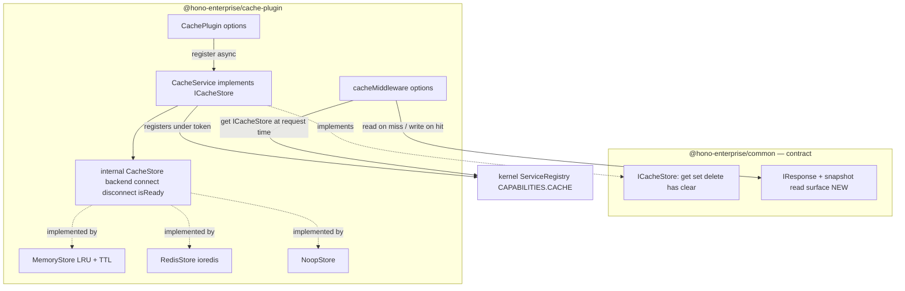
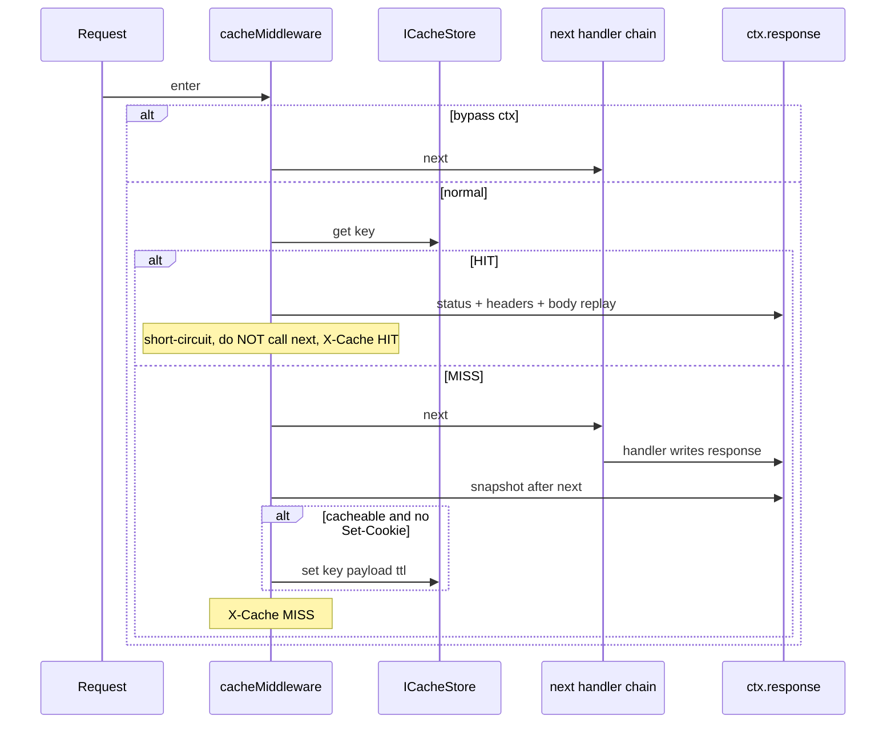

# Milestone 11 — Cache Plugin (`@hono-enterprise/cache-plugin`)

> **Status:** Planning. Branch to be created: `feat/m11-cache-plugin`. `main` is protected — all
> work (implementation + fixes) stays on this one branch until it merges via a single PR.

## 0. Objective & scope

Provide the cache capability with multiple stores, TTL management, and a **transparent
response-caching middleware**. Register an `ICacheStore` under `CAPABILITIES.CACHE`.

This milestone spans **two packages**:

1. **`@hono-enterprise/common`** — a small, additive public-API change: a read surface on
   `IResponse`.
2. **`@hono-enterprise/cache-plugin`** — the plugin, stores, service, and middleware.

Roadmap reference: `ROADMAP.md` → "Milestone 11: Cache Plugin".

---

## 1. Contracts verified from SOURCE (not names)

Every design below is checked against the committed source.

| Contract                                   | Source                                               | What it actually is                                                                                                                                                                                                                                |
| ------------------------------------------ | ---------------------------------------------------- | -------------------------------------------------------------------------------------------------------------------------------------------------------------------------------------------------------------------------------------------------- |
| `ICacheStore`                              | `packages/common/src/services/cache.ts:19`           | **5 methods only**: `get<T>(key): Promise<T\|null>`, `set<T>(key,value,ttlSeconds?): Promise<void>`, `delete(key): Promise<boolean>`, `has(key): Promise<boolean>`, `clear(): Promise<void>`. No `middleware`, no batch, no `incr`/`ttl`/`expire`. |
| `CAPABILITIES.CACHE`                       | `packages/common/src/tokens.ts`                      | `'cache'` (lowercase kebab; valid under `createCapabilityToken`).                                                                                                                                                                                  |
| `IResponse`                                | `packages/common/src/http.ts:83`                     | **Write-only today**: `status/header/appendHeader/json/text/send/redirect`. No read.                                                                                                                                                               |
| `MiddlewareFunction`                       | `packages/common/src/http.ts:192`                    | `(ctx, next) => void\|HandlerResult\|Promise<…>`; `next: () => Promise<void>` (returns **void**, not the handler result).                                                                                                                          |
| `IRequestContext.response`                 | `packages/common/src/http.ts:155`                    | `readonly`. Cannot be reassigned.                                                                                                                                                                                                                  |
| `ResponseBuilder.snapshot()`               | `packages/kernel/src/context/response.ts:73`         | **Already exists**, returns `{ status:number; headers:Headers; body:Uint8Array\|string\|null }`.                                                                                                                                                   |
| `ResponseBuilder.ended`                    | `packages/kernel/src/context/response.ts:82`         | getter; `executeChain` reads it via `ctx.response as Partial<ResponseBuilder>`.                                                                                                                                                                    |
| Kernel uses snapshot already               | `packages/kernel/src/application/application.ts:382` | `inject()` calls `response.snapshot()` to read the body → `InjectResponse`.                                                                                                                                                                        |
| `ResponseBuilder` NOT in kernel public API | `packages/kernel/src/index.ts:11`                    | Kernel exports only `createApplication` + app types. So a **separate package cannot** reach `ResponseBuilder` cleanly. ⇒ the snapshot read surface **must** be promoted to the public `IResponse` in `common`.                                     |

### 1.1 Why the milestone touches `common`

The transparent `cacheMiddleware` must capture and replay HTTP responses. Three blockers make that
impossible with today's contracts: (a) `IResponse` is write-only; (b) `ctx.response` is `readonly`
and `next()` returns `void` (middleware cannot see what the handler returned); (c) the only read
mechanism, `ResponseBuilder.snapshot()`, is a kernel **internal** (not exported, see
`kernel/src/index.ts`). A separate package reaching into `kernel/src/context/response.ts` via a
relative path would violate AI_GUIDELINES §2.1 ("no package imports another package's internal
modules").

**Decision (approved):** add a `snapshot()` read method to the public `IResponse` in `common`.
`ResponseBuilder` already implements it, so the kernel needs **no implementation change** — this
only formalizes the existing read seam the kernel already uses (`inject()`). Side benefit: this
unblocks the deferred **M39 HTTP server adapters** (whose scope note in ROADMAP.md explicitly cites
"no IResponse read surface").

---

## 2. Committed-doc conflicts — resolved HERE, shipped as named doc deliverables

(CLAUDE.md rule: when two committed documents disagree, the plan picks a side and lists the doc
correction as a PR deliverable — never silent.)

| #  | Conflict                                                                                                                                                                                    | Resolution (picked side)                                                                                                                                                                                                                                                                                 | Doc deliverable                                                                                                                                                                                     |
| -- | ------------------------------------------------------------------------------------------------------------------------------------------------------------------------------------------- | -------------------------------------------------------------------------------------------------------------------------------------------------------------------------------------------------------------------------------------------------------------------------------------------------------- | --------------------------------------------------------------------------------------------------------------------------------------------------------------------------------------------------- |
| C1 | PUBLIC_API.md "Cache Interface" defines `ICache` with **12 methods** (`getMany`/`setMany`/`deleteMany`/`incr`/`decr`/`ttl`/`expire` + the 5). The committed source `ICacheStore` has **5**. | **`ICacheStore` (5 methods) wins.** The extra 7 are cut: `incr`/`decr` are Redis-native and meaningless on Memory/Noop (a documented no-op returning 0 is a dead feature — violates "every interface method defines its behavior per implementation"); batch methods are not needed by any M11 consumer. | PUBLIC_API.md: rename `ICache`→`ICacheStore`, reduce the interface block to the 5 committed methods, fix `ctx.services.get<ICache>('cache')`→`get<ICacheStore>(CAPABILITIES.CACHE)` in the example. |
| C2 | ROADMAP.md M11 shows `cache.middleware({ ttl, key })`; PUBLIC_API.md imports a standalone `cacheMiddleware(...)`. `ICacheStore` has no `middleware` method.                                 | **Standalone `cacheMiddleware()` factory wins** (matches PUBLIC_API.md; keeps the store interface pure).                                                                                                                                                                                                 | ROADMAP.md M11 example: `cache.middleware(...)` → `cacheMiddleware({...})`.                                                                                                                         |
| C3 | ARCHITECTURE.md §cache-plugin says "Provide `ICache`", "Public API: `ICache`".                                                                                                              | Rename to `ICacheStore`.                                                                                                                                                                                                                                                                                 | ARCHITECTURE.md cache-plugin table: `ICache` → `ICacheStore` (Purpose, Responsibilities, Public API rows).                                                                                          |
| C4 | `IResponse` (write-only) vs the new `snapshot()` need.                                                                                                                                      | **Add `snapshot()` to public `IResponse`.**                                                                                                                                                                                                                                                              | PUBLIC_API.md HTTP abstractions + a note this unblocks M39.                                                                                                                                         |

All four corrections ship **in the same M11 PR** as code edits (never silent, never a follow-up).

---

## 3. Capability-token & plugin-name grammar (passes kernel constraints)

`createCapabilityToken` grammar: lowercase kebab-case, dot namespacing; **colons are illegal**
(CLAUDE.md). `plugin-resolver.ts` throws at startup on **duplicate plugin names** AND on **duplicate
capability providers**. Pattern mirrors M10 database-plugin exactly.

| Instance            | Token                                                      | Plugin name             |
| ------------------- | ---------------------------------------------------------- | ----------------------- |
| default             | `CAPABILITIES.CACHE` (`'cache'`)                           | `'cache-plugin'`        |
| named (multi-cache) | `createCapabilityToken('cache.<name>')` → `'cache.<name>'` | `'cache-plugin.<name>'` |

Two `CachePlugin({ name })` instances must use distinct `name` values → distinct tokens + distinct
plugin names → no startup throw. The default instance claims the bare `cache` token; only one
instance may be the default.

---

## 4. Architecture / data flow



**Middleware flow (the part that needed `snapshot()`):**



---

## 5. Design decisions (each behavior a test can assert has a home here)

### 5.1 `IResponse.snapshot()` (common — additive, no impl change)

- Add to the `IResponse` interface in `packages/common/src/http.ts`:
  ```typescript
  /** Returns an immutable snapshot of the built response (status, headers, body). */
  snapshot(): { readonly status: number; readonly headers: Headers; readonly body: Uint8Array | string | null };
  ```
- `ResponseBuilder` already implements this (kernel `response.ts:73`) — **no kernel _runtime_ edit**
  (the concrete's mutable `{status,…}` return is assignable to the `readonly`-fielded interface).
- Pure type addition ⇒ kernel tests already cover the behavior via `inject()`; add a common type
  test asserting `IResponse` includes `snapshot`.
- **⚠ NOT zero-impact — widening `IResponse` breaks every existing `IResponse` fake.**
  `deno task
  check` is workspace-wide, so four fixtures that construct an `IResponse` literal will
  fail to type-check until each adds a `snapshot()` method:
  - `packages/exceptions/test/fixtures/fake-runtime.ts:83`
  - `packages/validation-plugin/test/fixtures/fake-runtime.ts:96`
  - `packages/decorator-plugin/test/fixtures/fake-request-context.ts:38`
  - `packages/logger-plugin/test/unit/request-logger.test.ts:106`

  Per CLAUDE.md "test doubles must honor the real contract," each `snapshot()` must return the
  fixture's **tracked** status/headers/body (the values its write methods recorded), NOT a hardcoded
  `{status:200,…}` stub. This is a required deliverable of the M11 PR (see §6).

### 5.2 `CacheService` (the registered `ICacheStore`)

- Implements the committed 5-method `ICacheStore`.
- Wraps a backend `CacheStore` (internal interface below) and applies:
  - **key prefix — applied by `CacheService`** on the four keyed ops (`get`/`set`/`delete`/`has`):
    all keys become `${prefix}${key}`. **`clear()` is the exception** (it has no key argument): the
    service cannot scope a prefix it never passes down, so **the prefix is given to the backend at
    construction** and the backend's `clear()` scopes to it (§5.3). See the design note below.
  - **default TTL** — `set(key, value, ttlSeconds)` with no `ttlSeconds` uses the configured
    `defaultTtl` (seconds). A value of `undefined`/`0` ⇒ store default (Memory: no expiry).
- Registered under the derived token (§3).

> **Design decision — where the prefix lives (resolves the `clear()` gap).** Prefixing is _split_
> deliberately: `CacheService` prefixes the four keyed ops so a "dumb" backend never needs the
> prefix for `get`/`set`/`delete`/`has`; but `clear()` takes no key, so a backend that clears by
> scanning (Redis `SCAN MATCH ${prefix}*`) MUST know the prefix. Therefore **each backend is
> constructed with the (possibly empty) prefix** and uses it ONLY in `clear()`. This closes the "an
> interface method an implementation cannot support" gap (CLAUDE.md): without it,
> `RedisStore.clear()` would `SCAN *` + `DEL` and wipe every key on the server — other prefixes and
> other apps included. Memory's `clear()` still just empties its own map (each plugin instance owns
> its own `MemoryStore`, so the map only ever holds this instance's keys); the prefix is accepted
> but unused there, which is correct and must be noted so it does not read as a dead parameter.

### 5.3 Internal `CacheStore` backend (lifecycle-aware; NOT exported from `src/index.ts`)

```typescript
interface CacheStore { // internal, mirror of database IDatabaseAdapter
  connect(): Promise<void>;
  disconnect(): Promise<void>;
  isReady(): boolean;
  get<T>(key: string): Promise<T | null>; // receives already-prefixed key from CacheService
  set<T>(key: string, value: T, ttlSeconds?: number): Promise<void>; // already-prefixed key
  delete(key: string): Promise<boolean>; // already-prefixed key
  has(key: string): Promise<boolean>; // already-prefixed key
  clear(): Promise<void>; // scopes to the prefix given at construction (§5.2)
}
```

Each backend is **constructed with the configured `prefix`** (possibly `''`) so `clear()` can scope
to it; the four keyed ops still receive already-prefixed keys from `CacheService`. This is an
**internal** seam (file `src/stores/cache-store.ts`, not re-exported), so prefix/defaultTtl can be
unit-tested at the service layer and each backend's lifecycle/branching unit-tested directly.

### 5.4 `MemoryStore` — LRU + TTL

- `Map<string, Entry>` where `Entry = { value: T; expiresAt: number }` (monotonic `runtime.hrtime()`
  for `expiresAt` — **never `Date.now()`**, CLAUDE.md clock rule). Note: `hrtime()` is ms; TTL in
  seconds ⇒ `expiresAt = hrtime() + ttlSeconds*1000`.
- **LRU**: on `get` of a live entry, delete + re-insert (moves to MRU); on `set`, if
  `size > maxSize` evict the oldest (first Map key). `maxSize` default e.g. 1000.
- **TTL**: lazy expiry on read (`get`/`has` delete expired entries) — deterministic, needs no timer.
  `set(key, value)` with no `ttlSeconds` and no service default ⇒ entry never expires.
- `clear()` empties the map. Each plugin instance owns its own `MemoryStore`, so the map only ever
  holds this instance's (already-prefixed) keys ⇒ emptying it == clearing this prefix. The
  constructor `prefix` is accepted for interface parity but **intentionally unused** by Memory —
  note this in code so it does not read as a dead parameter (CLAUDE.md dead-option rule).

### 5.5 `RedisStore` — ioredis (decided)

- Client resolution mirrors M10 Prisma exactly: prefer injected `options.client`; else lazy
  `import('npm:ioredis@5.x')` (pinned version — confirm latest stable 5.x at implement time, e.g.
  `@5.6.x`). `validateClient()` checks the structural shape — the exact methods RedisStore calls:
  `get`, `set`, `del`, `exists`, `scan`, `quit` (no duplicates).
- Commands: `SET key val EX ttl` (omit `EX` when no TTL), `GET`, `DEL`, `EXISTS`, `clear()` →
  `SCAN MATCH ${prefix}*` + batch `DEL` (ioredis returns `[cursor, keys[]]` from `SCAN`).
- `connect()` calls client resolution + `client.connect()`; `disconnect()` calls `client.quit()`.
- The four keyed ops receive already-prefixed keys from `CacheService`; **`clear()` uses the
  construction-time `prefix`** to scope its `SCAN MATCH ${prefix}*` (§5.2). A store built with an
  empty prefix would scan `*` — so the plugin factory must always pass the resolved prefix (default
  `''` is acceptable only for a single-tenant Redis; document this in the RedisStore JSDoc).

### 5.6 `NoopStore` — testing

- `get`→`null`, `set`/`clear`→resolve, `delete`→`false`, `has`→`false`. `connect`/`disconnect`→noop.

### 5.6b Plugin lifecycle & health (explicit design home for the tests that assert them)

Mirrors `packages/database-plugin/src/plugin/database-plugin.ts` (verified against source):

- `optionalDependencies: ['logger']`; resolve an optional logger via `ctx.services.has('logger')`
  before `get` (never a hard dep).
- After building + `connect()`-ing the backend and registering the service under the token,
  **register a health indicator**: `ctx.health.register(`${token}`, …)` reporting `up`/`down` from a
  backend readiness check (`isReady()` / a lightweight ping).
- **Register shutdown**: `ctx.lifecycle.onClose(async () => backend.disconnect())`.
- These are asserted by §7 tests; this bullet is their design-decision home (CLAUDE.md: no test may
  assert behavior the design didn't specify). `IPluginContext` exposes
  `readonly health`/`readonly
  lifecycle` (`packages/common/src/plugin.ts:386,396`), so the surface
  exists.

### 5.7 `cacheMiddleware(options)` — transparent response cache

```typescript
interface CacheMiddlewareOptions {
  ttlSeconds?: number; // per-route TTL override (consumer: set call)
  key?: (ctx: IRequestContext) => string; // custom key (consumer: key generation)
  bypass?: (ctx: IRequestContext) => boolean; // skip cache (consumer: short-circuit)
  store?: string; // token, default CAPABILITIES.CACHE (consumer: service resolution)
  cacheableStatuses?: number[]; // default [200] (consumer: capture decision)
}
```

- Resolves the store at **request time** via
  `ctx.services.get<ICacheStore>(opts.store ?? CAPABILITIES.CACHE)` (route middleware is defined
  before `app.start()`, before the plugin registers the service — same pattern as the
  timing-middleware example, `http.ts:183`).
- **HIT**: read snapshot payload from cache → replay `ctx.response.status(s)`, copy headers (strip
  hop-by-hop: `connection, keep-alive, proxy-*, te, trailer, transfer-encoding, upgrade`), then set
  `X-Cache: HIT`, then write the body via **`send()` only** — decode the payload back to
  `Uint8Array` and call `ctx.response.send(bytes)`. **Do NOT replay via `json()`/`text()`**: both
  overwrite `content-type` (`application/json` / `text/plain; charset=utf-8`), clobbering the cached
  `content-type` header just copied and corrupting non-JSON replays. `send()` only defaults
  `content-type` when it is absent, so a copied `content-type` survives. **Do not call `next()`**
  (short-circuit — mandatory explicit test). A replay-fidelity test must assert the served
  `content-type` equals the originally-cached one for a non-JSON body (e.g. `text/html`).
- **MISS**: `await next()`; read `ctx.response.snapshot()`; if `status ∈ cacheableStatuses` and the
  response carries **no `set-cookie`** (security default; do not cache cookie-bearing responses),
  normalize to a serializable payload and `set(key, payload, ttl)`. Set `X-Cache: MISS`.
- **Default key** = `${request.method}:${request.url}` (url includes query ⇒ varies by query).
- Cached payload shape (store-portable, JSON-safe):
  `{ status, headers: Array<[string,string]>,
  body: string | null, bodyEncoding?: 'base64' }`.
  Bytes are base64-encoded so a Redis (JSON) store can persist them; Memory store stores the object
  directly. The encode/decode helpers live in `src/middleware/cache-middleware.ts` (or
  `src/utils/cache-payload.ts`) as an **internal seam** so the branches are unit-tested without a
  network.

### 5.8 Options — every option names its consumer (no dead options)

| Option                                | Consumer                                                  | Behavior                                                              |
| ------------------------------------- | --------------------------------------------------------- | --------------------------------------------------------------------- |
| `store` (`'memory'\|'redis'\|'noop'`) | plugin factory                                            | selects backend; default `'memory'`                                   |
| `name`                                | plugin factory                                            | derives token/plugin name (§3); default `'default'`                   |
| `options.url`                         | RedisStore                                                | connection URL                                                        |
| `options.client`                      | RedisStore                                                | injected ioredis client (skip lazy import)                            |
| `options.prefix`                      | CacheService (keyed ops) + backend ctor (`clear()` scope) | prepended to keys; passed to backend so `clear()` scopes to it (§5.2) |
| `options.defaultTtl`                  | CacheService                                              | seconds; used when `set` omits ttl                                    |
| `options.maxSize`                     | MemoryStore                                               | LRU cap                                                               |

(Any option accepted-but-unconsumed is a defect — grep each name beyond declare/assign, per
CLAUDE.md.)

---

## 6. Implementation files

### `packages/common` (additive contract change)

| File                      | Change                                              |
| ------------------------- | --------------------------------------------------- |
| `src/http.ts`             | Add `snapshot()` to `IResponse` (+ inline JSDoc).   |
| `test/unit/types.test.ts` | Add type assertion `IResponse` includes `snapshot`. |

**Required fixture updates — the `IResponse` widening breaks these until each implements
`snapshot()` (return the fixture's tracked status/headers/body, not a stub):**

| File                                                              | Change                                   |
| ----------------------------------------------------------------- | ---------------------------------------- |
| `packages/exceptions/test/fixtures/fake-runtime.ts`               | add `snapshot()` returning tracked state |
| `packages/validation-plugin/test/fixtures/fake-runtime.ts`        | add `snapshot()` returning tracked state |
| `packages/decorator-plugin/test/fixtures/fake-request-context.ts` | add `snapshot()` returning tracked state |
| `packages/logger-plugin/test/unit/request-logger.test.ts`         | add `snapshot()` to its fake response    |

### `packages/cache-plugin`

| File                                 | Purpose                                                                                                                                                                                 |
| ------------------------------------ | --------------------------------------------------------------------------------------------------------------------------------------------------------------------------------------- |
| `src/index.ts`                       | Barrel: `CachePlugin`, `CacheService`, `MemoryStore`, `RedisStore`, `NoopStore`, `cacheMiddleware`, option type exports. (Re-export `ICacheStore` type from common for convenience.)    |
| `src/interfaces/index.ts`            | `CacheStoreType`, `CachePluginOptions`, `CacheStoreOptions`, `CacheMiddlewareOptions`, `CachedResponsePayload`.                                                                         |
| `src/stores/cache-store.ts`          | Internal `CacheStore` backend interface (lifecycle + ops). **Not exported from index.**                                                                                                 |
| `src/stores/memory-store.ts`         | LRU + TTL `MemoryStore`.                                                                                                                                                                |
| `src/stores/redis-store.ts`          | ioredis-backed `RedisStore` (inject-or-lazy).                                                                                                                                           |
| `src/stores/noop-store.ts`           | `NoopStore`.                                                                                                                                                                            |
| `src/services/cache-service.ts`      | `CacheService implements ICacheStore` (prefix + defaultTtl + delegation).                                                                                                               |
| `src/plugin/cache-plugin.ts`         | `CachePlugin(options?)` factory (token/name derivation, backend creation, connect, register service, health indicator, `onClose` disconnect, optional logger). Mirrors database-plugin. |
| `src/middleware/cache-middleware.ts` | `cacheMiddleware(options)`, default key generator, payload encode/decode, replay helper.                                                                                                |
| `src/utils/cache-key.ts`             | `defaultCacheKey(ctx)` (extracted for unit-testing branching).                                                                                                                          |
| `deno.json`                          | already exists (`@hono-enterprise/cache-plugin`, exports `./src/index.ts`). Add `imports`/lint config if needed; **no hard dep on ioredis** (lazy `npm:` import).                       |

---

## 7. Test plan (every `src/` file mapped; 90% bar per file)

| Test file                                    | Covers                                        | Key assertions                                                                                                                                                                                                                                                                                                                                                                                                                |
| -------------------------------------------- | --------------------------------------------- | ----------------------------------------------------------------------------------------------------------------------------------------------------------------------------------------------------------------------------------------------------------------------------------------------------------------------------------------------------------------------------------------------------------------------------- |
| `packages/common/test/unit/types.test.ts`    | `IResponse.snapshot`                          | type-level presence.                                                                                                                                                                                                                                                                                                                                                                                                          |
| `test/unit/cache-plugin.test.ts`             | `cache-plugin.ts`                             | token derivation (default + named), backend selection switch, `optionalDependencies:['logger']`, registers service under token, health indicator registered, `onClose` calls disconnect, optional logger resolved.                                                                                                                                                                                                            |
| `test/unit/cache-service.test.ts`            | `cache-service.ts`                            | prefix applied on get/set/delete/has; `clear()` scoped to prefix; defaultTtl used when set omits ttl; delegation passthrough.                                                                                                                                                                                                                                                                                                 |
| `test/unit/memory-store.test.ts`             | `memory-store.ts`                             | set/get round-trip; TTL expiry (lazy, using `runtime.hrtime`-based clock); LRU eviction at `maxSize`; MRU promotion on get; `has`/`delete`/`clear`; expired entry not returned.                                                                                                                                                                                                                                               |
| `test/unit/redis-store.test.ts`              | `redis-store.ts`                              | **branching via injected fake ioredis client**: `resolveClient` prefers `options.client`; `validateClient` rejects bad shape; SET emits `EX` only with ttl; GET/DEL/EXISTS translation; `clear()` uses SCAN+DEL; connect/disconnect calls. + **one guarded REAL-import test** (`import('npm:ioredis@5.x')`, `it.skip`/guard when absent) mirroring M9 pino / M10 discovery precedent — a stubbed fake is never the only path. |
| `test/unit/noop-store.test.ts`               | `noop-store.ts`                               | all ops resolve/null/false.                                                                                                                                                                                                                                                                                                                                                                                                   |
| `test/unit/cache-key.test.ts`                | `cache-key.ts`                                | default key varies by method + url + query; custom key honored.                                                                                                                                                                                                                                                                                                                                                               |
| `test/unit/cache-middleware.test.ts`         | `cache-middleware.ts` + payload encode/decode | HIT short-circuits and **next is NOT called** (mandatory); MISS captures via `snapshot()` and stores; `bypass` skips cache; non-`cacheableStatuses` not stored; `set-cookie` responses not cached; replay fidelity (status+headers+body) incl hop-by-hop stripping; `X-Cache` header HIT/MISS; payload encode/decode round-trip for string + bytes(base64).                                                                   |
| `test/integration/cache-integration.test.ts` | end-to-end through real kernel `app.inject()` | CachePlugin(memory) under `CAPABILITIES.CACHE`; route with `cacheMiddleware`; **1st req MISS → stores; 2nd req HIT → served from cache, handler NOT invoked** (READ-BACK through the public API — CLAUDE.md "read it back"); named multi-instance cache distinct token.                                                                                                                                                       |
| `test/fixtures/fake-ioredis-client.ts`       | redis-store test                              | records calls; honors structural `CacheStore`/ioredis shape (per "test doubles honor the real contract").                                                                                                                                                                                                                                                                                                                     |

External-dep (ioredis) coverage rule (CLAUDE.md): one guarded REAL-import test + the branching logic
around the import unit-tested via the injected-client seam (`resolveClient`/`validateClient`).

---

## 8. Public API / doc deliverables (ship in same PR)

- `PUBLIC_API.md`: (C1) `ICache`→`ICacheStore`, 5-method interface; (C2) standalone
  `cacheMiddleware`; (C4) document `IResponse.snapshot()`; update the cache programmatic example to
  `ctx.services.get<ICacheStore>(CAPABILITIES.CACHE)`.
- `ARCHITECTURE.md`: (C3) cache-plugin table `ICache`→`ICacheStore`; note `snapshot()` unblocks M39.
- `ROADMAP.md`: (C2) M11 `cache.middleware(...)`→`cacheMiddleware(...)`; mark M11 deliverables
  `[x]`.
- `CLAUDE.md`: flip "Current status" M11 → complete, "Next milestone" → M12 (in the PR, before
  merge).
- JSDoc on every new export (AI_GUIDELINES §10).

---

## 9. Verification gates (must all pass; per-file 90% enforced by reading the table)

```bash
git branch --show-current   # MUST be feat/m11-cache-plugin, never main
deno task fmt:check
deno task lint
deno task check
deno task test
deno task test:coverage   # read ANSI-stripped per-file table; ≥90% branch/function/line every src file
```

End-of-task grep (must be empty, comments excepted):

```bash
grep -rn "new Function\|eval(\| require(\|as any\|@ts-ignore\|Date.now()\|globalThis.__" packages/cache-plugin/src packages/common/src
```

---

## 10. Risks & mitigations

- **Response read seam is a public contract change — additive at runtime, but a BREAKING type change
  for existing `IResponse` fakes.** `ResponseBuilder` needs no runtime edit (it already implements
  `snapshot()`; kernel `inject()` already uses it), but the workspace-wide `deno task check` will
  fail on four existing `IResponse` fixtures until each implements `snapshot()` (see §5.1 / §6).
  Mitigation: update all four in the same PR, returning each fixture's tracked state. Verify with
  `deno task check` across the whole workspace, not just the two changed packages.
- **Redis serialization of bytes.** Mitigation: middleware base64-encodes bytes into a JSON-safe
  payload before `set`; Memory store stores the object as-is.
- **Caching `set-cookie` responses.** Mitigation: default skip; documented + tested.
- **Monotonic clock for TTL.** Mitigation: `runtime.hrtime()` only; never `Date.now()` (gates do not
  catch `Date.now()` — on you).
- **`next()` returns void.** Mitigation: capture via `ctx.response.snapshot()` after `await next()`,
  not from the handler return value.

## 11. Out of scope

- Cache decorators (`@Cacheable`) — decorator-plugin territory; not in M11 ROADMAP deliverables.
- Hot reload, distributed invalidation, cache tagging — not in scope.
