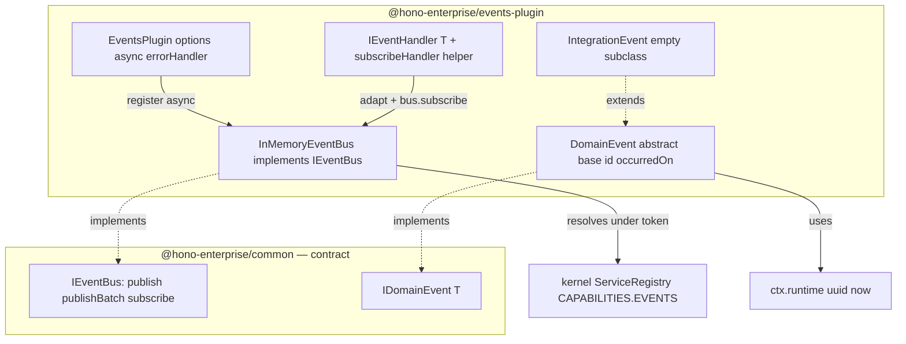
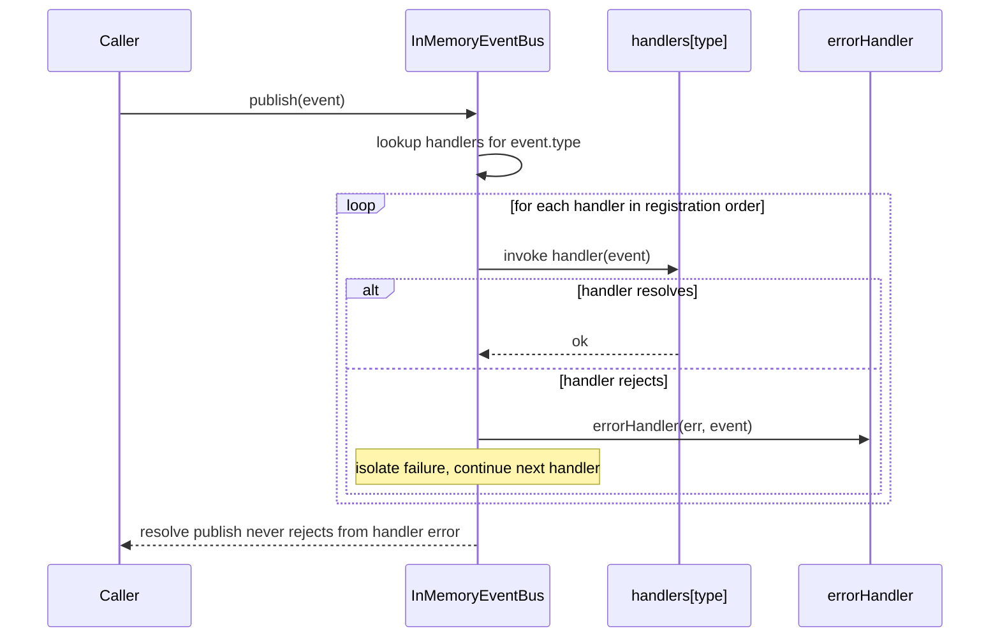

# Milestone 12 — Events Plugin (`@hono-enterprise/events-plugin`)

> **Status:** Planning. Branch to be created: `feat/m12-events-plugin`. `main` is protected — all
> work (implementation + fixes) stays on this one branch until it merges via a single PR.

## 0. Objective & scope

Provide the in-memory domain event bus capability. Register an
[`IEventBus`](../../packages/common/src/services/events.ts:60) under `CAPABILITIES.EVENTS`, with
publish/subscribe, batch publishing, error isolation, and a `DomainEvent` base class for consumers
to extend.

This milestone spans **two packages**:

1. **`@hono-enterprise/common`** — one small, additive public-API change: `publishBatch` on
   `IEventBus` (ROADMAP tests it; PUBLIC_API.md already documents it; no existing implementors to
   break — see §1).
2. **`@hono-enterprise/events-plugin`** — the plugin, in-memory bus, event base classes, and
   class-based handler helper.

Roadmap reference: `ROADMAP.md` → "Milestone 12: Events Plugin — Event Bus and Domain Events".

**In-memory only.** ARCHITECTURE.md §events-plugin: "In-memory only; for distributed events, use
messaging plugin." Cross-service/integration transport is the messaging capability (M14), not this
milestone.

---

## 1. Contracts verified from SOURCE (not names)

Every design below is checked against the committed source.

| Contract                    | Source                                      | What it actually is                                                                                                                                                                                                         |
| --------------------------- | ------------------------------------------- | --------------------------------------------------------------------------------------------------------------------------------------------------------------------------------------------------------------------------- |
| `IDomainEvent<T>`           | `packages/common/src/services/events.ts:17` | **6 fields**: `readonly type: string`, `id: string`, `occurredOn: Date`, `data: T`, `aggregateId?: string`, `version?: number`. An **interface**, not a class.                                                              |
| `IEventBus`                 | `packages/common/src/services/events.ts:60` | **2 methods only**: `publish<T>(event: IDomainEvent<T>): Promise<void>`, `subscribe<T>(type: string, handler: EventHandler<T>): Unsubscribe`. NO `publishBatch`, NO `unsubscribe(sub)`, NO `getSubscriptions`.              |
| `EventHandler<T>`           | `packages/common/src/services/events.ts:39` | `(event: IDomainEvent<T>) => void \| Promise<void>`.                                                                                                                                                                        |
| `Unsubscribe`               | `packages/common/src/services/events.ts:46` | `() => void` (a function, NOT a `Subscription` object).                                                                                                                                                                     |
| `CAPABILITIES.EVENTS`       | `packages/common/src/tokens.ts:53`          | `'events'` (lowercase kebab; valid under `createCapabilityToken`).                                                                                                                                                          |
| `IEventBus` implementors    | workspace grep `IEventBus`                  | **None** — only the contract definition + a doc example. Adding `publishBatch` is **pure additive**, breaks nothing (no fakes to update, unlike M11's `snapshot()`).                                                        |
| `ctx.health.register`       | `packages/common/src/plugin.ts:163`         | `register(name: string, indicator: HealthIndicatorFn): void`.                                                                                                                                                               |
| `ctx.lifecycle.onClose`     | `packages/common/src/plugin.ts:304`         | `onClose(fn: () => void \| Promise<void>): void`. ARCHITECTURE.md §lifecycle: "Event listeners are cleaned up on shutdown."                                                                                                 |
| `PLUGIN_PRIORITY.NORMAL`    | `packages/common/src/types.ts:84`           | `500` — events is an ordinary capability plugin.                                                                                                                                                                            |
| `IRuntimeServices.uuid/now` | `packages/common/src/runtime.ts`            | `uuid(): string`, `now(): number` (epoch ms). Used for event `id`/`occurredOn`. **Never `Date.now()` outside runtime** (CLAUDE.md clock rule). `occurredOn` is a wall-clock `Date` by contract ⇒ `new Date(runtime.now())`. |

### 1.1 Why the milestone touches `common`

ROADMAP.md M12 lists "Batch publishing" as a required test, and PUBLIC_API.md (line 1137) documents
`publishBatch(events: DomainEvent[])`. But the committed
[`IEventBus`](../../packages/common/src/services/events.ts:60) has no `publishBatch`. If
`publishBatch` lives only on the concrete bus class, every consumer must cast
`ctx.services.get<IEventBus>(CAPABILITIES.EVENTS)` to reach it — a leaky, fragile pattern.

**Decision (approved by user):** add `publishBatch` to the public `IEventBus` in `common`. This is a
**pure additive** change (no existing implementors — verified in §1), so unlike M11's `snapshot()`
it breaks **zero** fixtures. The concrete `InMemoryEventBus` implements all three methods.

---

## 2. Committed-doc conflicts — resolved HERE, shipped as named doc deliverables

(CLAUDE.md rule: when two committed documents disagree, the plan picks a side and lists the doc
correction as a PR deliverable — never silent.)

| #  | Conflict                                                                                                                                                                                                                                                                               | Resolution (picked side)                                                                                                                                                                                                                                                                                                                                                                                                            | Doc deliverable                                                                                                                                                |
| -- | -------------------------------------------------------------------------------------------------------------------------------------------------------------------------------------------------------------------------------------------------------------------------------------- | ----------------------------------------------------------------------------------------------------------------------------------------------------------------------------------------------------------------------------------------------------------------------------------------------------------------------------------------------------------------------------------------------------------------------------------- | -------------------------------------------------------------------------------------------------------------------------------------------------------------- |
| C1 | PUBLIC_API.md "Event Interface" (line 1135) defines `IEventBus` with **5 methods** (`publishBatch`, `subscribe` returning a `Subscription` object, `unsubscribe(subscription)`, `getSubscriptions`). The committed source has **2** (`publish`, `subscribe` → `Unsubscribe` function). | **Committed source wins.** Add only `publishBatch` (ROADMAP tests it). **Cut** `unsubscribe(subscription)` and `getSubscriptions` — they conflict with the `Unsubscribe`-function return and add introspection surface no M12 consumer needs (a documented dead option — violates "every interface method defines its behavior per implementation").                                                                                | PUBLIC_API.md: rewrite the "Event Interface" block to `publish`, `publishBatch`, `subscribe` (returns `Unsubscribe`); remove `unsubscribe`/`getSubscriptions`. |
| C2 | PUBLIC_API.md shows `subscribe<T extends DomainEvent>(type, handler): Subscription`. Committed source is `subscribe<T>(type, handler): Unsubscribe`.                                                                                                                                   | **`Unsubscribe`-function wins** (committed source). The `Subscription`-object form does not exist.                                                                                                                                                                                                                                                                                                                                  | PUBLIC_API.md: correct the subscribe signature + the `new UserCreatedEvent(...)` publish example to construct via the new `DomainEvent` base (see §5.2).       |
| C3 | ROADMAP.md M12 lists `src/events/integration-event.ts`, but ARCHITECTURE.md says events is **in-memory only** (integration transport = messaging).                                                                                                                                     | **Provide `IntegrationEvent<T>` as an EMPTY semantic subclass** of `DomainEvent` — NO `isIntegrationEvent` boolean (a field nothing reads in M12 would be dead surface). M14's messaging bridge discriminates cross-service events via `event instanceof IntegrationEvent`; the class _type_ is the consumed surface. Tests construct, publish, and subscribe an `IntegrationEvent` subclass (exercised, not declared-and-ignored). | No doc conflict to flip — document `IntegrationEvent` in PUBLIC_API.md §EventsPlugin; JSDoc names the M14 `instanceof`-based bridge intent.                    |
| C4 | ROADMAP.md M12 `DomainEvent` doc-block shows `aggregateId`/`version` as non-optional `readonly`; committed `IDomainEvent` has them **optional** (`aggregateId?`, `version?`).                                                                                                          | **Committed optional form wins.** `DomainEvent` base accepts them as optional constructor args, omits from the object when not supplied (honors `exactOptionalPropertyTypes`).                                                                                                                                                                                                                                                      | PUBLIC_API.md "Domain Event" example: keep optional fields optional.                                                                                           |

All corrections ship **in the same M12 PR** as code edits (never silent, never a follow-up).

---

## 3. Capability-token & plugin-name grammar (passes kernel constraints)

`createCapabilityToken` grammar: lowercase kebab-case, dot namespacing; **colons are illegal**
(CLAUDE.md). `plugin-resolver.ts` throws at startup on **duplicate plugin names** AND on **duplicate
capability providers**.

| Instance | Token                              | Plugin name       |
| -------- | ---------------------------------- | ----------------- |
| sole     | `CAPABILITIES.EVENTS` (`'events'`) | `'events-plugin'` |

**Single instance only — no `name` option.** ROADMAP shows no multi-instance events config and
ARCHITECTURE.md's "override `events` token" extension point is satisfied by registering a different
plugin under the same token with `override: true` (not by naming). Adding a `name` option with no
ROADMAP consumer would be a dead option (CLAUDE.md) — cut it. Two `EventsPlugin()` instances both
claim the bare `events` token + `events-plugin` name → the second throws at startup (duplicate
provider + duplicate name) — that is correct kernel behavior; document it, do not work around it.

---

## 4. Architecture / data flow



**Publish flow (async = false, the default):**



When `async: true`, the same per-handler invocation happens but is **not awaited** by `publish` —
`publish` resolves immediately and handler errors are caught and routed to `errorHandler`
asynchronously (fire-and-forget).

---

## 5. Design decisions (each behavior a test can assert has a home here)

### 5.1 `IEventBus.publishBatch` (common — additive, zero breakage)

Add to [`IEventBus`](../../packages/common/src/services/events.ts:60) in
`packages/common/src/services/events.ts`:

```typescript
/**
 * Publishes multiple events, each to its own subscribers.
 *
 * Under the default (synchronous) dispatch policy, events are published in
 * array order and every handler of event *i* settles before event *i+1*
 * begins (deterministic ordering). Under `async: true` dispatch, all events
 * are dispatched fire-and-forget. Accepts a heterogeneous batch — events of
 * differing payload types.
 *
 * @param events - The events to publish, in array order
 */
publishBatch(events: IDomainEvent[]): Promise<void>;
```

- Pure type addition ⇒ no runtime effect on existing code (no implementors exist).
- **Non-generic on purpose.** A batch is heterogeneous (the §7 integration test publishes two
  distinct event types); a single `<T>` would collapse to a useless union and buys nothing. This
  also matches PUBLIC_API.md's documented `publishBatch(events: DomainEvent[])`. `publish<T>` stays
  generic — a single event benefits from inferring its payload type. `IDomainEvent<{…}>` is
  assignable to `IDomainEvent` (= `IDomainEvent<unknown>`, covariant `readonly data`), so a mixed
  batch type-checks.
- `packages/common/test/unit/types.test.ts`: add a type assertion that `IEventBus` includes
  `publishBatch`.

### 5.2 `DomainEvent` — abstract base + runtime-bound factory (plugin; implements `IDomainEvent`)

`src/events/domain-event.ts`. `id`/`occurredOn` MUST come from `IRuntimeServices` (CLAUDE.md clock
rule + runtime independence), yet PUBLIC_API/ROADMAP document the ergonomic
`new UserCreatedEvent(data)` with no `runtime` in scope. **One implementation, two entry points**
(CLAUDE.md), pinned as follows — no other mechanism is used:

**(1) `DomainEvent<T>` — the single implementation.** An exported abstract class implementing
`IDomainEvent<T>` whose constructor takes `runtime` explicitly. This is the ONLY place
`id`/`occurredOn` are generated:

```typescript
abstract class DomainEvent<T = unknown> implements IDomainEvent<T> {
  abstract readonly type: string;
  readonly id: string;
  readonly occurredOn: Date;
  readonly data: T;
  readonly aggregateId?: string; // set only when supplied (exactOptionalPropertyTypes)
  readonly version?: number; // set only when supplied
  constructor(
    runtime: IRuntimeServices,
    data: T,
    opts?: { aggregateId?: string; version?: number },
  ) {
    this.id = runtime.uuid();
    this.occurredOn = new Date(runtime.now()); // wall-clock; never Date.now()
    this.data = data;
    if (opts?.aggregateId !== undefined) this.aggregateId = opts.aggregateId;
    if (opts?.version !== undefined) this.version = opts.version;
  }
}
```

**(2) `defineDomainEvent(runtime)` — the ergonomic entry point** (the form PUBLIC_API shows). Called
once per app from `ctx.runtime`; returns runtime-bound abstract base classes so subclasses construct
as `new X(data)`. Both bases `extends` the class in (1) and call `super(runtime, …)` — there is NO
second `id`/`occurredOn` implementation:

```typescript
// returns runtime-bound { DomainEvent, IntegrationEvent } abstract generic bases.
// (Exact generic typing of the returned classes is an implementation detail; `deno task check`
//  confirms it — the plan does not pin a possibly-wrong type literal here.)
function defineDomainEvent(runtime: IRuntimeServices): {
  DomainEvent: /* runtime-bound abstract base extending DomainEvent<T> */;
  IntegrationEvent: /* runtime-bound abstract base extending IntegrationEvent<T> */;
};
```

Consumer snippet (this EXACT shape is what PUBLIC_API.md's example is rewritten to — §8):

```typescript
const { DomainEvent } = defineDomainEvent(ctx.runtime);
class UserCreated extends DomainEvent<{ userId: string; email: string }> {
  readonly type = 'UserCreated';
}
const event = new UserCreated({ userId: '123', email: 'john@example.com' });
// event.id / event.occurredOn populated from runtime; event.data is typed
```

- `aggregateId`/`version` are set only when `opts` supplies them (so `'aggregateId' in event` is
  `false` when omitted — `exactOptionalPropertyTypes`).
- The raw `DomainEvent` (1) is also exported directly — for `instanceof` typing and for callers that
  already hold `runtime`. Bound subclasses from (2) are still `instanceof DomainEvent`, so the M14
  `instanceof` discrimination (§5.3) works across both entry points.
- **Both entry points are tested under a non-default config** (with `aggregateId`/`version` supplied
  AND omitted): raw `new Subclass(runtime, data, opts)` and bound `new Subclass(data, opts)` must
  produce identical field shapes (CLAUDE.md "one capability, two entry points, one implementation").

### 5.3 `IntegrationEvent` — semantic subclass (plugin; extends `DomainEvent`)

`src/events/integration-event.ts`. An **empty** abstract subclass of `DomainEvent` — no added
fields. It is a forward-looking _type_ marker: M14's messaging bridge discriminates cross-service
events via `event instanceof IntegrationEvent` and forwards them to a broker. The in-memory bus
publishes it like any other event.

```typescript
abstract class IntegrationEvent<T = unknown> extends DomainEvent<T> {}
```

- **No `isIntegrationEvent` boolean.** A marker field nothing reads in M12 would be dead surface
  (CLAUDE.md: every field must be read beyond declare/assign). The subclass _identity_ is the
  discriminator, and it is genuinely consumed — instantiated and published in tests now, matched by
  `instanceof` in M14.
- Constructed via the same `defineDomainEvent(runtime)` bound base (§5.2), so
  `new SomeIntegrationEvent(data)` works with the runtime-generated `id`/`occurredOn`.
- Unit + integration tests construct, publish, and subscribe to an `IntegrationEvent` subclass and
  assert `instanceof IntegrationEvent` (and `instanceof DomainEvent`) + normal dispatch.
- JSDoc states the M14 `instanceof`-based bridge intent explicitly, so it is not read as a no-op.

### 5.4 `InMemoryEventBus` — the registered `IEventBus`

`src/bus/in-memory-event-bus.ts`. Implements all three `IEventBus` methods.

- **Storage:** `Map<string, EventHandler[]>` (registration order preserved by push).
- **`subscribe(type, handler): Unsubscribe`** — appends, returns a function that removes the exact
  handler reference (splices it out; idempotent if called twice).
- **`publish(event): Promise<void>`** — looks up `event.type`; for each handler **in registration
  order**:
  - `async: false` (default): `await` each handler; on rejection, call `errorHandler(err, event)`
    and continue to the next handler (one failing handler never aborts siblings or rejects
    `publish`).
  - `async: true`: invoke each handler WITHOUT awaiting (fire-and-forget); attach a `.catch` that
    routes to `errorHandler`. `publish` resolves immediately after dispatching.
  - **`publish` never rejects due to a handler error** — errors are always isolated through
    `errorHandler`.
- **`publishBatch(events): Promise<void>`** — dispatch each event in array order. When
  `async: false`, awaits per-event dispatch (all handlers of event _i_ settle before event _i+1_
  begins) → deterministic ordering asserted by the "Event ordering" ROADMAP test. When
  `async: true`, all events dispatch without awaiting.
- **`errorHandler` default:** if none supplied, default to "log via the optional `logger` capability
  if present, else no-op." Resolved once at construction (the plugin passes a bound default).
- **Event ordering test home:** registration order within a type; array order across a batch.
- **Async-mode test seam (decided here, not left to Risks):** the sync-await vs fire-and-forget
  branch lives behind ONE internal `dispatch` function (unit-tested for both modes). In
  `async: true` mode the concrete `InMemoryEventBus` exposes an internal `whenIdle(): Promise<void>`
  that resolves once all in-flight fire-and-forget handler promises settle. It is **concrete-class
  only — NOT on `IEventBus`** — and exists so async-mode tests assert handler side effects
  deterministically (`publish` resolves first, then `await bus.whenIdle()`, then assert).

### 5.5 `IEventHandler` + `subscribeHandler` (plugin; class-based handler helper)

`src/handlers/event-handler.ts` (mandated by the ROADMAP M12 file list). Provides a programmatic
class-based handler pattern — a public helper consumers call directly. **M9 does NOT ship an
`@EventHandler` decorator** (verified: no `@EventHandler` in `packages/decorator-plugin/src`; M9
shipped decorator _primitives_ like `createDecorator`). A decorator-based `@EventHandler` is future
work that would wrap this helper; this milestone ships only the programmatic surface:

```typescript
interface IEventHandler<T = unknown> {
  handle(event: IDomainEvent<T>): void | Promise<void>;
}
/** Adapts a class-based handler to EventHandler and subscribes it. Returns the Unsubscribe. */
function subscribeHandler<T>(bus: IEventBus, type: string, handler: IEventHandler<T>): Unsubscribe;
```

- `subscribeHandler` calls `bus.subscribe(type, (e) => handler.handle(e))`. Consumed (unit-tested) —
  not dead.

### 5.6 Plugin lifecycle & health (explicit design home for the tests that assert them)

Mirrors `packages/cache-plugin/src/plugin/cache-plugin.ts` (verified against source):

- `optionalDependencies: ['logger']`; resolve an optional logger via `ctx.services.has('logger')`
  before `get` (never a hard dep).
- Build the `InMemoryEventBus` (threading `ctx.runtime` + the resolved logger into the default
  errorHandler), register it under `CAPABILITIES.EVENTS`.
- **Register a health indicator**: `ctx.health.register('events', …)` reporting `status: 'up'` (the
  in-memory bus is always ready). `data: { handlers: <count of subscribed types> }`.
- **Register shutdown**: `ctx.lifecycle.onClose(async () => bus.clear())` — `clear()` removes all
  subscriptions (ARCHITECTURE.md "Event listeners are cleaned up on shutdown"). `clear()` is an
  internal method on `InMemoryEventBus` (NOT on `IEventBus` — tested directly on the concrete
  class).
- These are asserted by §7 tests; this bullet is their design-decision home (CLAUDE.md: no test may
  assert behavior the design did not specify).

### 5.7 Options — every option names its consumer (no dead options)

| Option         | Consumer           | Behavior                                                                                                                                                                    |
| -------------- | ------------------ | --------------------------------------------------------------------------------------------------------------------------------------------------------------------------- |
| `async`        | `InMemoryEventBus` | `false` (default): publish/publishBatch await all handlers before resolving. `true`: fire-and-forget, publish resolves immediately, errors routed to errorHandler async.    |
| `errorHandler` | `InMemoryEventBus` | `(error: unknown, event: IDomainEvent) => void`. Default: log via optional logger if present, else no-op. Always invoked on a handler rejection; never lets publish reject. |

(Any option accepted-but-unconsumed is a defect — grep each name beyond declare/assign, per
CLAUDE.md. There are exactly two options and both are consumed.)

---

## 6. Implementation files

### `packages/common` (additive contract change)

| File                      | Change                                                                                                                                                                                   |
| ------------------------- | ---------------------------------------------------------------------------------------------------------------------------------------------------------------------------------------- |
| `src/services/events.ts`  | Add `publishBatch(events: IDomainEvent[]): Promise<void>` to `IEventBus` (+ inline JSDoc). Non-generic — a batch is heterogeneous (`publish<T>` stays generic for a single typed event). |
| `test/unit/types.test.ts` | Add type assertion that `IEventBus` includes `publishBatch`.                                                                                                                             |

**Breakage check (unlike M11):** adding a method to `IEventBus` breaks only classes that
`implements
IEventBus`. Workspace grep confirms **none exist** — no fixtures to update.

### `packages/events-plugin`

| File                              | Purpose                                                                                                                                                                                                                                                                                                                                                                                                                                                                                       |
| --------------------------------- | --------------------------------------------------------------------------------------------------------------------------------------------------------------------------------------------------------------------------------------------------------------------------------------------------------------------------------------------------------------------------------------------------------------------------------------------------------------------------------------------- |
| `src/index.ts`                    | Barrel: `EventsPlugin`, `InMemoryEventBus`, `DomainEvent`, `IntegrationEvent` (raw abstract bases), `defineDomainEvent` (returns runtime-bound `{ DomainEvent, IntegrationEvent }`), `IEventHandler`, `subscribeHandler`, option types. **Type-only** re-export of `IEventBus`/`IDomainEvent`/`EventHandler`/`Unsubscribe` from common for convenience — PUBLIC_API.md keeps `common` as their single owning source; the EventsPlugin section marks them as re-exports, not new declarations. |
| `src/interfaces/index.ts`         | `EventsPluginOptions`, `EventDispatchOptions` (the bound async/errorHandler shape passed into the bus).                                                                                                                                                                                                                                                                                                                                                                                       |
| `src/events/domain-event.ts`      | Abstract `DomainEvent<T>` base class (+ `defineDomainEvent(type, runtime)` factory for ergonomic `new XEvent(data)` construction).                                                                                                                                                                                                                                                                                                                                                            |
| `src/events/integration-event.ts` | `IntegrationEvent<T>` empty semantic subclass of `DomainEvent` (no marker field; discriminated by `instanceof` in M14).                                                                                                                                                                                                                                                                                                                                                                       |
| `src/bus/in-memory-event-bus.ts`  | `InMemoryEventBus implements IEventBus` — `publish`, `publishBatch`, `subscribe`, internal `clear()`.                                                                                                                                                                                                                                                                                                                                                                                         |
| `src/handlers/event-handler.ts`   | `IEventHandler<T>` interface + `subscribeHandler(bus, type, handler)` adapter helper.                                                                                                                                                                                                                                                                                                                                                                                                         |
| `src/plugin/events-plugin.ts`     | `EventsPlugin(options?)` factory (token/name fixed per §3, build bus, register service, health indicator, `onClose` clear, optional logger). Mirrors cache-plugin.                                                                                                                                                                                                                                                                                                                            |
| `deno.json`                       | Already exists (`@hono-enterprise/events-plugin`, exports `./src/index.ts`). Add lint config if needed; **zero external deps** (pure in-memory).                                                                                                                                                                                                                                                                                                                                              |

---

## 7. Test plan (every `src/` file mapped; 90% bar per file)

| Test file                                     | Covers                               | Key assertions                                                                                                                                                                                                                                                                                                                                                                                                                                                                                                                                                                                                                                                |
| --------------------------------------------- | ------------------------------------ | ------------------------------------------------------------------------------------------------------------------------------------------------------------------------------------------------------------------------------------------------------------------------------------------------------------------------------------------------------------------------------------------------------------------------------------------------------------------------------------------------------------------------------------------------------------------------------------------------------------------------------------------------------------- |
| `packages/common/test/unit/types.test.ts`     | `IEventBus.publishBatch`             | type-level presence.                                                                                                                                                                                                                                                                                                                                                                                                                                                                                                                                                                                                                                          |
| `test/unit/domain-event.test.ts`              | `domain-event.ts`                    | `id` from runtime.uuid (distinct across instances); `occurredOn` is a `Date` from runtime.now; `type` set by subclass; `data` round-trips; `aggregateId`/`version` **absent** when omitted (assert `'aggregateId' in e === false`) and **present** when supplied. **Both entry points produce identical field shapes:** raw `new Subclass(runtime, data, opts)` AND bound `new Subclass(data, opts)` from `defineDomainEvent(runtime).DomainEvent`, each tested with opts supplied and omitted; a bound instance is `instanceof DomainEvent`.                                                                                                                 |
| `test/unit/integration-event.test.ts`         | `integration-event.ts`               | a subclass is `instanceof IntegrationEvent` AND `instanceof DomainEvent`; constructible via the bound base (`new X(data)`); publishable on the bus (dispatched to subscribers like any event). No boolean marker to assert.                                                                                                                                                                                                                                                                                                                                                                                                                                   |
| `test/unit/in-memory-event-bus.test.ts`       | `in-memory-event-bus.ts`             | publish→subscribe round-trip (READ-BACK: handler invoked with the published event); multiple handlers fire in **registration order**; `subscribe` Unsubscribe removes the handler (idempotent); `publishBatch` dispatches a **heterogeneous** batch (two payload types) in **array order**; `async:false` awaits handlers; `async:true` fire-and-forget (publish resolves before handler completes; `await bus.whenIdle()` then assert side effects); handler rejection → errorHandler invoked, siblings continue, publish resolves (no rejection); default errorHandler logs via logger when present, silent otherwise; `clear()` removes all subscriptions. |
| `test/unit/event-handler.test.ts`             | `event-handler.ts`                   | `IEventHandler.handle` invoked on publish via `subscribeHandler`; returned Unsubscribe stops delivery.                                                                                                                                                                                                                                                                                                                                                                                                                                                                                                                                                        |
| `test/unit/events-plugin.test.ts`             | `events-plugin.ts`                   | token = `CAPABILITIES.EVENTS`, name = `events-plugin`, `provides:['events']`, `optionalDependencies:['logger']`, `priority: PLUGIN_PRIORITY.NORMAL`; registers an `IEventBus` under the token (READ-BACK: resolve + publish/subscribe works); health indicator registered (`'events'`, status `up`); `onClose` calls `clear()` (handler list empties); options `async`/`errorHandler` wired into the constructed bus (assert via a published failing handler under both modes); optional logger resolved only when present.                                                                                                                                   |
| `test/integration/events-integration.test.ts` | end-to-end via kernel `app.inject()` | EventsPlugin under `CAPABILITIES.EVENTS`; a route handler publishes a `UserCreated` event; a subscriber (registered in a second plugin) records it; **1st request → subscriber fires, response 201** (READ-BACK through the public API — CLAUDE.md "read it back"); `publishBatch` of two event types reaches both subscribers in order; a failing handler does not break the request or sibling handlers.                                                                                                                                                                                                                                                    |
| `test/fixtures/fake-runtime.ts`               | bus/domain-event tests               | `IRuntimeServices` fake with deterministic `uuid()` (counter) and `now()` (fixed epoch) — so `id`/`occurredOn` are assertable. Honors the real contract (per "test doubles honor the real contract"). Mirrors existing fake-runtime fixtures.                                                                                                                                                                                                                                                                                                                                                                                                                 |

No external optional dep ⇒ **no guarded REAL-import test** needed (unlike M11 ioredis). The bus is
pure in-memory and fully exercised by fakes.

---

## 8. Public API / doc deliverables (ship in same PR)

- `PUBLIC_API.md`: (C1/C2) rewrite the "Event Interface" block to the committed `IEventBus` +
  non-generic `publishBatch(events: IDomainEvent[])` (remove `unsubscribe`/`getSubscriptions`, fix
  `subscribe` to return `Unsubscribe`); (C4) keep `aggregateId`/`version` optional; add
  `DomainEvent`/`IntegrationEvent`/`defineDomainEvent`/`IEventHandler`/`subscribeHandler` to the
  EventsPlugin section (mark the re-exported common types as re-exports, not new declarations — §6);
  rewrite the publish example to construct via `defineDomainEvent(ctx.runtime)` exactly as the §5.2
  consumer snippet shows (`IntegrationEvent` is an empty subclass — no `isIntegrationEvent` field to
  document).
- `ARCHITECTURE.md`: §events-plugin Public API row →
  `EventsPlugin(); IEventBus; DomainEvent;
  IntegrationEvent; defineDomainEvent; IEventHandler; subscribeHandler`
  (add the new exports; no semantic change to "in-memory only").
- `ROADMAP.md`: M12 — mark deliverables `[x]` (`EventsPlugin`, `In-memory event bus`,
  `Domain event base`, `Full test coverage`).
- `CLAUDE.md`: flip "Current status" M12 → complete (PR pending), "Next milestone" → M13 (in the PR,
  before merge).
- JSDoc on every new export (AI_GUIDELINES §10).

---

## 9. Verification gates (must all pass; per-file 90% enforced by reading the table)

```bash
git branch --show-current   # MUST be feat/m12-events-plugin, never main
deno task fmt:check
deno task lint
deno task check
deno task test
deno task test:coverage   # read ANSI-stripped per-file table; >=90% branch/function/line every src file
```

End-of-task grep (must be empty, comments excepted):

```bash
grep -rn "new Function\|eval(\| require(\|as any\|@ts-ignore\|Date.now()\|globalThis.__" packages/events-plugin/src packages/common/src
```

---

## 10. Risks & mitigations

- **`async:true` timing is non-deterministic to test.** Mitigation (DECIDED in §5.4, not left open):
  the concrete `InMemoryEventBus` exposes an internal `whenIdle(): Promise<void>` (concrete-class
  only, NOT on `IEventBus`) that resolves once all in-flight fire-and-forget handler promises
  settle. Tests assert `publish` resolves before the handler completes, then `await bus.whenIdle()`
  and assert the side effect. The sync-await vs fire-and-forget branch lives behind one internal
  `dispatch` function, unit-tested for both modes.
- **Clock rule.** Mitigation: `id`/`occurredOn` via `ctx.runtime` only; never `Date.now()` (gates do
  not catch it — on you). Grep confirms.
- **`errorHandler` swallowing silently by default.** Mitigation: default logs via optional logger;
  test both "logger present" and "logger absent" branches.
- **Adding `publishBatch` to a shared interface.** Mitigation: verified zero implementors; pure
  additive; workspace-wide `deno task check` will confirm.
- **`IntegrationEvent` reads as dead surface.** Mitigation: it is an EMPTY semantic subclass (no
  unread marker field) whose _type identity_ is the M14 `instanceof` discriminator; JSDoc names that
  intent; tests construct + publish + subscribe it (exercised, not declared-and-ignored).

## 11. Out of scope

- Cross-process / distributed events — messaging capability (M14), including the Events→Messaging
  bridge.
- Event sourcing store, snapshots, projections — not in M12 ROADMAP.
- `@EventHandler` decorator — **not shipped by M9** (M9 shipped decorator _primitives_ like
  `createDecorator`; there is no `@EventHandler`). A decorator-based handler is future work built on
  those primitives; M12 ships only the programmatic `IEventHandler`/`subscribeHandler`.
- Multi-instance / named event buses (see §3 — cut as a dead option).
- Wildcard subscriptions (`subscribe('*', …)`) — not in committed `IEventBus` or ROADMAP.
