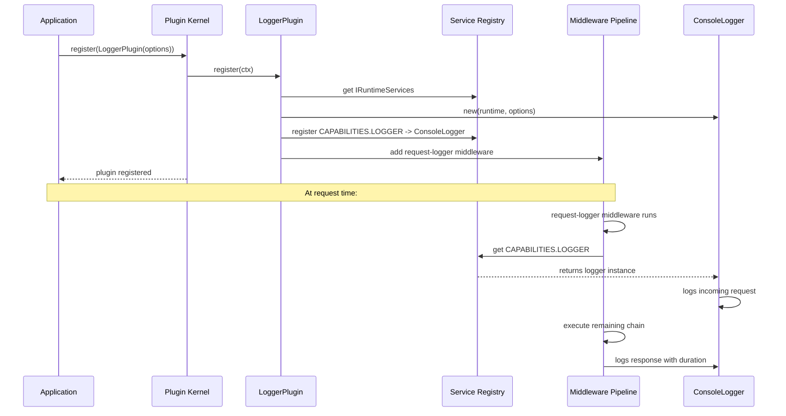

# Milestone 4: Logger Plugin — Structured Logging

## Objective

Implement `@hono-enterprise/logger-plugin` — structured logging capability provided as a plugin with
Pino, Console, and Noop implementations plus automatic request-logging middleware.

## Package Dependencies

Per ROADMAP.md: `logger-plugin` depends on `common`, `kernel`, and `runtime`.

```
logger-plugin ─► common, kernel, runtime
```

## Existing Contracts (Must Implement Exactly)

### `ILogger` — from `@hono-enterprise/common`

Defined in [`packages/common/src/services/logger.ts`](packages/common/src/services/logger.ts:1):

```typescript
export type LogMetadata = Readonly<Record<string, unknown>>;

export interface ILogger {
  readonly level: LogLevel;
  fatal(message: string, metadata?: LogMetadata): void;
  error(message: string, metadata?: LogMetadata): void;
  warn(message: string, metadata?: LogMetadata): void;
  info(message: string, metadata?: LogMetadata): void;
  debug(message: string, metadata?: LogMetadata): void;
  trace(message: string, metadata?: LogMetadata): void;
  child(bindings: LogMetadata): ILogger;
}
```

### `LogLevel` — from `@hono-enterprise/common`

```typescript
export type LogLevel = 'fatal' | 'error' | 'warn' | 'info' | 'debug' | 'trace';
```

### `CAPABILITIES.LOGGER` — Token

```typescript
CAPABILITIES.LOGGER = 'logger';
```

### `IPlugin` — from `@hono-enterprise/common`

```typescript
interface IPlugin {
  name: string;
  version: string;
  dependencies?: string[];
  optionalDependencies?: string[];
  provides?: string[];
  consumes?: string[];
  priority?: number;
  register(ctx: IPluginContext): void | Promise<void>;
}
```

---

## Implementation Files

| File                               | Purpose                                              |
| ---------------------------------- | ---------------------------------------------------- |
| `src/loggers/console-logger.ts`    | `ConsoleLogger` — runtime-independent console output |
| `src/loggers/noop-logger.ts`       | `NoopLogger` — does nothing; for testing             |
| `src/loggers/pino-logger.ts`       | `PinoLogger` — Pino-based (lazy `npm:` import)       |
| `src/middleware/request-logger.ts` | Automatic request/response logging middleware        |
| `src/plugin/logger-plugin.ts`      | `LoggerPlugin()` factory function                    |
| `src/index.ts`                     | Public API barrel export                             |

---

## Detailed Design

### 1. Console Logger (`src/loggers/console-logger.ts`)

**Responsibility:** Runtime-independent structured logger that outputs to `console`.

**Key design decisions:**

- Since `no-console` lint rule applies everywhere except `packages/cli` and `scripts/`, this logger
  is the sanctioned exception. The file header will carry
  `// deno-lint-ignore-file no-console — ConsoleLogger is the sanctioned logger implementation`.
- Output format: JSON-lines in production, pretty-printed when `pretty: true`.
- Level filtering: only emit at or above the configured level.
- Uses `runtime.now()` for timestamps (runtime independence).
- `child()` returns a new `ConsoleLogger` with merged bindings.

**Interface:**

```typescript
interface ConsoleLoggerOptions {
  level?: LogLevel;
  pretty?: boolean;
  redact?: string[];
  bindings?: LogMetadata;
}

class ConsoleLogger implements ILogger {
  readonly level: LogLevel;
  constructor(runtime: IRuntimeServices, options?: ConsoleLoggerOptions);
  fatal(message: string, metadata?: LogMetadata): void;
  error(message: string, metadata?: LogMetadata): void;
  warn(message: string, metadata?: LogMetadata): void;
  info(message: string, metadata?: LogMetadata): void;
  debug(message: string, metadata?: LogMetadata): void;
  trace(message: string, metadata?: LogMetadata): void;
  child(bindings: LogMetadata): ILogger;
}
```

### 2. Noop Logger (`src/loggers/noop-logger.ts`)

**Responsibility:** Does nothing. For testing and disabling logging.

**Design:**

- All methods are empty functions.
- `child()` returns itself (singleton).
- `level` is `'trace'` (always emits — but since methods are no-ops, that doesn't matter).

```typescript
class NoopLogger implements ILogger {
  readonly level: LogLevel = 'trace';
  fatal(): void {}
  error(): void {}
  warn(): void {}
  info(): void {}
  debug(): void {}
  trace(): void {}
  child(): ILogger {
    return this;
  }
}
```

### 3. Pino Logger (`src/loggers/pino-logger.ts`)

**Responsibility:** Pino-based logger for Node.js/Deno/Bun.

**Key design decisions:**

- Pino is a **heavy, optional dependency**. Import via lazy `npm:` import only when transport is
  `'pino'`.
- Follows AI_GUIDELINES §12.2: "Heavy deps are never hard dependencies — injected via options or
  lazy `npm:` imports."
- Wraps Pino's `Logger` interface to conform to `ILogger`.
- `child()` delegates to Pino's native `child()`.

```typescript
interface PinoLoggerOptions {
  level?: LogLevel;
  redact?: string[];
  bindings?: LogMetadata;
}

class PinoLogger implements ILogger {
  readonly level: LogLevel;
  constructor(options?: PinoLoggerOptions);
  fatal(message: string, metadata?: LogMetadata): void;
  // ... same for each level
  child(bindings: LogMetadata): ILogger;
}
```

### 4. Request Logger Middleware (`src/middleware/request-logger.ts`)

**Responsibility:** Automatic logging of incoming requests and outgoing responses.

**Logs:**

- Incoming request: method, path, requestId
- Outgoing response: status code, duration (ms)
- Slow request warning when duration exceeds `slowRequestThreshold` (default 5000ms)
- Unhandled errors with stack traces

**Design:**

- Reads `ILogger` from `ctx.services.get<ILogger>(CAPABILITIES.LOGGER)`.
- Creates a child logger bound to `requestId`.
- Uses `ctx.startTime` for duration calculation.
- Uses `runtime.now()` or `performance.now()` for high-resolution timing.

```typescript
interface RequestLoggerOptions {
  slowRequestThreshold?: number; // ms, default 5000
  excludePaths?: string[]; // paths to skip logging
}

function createRequestLoggerMiddleware(options?: RequestLoggerOptions): MiddlewareFunction;
```

### 5. LoggerPlugin Factory (`src/plugin/logger-plugin.ts`)

**Responsibility:** Factory function that returns an `IPlugin` implementing the plugin contract.

**Options:**

```typescript
interface LoggerPluginOptions {
  level?: LogLevel; // default 'info'
  transport?: 'console' | 'pino' | 'noop'; // default 'console'
  pretty?: boolean; // ConsoleLogger: pretty print
  redact?: string[]; // Paths to redact (Pino) or manual redaction
  requestLogging?: boolean; // Enable automatic request logging middleware
  slowRequestThreshold?: number; // ms, default 5000
}
```

**Plugin behavior in `register()`:**

1. Resolve `IRuntimeServices` from `ctx.services.get<IRuntimeServices>(CAPABILITIES.RUNTIME)`.
2. Instantiate the appropriate logger based on `transport`.
3. Register `ILogger` with `ctx.services.register(CAPABILITIES.LOGGER, logger)`.
4. If `requestLogging` is enabled, add request-logging middleware via `ctx.middleware.add()`.

**Plugin metadata:**

```typescript
{
  name: 'logger-plugin',
  version: '0.1.0',
  dependencies: ['runtime'],       // Needs IRuntimeServices
  provides: [CAPABILITIES.LOGGER],
  priority: PLUGIN_PRIORITY.HIGH,  // 100 — most plugins consume logging
  register(ctx) { /* ... */ }
}
```

### 6. Public API (`src/index.ts`)

```typescript
// Plugin factory
export { LoggerPlugin } from './plugin/logger-plugin.ts';
export type { LoggerPluginOptions } from './plugin/logger-plugin.ts';

// Logger implementations
export { ConsoleLogger } from './loggers/console-logger.ts';
export type { ConsoleLoggerOptions } from './loggers/console-logger.ts';
export { NoopLogger } from './loggers/noop-logger.ts';
export { PinoLogger } from './loggers/pino-logger.ts';
export type { PinoLoggerOptions } from './loggers/pino-logger.ts';

// Middleware
export { createRequestLoggerMiddleware } from './middleware/request-logger.ts';
export type { RequestLoggerOptions } from './middleware/request-logger.ts';
```

---

## Architecture Diagram



---

## Test Plan

### Unit Tests (`test/unit/`)

| File                     | Tests                                                                                               |
| ------------------------ | --------------------------------------------------------------------------------------------------- |
| `console-logger.test.ts` | Level filtering, structured output, child logger bindings, redaction, pretty mode, timestamp format |
| `noop-logger.test.ts`    | All methods are no-ops, child returns self, level is trace                                          |
| `pino-logger.test.ts`    | Level mapping, child logger delegation, lazy import (no Pino without transport='pino')              |
| `request-logger.test.ts` | Request logging, response logging, slow request detection, error logging, excluded paths            |

### Integration Tests (`test/integration/`)

| File                    | Tests                                                                                                                           |
| ----------------------- | ------------------------------------------------------------------------------------------------------------------------------- |
| `logger-plugin.test.ts` | Plugin registration, service resolution, middleware registration, dependency on runtime, priority ordering, transport selection |

### Coverage Requirements

Every `src/` file must achieve ≥90% on lines, branches, and functions.

---

## Implementation Order

1. **NoopLogger** — Simplest implementation, validates interface contract, enables immediate
   testing.
2. **ConsoleLogger** — Core implementation with level filtering, structured JSON output, child
   logger, and redaction.
3. **PinoLogger** — Wraps Pino with lazy import; delegates to Pino's native API.
4. **Request Logger Middleware** — Consumes `ILogger` from registry, logs request/response
   lifecycle.
5. **LoggerPlugin Factory** — Orchestrates logger creation and middleware registration.
6. **Index.ts** — Barrel exports.
7. **Tests** — Unit tests for each component, integration test for plugin registration.
8. **PUBLIC_API.md** — Update with all new exports and JSDoc.
9. **Verification gates** — `fmt:check`, `lint`, `check`, `test`, `test:coverage`.

---

## Rules & Constraints

### Must Follow

- **`no-console`** — Only `console-logger.ts` uses `console` (sanctioned exception with file-level
  ignore directive).
- **No `any`** — Use `unknown`, `Record<string, unknown>`, or generics.
- **Runtime independence** — Use `IRuntimeServices` for `uuid()`, `now()`, timers. Never
  `crypto.randomUUID()` or `Date.now()` directly.
- **Named exports only** — No `export default`.
- **`import type`** for type-only imports (verbatim-module-syntax).
- **`exactOptionalPropertyTypes`** — Never assign `undefined` to optional properties.
- **JSDoc on every export** — `@param`, `@returns`, `@throws`, `@example`, `@since`.
- **Heavy deps lazy-loaded** — Pino via `npm:` import only when `transport: 'pino'`.

### Redaction Strategy

For `ConsoleLogger`, implement path-based redaction using the paths array (e.g.,
`['password', 'token']`). For deep paths, use dot notation (e.g., `['auth.token']`).

For `PinoLogger`, delegate to Pino's built-in redaction.

---

## Deliverables Checklist

- [ ] `ConsoleLogger` — runtime-independent console output
- [ ] `NoopLogger` — for testing
- [ ] `PinoLogger` — lazy-loaded Pino wrapper
- [ ] Request/response logging middleware
- [ ] `LoggerPlugin()` factory with plugin contract
- [ ] Public API barrel export in `src/index.ts`
- [ ] `PUBLIC_API.md` updated
- [ ] Unit tests (≥90% per-file coverage)
- [ ] Integration tests
- [ ] All gates pass: `fmt:check`, `lint`, `check`, `test`, `test:coverage`
